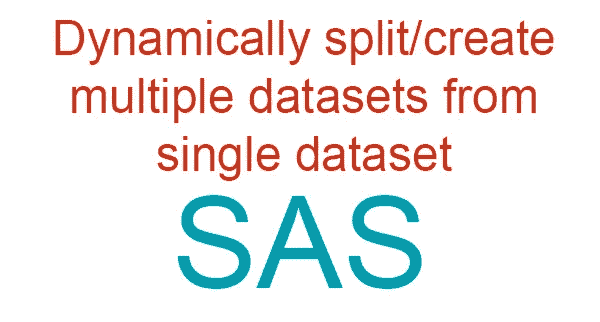
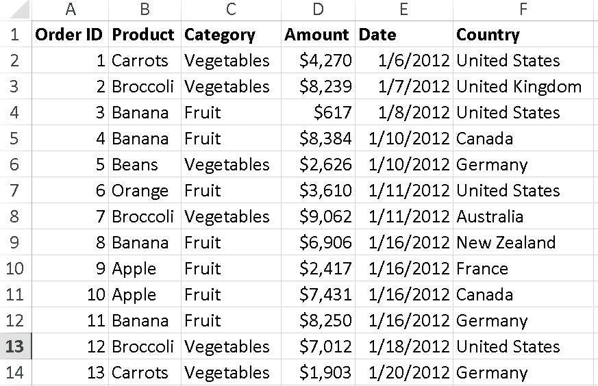
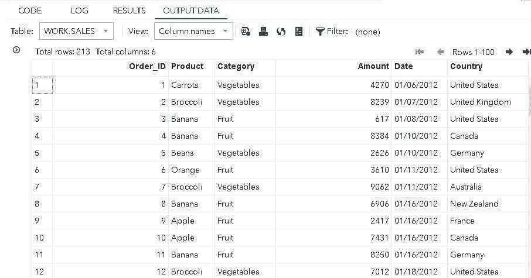
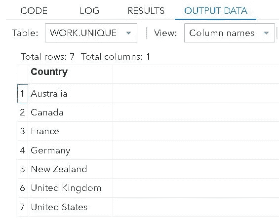
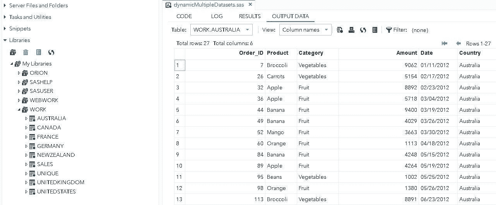

# 在 SAS 中从单个数据集动态拆分/创建多个数据集

> 原文：<https://towardsdatascience.com/dynamically-split-create-multiple-datasets-from-single-dataset-in-sas-7a6ea1f5f15d?source=collection_archive---------9----------------------->



将一个数据集分割成多个数据集是 SAS 程序员经常面临的挑战。例如，将从世界各地收集的数据分割成独特的国别数据集，其中每个数据集只包含特定于该国的数据。在这种情况下，程序员经常被迫对程序进行硬编码，并使用多个循环来完成工作，这不是一种好的做法。然而，SAS 为这个问题提供了一个漂亮的、一次性的、可重用的解决方案。让我们直接进入它。

# 导入数据集

我们有以下全球销售数据集( *Worldwide_Sales.xls* ):

> 所有数据集和代码文件都可以在 GitHub(*[*【https://github.com/pramodkumavat/createMultipleDatasets/*](https://github.com/pramodkumavat/createMultipleDatasets/)*)找到。**

****

**让我们首先将这个数据集导入到我们的 SAS 环境中。**

**页（page 的缩写）s:请将数据集文件 *Worldwide_Sales.xls* 复制到您的 SAS 工作目录 *myfolders* 中。**

```
**proc import out=work.sales
datafile='/folders/myfolders/Worldwide_Sales.xls'
dbms=xls replace;
getnames=yes;
run;**
```

**运行上面的代码将把我们的数据集作为 *work.sales* 库加载到 SAS 中。**

****

**要理解导入代码中使用的各种选项，这个 [FAQ](https://stats.idre.ucla.edu/sas/faq/how-do-i-readwrite-excel-files-in-sas/) 就是你所需要的。**

# **创建多个数据集**

**业务需求表明，我们必须从全球数据集创建国家唯一的数据集。这样创建的每个数据集将包含该特定国家的销售数据。为此，我们首先需要从数据集中提取唯一的国家名称。**

# **步骤 1:提取唯一的国家名称**

```
**proc sort data=work.sales out=work.unique (keep=Country)
nodupkey;
by country;
run;**
```

**运行上面的代码将为我们提供数据集中唯一的国家名称。**

****

**一旦我们提取了国家名称，现在让我们创建我们的神奇代码，在单个*数据*语句中动态创建国家级数据集。**

# **步骤 2:动态创建多个数据集**

```
**data _null_;
set work.unique;
call execute('data ' !! compress(Country) !! '; set work.sales; where Country = "' !! Country !! '"; run;');
run;**
```

****

**正如您在上面的输出中所看到的，在左侧，我们看到已经创建了国家唯一的数据集。**

# **幕后的魔法**

**让我们一行一行地理解代码的每一个方面，这使得魔术成为可能。**

```
**data _null_;**
```

**我们将输出*数据*设置为 *_null_* ，因为我们不想创建单个数据集，而是一次创建多个数据集，这一点我们稍后会看到。**

```
**set work.unique;**
```

**我们将输入数据集设置为 *work.unique* ，其中包含唯一的国家名称。我们这样做是因为我们希望在每次迭代中创建独特的国家级数据集。**

```
**call execute('data ' !! compress(Country) !! '; set work.sales; where Country = "' !! Country !! '"; run;');
run;**
```

**这才是真正的交易！您可能已经注意到，我们在 *call execute()* 语句中编写了一个嵌套查询。如前所述，SAS 提供了这个漂亮的解决方案来创建多个数据集，而不使用多个循环。**

**在 *execute()* 调用中，我们以*数据*语句开始，然后附加上我们唯一的国家名称。*国家*这里只是来自我们 *work.unique* 数据集的变量。 *compress* 函数应用于 *Country* 变量，因为我们的国家名称中有空格(例如，新西兰、英国)。这个 *compress* 函数在创建唯一数据集时删除国家名称中的空格。**

**然后我们放分号(*；*)结束我们的*数据*步骤，然后将输入数据集设置为 *work.sales* 。很明显，我们将输入设置为父数据集 *work.sales* ，使用它我们将创建唯一的数据集。然后，我们放入 *where* 条件，以便它从父数据集中挑选国家级数据。然后，我们用 *run* 语句结束嵌套查询，并关闭 *execute()* 调用。代码的最后一个 *run* 语句是为了结束外部查询。**

# **完整代码**

**我在这里粘贴完整的 SAS 代码供您参考。这个 SAS 代码(*dynamicmultipledatasets . SAS*)以及使用的数据集( *Worldwide_Sales.xls* )可以从 GitHub [这里](https://github.com/pramodkumavat/createMultipleDatasets/)下载。**

```
*** Importing the dataset in SAS;proc import out=work.sales
datafile='/folders/myfolders/Worldwide_Sales.xls'
dbms=xls replace;
getnames=yes;
run;* Extracting country names from the dataset;proc sort data=work.sales out=work.unique (keep=Country)
nodupkey;
by country;
run;* Creating multiple datasets from the parent dataset;data _null_;
set work.unique;
call execute('data ' !! compress(Country) !! '; set work.sales; where Country = "' !! Country !! '"; run;');
run;**
```

**希望这对你有帮助。请评论您的反馈/建议。干杯！**