# 基于自然语言处理和无监督学习的电子商务评论分析

> 原文：<https://towardsdatascience.com/e-commerce-reviews-analysis-902210726d47?source=collection_archive---------14----------------------->


picture credits to [www.oberlo.com](http://www.oberlo.com)

在这个项目中，我想练习[自然语言处理](https://en.wikipedia.org/wiki/Natural_language_processing)和[无监督机器学习](https://en.wikipedia.org/wiki/Unsupervised_learning)。在对我能从网上获得的数据集做了一些研究后，我找到了一个真实的电子商务企业的[女装数据集](https://www.kaggle.com/nicapotato/womens-ecommerce-clothing-reviews)。我认为，如果我能为企业开发一种从他们的服装评论中提取见解的自动化工具，这可能会很酷，对企业很有用。因为阅读成千上万的评论并不容易，而且是一项耗时的任务。

由于各种原因，这可能是有价值的。例如:

1.  了解趋势:了解人们在谈论什么，他们喜欢什么或不喜欢什么。
2.  根据用户反馈改进产品。
3.  跟进用户不喜欢的产品，进一步了解问题所在。
4.  为了降低退货率，重新进货费用是电子商务成功甚至生存的一大开支。

以上是你可以对顾客评论做的一些事情。

## **我想解决的问题**

因此，为了这个项目的目的，我想探索以下几点:

1.  [话题建模](https://en.wikipedia.org/wiki/Topic_model):比如人们在谈论的那个服装/鞋子有哪些正面和负面的东西。通过计算某个主题中出现的单词或单词组合的频率，看看我是否能找到任何主题。
2.  使用[聚类](https://www.geeksforgeeks.org/clustering-in-machine-learning/)将好的和坏的评论“分离”:通过聚类的方法，将不同产品的好的和坏的评论分离出来或找到模式，以便发送给相应的部门关注。这可能非常困难，因为聚类方法是一种无监督的机器学习技术，可以从数据中找到隐藏的模式。

## **项目设计**

1.  [清理](https://en.wikipedia.org/wiki/Data_cleansing)并对我的数据执行[探索性数据分析(EDA)](https://en.wikipedia.org/wiki/Exploratory_data_analysis) 。
2.  [我清理的文本数据的矢量化](https://medium.com/@paritosh_30025/natural-language-processing-text-data-vectorization-af2520529cf7)(计数矢量化器和 TF-IDF)。
3.  生成一个单词云，看看人们谈论的最频繁的单词是什么。
4.  进行主题建模，看看我是否能找到一些人们正在谈论的不同主题。
5.  使用聚类方法从我的文本数据中聚类出模式，看看我是否能聚类出那些不好的评论(或不同类型的评论)。并使用 TSNE 可视化我的集群。
6.  最后，使用数据集中的评级列执行监督学习问题，以对好评和差评进行分类。

## **我使用的数据和技术**

我使用的数据集可以从 [Kaggle](https://www.kaggle.com/nicapotato/womens-ecommerce-clothing-reviews) 获得，由 23486 条不同的服装评论和 11 个不同的栏目组成。

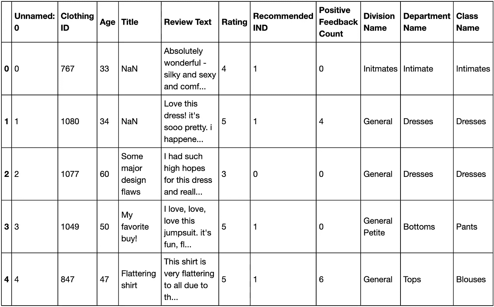

snapshot of the data

我在这个项目中使用的工具有 numpy、pandas、matplotlib、seaborn、wordcloud、 [sklearn](https://scikit-learn.org/stable/) 特别是与 [CountVectorizer](https://scikit-learn.org/stable/modules/generated/sklearn.feature_extraction.text.CountVectorizer.html) 、 [TfidfVectorizer](https://scikit-learn.org/stable/modules/generated/sklearn.feature_extraction.text.TfidfVectorizer.html) 、 [Kmeans](https://scikit-learn.org/stable/modules/generated/sklearn.cluster.KMeans.html) 、 [TSNE](https://scikit-learn.org/stable/modules/generated/sklearn.manifold.TSNE.html) 、 [NMF](https://scikit-learn.org/stable/modules/generated/sklearn.decomposition.NMF.html) 、 [TruncatedSVD](https://scikit-learn.org/stable/modules/generated/sklearn.decomposition.TruncatedSVD.html) 、 [silhouette_score](https://scikit-learn.org/stable/modules/generated/sklearn.metrics.silhouette_score.html) 、 [MultinomialNB](https://scikit-learn.org/stable/modules/generated/sklearn.naive_bayes.MultinomialNB.html)

## **数据清洗&探索性数据分析(EDA)**

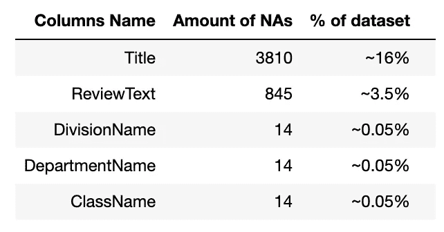

how many NAs in the dataset

*   数据集中有一些 NAs，我将把它们放在这里。
*   ReviewText 列将是我的 NLP 主要列。
*   除了 ReviewText 列，我还创建了另一个名为 CombinedText 的列，它将 Title 和 ReviewText 列连接在一起。因为我认为你也可以从评论标题中得到一些隐藏的数据。
*   最后，我将清理后的数据保存起来以备将来使用。

## **WordCloud**

接下来我要做的是创建一个单词云，看看人们谈论/使用最多的单词是什么。在此之前，我需要:

1.  将我的文本全部修改成小写
2.  删除评论中可能存在的一些不太有用的常用词，如连衣裙、连衣裙等。
3.  然后使用 Count 和 TF-IDF 矢量器对文本数据进行矢量化。例如:

```
count_vectorizer = CountVectorizer(ngram_range=(1, 2),  
                                   stop_words='english', 
                                   token_pattern="**\\**b[a-z][a-z]+**\\**b",
                                   lowercase=**True**,
                                   max_df = 0.6, max_features=4000)
tfidf_vectorizer = TfidfVectorizer(ngram_range=(1, 2),  
                                   stop_words='english', 
                                   token_pattern="**\\**b[a-z][a-z]+**\\**b",
                                   lowercase=**True**,
                                   max_df = 0.6, max_features=4000)

cv_data = count_vectorizer.fit_transform(df.ReviewTextLower)
tfidf_data = tfidf_vectorizer.fit_transform(df.ReviewTextLower)
```

代码基本上是说将文本矢量化为 [1-gram](https://en.wikipedia.org/wiki/N-gram) 和 2-gram(也尝试了 3-gram)，使用包中预设的“英语”停用词，所有内容和模式都是小写，忽略文档中频率高于 0.6 的词，最多 4000 个特征/尺寸。

然后我用下面的代码创建一个单词云:

```
for_wordcloud = count_vectorizer.get_feature_names()
for_wordcloud = for_wordcloud
for_wordcloud_str = ' '.join(for_wordcloud)

wordcloud = WordCloud(width=800, height=400, background_color ='black',
                      min_font_size = 7).generate(for_wordcloud_str)

plt.figure(figsize=(20, 10), facecolor=**None**)
plt.imshow(wordcloud)
plt.axis("off")
plt.tight_layout(pad=0)

plt.show()
```

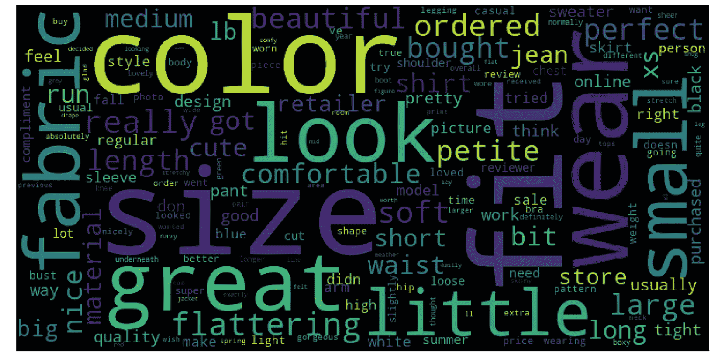

most frequent words that customers are talking about

## **话题建模**

在我做主题建模之前还有一步，就是使用 [LSA](https://en.wikipedia.org/wiki/Latent_semantic_analysis) 和 [NMF](https://en.wikipedia.org/wiki/Non-negative_matrix_factorization) 来降低我输入文本数据的维度。例如:

```
*# try using 10 dimensions*
n_comp = 10
lsa_tfidf = TruncatedSVD(n_components=n_comp)
lsa_cv = TruncatedSVD(n_components=n_comp)
nmf_tfidf = NMF(n_components=n_comp)
nmf_cv = NMF(n_components=n_comp)

lsa_tfidf_data = lsa_tfidf.fit_transform(tfidf_data)
lsa_cv_data = lsa_cv.fit_transform(cv_data)
nmf_tfidf_data = nmf_tfidf.fit_transform(tfidf_data)
nmf_cv_data = nmf_cv.fit_transform(cv_data)
```

然后我们可以进行主题建模，下面是一个输出示例:

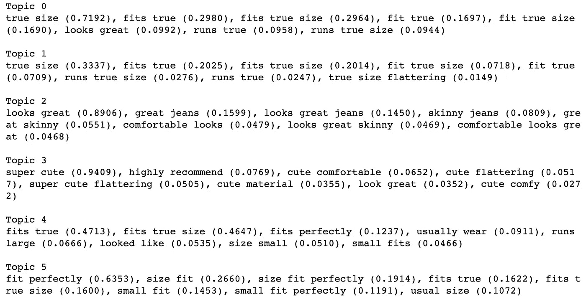

example of a few topics

您可以生成不同数量的主题，通过测试不同数量的主题来找到最佳数量，并查看这些主题对您是否有意义。

## **聚类**

在运行聚类算法之前，最好[将](https://scikit-learn.org/stable/modules/generated/sklearn.preprocessing.StandardScaler.html)您的输入数据标准化为平均值 0 和标准差 1。因为您的要素可能不在同一比例上，换句话说，这可能与从要素 a 增加 1 个单位和从要素 b 增加 1 个单位不是一回事。

```
*# initialize standardscaler*
**from** **sklearn.preprocessing** **import** StandardScaler
SS = StandardScaler()

*# transform my reducer data using standardscaler*
lsa_tfidf_data_sclaed = SS.fit_transform(lsa_tfidf_data)
lsa_cv_data_sclaed = SS.fit_transform(lsa_cv_data)
nmf_tfidf_data_scaled = SS.fit_transform(nmf_tfidf_data)
nmf_cv_data_scaled = SS.fit_transform(nmf_cv_data)
```

然后你可以使用无监督的机器学习算法，针对不同的话题或者不同类型的评论做聚类。在这个项目中，我使用了 [KMeans](https://scikit-learn.org/stable/modules/generated/sklearn.cluster.KMeans.html) ，还使用了惯性和轮廓分数作为代理来帮助我确定我应该使用的最佳聚类数。然后使用 [TSNE](https://scikit-learn.org/stable/modules/generated/sklearn.manifold.TSNE.html) 来帮助我可视化生成的集群。例如:

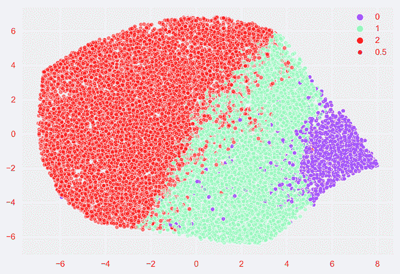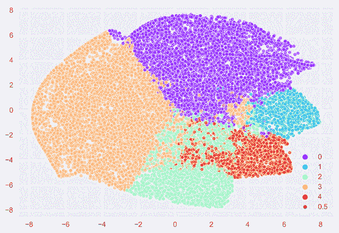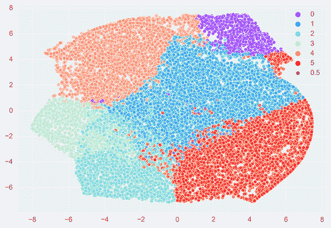

TSNE plots for different number of clusters

在确定了多少个聚类是最佳聚类之后，您可以打印出最接近每个聚类质心的文档以供检查。例如:

```
indices_max = [index **for** index, value **in** enumerate(kmeans.labels_) **if** value==3]
**for** rev_index **in** indices_max[:5]:
    print(rev_index, str(df.ReviewText[rev_index]))
    print("**\n**")
```

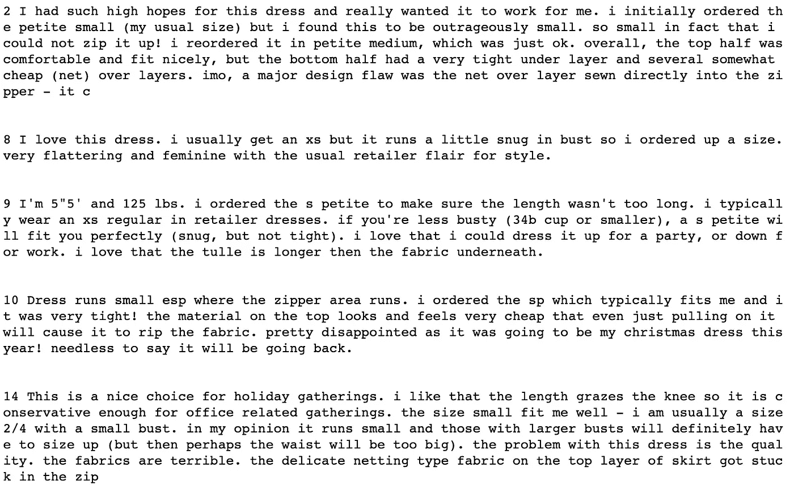

example of a few documents

## **分类**

我们可以尝试从分析文本数据中分离好的或坏的评论的另一件事是执行分类问题。


snapshot of the data

在我们的数据中，我们有一个名为 Rating 的特性，它是客户对产品的评分，1 表示最不满意，5 表示最满意。

我们可以将 Rating 列设置为目标变量，将 engineered CombinedText 列设置为独立变量，看看是否可以构建一个分类器来自动对评论进行分类。

我做的第一件事是将排名 1 到 4 归为差评(标记为 1)，而排名 5 是我们的好评(标记为 5)。这两个等级并不完全平衡，但都在可接受的范围内。我用[朴素贝叶斯](https://scikit-learn.org/stable/modules/naive_bayes.html)和[逻辑分类器](https://scikit-learn.org/stable/modules/generated/sklearn.linear_model.LogisticRegression.html)构建了分类模型。

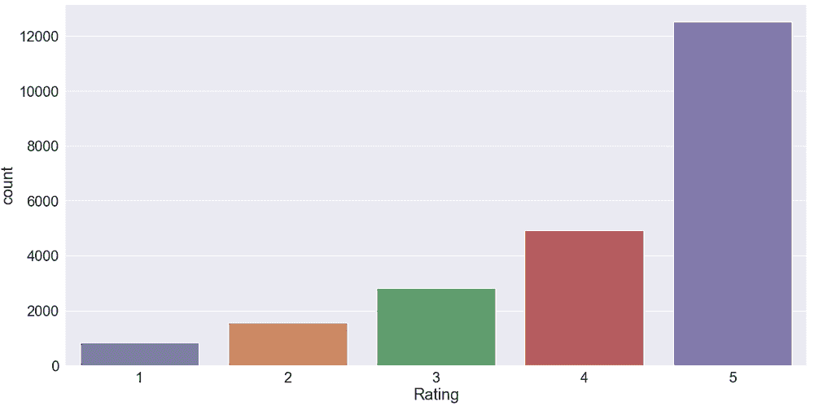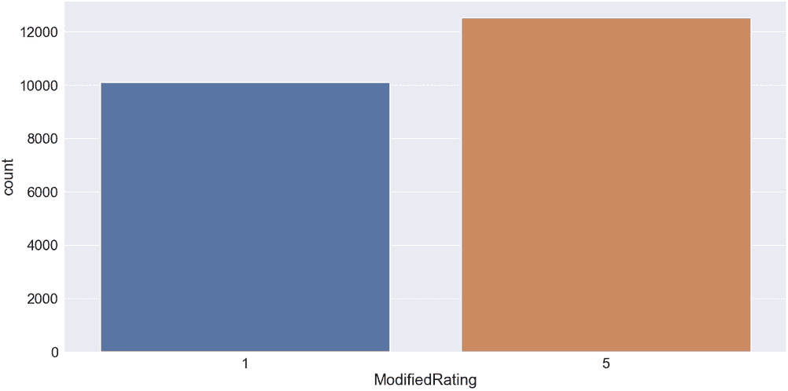

Before and After modification of the Rating column

我用于模型评估的指标，我使用[回忆](https://en.wikipedia.org/wiki/Precision_and_recall)分数，因为我关心当我预测审查是好的审查但实际上不是时的情况。我得到的最好的召回分数是 0.74，没有太多的工程。如果在模型上有更多的时间和探索，分数可能会更好。

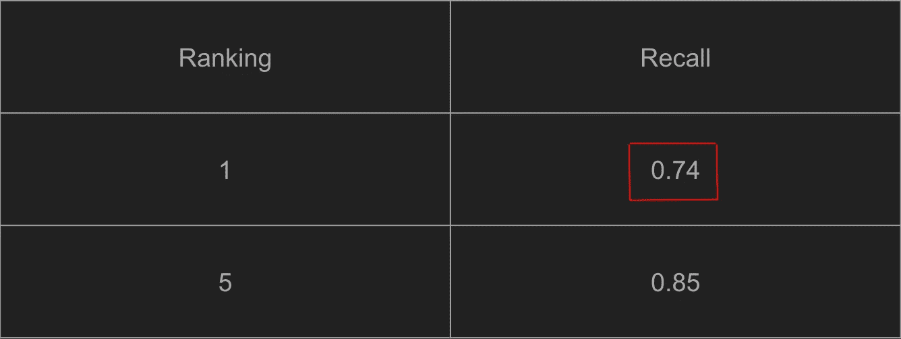

recall score fo both bad (rank 1) and good (rank 5) reviews

## **吸取的教训**

*   无监督学习和有监督学习真的是天壤之别，因为它的本质！
*   您将会花费大量时间来尝试理解如何对您的数据进行聚类，除了 KMeans 之外，还有许多聚类方法。
*   在进行文本分析或 NLP 时，您可能会花费大量时间清理文本数据以获得最佳结果。例如，如何根据您的数据和您想要解决的问题的上下文来决定使用什么停用词，如何进行词条整理，如何进行向量化，如何降低维度并避免[维度诅咒](https://en.wikipedia.org/wiki/Curse_of_dimensionality)等等。

## **未来**

如果我有机会延长该项目，我想跟进以下内容:

*   探索不同类型的聚类算法和 NLP 技术。
*   添加新的停用词。
*   构建一个 Flask 原型应用程序来创建一个自动流程，从用户评论中推荐(分离)不同的主题。

非常感谢您的阅读，如果您有兴趣探索我使用的代码和资源，这个项目在我的 [github repo](https://github.com/khsio/project_fletcher) 上。