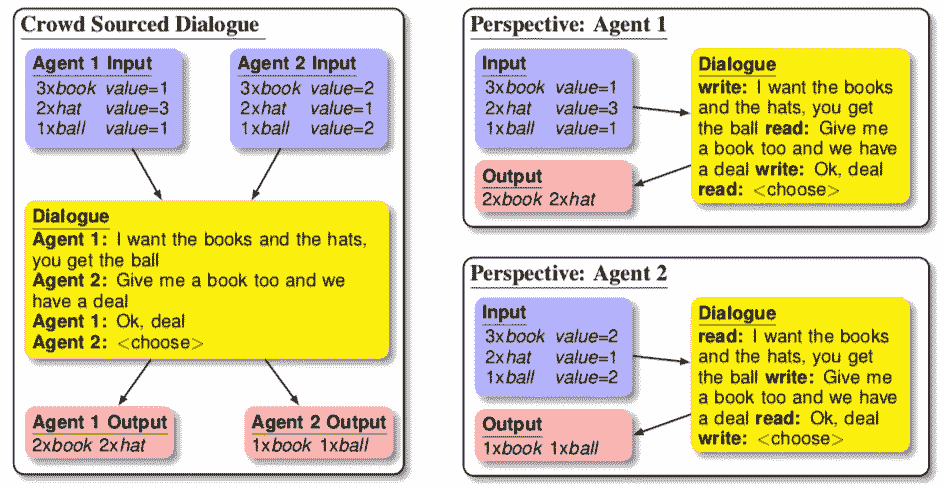
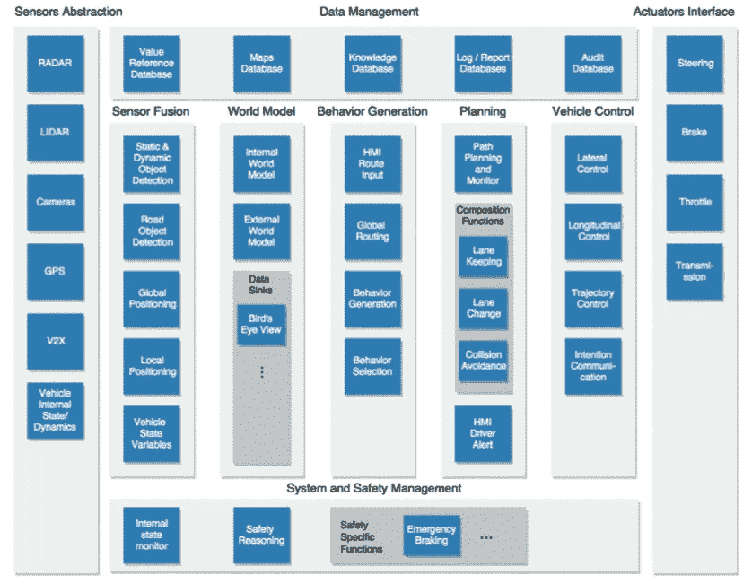
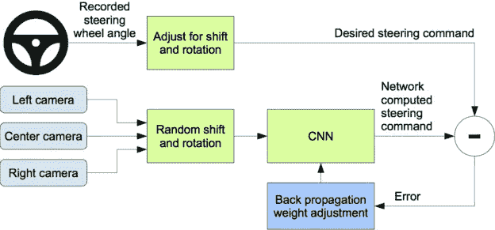

# 端到端学习,(几乎)通用的 ML 方法

> 原文：<https://towardsdatascience.com/e2e-the-every-purpose-ml-method-5d4f20dafee4?source=collection_archive---------3----------------------->

## E2E 可以用来解决每一个机器学习问题吗？

Photo by [Su San Lee](https://unsplash.com/@blackodc?utm_source=medium&utm_medium=referral) on [Unsplash](https://unsplash.com?utm_source=medium&utm_medium=referral)

对于那些从事机器学习的人来说，最重要的技能之一就是知道对于给定的问题，哪种方法是正确的选择。一些选择是琐碎的(例如，监督的或无监督的，回归或分类)，因为它们与问题公式化本身有关。然而，即使在定义了你要解决的问题之后，通常还有无数的算法可以使用。

例如，假设您想要开发一个能够预测分类变量的系统。为了解决这个问题，可以使用分类树、K-最近邻或者甚至人工神经网络。当然，许多不同的算法存在是有原因的，即使它们解决的是类似的问题:每一种算法都有其特殊性，我们可以从中受益。

让任务变得更加困难的是，为了解决一些问题，如语音识别和自动驾驶，由许多层组成的架构是必要的(例如，预处理、特征提取、优化、预测、决策)。对于每一层，可以使用许多不同的算法。

问题是:为了获得更好的结果，必须应用内层的变化及其相应的算法。然而，由于每一层都负责解决特定的任务，因此很难确定这样的变化将如何影响整个系统。

端到端(E2E)学习指的是训练由代表完整目标系统的单个模型(特别是深度神经网络)代表的可能复杂的学习系统，绕过传统流水线设计中通常存在的中间层。

# 端到端学习

E 第二端到端学习是深度学习领域的一个热门话题，它利用深度神经网络(DNNs)的多层结构来解决复杂问题。类似于人的大脑，每个 DNN 层(或层组)可以专门执行此类问题所需的中间任务。Tobias Glasmachers 证明了 E2E 是如何在深度学习的背景下被构建的[1]:

> “这种优雅但直截了当且有些蛮力的技术[E2E]已经在深度学习的背景下得到普及。这是深度神经架构模糊学习机和其他处理组件之间的经典界限的一个看似自然的结果，它通过将可能复杂的处理管道铸造到神经网络的连贯和灵活的建模语言中。”

这种替代方法已经成功地应用于解决许多复杂的问题。下面你可以看到 E2E 是如何应用于语音识别和自动驾驶问题的。

# 语音识别

Photo by [Arthur Caranta](https://www.flickr.com/photos/arthur-caranta/)

口语理解系统的传统方法设计是具有几个不同组件的流水线结构，由以下序列举例说明:

> **音频(输入)——>特征提取——>音素检测——>单词合成——>文本转录(输出)。**

这种流水线结构的一个明显的限制是，每个模块必须在不同的标准下分别进行优化。E2E 方法包括用单个神经网络代替上述链，允许使用单个优化标准来增强系统:

> **音频(输入)————(神经网络)——→抄本(输出)**

迈克·刘易斯等人介绍了自然语言谈判的 E2E 学习方法[2]。由此产生的系统是一个基于单个神经网络的对话代理，能够通过协商达成协议。这是通过使用来自包含各种不同谈判策略的大型人际谈判记录数据集的数据来训练神经网络来实现的。

Figure from Mike Lewis et al. [2]

E2E 方法的另一个好处是，尽管问题很复杂，但不需要深入了解问题，也可以设计出运行良好的模型。Ronan Collobert 等人解释了如何使用统一的神经网络架构和适当的自然语言处理(NLP)学习算法来避免特定任务工程和大量的先验知识[3]:

> “[……]我们试图在多个基准测试中超越*，同时*避免特定任务的工程*。相反，我们使用一个能够发现足够的内部表示的单一学习系统。[……]我们避免特定任务工程特征的愿望阻止了我们使用大量的语言知识。相反，我们通过传输在大型无标签数据集上发现的中间表示，在大多数任务中达到良好的性能水平。我们称这种方法为“几乎从零开始”，以强调减少(但仍然重要)对先验 NLP 知识的依赖。*

# *自动驾驶*

*一个自主驾驶系统可以归类为由许多层组成的复杂系统的一个显著例子。根据 Alexandru Serban 等人提出的架构，我们可以使用 5 个不同的层来设计自动驾驶系统[4]:*

**

*Figure from Alexandru Serban et al. [4]*

*输入数据来自几个传感器(照相机、激光雷达、雷达等)。)在**传感器融合**层进行处理，以提取相关特征(如物体检测)。处理完所有数据并提取相关特征后，在第二层创建一个“**世界模型**”。该模型包括周围环境以及车辆内部状态的完整图像。*

*根据这个模型，系统必须选择在**行为层**做出哪些决定。根据车辆的目标，基于系统策略提出多个行为选项，并通过应用一些优化标准来选择最佳的一个。*

*做出决定后，系统确定车辆必须执行的动作，以满足在**规划**层选择的行为，最后，控制值被发送到**车辆控制**层的执行器接口模块。*

**

*Photo by [Bram Van Oost](https://unsplash.com/@ort?utm_source=medium&utm_medium=referral) on [Unsplash](https://unsplash.com?utm_source=medium&utm_medium=referral)*

*在“自动驾驶汽车的端到端学习”一文中，Mariusz Bojarski 等人提出了一种 E2E 系统，能够直接从嵌入式摄像头提供的像素控制自动驾驶汽车[5]。该系统能够学习中间步骤的内部表示，例如检测有用的道路特征，仅使用人类转向角度作为训练信号。卷积神经网络(CNN)的使用在所提出的系统中起着重要的作用，因为它能够从图像数据中提取有用的特征:*

> *“CNN 的突破是从训练样本中自动学习特征。CNN 方法在图像识别任务中尤其强大，因为卷积运算捕捉了图像的 2D 性质。”*

*设计的 CNN 超越了模式识别，学习驾驶汽车所需的整个处理流程。网络架构由 9 层组成，包括一个标准化层、5 个卷积层和 3 个全连接层。该系统使用在新泽西州中部、伊利诺伊州、密歇根州、宾夕法尼亚州和纽约收集的真实驾驶记录数据进行训练。下图显示了培训系统设计的框图:*

**

*Figure from Mariusz Bojarski et al. [5]*

*凭借大约 72 小时的驾驶数据，该系统能够学习如何在不同的道路类型和天气条件下驾驶汽车:*

> *“从不到 100 小时的驾驶中获得的少量训练数据足以训练汽车在各种条件下运行，包括高速公路、本地和住宅区道路，以及晴天、多云和雨天。CNN 能够从非常稀疏的训练信号(单独转向)中学习有意义的道路特征。例如，该系统在训练期间学习检测道路的轮廓，而不需要明确的标签。”*

# *E2E 的局限性*

*如果在输入和输出之间使用单个 DNN 对上述例子有效，为什么不使用它作为解决所有机器学习问题的通用方法呢？*

*许多原因使得 E2E 在不同情况下不可行:*

*   ***大量的数据是必要的**:将一些先前的知识结合到训练中被认为是在许多应用中提高性能的关键因素。对于没有整合这种先验知识的 E2E 学习，必须提供更多的训练实例。*
*   ***难以改进或修改系统:**如果必须应用某些结构变化(例如，通过添加更多功能来增加输入维度)，则旧模型没有用，必须更换和重新训练整个 DNN。*
*   ***高效可用模块无法使用:**很多技术在解决某些任务时是高效的。例如，最先进的物体识别系统在很大程度上是分布式的，但是一旦它被集成到 E2E 系统中，它就不能再被认为是 E2E 了。*
*   *难以验证:如果需要高级别的验证，E2E 可能变得不可行。由于复杂的架构，潜在的输入/输出对的数量可能大到无法进行验证。这对于像汽车工业这样的行业来说尤其重要。*

*除了这些问题之外，E2E 可能不适用于某些应用，如[1]所示:*

> *“我们已经证明，对于训练由多个非平凡模块组成的神经网络模型来说，端到端学习可能非常低效。端到端的学习甚至会完全中断；在最坏的情况下，没有一个模块能够学习。相比之下，每个模块能够学习其他模块是否已经被训练并且它们的重量被冻结。这表明，复杂学习机器的训练应该以结构化的方式进行，首先训练简单的模块，并独立于网络的其余部分。”*

# *结论*

*End-to-end 无疑是解决复杂任务的绝佳工具。使用单一模型专门从输入直接预测输出的想法允许开发可以被认为是最先进的极其复杂的系统。然而，每一种增强都是有代价的:虽然在学术领域受到推崇，但由于需要大量的训练数据和验证的困难，行业仍然不愿意使用 E2E 来解决其问题。*

# *参考*

*[1] Glasmachers，Tobias。“端到端学习的局限性。” *arXiv 预印本 arXiv:1704.08305* (2017)。*

*[2]刘易斯、迈克等人，《交易还是不交易？用于谈判对话的端到端学习。” *arXiv 预印本 arXiv:1706.05125* (2017)。*

*[3]科洛伯特、罗南等，《自然语言处理(几乎)从无到有》*机器学习研究杂志* 12。2011 年 8 月:2493–2537。*

*[4]塞尔班、亚历山德鲁·康斯坦丁、埃里克·波尔和约斯特·维瑟。"完全自动驾驶汽车的标准驱动软件架构." *2018 IEEE 软件架构伴侣国际会议(ICSA-C)* 。IEEE，2018。*

*[5] Bojarski，Mariusz 等，“自动驾驶汽车的端到端学习” *arXiv 预印本 arXiv:1604.07316* (2016)。*