# EagleView 使用 Keras 和 ArcGIS Pro 使用 Mask-RCNN/DeepLabV3+进行高分辨率图像语义分割

> 原文：<https://towardsdatascience.com/eagleview-super-high-resolution-image-segmentation-with-deeplabv3-mask-rcnn-using-keras-arcgis-9be08caac42c?source=collection_archive---------19----------------------->

机器学习中的计算机视觉为 GIS 提供了巨大的机会。其任务包括获取、处理、分析和理解数字图像的方法，以及从现实世界中提取高维数据以产生数字或符号信息，例如以决策的形式。[1][2][3][4]在过去的几年里，计算机视觉正日益从传统的统计方法转向最先进的深度学习神经网络技术。

在这篇博客中，我将分享几个使用 Keras 和 ESRI ArcGIS Pro 工具以及深度学习和转移学习技术的经验实践，以从超高分辨率的 3 英寸 EagleView (Pictometry)影像构建建筑物足迹图像分割网络模型。

2018 年， [ESRI 和微软](https://blogs.technet.microsoft.com/machinelearning/2018/03/12/pixel-level-land-cover-classification-using-the-geo-ai-data-science-virtual-machine-and-batch-ai/)与切萨皮克保护组织合作，训练深度神经网络模型，从 1 米 NAIP 分辨率航空影像数据源预测土地覆盖。该神经网络在架构上与 Ronnenberger 等人的 U-net ( [2015](https://arxiv.org/abs/1505.04597) )相似，是一种常用的语义分割模型。每年，佐治亚州科布县的 GIS 核心小组都会收到来自 EagleView(Pictometry)的 3 英寸超高分辨率正射影像。深度学习模型可以应用于这种超高分辨率的正射影像来分类土地覆盖或提取建筑物足迹吗？有几个挑战——超高分辨率图像通常呈现各种植被类型和重叠；建筑物和树木在图像中产生了浓重的阴影，这可能会对真实的地面物体进行错误的分类。

一开始，我非常保守，因为我决定使用一台只有 CPU 的笔记本电脑来训练大约 3800 幅图像。考虑到土地覆盖和建筑足迹的复杂性，这对于深度学习来说是一个相当小的数据集，因为如果你阅读教科书，经常会说深度学习需要大量的训练数据才能获得更好的性能。但这也是一个现实的分类问题:在现实世界中，即使是小规模的图像数据也很难收集，而且非常昂贵，有时甚至几乎不可能。能够使用小型数据集并训练一个强大的分类器是一个称职的数据科学家的关键技能。经过多次尝试和运行，结果证明非常有希望，特别是使用最先进的 Deeplabv3+和 Mask-RCNN 模型。

***研究区域和训练图像数据集准备***

fig.1 — Cobb County 2018 3in EagleView imagery covers with 433 1x1 mile tiles.

科布县的地理区域覆盖了分辨率为 3 英寸的 433 个 1 x 1 英里的图像切片。县 GIS 组在某些区域有一个建筑物覆盖区面图层。出于训练目的，选择了一个靠近县中心的图像切片作为图像训练数据集(图 1)。建筑物覆盖区面要素图层用于处理地面真实掩膜标注。ArcGIS Pro 2.4 版本中的[“导出深度学习的训练数据”](http://pro.arcgis.com/en/pro-app/tool-reference/spatial-analyst/export-training-data-for-deep-learning.htm)。地理处理工具的用于导出实例分割数据集的图像和掩膜(图 2)。输出图像的尺寸为 512x512x3，旋转角度设置为 90 度，以生成更多的图像来防止过度拟合，并帮助模型更好地泛化。

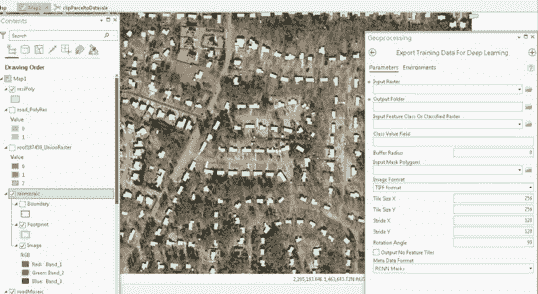

Fig. 2 — ArcGIS [“Export Training Data for Deep Learning”](http://pro.arcgis.com/en/pro-app/tool-reference/spatial-analyst/export-training-data-for-deep-learning.htm)

***1。用 Mask-RCNN 模型训练***

生成的训练数据集包含超过 18000 个图像和标签。通过进一步的数据处理以去除没有标记的图像，最终数据集具有超过 15000 个训练图像和标签。然而，在只有 32gb 内存的笔记本电脑上，不可能将如此大的数据集输入到 Mask-RCNN 模型中，这需要巨大的内存来进行训练。

训练策略是看看概念验证将如何工作，所以我逐渐增加数据集，以 3800 个数据集的试验馈入 CNN。

我使用了令人印象深刻的开源实现 [Mask-RCNN 库](https://github.com/matterport/mask_rcnn)，MatterPort 在 Github [上构建了这个库](https://github.com/matterport/Mask_RCNN)来训练这个模型。

Mask-RCNN 有效地检测图像中的对象，同时为每个实例生成高质量的分割掩模。该方法通过与现有的用于边界框识别的分支并行地添加用于预测对象遮罩的分支来扩展更快的 R-CNN[5]。可以阅读[研究论文](https://arxiv.org/abs/1703.06870)更好的理解模型。(图 3)。

fig. 3\. — Mask R-CNN framework for instance segmentation. Source: [https://arxiv.org/abs/1703.06870](https://arxiv.org/abs/1703.06870)

需要在类(Utils.dataset)中修改三个主要函数，以将您自己的数据集加载到框架中。有关数据加载实现，请参见下文。锚的比率设置为(16，32，64，128，256)以预测较小的住宅建筑尺寸。IMAGES_PER_GPU 设置为=1，因此 CPU 可用于训练模型(图 4)。图像和遮罩的示例(图 5)。

fig. 4 — Load Cobb Pictometry datasets to Mask-RCNN framework.

fig. 5 — An example of a random image and mask from datasets.

这里，迁移学习技术应用于主干网 ResNet-101 模型。我首先用 epoch =5 训练最后完全连接的层，以适应住宅建筑类，然后用 35 个 epoch 训练整个网络。

在 32gb 的 CPU 上，完成训练过程需要将近 48 个小时(图 6 和图 7)。

fig. 6 — Model training result. The loss is reasonable good.

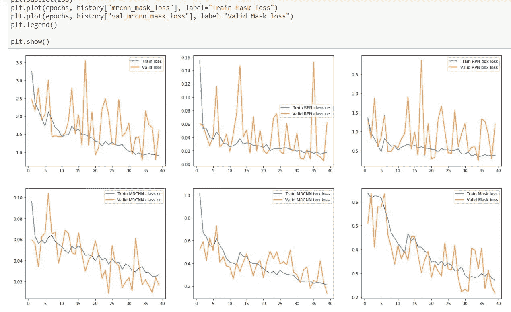

fig. 7 — Loss charts.

这里有两个推论，原始图像没有用于训练(图 8 和图 9)。有趣的是，推断面具比原始面具更准确地描绘了建筑。

fig. 8 — Original image that was not used in training

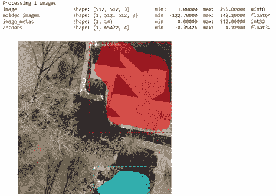

fig. 9 — Inference mask more accurately delineating the building than the original mask.

另一个有趣的例子是，一幅图像没有用于训练和屏蔽推断结果(图 10 和图 11)。

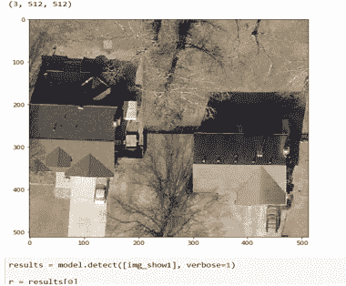

fig. 10 — An image that was not used in training.

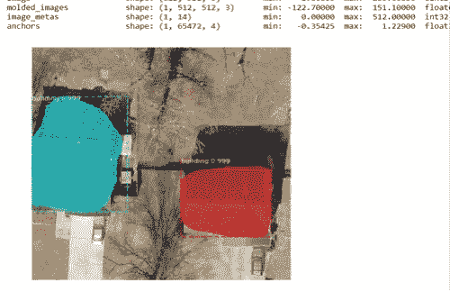

fig. 11 — Inference instance masks.

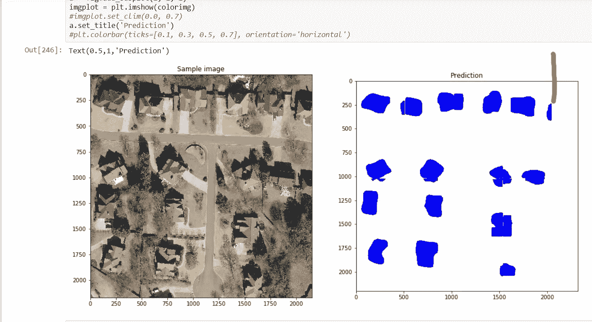

fig. 12 — This is a cropped image and inference mask not used in the training. The orange line indicates the image cropped position. With 3000 training datasets, the result is very promising.

***2。用 Deeplabv3+型号*训练 T3**

Deeplabv3+是由[谷歌研究团队](https://ai.googleblog.com/2018/03/semantic-image-segmentation-with.html)开发的最新艺术级语义图像分割模型。该模型的特点是级联或并行使用 atrous 卷积，通过采用多个 atrous 速率来捕捉多尺度背景(图 13)。

fig.13 — [https://ai.googleblog.com/2018/03/semantic-image-segmentation-with.htm](https://ai.googleblog.com/2018/03/semantic-image-segmentation-with.html)l

使用来自 ArcGIS 的相同训练数据集导出深度学习工具的训练数据，对图像和掩膜进行增强处理，并保存到 HDF5 压缩文件中，以便于加载到训练模型中(图 14)。

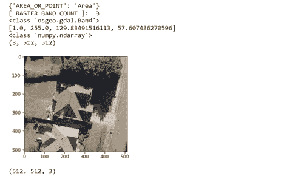

fig. 14 — A random example of image and mask.

我在 Github [这里](https://github.com/bonlime/keras-deeplab-v3-plus)使用了 Deeplabv3+的 Keras 实现。下面是 Keras 训练模型和主干 Mobilenetv2，它的参数比 Xception 模型少(图 15)。

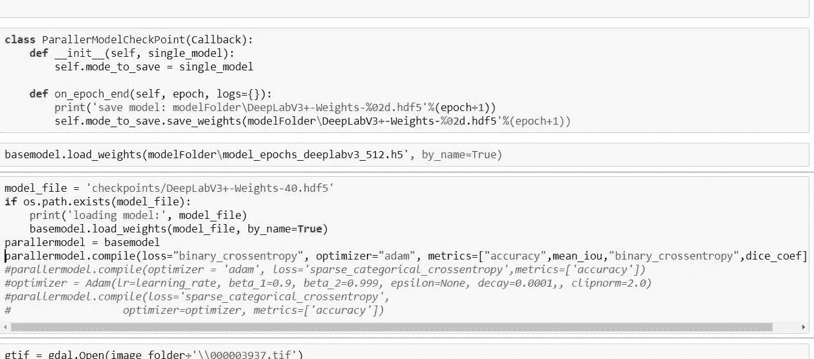

fig.15 — Define DeepLabv3+model.

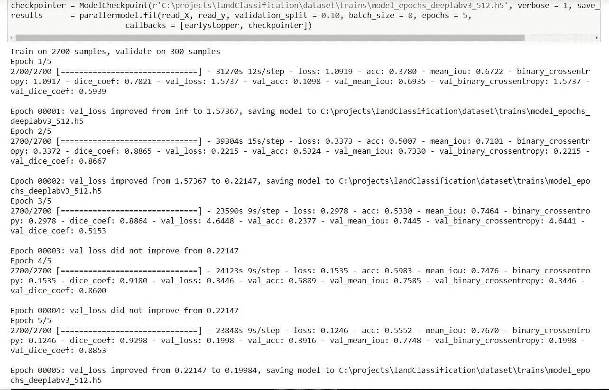

fig. 16 — Five epochs training result.

只有 5 个历元训练运行，结果非常有希望(图 16)。

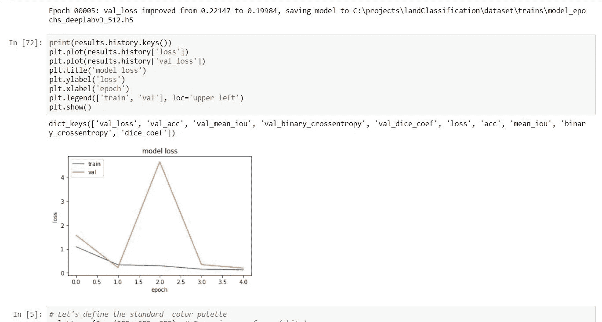

fig. 17 — Training loss converged plot.

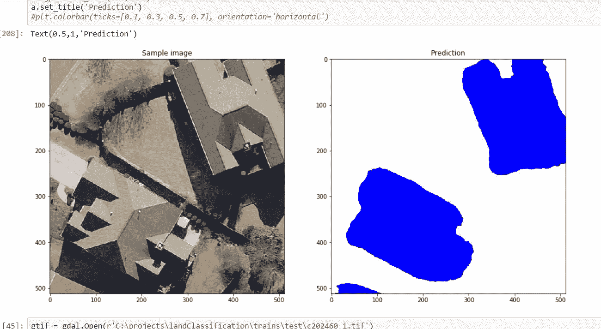

fig. 18 — Image and inference from trained year 2018 imagery of Deeplabv3+ model

我运行 Python 脚本对任意裁剪的 2064x1463 尺寸图像进行推理，该脚本裁剪并处理 16 张(512x512x3 dim)图像以获得推理栅格。(图 19)。随着对图像的进一步检查和推断，我们可以看到建筑物阴影的影响会降低建筑物边缘的准确性。

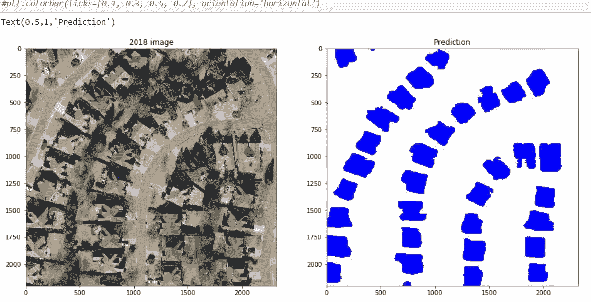

fig. 19 — A cropped 2018 EagleView image with inference raster (25 rasters of 512x512 dim)

使用相同的训练模型来预测 2019 年裁剪图像的相同区域，结果非常相似，只有微小的局部差异(图 20)。该模型确实有助于未来一年的图像推断。

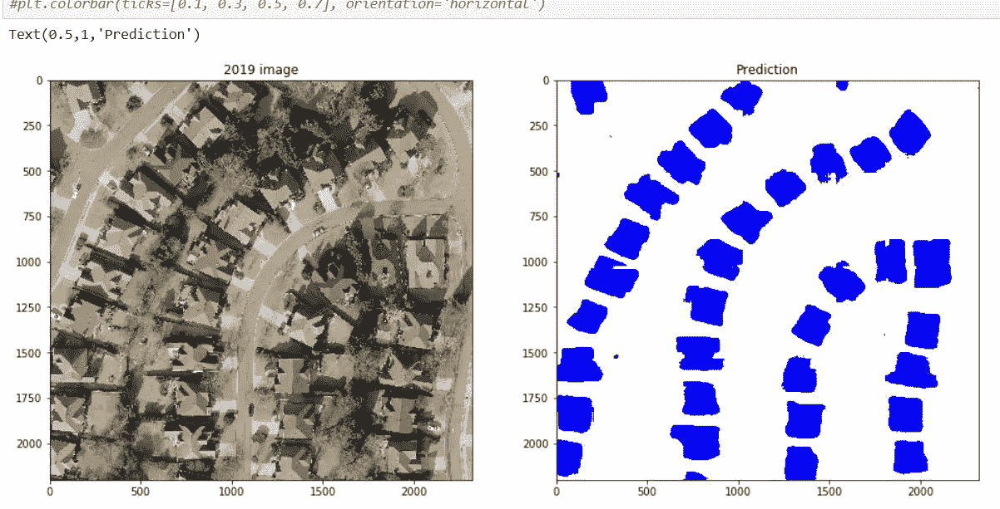

fig. 20 — A cropped 2019 EagleView image with inference raster (25 rasters of 512x512 dim)

fig. 21 — 2018 inference raster overlay the original image.

将上述图像和推论添加到 ArcGIS Pro 后。(图 21)

上面的影像栅格被转换为面要素，然后使用 ArcGIS Pro 3D analysis 中的[正则化建筑物覆盖区](https://pro.arcgis.com/en/pro-app/tool-reference/3d-analyst/regularize-building-footprint.htm)和适当的参数来正则化原始检测。(图 22)

fig. 22 — Use ArcGIS Pro Regularize Building Footprint tool to clean up building polygons.

然后，我用两张 20，000 x 20，000 尺寸的完整 2018 切片图像运行 python 推理脚本，这两张图像彼此相距约 3 英里。脚本裁剪并处理 1600 张(512x512x3 dim)图像以进行推理。使用 32GB RAM 的纯 CPU 笔记本电脑完成每个图块大约需要一个小时。参见(图 23)。有遗漏的分类建筑物主要是因为使用非常小的训练数据集和覆盖在建筑物顶部的树木。从该县的不同位置选择几个有代表性的瓦片作为训练数据集可以提高结果的准确性。

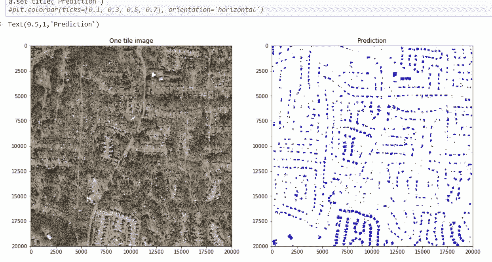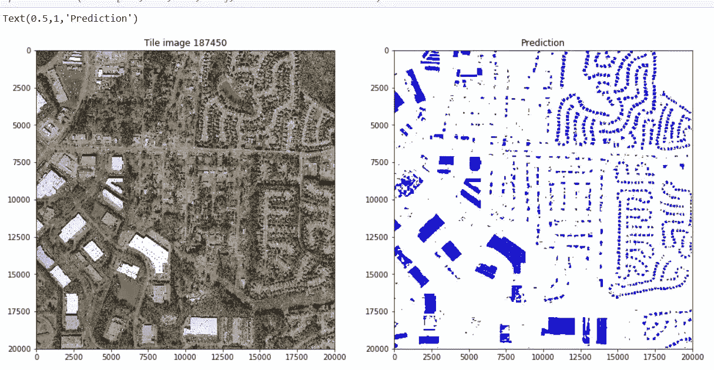

fig. 23 — Two complete tiles of EagleView 2018 image with inference raster (1600 rasters of 512x512 dim on each)

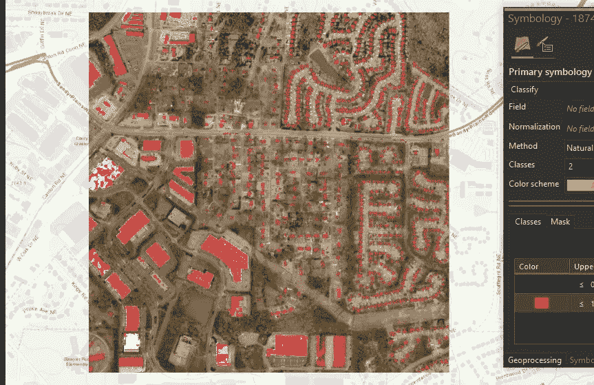

fig.24 inference raster overlay the image tile in ArcGIS Pro.

**结论:**

虽然它是一个相对较小的数据集，但 Mask-RCNN 和 Deeplabv3+深度学习模型都使用转移学习技术为超高分辨率图像分割提供了有希望的结果。由于原始建筑物覆盖区地面真实要素多边形的精度较低，以及笔记本电脑 CPU 和内存的限制，在某些图像分类和实例分割中，性能结果可能无法超越人类数字化仪。然而，这种深度学习训练过程的准确性可以通过增加来自该县不同位置的高质量训练数据集以及应用数据变化增强方法来进一步增强。该模型可用于多年影像以推断用于比较的要素检测，甚至可用于 ArcGIS 工具模型构建器的低成本要素描绘，以实现业务任务的自动化。更重要的是，上述深度学习训练过程可以应用于其他类型的图像实例或分割案例。( [**请看我下一篇博客**](/urban-water-inlet-features-detection-from-eagleview-aerial-imagery-using-mask-r-cnn-keras-arcgis-fd3f2ae062bf) **)**

*1。赖因哈德·克莱特(2014)。简洁的计算机视觉。斯普林格。*[*ISBN*](https://en.wikipedia.org/wiki/International_Standard_Book_Number)*[*978–1–4471–6320–6*](https://en.wikipedia.org/wiki/Special:BookSources/978-1-4471-6320-6)*。**

*[2。琳达·夏皮罗](https://en.wikipedia.org/wiki/Linda_Shapiro)*；乔治·斯托克曼(2001 年)。计算机视觉。普伦蒂斯霍尔。*[*ISBN*](https://en.wikipedia.org/wiki/International_Standard_Book_Number)*[*978–0–13–030796–5*](https://en.wikipedia.org/wiki/Special:BookSources/978-0-13-030796-5)*。***

***3。蒂姆·莫里斯(2004)。计算机视觉和图像处理。帕尔格雷夫·麦克米伦。*[*ISBN*](https://en.wikipedia.org/wiki/International_Standard_Book_Number)*[*978–0–333–99451–1*](https://en.wikipedia.org/wiki/Special:BookSources/978-0-333-99451-1)*。****

***4。Bernd jhne；霍斯特·豪埃克(2000 年)。*计算机视觉与应用，学生和从业者指南。学术出版社*。* [*书号*](https://en.wikipedia.org/wiki/International_Standard_Book_Number)*[*978–013085198-*](https://en.wikipedia.org/wiki/Special:BookSources/978-0-13-085198-7)*7。****

***5。* [*【明凯】*](https://arxiv.org/search/cs?searchtype=author&query=He%2C+K)*[*格鲁吉亚*](https://arxiv.org/search/cs?searchtype=author&query=Gkioxari%2C+G)*[*彼得·多拉尔*](https://arxiv.org/search/cs?searchtype=author&query=Doll%C3%A1r%2C+P)*[*罗斯·吉希克*](https://arxiv.org/search/cs?searchtype=author&query=Girshick%2C+R) *。* (2018)。面具-RCNN *，*[https://arxiv.org/abs/1703.06870v3](https://arxiv.org/abs/1703.06870v3)*****

**6. *Deeplabv3+ model，*[https://github . com/tensor flow/models/tree/master/research/deep lab](https://github.com/tensorflow/models/tree/master/research/deeplab)**

**[*7。https://blog . keras . io/building-powerful-image-class ification-models-using-very-little-data . html*](https://blog.keras.io/building-powerful-image-classification-models-using-very-little-data.html)**

**[*8。http://pro . ArcGIS . com/en/pro-app/tool-reference/image-analyst/export-training-data-for-deep-learning . htm*](http://pro.arcgis.com/en/pro-app/tool-reference/image-analyst/export-training-data-for-deep-learning.htm)**

**[*9。https://pro . ArcGIS . com/en/pro-app/tool-reference/3d-analyst/regulate-building-footprint . htm*](https://pro.arcgis.com/en/pro-app/tool-reference/3d-analyst/regularize-building-footprint.htm)**

***10。*[*https://blogs . TechNet . Microsoft . com/machine learning/2018/03/12/pixel-level-land-cover-class ification-using-the-geo-ai-data-science-virtual-machine-and-batch-ai/*](https://blogs.technet.microsoft.com/machinelearning/2018/03/12/pixel-level-land-cover-classification-using-the-geo-ai-data-science-virtual-machine-and-batch-ai/)**

***11。U-Net:用于生物医学图像分割的卷积网络*[*:https//lmb . informatik . uni-freiburg . de/people/Ron neber/u-Net/*](https://lmb.informatik.uni-freiburg.de/people/ronneber/u-net/)**