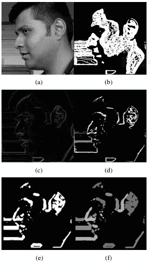
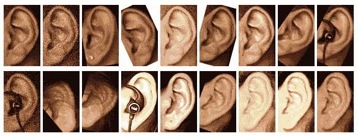

# 耳朵生物识别—机器学习更进一步…

> 原文：<https://towardsdatascience.com/ear-biometrics-machine-learning-a-little-further-1839e5d3e322?source=collection_archive---------9----------------------->

## 更精确的生物识别技术的领先创新。


Neural Networks (Image by [Gerd Altmann](https://pixabay.com/users/geralt-9301/?utm_source=link-attribution&utm_medium=referral&utm_campaign=image&utm_content=5140071) from [Pixabay](https://pixabay.com/?utm_source=link-attribution&utm_medium=referral&utm_campaign=image&utm_content=5140071))

像其他使用面部、虹膜和手指的生物特征一样，耳朵作为一种生物特征包含大量特定和独特的特征，允许进行人类识别。耳朵的形态在 10 岁后会有轻微的变化，医学研究表明，耳朵形状的显著变化只发生在 8 岁前和 70 岁后。随着年龄的增长，它的大小确实对称地增长，并开始向下凸出，但这是一个可测量的影响。研究表明，耳朵每年只变化 **1.22 毫米**。还有，耳朵的颜色分布和脸不一样，几乎是均匀的。耳朵的位置几乎在侧面脸的中间。甚至在对象从远处没有意识到的情况下，也可以捕获耳朵数据。人耳生物特征可以作为被动生物特征的一个很好的例子，并且不需要主体的太多合作，这满足了当前环境中认证系统的保密性要求。

数码相机从不同角度拍摄环境中对象的侧面人脸图像，从中分割、预处理耳朵部分。然后在不同的测试情况下分析特征向量，这些测试情况包括人脸在同一平面、不同平面、不同光照条件等的旋转。将作为输入提供给机器学习模型，该模型将被训练以识别环境中的人。该过程虽然复杂，但将开发一种系统，该系统将提供经认证的基于耳朵的生物识别系统。

**受控环境**

相机 A 的目的是在不期望耳朵有太大倾斜或旋转的情况下获得侧面脸部的清晰照片。同时，相机 B 和相机 C 用于为同一个人的多个图像捕获更多的侧面照片，以形成特征矩阵。


Environment

**从侧面人脸分割耳朵—**



Camera — A

图像(a)是从照相机捕捉的侧面脸。在图像(b)中，完成了地形标记。地形标记用于查找曲面和边缘。图像(c)是腐蚀和膨胀的差异，即对轮廓面应用形态学操作以锐化特征。图像(d)是(b)和(c)的简单点积。通过模糊(d) 10 次来获得图像(e ),从而可以应用连通分量分析。在图像(f)中，找到每个连通分量的复杂度，并用不同的
颜色进行着色。由于发现最复杂的区域是耳朵，为了更快的计算，将其分割并转换成图像(g)中的灰度。


Camera — B & C

**数据集和预处理**

数据集准备是任何机器学习模型的第一步。在该系统中，使用一个[深度神经网络](http://neuralnetworksanddeeplearning.com/chap6.html)来获取环境中对象的特征和特性。需要一个大的数据集作为神经网络的输入。每个对象至少 500 个图像来适当地训练网络，因为所有类别都是耳朵机器的图像，很容易与特征和特性混淆，每个对象的样本越多，就越容易找到明显的特征。数据集应涵盖各种各样的图像，例如不同光照条件、不同角度、[高斯滤波器](https://en.wikipedia.org/wiki/Gaussian_filter)、模糊等的图像。


DNN Architecture

在训练 CNN 网络的时候，有一些小的遮挡需要被覆盖，比如耳朵被头发、耳机或珠宝覆盖。图像增强有助于生成多份略有变化的图像副本，从而增加数据集。例如，可以使用 Keras 的[数据发生器。](https://keras.io/preprocessing/image/)



Dataset with slight variations

```
DATADIR = "./dataset"
CATEGORIES = ["Subject1", "Subject2", "Subject3", "Subject4"]

for category in CATEGORIES:
    path = os.path.join(DATADIR, category)

    for img in os.listdir(path):
        img_array = cv2.imread(os.path.join(path, img), cv2.IMREAD_GRAYSCALE)
        break
    break

IMG_WIDTH = 60
IMG_HEIGHT = 100
new_array = cv2.resize(img_array, (IMG_WIDTH, IMG_HEIGHT))

training_data = []

def create_training_data():
    for category in CATEGORIES:
        path = os.path.join(DATADIR, category)
        class_num = CATEGORIES.index(category)

        for img in os.listdir(path):
            try:
                img_array = cv2.imread(os.path.join(path, img), cv2.IMREAD_GRAYSCALE)
                new_array = cv2.resize(img_array, (IMG_WIDTH, IMG_HEIGHT))
                training_data.append([new_array, class_num])
            except Exception as e:
                pass

create_training_data()
print(len(training_data))

random.shuffle(training_data)
```

**卷积神经网络**

因为我们使用的是图像数据集(而不是。csv 文件或数字数据)，在数据预处理完成后使用 CNN。预处理的数据被传递到神经网络的结构。由于耳朵的表面积小于面部，因此耳朵所需的计算时间也较少。灰度图像由网络的输入层获取。


CNN Architecture


Convolution

步幅卷积和最大池用于增加每个隐藏层的深度(特征)。

卷积滤波器减少 9 个图像像素以生成单个像素，而不影响特征。

```
a = []      #feature set
b = []      #labels

for features, labels in training_data:
    a.append(features)
    b.append(labels)

a = np.array(a).reshape(-1, IMG_WIDTH, IMG_HEIGHT, 1)
```


Depth Increase (Pixel decrease)

```
# Create the model
model = Sequential()

model.add(Conv2D(32, kernel_size=4, strides=1,activation='relu', input_shape=(IMG_WIDTH, IMG_HEIGHT, 1)))
model.add(Conv2D(32, kernel_size=4, strides=2,activation='relu'))
model.add(MaxPooling2D(pool_size=2))
model.add(Conv2D(64, kernel_size=4, strides=1,activation='relu'))
model.add(MaxPooling2D(pool_size=2))
# model.add(Conv2D(64, kernel_size=4, strides=2,activation='relu'))
# model.add(Dropout(0.5))
# model.add(Conv2D(64, kernel_size=4, strides=1,activation='relu'))
# model.add(Conv2D(64, kernel_size=4, strides=2,activation='relu'))
model.summary()

model.add(Flatten())
model.add(Dense(32, activation='relu'))
model.add(Dropout(0.5))
model.add(Dense(4, activation='softmax'))
model.summary()

# Compile the model
model.compile(loss='categorical_crossentropy', optimizer='adam', metrics=['accuracy'])

# Train the model
model.fit(X_train, to_categorical(Y_train), batch_size=32, epochs=5)# Evaluate the model
scores = model.evaluate(X_test, to_categorical(Y_test))

print('Loss: %.3f' % scores[0])
print('Accuracy: %.3f' % scores[1])

model.save('model_opt.h5')
```

在最后的密集层中，完成特征分类(FC ),基于该特征分类将对象分类到网络的相应类别。


Training and testing

图表显示了深度神经网络的同一类的重叠曲线和不同类的不同曲线的精度。


Graph


Authorized user


Unauthorized user

**限制**

可能会有不同类型的遮挡情况，如头发、耳机或耳朵受伤或被布覆盖。个人获得认证的机会将变得更少。由于用于特征提取的纯耳百分比较小，因此精度会受到影响。该系统旨在关注小型环境房间，如安全室、董事会议、医学实验室等。

**未来范围**

耳朵是人体中最小的骨头。这对于网络罪犯来说很难复制。此外，它还可以用来测量温度、血流量、心率和葡萄糖水平。Ear 生物识别系统将在以下领域有多种用途:身份验证、访问和考勤控制、旅行控制、需要授权的金融和其他交易、远程投票、自动化工作设备的使用、行动控制。例如，如今机场使用面部和虹膜生物测定的组合来认证个人，相反，可以使用单耳生物测定系统来以相同的准确度实现个人的真实性。身体的每一个特征都会影响一个人的总体性格——脸、眼睛、手掌甚至笔迹。通过笔迹的个性分析被用于检测该人是否在说谎等。同样，耳朵可以用来分析一个人的性格。耳垂有很多可以用于性格分析的特征——附耳垂、宽耳垂、窄耳、尖耳、圆耳垂、方耳、耳突等。

**总结**

耳朵生物识别系统的最大优点是在人们不知情的情况下识别他们。这一特性将改变被动生物识别的动态，并可以在生物识别领域实现完全自动化。**指向焦点—**

*   具有各种图像的大型数据集(每个受试者 500 个样本),用于正确训练学习模型。
*   预处理图像以减少计算时间。
*   良好的网络架构(没有太多损失或丢失)。
*   运行足够多的历元来高效训练网络(建议用 GPU)。
*   使用训练好的模型来精确地预测这个人。

恭喜你坚持到了最后。太棒了。[点击这里](https://github.com/Hitesh-Valecha/Ear_Biometric_System)从我的 GitHub 账户获取源代码。

请随意提问，因为我们正在学习和机器一样的东西..

**参考文献—**

1.  闫平和凯文·w·鲍耶，IEEE 研究员，“使用 3D 耳朵形状的生物识别”，IEEE 模式分析和机器智能汇刊，第 29 卷，第 8 期，2007 年 8 月
2.  John D. Bustard，IEEE 学生会员，和 Mark S. Nixon，IEEE 准会员，“从二维图像进行不受约束的人耳识别”，IEEE 系统、人和控制论汇刊-A 部分:系统和人类，第 40 卷，第 3 期，2010 年 5 月
3.  智能系统研究中心的比尔·巴努和惠辰。计算机人耳识别。加州:加州大学河滨分校【在线】。doi:10.1007/978–1–84800–129–9。
4.  Eyad Haj Said，北卡罗来纳州立农业技术大学，北卡罗来纳州格林斯博罗，Ayman Abaza 和 Hany Ammar，计算机科学和电气工程系。“使用数学形态学在彩色面部图像中进行人耳分割”，IEEE 2008。