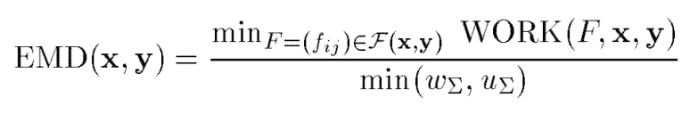

# 推土机的距离

> 原文：<https://towardsdatascience.com/earth-movers-distance-68fff0363ef2?source=collection_archive---------5----------------------->

## 语义搜索中文档相似性的语义度量

Photo by [Luis Enrique Ruiz Carvajal](https://unsplash.com/@luis_ruiz?utm_source=medium&utm_medium=referral) on [Unsplash](https://unsplash.com?utm_source=medium&utm_medium=referral)

## ⚠️在我的博客⚠️中读到了[的原帖](https://anebz.eu/earth-mover-distance)

这是我最初的[语义搜索](https://anebz.eu/semantic-search)帖子的续篇。这个是关于推土机的距离，可以应用在语义搜索上。

# 动机

语义搜索引擎从其本体中检索结果的方式是通过计算与查询最接近/最相似的文档。为了获得顶部最相似的文档，该算法计算查询和许多文档之间的**距离**。当获得相似性时，文档被相应地排序，并且位于顶部的文档被检索。

例如，假设本体有 5 个文档:

*   查询:'*我如何开始数据科学的职业生涯？'*
*   文档 1: *《烹饪的科学:如何做出一顿丰盛的饭菜》*
*   文件二:*‘2019 年数据科学突破*
*   文档 3: ' *海洋生物学家获得数据科学工作的指南'*
*   文献 4:*‘关于黑猩猩的数据是行为科学的基础’*
*   文档 5:*‘数据科学是 21 世纪的顶级职业’*

首先，我们计算查询和 5 个文档之间的距离，将具有最高相似性的文档返回给用户。

文档之间的这个**距离**是什么？人类可以很快知道哪个文档最适合这个查询，因为语言是我们与生俱来的，我们理解每个单词和整个句子的意思，我们甚至可以预测每个文档是关于什么的。简单的语法错误或稍微不同的词序不会影响我们的思维过程。

在几秒钟内，我们得出结论，文档#3 是最接近的:即使用户可能没有海洋生物学背景，海洋生物学家的经验可能会被证明是有用的。

但是计算机是如何计算两个句子之间的距离的呢？一个句子不仅仅是一系列单词:每个单词都有它的位置，有一个我们凭直觉理解的无形的潜在语法结构，因为我们从出生开始就接触语言，但计算机在历史上很难获得这种“直觉”。

一个简单的文档相似性度量是计算两个句子之间有多少共同的单词，而不考虑位置:

*   d(查询，文档 1) = 3(科学，如何，a)
*   d(查询，文档 2) = 2(数据，科学)
*   d(查询，文档 3) = 3 (a，数据，科学)
*   d(查询，文档 4) = 2(数据，科学)
*   d(query，doc5) = 4(数据，科学，职业，in)

根据这个标准，文档#5 是与查询最相似的文档。但是我们很快意识到有些词是不相关的，‘a’。how '，' in '等词并没有给句子增加意义。这些词被称为*停用词*，在大多数文本处理算法中会被删除。

词汇上的细微变化也不包括在这个指标中。动词的现在时与过去时、单数与复数、副词与形容词等。被认为是不同的词，而实际上，它们指的是几乎相同的术语。*词干化、词汇化和标记化*是获取单词词根形式的方法。

最后，文档#3 应该因为包含单词“job”而得分，在这个上下文中，它是“career”的同义词。“职业”和“工作”应视为等同物。，与文件#5 中的“职业”一词相同。在算法中包含同义词覆盖率可以大大提高性能。

如果我们深入挖掘，有人可能会说“我如何做 X”在意思上类似于“某人做 X 的指南”，尽管实现它是另一回事。

> 总之，使用语义文档相似性度量的动机是通过使用同义词、下义词等语义特征来改进现有的度量。

有许多文档相似性度量，词汇的和语义的。你可以读到他们中的许多人，[更偏重于理论](/overview-of-text-similarity-metrics-3397c4601f50)或[更实用](https://medium.com/@adriensieg/text-similarities-da019229c894)。

这篇文章是关于运土机的距离(EMD)的，这是一种语义方法，其中考虑了单词的含义和用户的意图。

# 推土机距离(EMD)

在 EMD 的情况下，文档之间的距离基于单词之间的语义距离，其中单词存储在称为 WordNet 的电子词汇数据库中。一旦获得单词之间的语义距离，EMD 通过单词之间的多对多匹配来计算文档相似度。也就是说，一个文档中的三个单词可能与另一个文档中的一个单词意思相同。[1]

## 1.定义

让我们从句子、单词和文档中抽象出来，假设文档是加权点的分布。分布是位置为**和权重为**的元组。

> 两种分布之间的 EMD 与将一种分布转换成另一种分布所需的最小**工作量**成比例。
> 
> 1 单位**功**是将一单位重量移动一单位距离所需的功。

## 2.直觉

直觉上，重量从一个分布流向另一个分布，直到它们相同，类似于用成堆的*灰尘*填充*洞*。一个分布充当一组孔，而另一个分布的点是污垢。[2]

Example 1

从空间中显示两个分布的初始点开始，一个分布被指定为灰尘的角色，而其他分布被指定为孔的角色，每个灰尘点被指定为孔的一个点(不一定每个孔的点都有一个灰尘点)，并且灰尘反复地向孔“移动”，直到它填满孔。

移动灰尘的成本/ **工作**取决于灰尘的重量/数量以及需要移动的距离。

点与点之间的地面距离度量可以是欧几里得，曼哈顿…但是不要把这个距离和单词之间的距离混淆。这个地面距离仅仅是维度空间中的点之间的距离。

Example 2

在示例#2 中，红色分布必须覆盖的距离大于示例#1 中的距离，因此需要更多的**功**来“移动灰尘”。

> **EMD 算法的目标是优化如何分配权重，以使所有的灰尘覆盖所有的孔洞，同时将权重移动尽可能短的距离。**

注意:在这种情况下，两种分布是平衡的，也就是说，污垢的数量等于孔的数量。一旦所有的洞都被盖住了，就不会有灰尘留下，或者一旦所有的灰尘都被放进去，就不会有多余的洞了。如果你想看到不平衡的分布，考虑阅读[2]。

有许多方法来分配权重，红色分布中最左边的脏点可以与蓝色分布中最低的洞点相匹配，但这不是很有效。计算 EMD 的一个步骤是*获得两个分布*之间最可行的流量

## 3.注释

符号和公式可以在我的演示文稿[0]的幻灯片中找到。我试着让这篇文章更加理论化和直观化，而不要过于深入数学。

## 4.流动

给定两个分布 x 和 y，它们之间的流是定义 x 和 y 之间的权重分布的任何矩阵 F。矩阵 F 中的每个点 f_ij 表示 x_i 处与 y_j 匹配的权重量。

注意:强调 **any，** a 流可以是任意的权重分布，无论是否有效。寻找有效/可行的流程是 EMD 所基于的优化问题。

**寻找可行流:**流 F 是可行的当且仅当它满足每个 f_ij 的以下约束:[2]

1.  f_ij 必须为正，匹配权重不能为负。
2.  移动到孔 y_j 的重量不能超过 x_i 中存在的重量。最多可以移动污垢点中的所有污垢。
3.  从污垢点 x_i 移动的重量不能超过 y_j 中存在的“孔”的量。孔中不能有污垢溢出。
4.  在所有点上移动的所有重量必须是分布中的总重量。所有的灰尘必须盖住所有的洞，没错。没有污垢漂浮在周围，没有洞被覆盖。

满足这些要求的流程被认为是可行的。

## 5.工作

可行流在匹配 x 和 y 时所做的**功**是 x 和 y 中每个点的匹配权重乘以距离

## 6.电机驱动的（electric motor-driven 的缩写）

推土机的距离是匹配 x 和 y 的最小**工作量**，由较轻分布的总重量标准化，但在这种情况下，两种分布具有相同的总重量，因此不存在较轻分布。功简单地除以一个分布的总重量。

优化问题是找到最小化工作的流。重量，所有的重量，都必须移动。但是哪个权值到哪个点，用什么量，取决于点与点之间的距离，这样权值就不用移动太远，这就是优化问题。

## 7.一些例子[2]

Example 3

关于工作的非最佳与最佳流程。在左边的场景中，0.26 重量(d=316.3)所覆盖的距离导致功如此之高。这个例子相当直观，最优流量相对容易获得。

Example 4

一个不太直观的例子，在这种情况下，分布中的*总权重是不同的。*所以要么会有脏物溢出，要么孔不会被完全盖住。

## **8。总结**

推土机的距离是将一种分布移动/转换成另一种分布所需的距离。这些分布的两个特征是点在一个空间中，在例子中是 2D，并且每个点都有一定的权重。通过计算分配这些权重的最有效方式，我们得到一个表示 EMD 的数字。

## 9.EMD 作为文档相似性的语义度量

这与这篇文章要讨论的文档相似性的语义度量有什么关系？正如开头提到的，文档之间的距离是基于单词之间的语义距离，其中单词存储在一个称为 WordNet 的电子词汇数据库中。让我们试着将这个 WordNet 表示映射成点数和权重的分布:[3][4]

*   WordNet 是一个大型图形或语义网络，其中网络的每个**节点**代表一个真实世界的概念(房子、老师、艺术)。
*   每个节点包括:
    一个 *synset* ，一组表示相同概念的同义词，以及
    一个 *gloss* ，一个真实世界概念的简短定义或描述。
*   同素集之间的每个链接描述了同素集所代表的真实世界概念之间的一种语义关系(上义词、下义词、部分义词、全义词等)。

句子 X 可以被描述为点和权重的分布，其中:

*   这些点是单词的 WordNet 表示(在长度为 N 的向量中，我们可以将其视为一个 N 维空间)
*   权重是单词的 [TF-IDF](https://en.wikipedia.org/wiki/Tf%E2%80%93idf) 值(显示单词对于文档有多重要的度量)。[5]

通过找到最小化工作以匹配 x 和 y 的流来计算 EMD，归一化为 1，并且如下获得**文档相似度**:

# 结论

推土机的距离是一种距离，其中 N 维空间中的点的位置和重量是关键的。

通过将单词转换为单词向量，将权重转换为 TF-IDF 值，EMD 可以用作文档相似性的语义度量。

## 与语义搜索的关系

EMD 可以用来计算查询和文档的语义相似度，从而在[语义搜索](https://anebz.eu/semantic-search)的本体匹配阶段发挥作用。

## 字移动器的距离

WMD 是 EMD 的一个类似的、更新的变体，但是使用 word2vec 而不是 WordNet。它发布于 2015 年[6]，有几个[实现教程](https://markroxor.github.io/gensim/static/notebooks/WMD_tutorial.html)可用，对学习 measure 的实现方面非常有用。

为了我的演讲，我对这个话题进行了深入的研究，我希望我用一种清晰简洁的方式对它进行了总结。如果有什么解释得不够好，我很乐意再试一次。

我真的很感激任何反馈，不完整或错误的信息，我可能已经包括在内。感谢您的阅读！

## 参考

[0]: [语义搜索](https://www.dropbox.com/s/7wd6110uiyqa835/semantic_search.pdf?dl=0)，2018 年我在 LMU 大学攻读硕士学位时发表的演讲幻灯片

[1]: [面向基于命名实体的相似性度量:挑战与机遇](https://dl.acm.org/citation.cfm?id=2666194)，De Nies 等人，2014

[2]: [在图像中寻找颜色和形状模式](http://infolab.stanford.edu/pub/cstr/reports/cs/tr/99/1620/CS-TR-99-1620.pdf)，科恩，斯坦福大学，1999

[3]: [将词典和语料库信息合并到语义相关度的上下文向量测量中](http://www.d.umn.edu/~tpederse/Pubs/patwardhan.pdf)，Pathwardan，明尼苏达大学，2003 年

[4]: [自动词义辨别](http://www.aclweb.org/anthology/J98-1004)，Schütze，1998

[5]:【推土机距离作为文档相似度的语义度量，万，彭，北京大学，2005

[6]: [从单词嵌入到文档距离](http://proceedings.mlr.press/v37/kusnerb15.pdf)，Kusner 等，2015。

## 相关链接

*   [单词嵌入之间的单词距离](/word-distance-between-word-embeddings-cc3e9cf1d632)
*   [字移动器的距离作为线性规划问题](https://medium.com/@stephenhky/word-movers-distance-as-a-linear-programming-problem-6b0c2658592e)
*   [推土机的距离](https://medium.com/@dieswaytoofast/earth-movers-distance-276d46e0511d)