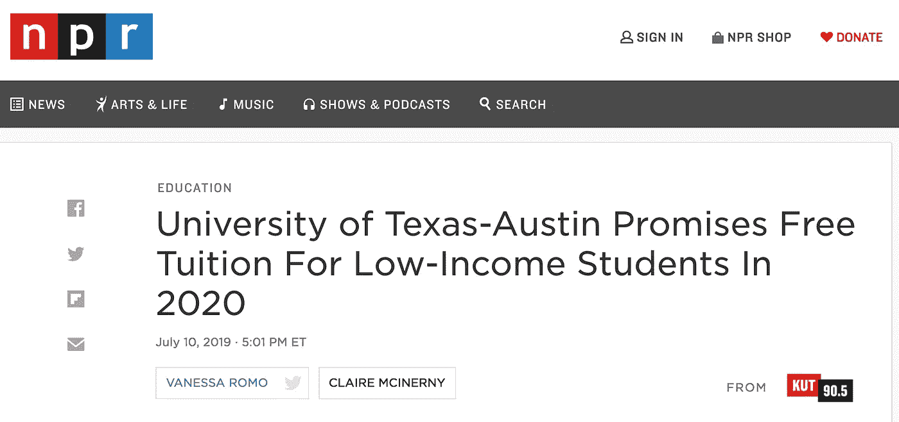
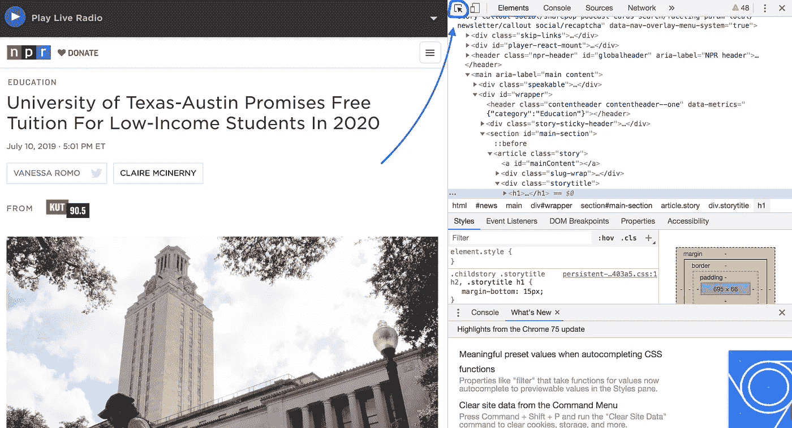
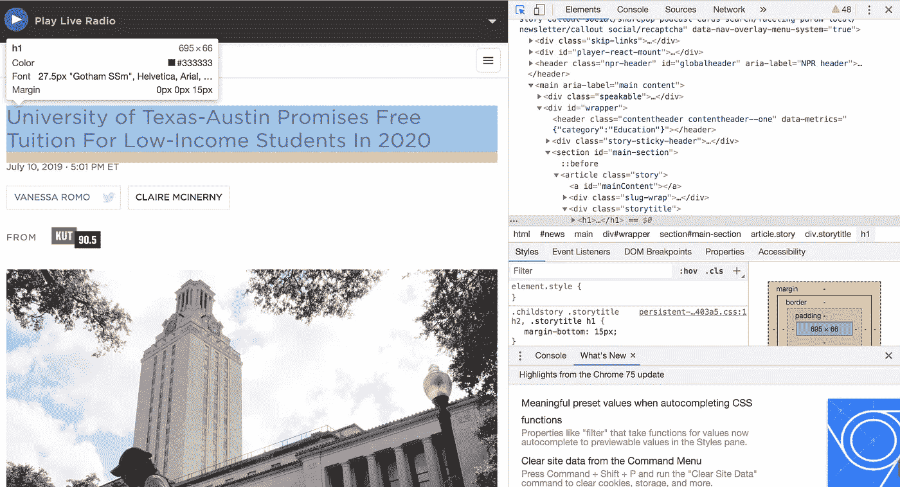
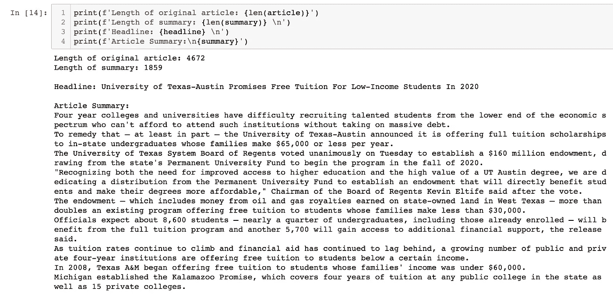

# 使用 Python 轻松抓取和总结新闻文章

> 原文：<https://towardsdatascience.com/easily-scrape-and-summarize-news-articles-using-python-dfc7667d9e74?source=collection_archive---------11----------------------->


There’s lots of news to read and lots of coffee to drink!

在今天的数字世界中，我们被无尽的信息轰炸。我们有无限滚动的社交媒体和 24 小时新闻循环。因此，有大量的新闻需要关注，我们必须能够快速消化！

因此，让我们来做一个练习，将新闻文章压缩到更容易理解的大小。

我们将使用 *requests* 和 *BeautifulSoup* 包抓取一篇示例文章，然后我们将使用优秀的 *gensim* 库对其进行总结。你可以通过在我的 Github 上下载[这个 Jupyter 笔记本](https://github.com/chaimgluck/blog-posts/blob/master/scrape-news/scraping-and-summarizing-news-articles.ipynb)来参与互动。

让我们开始吧！

```
# Imports
import requests
from bs4 import BeautifulSoup
from gensim.summarization import summarize
```

现在我们来挑选一篇有趣的文章:



[Link - I want to read it. But I bet it’s TOO long!](https://www.npr.org/2019/07/10/740387601/university-of-texas-austin-promises-free-tuition-for-low-income-students-in-2020)

现在我们有了一篇文章，我们将检索它的内容:

```
# Retrieve page text
url = '[https://www.npr.org/2019/07/10/740387601/university-of-texas-austin-promises-free-tuition-for-low-income-students-in-2020](https://www.npr.org/2019/07/10/740387601/university-of-texas-austin-promises-free-tuition-for-low-income-students-in-2020)'
page = requests.get(url).text
```

## 网页抓取:

现在我们刮吧！

首先，我们将把页面内容转换成一个 BeautifulSoup 对象，这将允许我们解析 HTML 标签。

```
# Turn page into BeautifulSoup object to access HTML tags
soup = BeautifulSoup(page)
```

然后，我们需要找出哪些 HTML 标签包含文章的标题和正文。对于一个伟大的 HTML 入门，看看[HTML.com](https://html.com/)。

为此，我们将使用 Google Chrome 出色的 *Inspect* 工具。在[新标签](https://www.npr.org/2019/07/10/740387601/university-of-texas-austin-promises-free-tuition-for-low-income-students-in-2020)中打开我们选择的新闻文章，在页面上点击右键，从下拉菜单中选择 *Inspect* 。这将调出*检查*工具，如下所示:



If for some reason you’re not using Chrome, now’s the time to start

单击上面概述的小按钮，找到与您在页面上看到的任何内容相对应的 HTML 标签。

当您将鼠标悬停在页面上您想要选择的文本上时，在本例中是文章的标题和正文，您将看到哪些 HTML 标签用于标识该文本。



Headline is identified with the <h1> tag

文章标题被

# 标签包围。我们将选择页面上的第一个

# 标签，如下所示:

```
# Get headline
headline = soup.find('h1').get_text()
```

文章的正文由

标签包围。这一次我们必须找到页面上包含的< p >标签中的所有标签，因为文章的每个段落都包含在一个< p >标签中。

```
# Get text from all <p> tags.
p_tags = soup.find_all('p’)
# Get the text from each of the “p” tags and strip surrounding whitespace.
p_tags_text = [tag.get_text().strip() for tag in p_tags]
```

如果您检查我们在' *p_tags_text'* 变量中检索到的文本，您会注意到有些文本不是来自主文章，比如作者的名字和一些图像标题。因为它们也是用< p >标签描述的，所以我们也选择了它们。为了清理我们所拥有的文本，我们可以使用一些快速列表理解来过滤掉我们所知道的不属于主要文章的文本类型。

在本文中，图像标题包含换行符' *\n* '来添加空格。因为我们知道文章中的实际句子不会有随机的换行符，所以我们可以安全地删除它们。类似地，我们可以删除不包含句号的文本，因为我们知道文章中任何合适的句子都会包含句号。这将漏掉作者的名字和其他一些不相关的信息。

```
# Filter out sentences that contain newline characters '\n' or don't contain periods.
sentence_list = [sentence for sentence in p_tags_text if not '\n' in sentence]
sentence_list = [sentence for sentence in sentence_list if '.' in sentence]
# Combine list items into string.
article = ' '.join(sentence_list)
```

## 总结:

现在我们有了文章的正文，我们可以对它进行总结了。

*Gensim* 是一个用于各种 NLP 任务的优秀 Python 包。它包括一个相当强大的摘要功能，易于使用。它是基于[本文](https://arxiv.org/pdf/1602.03606.pdf) ( [文档](https://radimrehurek.com/gensim/summarization/summariser.html))的发现的 [TextRank 算法](https://web.eecs.umich.edu/~mihalcea/papers/mihalcea.emnlp04.pdf)的变体。正如您将看到的，我们可以在一行代码中使用它:

```
summary = summarize(article_text, ratio=0.3)
```



That’s pretty good!

你有它！我们已经检索了文章的标题，并创建了内容摘要。现在你可以用大约 1/3 的时间理解文章的主旨，然后继续你的一天。

在我的下一篇文章中，我将通过创建一个命令行实用程序来扩展这个功能，该实用程序可以抓取和总结一篇文章，并自动将摘要通过电子邮件发送给您自己。敬请期待！