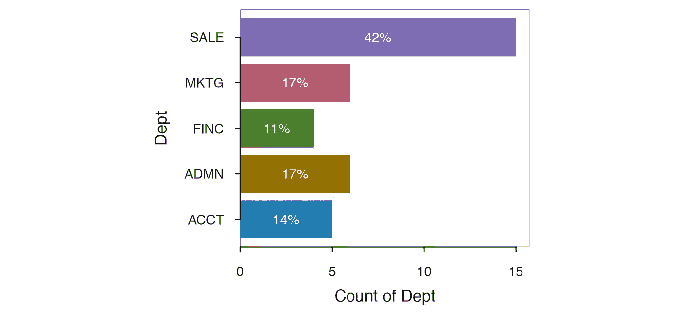
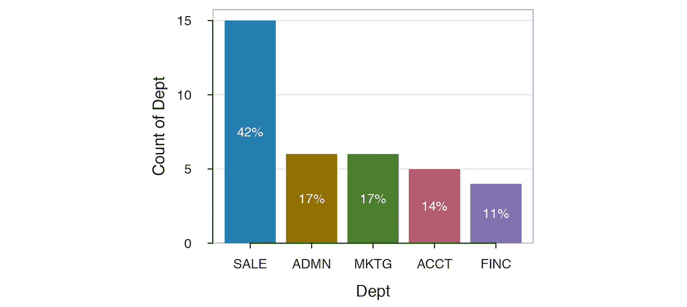
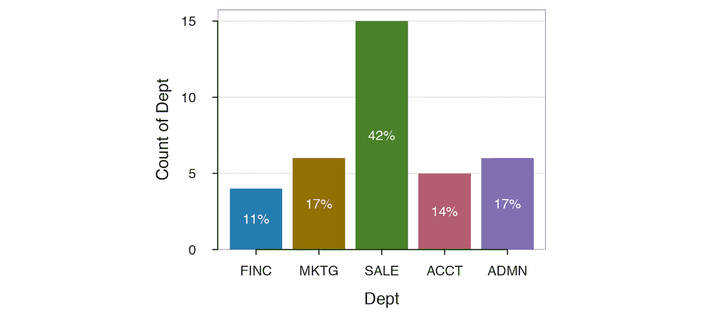
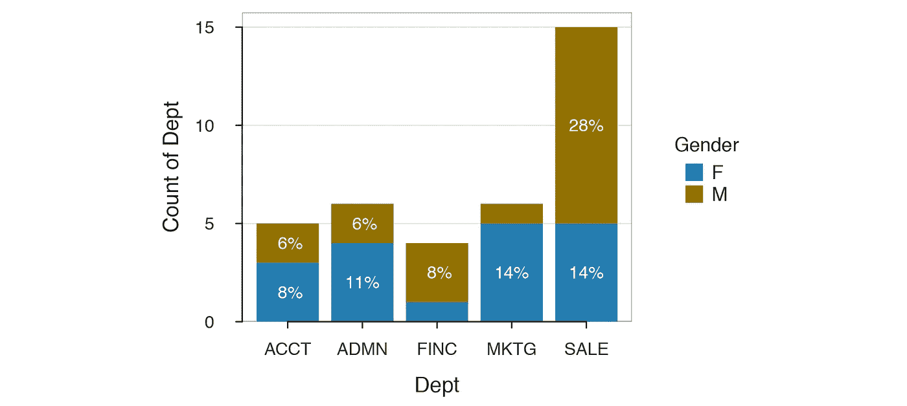
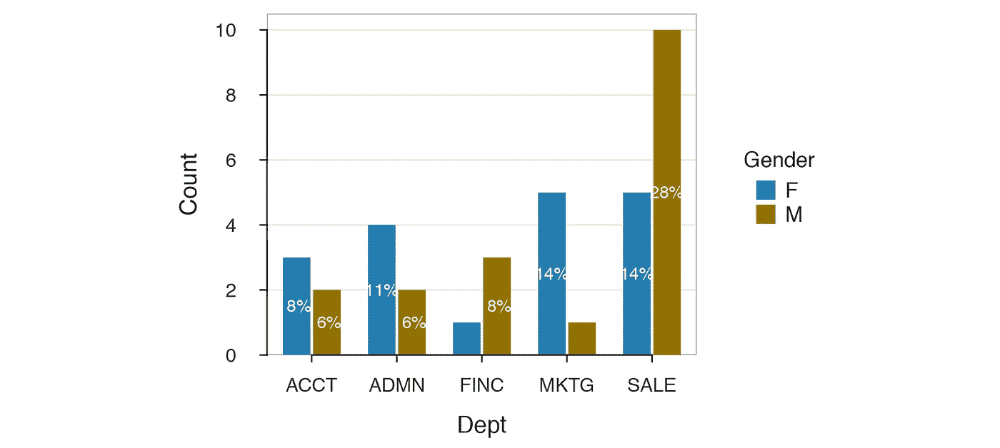
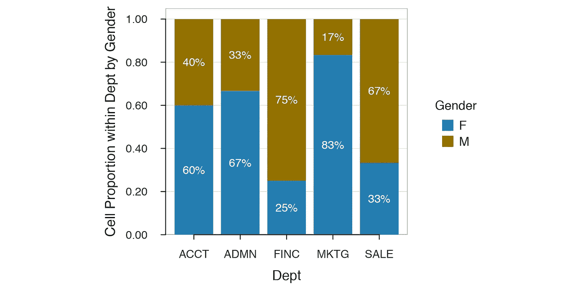
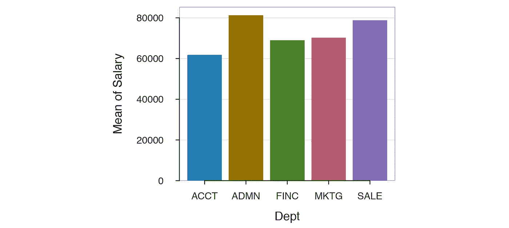
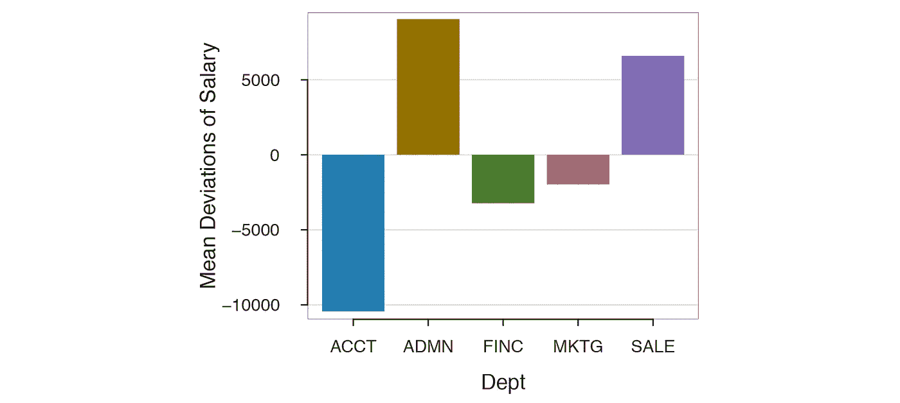
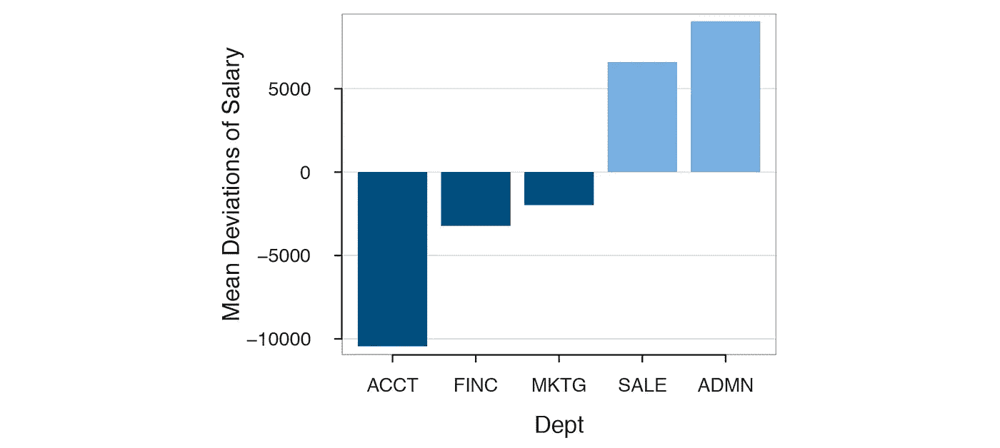
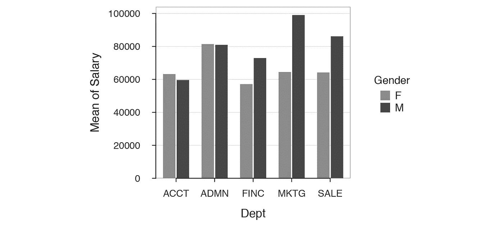

# 从简单到复杂的简单、引人入胜的条形图

> 原文：<https://towardsdatascience.com/easy-bar-charts-from-simple-to-sophisticated-7270c03eced8?source=collection_archive---------15----------------------->

## 通过数据可视化讲述您的故事

想象一下生成数据可视化的最简单的代码。让我们从一个我们都见过并且都需要的形象化的条形图开始。


Beach bar chart, horizontal orientation.

条形图中的每个条形代表一个变量的类别或级别，该变量具有相对较少的唯一值，例如公司的各个部门。每个条形的高度对应于我们分配给该类别的数字。这个数字可以代表很多东西，例如，对于每个部门，雇员的平均工资，或者雇员的数量。

我们需要指令来创建一个如此简单的条形图，以至于计算机可以直接读取我们的想法。我们希望我们的默认可视化在没有编程的情况下看起来很棒。我们宁愿把时间花在分析和解释上，甚至(有时)做一些完全不同的事情，而不是弄清楚编码语法和调试。

> 最小的计算机输入应该提供最大的有用的计算机输出。

无论您是 R 专家还是 Python 专家，或者根本不是专家，都没有什么区别。为了简单起见，我们将条形图函数命名为`BarChart`。一个简单的函数调用就是一个简单的函数调用，不管是什么语言，所有人都可以访问。`BarChart`包含在我的 *lessR* 包中，是 R 生态系统的一部分。

# 数据帧

从哪里开始？

> 数据分析分析组织成表格的指定变量的数据值。

将您的数据值存储在*数据表*中。每一列都包含单个变量的数据值，例如下面的一些雇员的 Excel 表。


First six rows of data of a data table with an ID field and four variables: Years, Gender, Dept, and Salary.

用相对较少的非数字类别定义数据表中的每个分类变量，比如性别和部门。其他变量有连续的数值，如薪水。每行包含单个雇员的数据值。空白单元格表示缺少数据。

我们访问这种数据表的通用结构，无论是用 R 语言、Python 语言，还是在第一个广泛可用的数据分析系统中，都可以追溯到 20 世纪 70 年代初我的大学时代。当时，我在 IBM 360 大型机上用穿孔卡运行 SAS 和 SPSS 版进行数据分析，玩得很开心。你知道，在我们有那些连接到主机的高级终端之前，我们可以在屏幕上打字，更不用说携带我们自己的电脑了。从一开始，我们就将数据组织成分类变量和连续变量的数据表。

要开始分析，请将数据表中的数据值从某个外部文件(位于您的计算机系统或网络上)读取到存储在您正在运行的应用程序中的数据结构中。r 和 Python 把这个数据结构叫做*数据帧*。我们正是从数据框架开始数据分析的。

一个简单的读取函数，不出所料地被命名为`Read`，也是 *lessR* 包的一部分。`Read`用相同的函数调用将 Excel、text csv 逗号或制表符分隔、SAS、SPSS 或 R 数据文件读入 R 数据框。计算机不是完全哑的，所以让它弄清楚文件的类型。`Read`还提供各种输出来帮助你理解你的数据，并确保它被正确读取。

要使用，在响应 R 命令提示符>时，输入带数据位置的`Read`，用引号括起来。将输出定向到数据框。在这里，从文件的网址读取上图中引用的完整 Excel 文件。为简单起见，将我们新创建的数据框称为 *d，*是所有 *lessR* 数据分析函数的默认数据框名称。

```
d = Read("[http://web.pdx.edu/~gerbing/data/employee.xlsx](http://web.pdx.edu/~gerbing/data/employee.xlsx)")
```

要在您的计算机系统上浏览数据文件，而不是位置，不要在引号之间放置任何东西。

# 基本条形图

现在，我们有了编写最简单的函数调用所需的信息，可以创建每个部门中雇员数量的条形图。

> 从可视化函数创建可视化，该函数将数据作为变量名称引用。

这就是我们的函数名和我们希望绘制以获得条形图的变量。

## 默认条形图

要获得默认条形图，运行 R 应用程序(参见最后一节)，访问 *lessR* 函数，读取您的数据，然后输入以下内容以响应 R 命令提示符，>。

```
BarChart(Dept)
```

如果你把你的数据框命名为 *d* ，就是这样。如果您愿意，可以包含参数 *data* ，这是一个名为 *d* 之外的数据帧所必需的。

```
BarChart(Dept, data=d)
```

无论哪种方式，得到以下可视化。


`BarChart`标注每个条形，如每个部门员工的百分比。从我们的可视化中，我们看到销售部门的员工比任何其他部门都多，占所有员工的 15%或 42%。金融从业人员最少，只有 4 人，占全部从业人员的 11%。

我们的默认条形图避免了枯燥的灰色。我们想要颜色，但不是任何颜色。我们希望防止一些条形(如亮红色)比其他条形(如深蓝色)更明显的感知偏差。条形图中的所有颜色都具有相同的亮度和强度。如果我们将彩色条纹放入 PhotoShop 等照片处理应用程序，并转换为灰度，所有条纹的灰度都相同。

我们想要许多易于实施的选项。如果我们愿意，可以水平翻转条形，或者用绘制的数值(这里是计数，而不是百分比)标记条形，或者完全关闭标记，甚至用灰色标记。我们希望所有这些选项都可以工作，而不必编写更多的代码行。

在创建我们伟大的图形时，我们可能会得到一些附带的统计输出。对于我们的条形图，自然输出是频率分布，我们的分类变量的每个类别的计数和比例。还包括相等类别比例的卡方检验。

进一步简化条形图函数调用的唯一方法是缩写。我们有。如果你厌倦了键入`BarChart`，就用`bc`，比如`bc(Dept)`。

## 水平条形图

为了定制超出默认范围的代码，我们不想编写更多的代码。相反，请指定参数值。例如，要水平翻转图表，将参数 *horiz* 设置为 *TRUE* 。

```
BarChart(Dept, horiz=TRUE)
```



# 重新排列类别

默认情况下，R 按字母顺序排列类别。如果顺序是任意的，或者是按字母顺序排列的，这种方法就可以，否则就不行。

## 按数值对类别进行排序

一种重新排序的方法是使用参数 *sort 按数值对类别进行排序。*将值设置为`“+”`进行升序排序，或者设置为`“-”`进行降序排序，最大值优先。

```
BarChart(Dept, sort="-")
```



## 定义类别的任意顺序

r 可以将一个分类变量表示为一个*因子*，它允许对类别进行任何排序。用 R `factor`函数转换成一个因子，或者更简单更通用的 *lessR* 版本`factors`。用*级别*参数指定类别或级别的顺序。

在这里，将变量 Dept 转换为默认 *d* 数据框中的 R 因子，其中类别排序为财务第一，管理最后。然后将创建的因子保存回 *d* 数据框。同样，如果要转换的变量不在 *d* 数据框中，包括*数据*参数。

```
d = factors(Dept, levels=c("FINC", "MKTG", "SALE", "ACCT", "ADMN"))
BarChart(Dept)
```

现在条形图中的条形遵循指定的顺序。



# 两个分类变量的条形图

要向条形图添加第二个分类变量，请在函数调用中引用第二个变量的名称。

## 堆积条形图

同样，为了简单起见，让我们用来命名参数*来表示第二个分类变量。*

```
BarChart(Dept, by=Gender)
```

对于下面的条形图，条形图的大小与 just Dept 的第一个条形图相同，但现在每个条形图都分成两个部分。每种性别的部分相互堆叠，形成一个*堆叠条形图*。



与前面的 just Dept 条形图一样，每个条形的高度对应于相关部门中的雇员数。现在我们有了额外的信息，每组变量的百分比。例如，销售部门的女性占 14%，这是基于整个分析中的员工总数。

## 并排条形图

你更愿意并排看到每个性别的条形图来强调他们的相对影响力吗？参数*的时间在*旁边。

```
BarChart(Dept, by=Gender, beside=TRUE)
```



`BarChart`不列出具有最小值的条形的百分比值。

## 百分比堆积条形图

另一个演示侧重于这些数据值在每个部门中的男女比例*，它代表第一分类变量的每个类别中的所有数据值。对应的条形图是一个堆积的 100%条形图，用参数 *stack100* 表示。*

```
BarChart(Dept, by=Gender, stack100=TRUE)
```

对于这种类型的条形图，所有的条形高度相同。每个条形代表第一个分类变量的每个类别中的所有数据值。



在这里，我们看到销售领域的男性人数是女性的两倍，分别为 67%和 33%，营销领域的女性人数比男性多得多，分别为 83%和 17%。

# 超过个计数的条形图

条形图与类别相关联的数字超出了计数的范围。对于垂直条形图，在水平轴或 *x* 轴上绘制分类变量的值。在纵轴或 y 轴上绘制数字。在前面的例子中，我们提供了变量 Dept 的值 *x* ，由此`BarChart`将计数计算为变量 *y* 的值。因此，前面的函数调用没有指定一个 *y* 变量。

## 绘制数值变量在不同类别中的平均值

为了绘制不同级别部门的可变工资的平均值，通知`BarChart`变量*y*-是基于工资的。用参数 *stat* 表示 *y* 跨 *x* 类别汇总的统计量。在这里画出每个部门的平均工资。

```
BarChart(Dept, Salary, stat="mean")
```

明确地说，包括 *x* 和 *y* 参数的名称，在`BarChart`函数调用中写入`x=Dept`和`y=Salary`。或者，键入 less，如本例所示，并删除参数名。无论哪种方式，我们得到以下可视化。



除了`“mean”`，我们还可以选择统计数据`“sum”`、`“sd”`、`“dev”`、 `“min”`、`“median”`或`“max”`。

`“dev”`表示每个类别相对于 *y* 变量平均值的偏差分数。绘制偏差分数强调了数值变量在类别间的差异。

```
BarChart(Dept, Salary, stat="dev")
```



在这个例子中，我们看到平均工资最高的是行政部门，平均来说，会计师的工资最低。

与典型的数值一样，更具信息性的可视化是根据它们的大小进行排序。我们再次调用*排序*选项。我们还包括一个新选项， *fill_sort* ，它为条形提供了两种颜色，在这里以 0 分割，以区分正负偏差。

```
BarChart(Dept, Salary, stat="dev", sort="+", fill_split=0)
```



## 跨类别按变量比较*的级别*

公司各个部门的男女平均工资有什么不同？现在我们把它们放在一个函数调用中。将第一个分类变量 *x* (部门)、数字变量 *y* (薪水)、第二个分类变量 *by* (性别)包括在一起，并指出 *y* 到每个类别组合平均值的转换。

```
BarChart(Dept, Salary, by=Gender, stat="mean", beside=TRUE)
```

当比较不同级别的平均值时，将级别绘制为相邻的条形可能更有意义，因此将参数旁边的*设置为*真*。*


`BarChart`的文本输出还包括标绘平均值的具体值。没有直接在横条上写数值的空间。

# 式样

对于特定的应用，你需要这些灰色吗？灰度和许多其他样式选项是可用的，太多了，无法在这里全部讨论。事实上，可视化的任何方面都可以定制。最有影响的两个参数是*填充、*用于区域的颜色，例如条和点，以及*颜色、*用于区域的边缘颜色，包括线段本身。

为了让我们的灰色不那么无聊，绘制一个从浅到深的灰度调色板。 *lessR* 包提供预定义的调色板，例如用于一系列灰色的`“grays”`。以 30 度的增量遍历色轮定义了其他 *lessR* 调色板:`“reds”`、`“rusts”`、`browns”`、`“greens”`、`“emeralds”`、`“turquoises”`、`“aquas”`、`“blues”`、`“purples”`、`“violets”`和`“magentas”`。

```
BarChart(Dept, Salary, by=Gender, stat="mean", fill="grays")
```

性别在这些数据中只有两个值，因此结果条形图跨越两种颜色的灰色。



样式的另一个选项是改变整个地块的基本颜色主题，例如使用*主题*参数，但是我们将这个讨论留到下次。

# 统计数据表

之前说明的数据表包含记录的数据值，有时称为*原始数据*或*测量数据*。所有之前的`BarChart`示例都是从读入数据框 *d* 的原始数据中创建可视化。从原始数据中，`BarChart`为您计算汇总，如计数或平均值，然后绘制计算值。

另一种可能是数据已经汇总。也许原始数据值甚至不可用。也许你在网上的某个地方看到了一些统计数据，现在你想要相应的条形图。

`BarChart`可以直接处理输入的统计汇总。`BarChart`将输入的数据评估为原始数据值或统计汇总，如计数或平均值。如果数据是原始数据值，则首先计算适当的统计概要。显示的条形图来自输入或计算的适当统计摘要。

例如，要直接从两个分类变量的列表计数中创建条形图，将相应的交叉列表作为数据表读入 R 数据框，通常再次命名为 *d* 。


其他都没变。`BarChart`函数调用与处理原始数据值时相同。当然，要确保在函数调用中包含分类变量和数值变量，如果需要的话，还可以通过包含*分类变量。*

# 所有的条形图

一个数据表可以，而且经常有许多变量，分类变量和连续变量的混合。数据分析通常始于检查分析中每个变量的分布，由每个分类变量的条形图表示。为了获得所有的条形图，不提供数据引用，即不通过变量提供 *x，y，*和*。如果您接受所有其他默认值，这意味着只有括号，根本没有输入值。*

```
BarChart()
```

结果是数据框中每个分类变量的*条形图和频率表。在开始分析之前，使用前述的`factor`或`factors`函数正确定义分类变量，以指定所选条形图的分类顺序。*

# 让它发生

两个占主导地位的开源数据科学应用程序 R 和 Python 有时被视为竞争对手。与生活中的许多事情一样，计算机应用程序更倾向于相互合作。

> r 和 Python 想成为朋友。

充分利用各自的优势，与同事一起工作，不管他们更喜欢 R 还是 Python。例如，在机器学习方面，很难比 Python 做得更好。并且很高兴在 r。

你更喜欢用 Python 来做数据清理和预处理，即数据分析中耗时的数据争论阶段吗？如果是这样，在您完成所有工作后，对 Python pandas `[to_csv](https://pandas.pydata.org/pandas-docs/stable/reference/api/pandas.DataFrame.to_csv.html)`函数的简单函数调用将指定的清理数据帧写入一个 csv 文件。从那里，数据可以很容易地转移到任何数据分析系统中，比如使用前面提到的来自我的 *lessR* 包中的`Read`函数。

如果您像大多数分析师一样，从 RStudio 运行 R，您会得到通常的 R 控制台，但也会有一个用于可视化的专用窗口，可以访问您的文件目录等等。RStudio 还支持在同一个分析中混合使用 R 和 Python 代码。r 函数甚至可以直接访问 Python 数据帧，反之亦然！语言之间的障碍正在消失。

下载 r .选择 [Windows](https://cran.r-project.org/bin/windows/base/) ，或者 [Mac](https://cran.r-project.org/bin/macosx/) (点击页面下方几段的链接，左边空白处)。

下载 [RStudio](https://www.rstudio.com/products/rstudio/download/) 。选择第一个选项，RStudio 桌面，开源许可。

要访问 *lessR* 包中的功能，比如`BarChart`，你首先需要从官方的 R 服务器上下载这些功能。只有一次，当运行 R 时，输入以下内容进行下载。

```
install.packages("lessR")
```

你将自动下载 *lessR* 函数和数据集，以及几个依赖包。

从那时起，为了开始每个 R 会话，用`library`函数加载 *lessR* 函数。下面是一个完整的三行程序，它根据数据框中指定变量 Dept 的数据值创建一个条形图。在本例中，我们读取的数据与之前的员工数据文件相同，但是来自一个内置的 *lessR* 数据集——如果您想找点乐子，需要一些数据，并且不在互联网上，这很方便。

```
library("lessR")
d = Read("Employee")
BarChart(Dept)
```

它不是火箭科学。当然，一旦将数据值读入 R，就可以创建许多数据可视化和其他分析。

所以你有它。未来的文章将展示简单获得的其他可视化效果，包括对称为 Likert scales 的调查项目的响应的专用条形图。享受你的条形图吧。

要了解更多关于数据可视化的知识，使用 lessR 和其他可视化系统，请查看我在 CRC 出版社出版的 2020 年出版的书，[*R Visualizations:Derive Meaning from Data*](https://www.amazon.com/R-Visualizations-Derive-Meaning-Data/dp/1138599638/ref=sr_1_1?dchild=1&keywords=Gerbing&qid=1590628688&s=books&sr=1-1)。