# 使用 Datasist 实现简单的数据分析、可视化和建模(第 2 部分)

> 原文：<https://towardsdatascience.com/easy-data-analysis-visualization-and-modeling-using-datasist-part-2-d2ce7fbf79e3?source=collection_archive---------33----------------------->

## 使用 datasist 库进行快速有效的数据分析


datasist logo

在这篇文章的第一部分[，我们讨论了 datasist 中五个模块中的三个(structdata、feature_engineering 和 timeseries)。在这一部分，我们将讨论最后两个模块(可视化和模型)。](/https-medium-com-risingdeveloper-easy-data-analysis-visualization-and-modeling-using-datasist-part1-8b26526dbe01)

所以事不宜迟，让我们开始吧。

你将从这篇文章中学到什么:

1.  使用 datasist 轻松实现可视化。

> 类别特征的可视化。
> 
> 数字特征的可视化。

2.用 datasist 测试和比较机器学习模型。

在我们开始之前，让我们导入将用于该分析的数据集和库。如果你刚刚加入我们，我建议你阅读这篇文章的[第一部分](/https-medium-com-risingdeveloper-easy-data-analysis-visualization-and-modeling-using-datasist-part1-8b26526dbe01)，这样你就能有效地跟进。

# 使用 datasist 轻松实现可视化

可视化模块是 datasist 中最好的模块之一。有很多功能可以让你用最少的代码创造出美观多彩的情节。在这篇文章中，我将重点介绍一些最重要的功能。

> **注意:**可视化模块中的所有功能都在数据尺度上工作，而不是在特征尺度上。这意味着，您可以传入完整的数据集，并获得开箱即用的每个要素的可视化效果。还可以指定要打印的要素。

## 类别特征的可视化

分类特征的可视化包括柱状图、计数图等。让我们回顾一些可用的功能。

1.  **boxplot:** 该函数根据指定的分类目标列绘制所有数字特征的方框图。箱线图(或盒须图)以一种便于变量之间或分类变量水平之间比较的方式显示定量数据的分布。

> 注意:通过将 **save_fig** 参数设置为 **True，可以将 datasist 生成的任何图保存为当前工作目录中的. png 文件。**

```
ds.visualizations.boxplot(train_df, target='Claim')
```

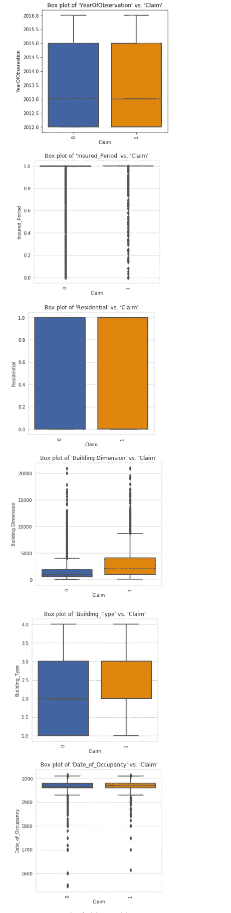

2.**cat box:**cat box 功能用于根据指定的分类目标绘制数据集中所有分类特征的并排条形图。这有助于识别原因和模式，也有助于识别正确区分目标的特征。

> **注意:** catbox 将只绘制具有有限数量的唯一类的分类特征。

```
ds.visualizations.catbox(train_df, target='Claim')
```

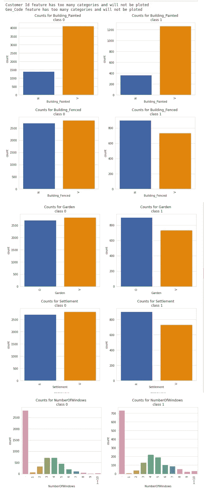

3.**计数图**:计数图简单地绘制了所有分类特征的柱状图，以显示它们的类别计数。

```
ds.visualizations.countplot(train_df)
```

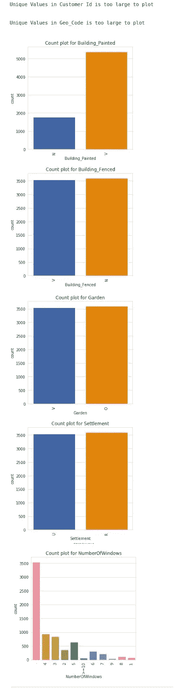

## 数字特征的可视化

数字特征的可视化包括散点图、直方图、kde 图等。我们可以使用 datasist 中可用的函数在数据范围内轻松做到这一点。下面我们来回顾一下其中的一些。

**4。直方图**:这个函数绘制一个数据集中所有数字特征的直方图。这有助于显示特征的分布。

> **注意:**要使用该功能，指定的要绘制的特征不能包含缺失值，否则会抛出错误。

在下面的示例中，要素 Building Dimension 和 Date _ of _ Occupancy 都包含缺失值。我们可以决定在绘图之前填充这些特征，或者我们可以传入我们想要的特征列表。

我会选择第一个选项，即填充缺失的值。

```
#fill the missing values 
df = ds.feature_engineering.fill_missing_num(train_df)ds.visualizations.histogram(df)
```

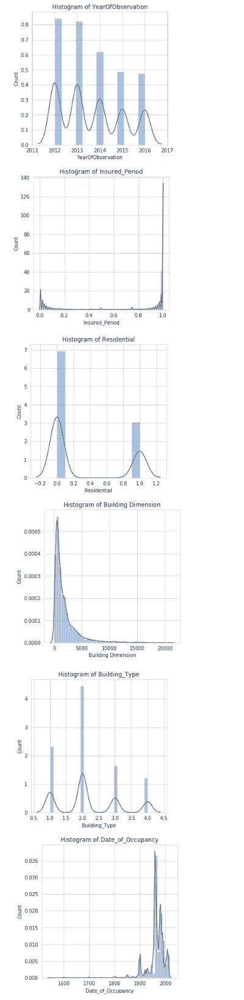

2.**散点图**:该函数根据指定的数值目标，绘制数据集中所有数值特征的散点图。它有助于显示特征之间的相关性。

```
feats = ['Insured_Period',
         'Residential',
         'Building Dimension',
         'Building_Type',
         'Date_of_Occupancy']ds.visualizations.scatterplot(train_df,num_features=feats, 
                                target='Building Dimension')
```

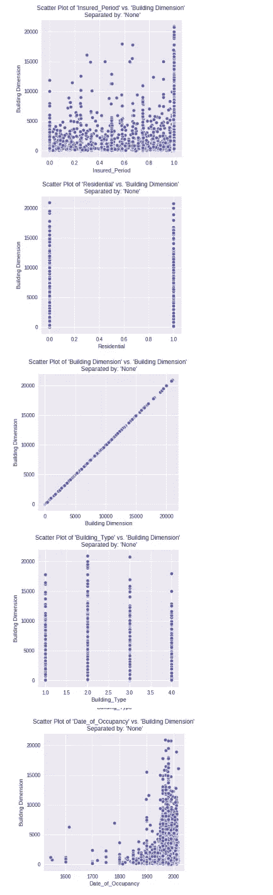

**5。plot_missing:** 顾名思义，这个函数可以用来可视化数据集中缺失的值。白色单元格表示缺失，黑色单元格表示未缺失。右上角的颜色范围显示缺失的强度。

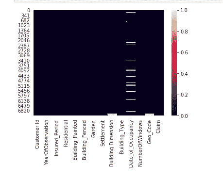

6. **autoviz** : Autoviz 是懒人的终极可视化功能。使用这个函数，您只需一行代码就可以可视化任何数据集。

要在 datasist 中使用 autoviz，首先必须安装 autoviz 包。要通过 pip 安装，请使用以下命令。

```
pip install autoviz
```

现在，让我们演示如何在 datasist 中使用 autoviz。

```
ds.visualizations.autoviz(train_df)
```

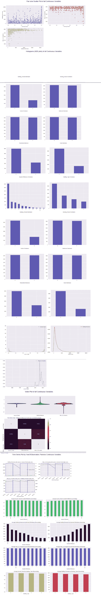

那不是很值得一看吗？只用一行代码就能快速完成任务，这真是令人惊讶。

可视化模块中可用的其他功能有 plot_auc、plot_confusion_matrix、violin_plot 等。要了解这些功能的更多信息，请访问[此处](https://risenw.github.io/datasist/visualizations.html)

## 用 datasist 测试和比较机器学习模型

***模型*** 模块包含测试和比较机器学习模型的函数。当前版本的 datasist 仅支持 scikit-learn 模型。我将重点介绍本模块中的一些重要功能，并演示如何使用它们。

首先我们从数据科学尼日利亚获取一个数据集，2019 新兵训练营竞赛页面[**这里**](https://zindi.africa/competitions/data-science-nigeria-2019-challenge-1-insurance-prediction) 。任务是根据建筑观察预测保险索赔(1 =索赔，0 =无索赔)。我们会做一些基础的数据预处理，为建模做好数据准备。

> 注意:这个分析的目标是演示如何使用 datasist 中的模型模块，所以我们不会做任何繁重的特性工程。

接下来，让我们看看特性定义，以了解变量。

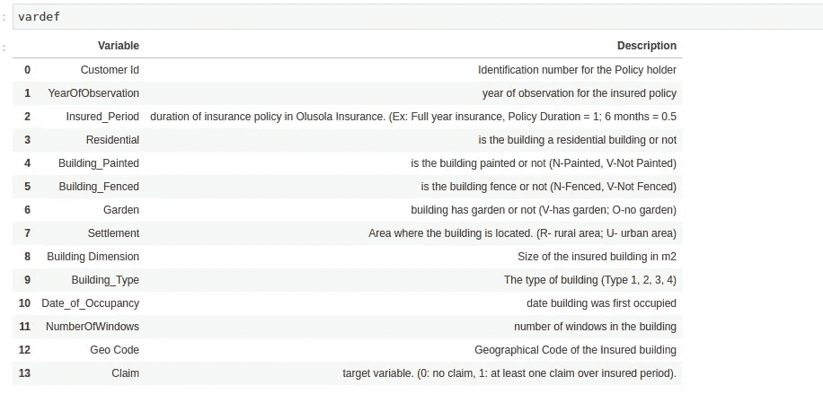

接下来，我们做一些处理。首先，我们删除 Id 列(客户 ID ),然后填充缺失的数字和分类特征。

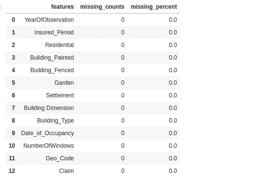

现在我们有了一个正确填充的数据集，我们将根据唯一类的数量使用标签编码或一种热编码对所有分类要素进行编码。

```
#check the unique classes in each categorical feature
ds.structdata.class_count(train)
```

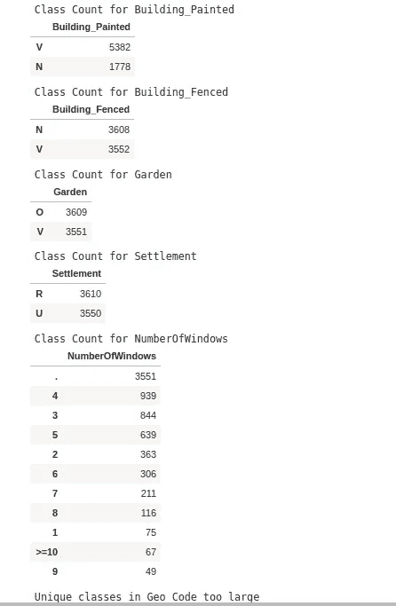

我们将标记 encode Geo_Code，因为唯一的类很大，而 one-hot-encode 其余的类。

现在，让我们讨论一下模型模块中可用的函数，我们可以在处理过的数据集上使用这些函数。

1.  **compare_model** :这个模型将多个机器学习模型作为参数，并返回一个显示每个模型性能的图。这可用于选择基础模型以进行进一步优化。 ***compare_model*** 也返回一组训练好的模型和它们相应的分数。

现在，让我们看看这个函数的运行情况。我们将比较三种模型(RandomForest、LightGBM 和 XGBoost)。

> **注意:**在这篇文章中，我们不会执行任何高级超参数调整。目标是向您展示如何使用 datasist 中可用的函数，而不是大量的超参数调优。

此外，在尝试这一部分之前，您必须安装 lightgbm 和 xgboost。或者，您可以使用 scikit-learn 中的默认模型。要安装 lightgbm [**请转到她的** e](https://lightgbm.readthedocs.io/en/latest/Installation-Guide.html) ，要安装 xgboost， [**请转到这里。**](https://xgboost.readthedocs.io/en/latest/build.html)

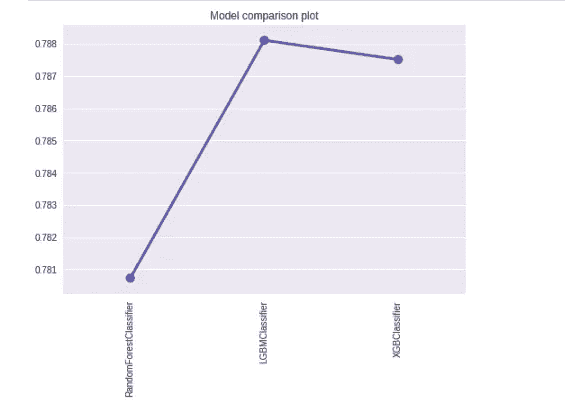

从结果图来看，LGBMClassifier 是目前最好的模型。假设我们对这个模型满意，我们可以通过访问返回的模型列表进行预测。

```
pred = models[1].predict(Xtest)
```

2.**get _ class ification _ report**:我们可以通过***get _ class ification _ report***函数得到一个分类任务的详细指标报告。它接受预测类和真值作为参数。

```
ds.model.get_classification_report(pred, ytest)
```

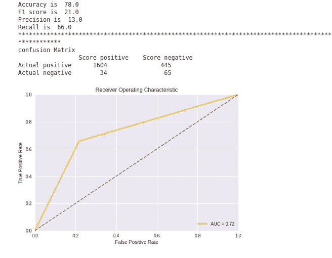

3.**plot _ feature _ importance**:该函数将数据集中最重要的特征绘制成一个条形图，供训练模型使用。

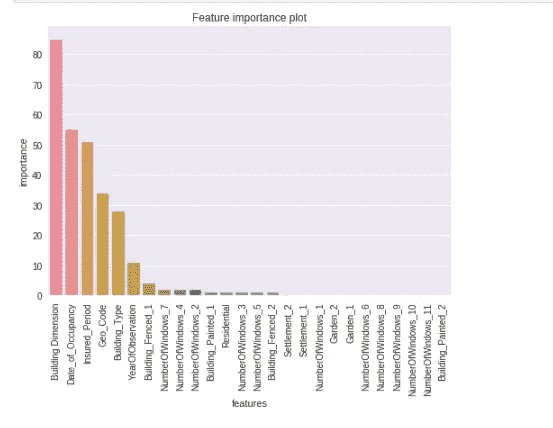

> 注意:我们用一个分类问题演示了这里的例子。您可以将相同的函数应用于您的回归问题，它会工作得很好。
> 
> 查看 [**API 文档**](https://risenw.github.io/datasist/model.html) 了解模型模块中可用的其他功能。


而我们已经到了这篇文章的结尾。我相信你现在很渴望在你的下一个项目中使用 datasist。

> 随着我们添加更多功能，datalist 将会继续发展。如果你想让它变得更好，请查看我们的投稿指南[这里](https://risenw.github.io/datasist/contributing.html)，如果你想报告一个 bug 问题或对一个功能有想法，请访问我们的 GitHub [问题页面这里。如果这个项目对你有用，别忘了在 GitHub 上给我们留下一颗星。](https://github.com/risenW/datasist/issues)

最后，如果您在您的项目中使用了 datasist，请告诉我们，以便我们可以在我们的页面上展示您。

点击 找到我们的投稿人名单 [**。**](https://github.com/risenW/datasist/graphs/contributors)

[**将**](https://github.com/risenW/datasist) 链接到 GitHub 上的 datasist repo

[**将**](https://risenw.github.io/datasist/index.html) 链接到文档

[**链接**](https://risenw.github.io/datasist/classification_example.html) 举例用法

在[**Twitter**](https://twitter.com/risingodegua)**[**LinkedIn**](https://www.linkedin.com/in/risingdeveloper/)上找我**

**给我发邮件:[risingodegua@gmail.com](mailto:risingodegua@gmail.com)**