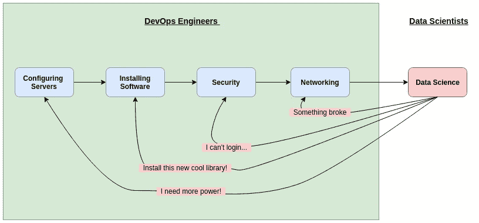
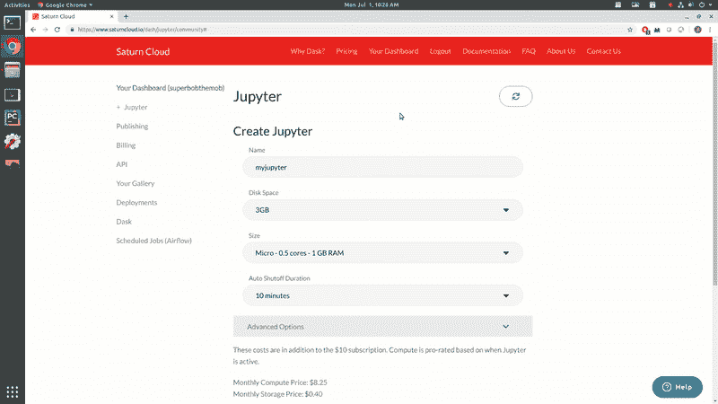
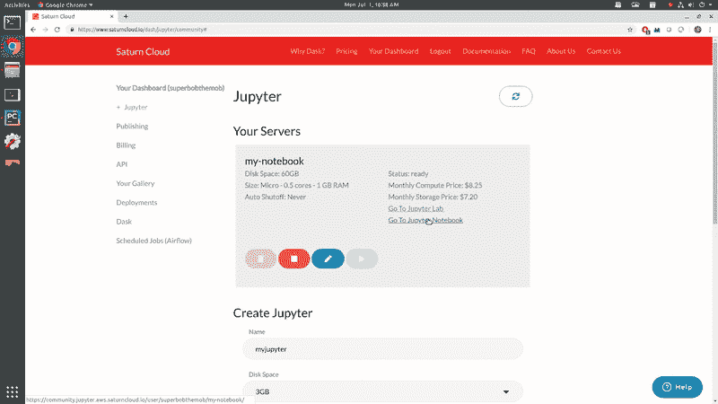

# 简单的一键式 Jupyter 笔记本

> 原文：<https://towardsdatascience.com/easy-devops-for-data-science-with-saturn-cloud-notebooks-d19e8c4d1772?source=collection_archive---------33----------------------->

What society thinks Data Scientists look like. Source

> 我为学习者写了一份名为《强大的知识》的时事通讯。每一期都包含链接和最佳内容的关键课程，包括引文、书籍、文章、播客和视频。每一个人都是为了学习如何过上更明智、更快乐、更充实的生活而被挑选出来的。 [**在这里报名**](https://mighty-knowledge.ck.page/b2d4518f88) 。

数据科学可以是一件有趣的事情！

事实上，我们所做的大部分事情都是在挖掘数据的同时试图提取隐藏的信息。这就像我们在一个未知的丛林中寻找宝藏！

但它并不总是有趣和游戏。

在幕后，建立数据科学家用于工作的实际平台需要做很多工作。创建服务器、安装必要的软件和环境、建立安全协议等等。

完成所有这些工作通常需要一名专门的 DevOps 工程师。了解云服务、操作系统、网络的来龙去脉，至少了解一点数据科学和机器学习软件的知识，以便正确设置它。

但是，如果有一种方法，我们可以绕过所有繁琐的开发工作，直接进入我们的数据科学呢？

一项名为[土星云](https://www.saturncloud.io/?source=gs-1)的新服务让数据科学家可以做到这一点:跳过繁琐的设置，直接进入数据科学！

# 数据科学的土星云和 DevOps

花点时间想想为数据科学家有效工作而设置环境所涉及的所有事项。对于许多公司来说，这看起来像是:

1.  创建和配置服务器。理想情况下，这些应该在服务器能力和实例数量方面都很容易扩展
2.  在所有服务器上安装软件。软件应该易于更新
3.  配置安全性。保护任何敏感数据、代码或 ML 模型
4.  配置网络。服务器应该可以在特定的端口被特定的人访问。

所有这些都需要大量的时间，尤其是第 1 步和第 2 步。许多数据科学家甚至从未见过这些事情发生——他们只看到最终产品。但是设置所有这些基础设施是一个真正的挑战，其中一些需要不断更新。

DevOps engineers constantly catering to the ever-changing needs of Data Scientists

Saturn Cloud 自称为*云托管数据科学*，它允许数据科学家轻松地在云上提供和托管他们的工作，而不需要专门的开发人员。然后，您可以在 Juptyer 笔记本中工作，该笔记本位于您指定的服务器上，由系统创建。

所有软件、网络、安全和库的设置都由 Saturn Cloud 系统自动处理。然后，数据科学家可以专注于*实际的*数据科学，而不是围绕它的乏味的基础设施工作。

这个想法是，用户(你和我，数据科学家)可以简单地指定我们想要的计算，输入我们想要的软件库列表，土星云系统将处理其余的设置。

# 如何使用托管的 Jupyter 笔记本

要开始，只需进入[土星云网站](https://www.saturncloud.io/?source=gs-1)并创建一个账户。基本计划是完全免费的，所以你可以先在环境中摸索一下。

登录后，点击“您的仪表板”选项卡，开始创建一个托管 Jupyter 笔记本的服务器。下面的视频展示了如何创建你的服务器！

您将基本上经历以下步骤:

1.  为笔记本指定一个名称
2.  指定您想要的存储量
3.  指定您想要使用的 CPU 或 GPU
4.  如果需要，设置自动关机
5.  列出您希望安装在系统上的任何软件包或库

一旦你点击创建按钮，你的服务器将自动创建所需的设置和软件。当创作完成时——瞧！您的云托管 Jupyter 笔记本已准备好用于数据科学！

在您的仪表板顶部，您会看到启动、停止、编辑和删除笔记本云服务器的按钮。对于本教程的下一部分，我已经编辑了我的服务器，安装了 pandas 和 matplotlib。

要访问您的云托管 Jupyter 笔记本，请点击“转到 Jupyter 笔记本”链接。将打开一个选项卡，其中有 Jupyter 笔记本界面设置，您可以从中创建 Python 3 笔记本！

我已经在下面的视频中创建了我的笔记本。一旦你的笔记本创建完成，你就可以开始编码了！我提前准备了一些代码来绘制鸢尾花数据集。土星云能够平稳无缝地运行一切。

除了托管 Jupyter 笔记本，土星云还允许你[公开或私下发布你的笔记本](https://www.saturncloud.io/docs/publishing?source=gs-1)。当您发布您的笔记本时，您将获得一个 URL，然后您可以与任何想要运行您的笔记本的人共享该 URL:随时随地。查看我的[这里](https://www.saturncloud.io/published/georgeseif94/mynotebook/notebooks/my_notebook.ipynb?source=gs-1)！

# 喜欢学习？

在 twitter 上关注我，我会在这里发布所有最新最棒的人工智能、技术和科学！也在 [LinkedIn](https://www.linkedin.com/in/georgeseif/) 上和我联系吧！