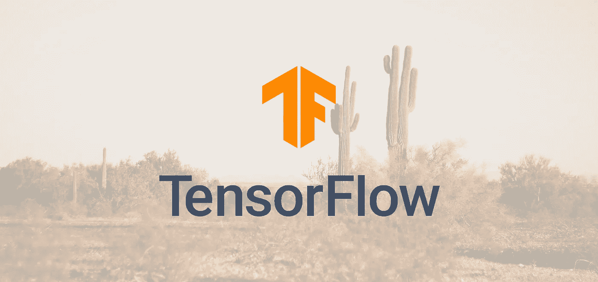
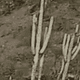
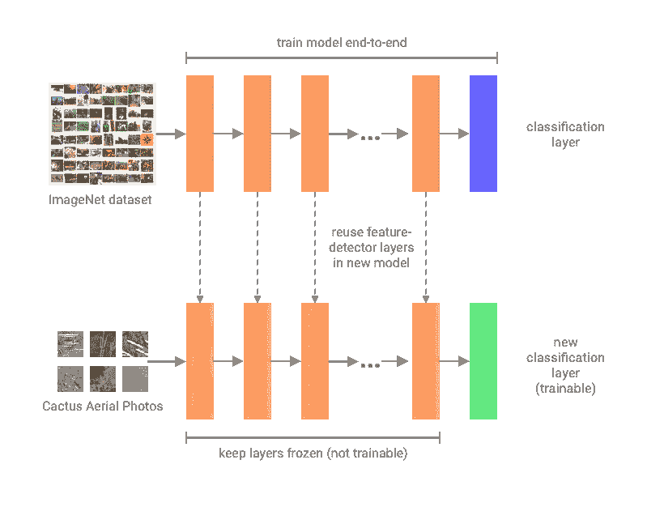
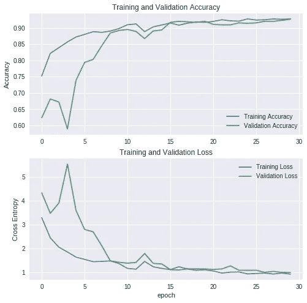
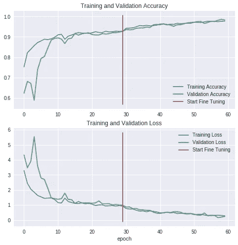

# 使用 TensorFlow 2.0 轻松进行图像分类

> 原文：<https://towardsdatascience.com/easy-image-classification-with-tensorflow-2-0-f734fee52d13?source=collection_archive---------2----------------------->

## G etting 从 TensorFlow 2.0 alpha 的改进高级 API 开始



# 具有重大优势的主要版本

在 2019 年 TensorFlow Dev 峰会上，谷歌推出了 TensorFlow 2.0 的 alpha 版本。从历史上看，TensorFlow 被认为是机器学习框架的“工业车床”:一个强大的工具，具有令人生畏的复杂性和陡峭的学习曲线。如果你过去用过 TensorFlow 1.x，你就知道我在说什么。这个 2.0 版本代表了为提高 TensorFlow 的可用性、清晰性和灵活性所做的共同努力。以下是一些亮点:

*   默认情况下，会启用急切执行，而不会牺牲基于图形的执行的性能优化。
*   API 更干净，更一致，冗余更少。
*   作为高级 API 的更紧密的 Keras 集成。
*   [还有更](https://www.tensorflow.org/community/roadmap)

因此，TensorFlow 2.0 更加 Pythonic 化，学习起来不那么令人畏惧，同时保留了较低级别的定制和复杂性(如果需要的话)。让我们从 TensorFlow 2.0 开始，探索如何在经典图像分类设置中应用其高级 API。

# 在 Colab 上安装 TensorFlow 2.0 alpha

[谷歌合作实验室](https://colab.research.google.com)让在云中设置 Python 笔记本变得非常容易。由于每次可以免费访问 GPU 长达 12 小时，Colab 很快成为我进行机器学习实验的首选平台。

让我们通过 pip 在一台 Colab 笔记本上安装 TensorFlow 2.0 alpha 版本(GPU 版)。

```
!pip install tensorflow-gpu==2.0.0-alpha0
```

要验证其安装是否正确:

```
import tensorflow as tf
print(tf.__version)# Output: 2.0.0-alpha0
```

你应该可以走了！如果您遇到问题，请在“编辑”>“笔记本设置”中仔细检查您的 Colab 运行时是否将“GPU”作为运行时加速器。

# 使用 tf.data.Dataset 加载数据

让我们使用 Kaggle 上的[空中仙人掌识别](https://www.kaggle.com/c/aerial-cactus-identification)比赛的数据集。我们的任务是建立一个分类器，能够确定一个航拍图像是否包含柱状仙人掌。该数据集是 Cactus 航空照片数据集[1]的修改版本(Kaggle 将每个图像的大小调整为 32x32 像素)。



Example image with cactus


Example image with no cactus (upscaled 4x)

例如从 Kaggle 下载/解压缩数据集的代码，请参见[完整笔记本，此处为](https://github.com/cameroncruz/notebooks/blob/master/Easy_Image_Classification_with_TF_2.ipynb)。

让我们使用 pandas 将图像文件路径及其相应的标签加载到列表中，然后使用 sklearn.model_selection 创建一个 90–10 的训练验证分割。

```
train_csv = pd.read_csv('data/train.csv')# Prepend image filenames in train/ with relative path
filenames = ['train/' + fname for fname in train_csv['id'].tolist()]
labels = train_csv['has_cactus'].tolist()train_filenames, val_filenames, train_labels, val_labels = 
  train_test_split(filenames,
                 labels,
                 train_size=0.9,
                 random_state=42)
```

现在我们已经将图像文件名和标签分成了训练集和验证集，我们可以创建各自的 tf.data.Dataset 对象。

```
train_data = tf.data.Dataset.from_tensor_slices(
  (tf.constant(train_filenames), tf.constant(train_labels))
)val_data = tf.data.Dataset.from_tensor_slices(
  (tf.constant(val_filenames), tf.constant(val_labels))
)
```

然而，我们的数据集仍然只包含图像文件名，而不是实际的图像。我们需要定义一个函数，可以从文件中加载图像，并执行任何必要的预处理。当我们这样做的时候，让我们也对数据集进行洗牌和批处理。

```
IMAGE_SIZE = 96 # Minimum image size for use with MobileNetV2BATCH_SIZE = 32# Function to load and preprocess each image
def _parse_fn(filename, label):
    img = tf.io.read_file(img)
    img = tf.image.decode_jpeg(img)
    img = (tf.cast(img, tf.float32)/127.5) - 1
    img = tf.image.resize(img, (IMAGE_SIZE, IMAGE_SIZE))
    return img, label # Run _parse_fn over each example in train and val datasets
# Also shuffle and create batchestrain_data = (train_data.map(_parse_fn)
             .shuffle(buffer_size=10000)
             .batch(BATCH_SIZE)
             )val_data = (val_data.map(_parse_fn)
           .shuffle(buffer_size=10000)
           .batch(BATCH_SIZE)
           )
```

# 构建迁移学习模型

迁移学习通过使我们能够重复使用现有的预训练图像分类模型来加速训练，只需要重新训练网络的顶层来确定图像可以属于的类别[2]。



Diagram illustrating transfer learning

让我们使用 TensorFlow 2.0 的高级 Keras API 来快速构建我们的图像分类模型。对于迁移学习，我们可以使用预训练的 MobileNetV2 模型作为特征检测器。MobileNetV2 是由 Google 发布的 MobileNet 的第二个迭代，目标是比 ResNet 和 Inception 等模型更小、更轻量级，以便在移动设备上运行[3]。让我们加载在 ImageNet 上预训练的没有顶层的 MobileNetV2 模型，冻结其权重，并添加新的分类头。

```
IMG_SHAPE = (IMAGE_SIZE, IMAGE_SIZE, 3)# Pre-trained model with MobileNetV2
base_model = tf.keras.applications.MobileNetV2(
    input_shape=IMG_SHAPE,
    include_top=False,
    weights='imagenet'
)# Freeze the pre-trained model weights
base_model.trainable = False# Trainable classification head
maxpool_layer = tf.keras.layers.GlobalMaxPooling2D()
prediction_layer = tf.keras.layers.Dense(1, activation='sigmoid')# Layer classification head with feature detector
model = tf.keras.Sequential([
    base_model,
    maxpool_layer,
    prediction_layer
])learning_rate = 0.0001# Compile the model
model.compile(optimizer=tf.keras.optimizers.Adam(lr=learning_rate), 
              loss='binary_crossentropy',
              metrics=['accuracy']
)
```

注意，建议使用 TensorFlow 优化器训练`tf.keras`模型。在 TensorFlow 2.0 中，之前`tf.train`和`tf.keras.optimizers`API 中的优化器已经统一在`tf.keras.optimizers`下，其中原来的`tf.keras`优化器已经被升级后的 TensorFlow 优化器所取代【4】。因此，应用 TensorFlow 优化器现在是一种更简单、更一致的体验，完全支持使用`tf.keras` API，并且不会牺牲性能。

# 训练模型

TensorFlow 2.0 中的`tf.keras` API 现在已经完全支持`tf.data` API，因此我们可以在训练模型时轻松使用我们的`tf.data.Dataset`对象[5]。同样，现在默认情况下，训练会被急切地执行，而不会牺牲基于图形的执行的性能优势。

```
num_epochs = 30
steps_per_epoch = round(num_train)//BATCH_SIZE
val_steps = 20model.fit(train_data.repeat(),
          epochs=num_epochs,
          steps_per_epoch = steps_per_epoch,
          validation_data=val_data.repeat(), 
          validation_steps=val_steps)
```

经过 30 个时期后，模型的验证精度从大约 0.63 提高到 0.94。



Accuracy and loss over 30 epochs of transfer learning

# 微调模型

让我们试着进一步提高我们模型的准确性。当我们应用迁移学习时，我们只训练模型的新分类头，冻结来自 MobileNetV2 的权重。如果我们最初不冻结这些权重，模型将“忘记”它开始时的所有知识，因为新的分类头是随机初始化的[2]。然而，现在我们已经首先训练了分类头，我们可以在预训练的模型中解冻层，以在这个特定的数据集上进行微调。

```
*# Unfreeze all layers of MobileNetV2*
base_model.trainable = **True**

*# Refreeze layers until the layers we want to fine-tune*
**for** layer **in** base_model.layers[:100]:
  layer.trainable =  **False**# Use a lower learning rate
lr_finetune = learning_rate / 10# Recompile the model
model.compile(loss='binary_crossentropy',
              optimizer = tf.keras.optimizers.Adam(lr=lr_finetune),
              metrics=['accuracy'])# Increase training epochs for fine-tuning
fine_tune_epochs = 30
total_epochs =  num_epochs + fine_tune_epochs # Fine-tune model
# Note: Set initial_epoch to begin training after epoch 30 since we
# previously trained for 30 epochs.model.fit(train_data.repeat(), 
          steps_per_epoch = steps_per_epoch,
          epochs=total_epochs, 
          initial_epoch = num_epochs,
          validation_data=val_data.repeat(), 
          validation_steps=val_steps)
```

在另外 30 个时期的微调后，该模型达到了 0.986 的验证精度。基于准确度和损失图，更多的时期可能导致更大的改进。



Accuracy and loss with additional 30 epochs of fine-tuning

# 摘要

在这篇文章中，我们了解了 TensorFlow 2.0 对可用性、清晰度和灵活性的关注如何使 TensorFlow 在机器学习实验中的入门变得不那么令人生畏。热切的执行和改进的高级 API 抽象出了 TensorFlow 通常的复杂性，使其更容易快速实施和运行典型的图像分类实验。

在撰写本文时，这只是 TensorFlow 2.0 的 alpha 版本，最终版本预计将在今年晚些时候发布。显然，TensorFlow 团队正在打造一个更加直观的 TensorFlow 迭代。这可能会全面提高机器学习工程师的生产率，降低通常的复杂性，同时为那些需要的人保留较低层次的控制。此外，虽然 TensorFlow 已经是机器学习专家的热门选择，但更平滑的学习曲线也使其对初学者更具吸引力。

请在评论中告诉我你对 TensorFlow 2.0 目前为止的看法！另外，**如果你对本教程的完整代码感兴趣，** [**参见笔记本这里的**](https://github.com/cameroncruz/notebooks/blob/master/Easy_Image_Classification_with_TF_2.ipynb) 。如果你有任何问题，也不要犹豫，在评论区提问。

# 参考

本教程的灵感来自于使用 TensorFlow.org 的预训练网络进行迁移学习。阅读教程原文，见[此处](https://www.tensorflow.org/alpha/tutorials/images/transfer_learning)。

[1]Kaggle.com j .瓦斯奎兹-戈麦斯[仙人掌航拍照片](https://www.kaggle.com/irvingvasquez/cactus-aerial-photos) (2019)

[2] [利用预训练的 ConvNets 进行迁移学习](https://www.tensorflow.org/alpha/tutorials/images/transfer_learning) (2019)，TensorFlow.org

[3] M. Sandler，A. Howard，m . Zhmonginov，L. C. Chen， [MobileNetV2:反向残差和线性瓶颈](https://arxiv.org/pdf/1801.04381.pdf) (2019)，谷歌公司。

[4] F. Chollet， [TensorFlow 2.0:优化器统一](https://github.com/tensorflow/community/blob/master/rfcs/20181016-optimizer-unification.md) (2018)，TensorFlow GitHub

[5] [路线图](https://www.tensorflow.org/community/roadmap) (2019)，TensorFlow.org