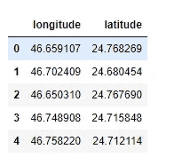
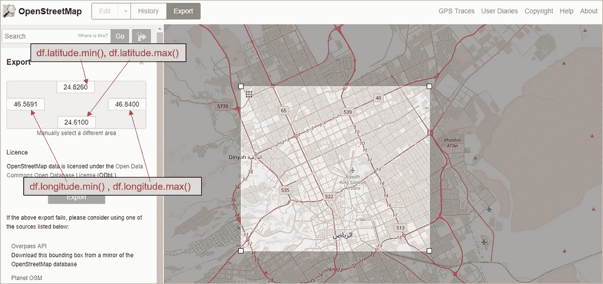
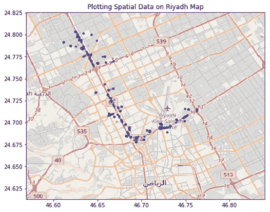

# 在地图上绘制地理数据的简单步骤 Python

> 原文：<https://towardsdatascience.com/easy-steps-to-plot-geographic-data-on-a-map-python-11217859a2db?source=collection_archive---------0----------------------->

A 假设你在一家创业公司工作，需要对用户的地理数据进行空间数据分析和预测。或者，您的公司运行大量的交付操作，您的工作再次分析、可视化并可能预测司机或用户的地理数据。因此，在地图上可视化您的数据(可能是预测的数据)将是非常必要的。

在本文中，我将介绍如何使用 Python 在任何地图上绘制地理数据的简单步骤。我发现它在我以前的项目中非常有用和有帮助，使用相同的语言:Python-检查我的文章:[交通管理的空间数据分析](/brilliant-sim-cards-traffic-management-90982691fa94)。

当然，当我们提到地理数据时，我们脑海中浮现的是数据点的坐标:经度和纬度。这是真的，它们只是地图上特定点的 X 和 Y 坐标。然而，还有其他类型的地理数据，如多边形、线数据。这里主要关注如何在地图上可视化点数据。我们可以开始了吗？

## 加载库和数据集

首先，让我们从加载库开始

```
import numpy as np
import pandas as pd
import matplotlib.pyplot as plt
```

加载空间数据集

```
df = pd.read_csv(‘C:/.. …/SpatialDataSet.txt’)
```

看一看数据集

```
df.head()
```



我的数据集很简单(1444 行× 2 列)。为了这次演示，我在利雅得市收集了随机的地理数据点。

## 定义边界框

现在，我们必须定义边界框。边界框是由两个经度和两个纬度定义的区域，它将包括所有的空间点。

```
BBox = ((df.longitude.min(),   df.longitude.max(),      
         df.latitude.min(), df.latitude.max())> (46.5691,46.8398, 24.6128, 24.8256)
```

## 拿你的地图

进入 opestreetmap.org 网站[，首先输入边界框数据，将所需地图导出为图像。我按照下图中的解释做了同样的事情(这里也提到了更多的细节:](https://www.openstreetmap.org/export#map=5/51.500/-0.100)[导出地图图像的步骤](https://medium.com/@abuqassim115/thanks-for-your-response-frank-fb869824ede2))。



返回编码环境并加载地图图像:

```
ruh_m = plt.imread('C:/.. … /Riyadh_map.png')
```

## 最后一步:绘图

最后，在' *ruh_m* '地图图像上绘制'*测向经度*'和'*测向纬度*'坐标作为散点。注意，根据边界框' *BBox* '设置 X 轴和 Y 轴很重要

```
fig, ax = plt.subplots(figsize = (8,7))ax.scatter(df.longitude, df.latitude, zorder=1, alpha= 0.2, c='b', s=10)ax.set_title('Plotting Spatial Data on Riyadh Map')
ax.set_xlim(BBox[0],BBox[1])
ax.set_ylim(BBox[2],BBox[3])ax.imshow(ruh_m, zorder=0, extent = BBox, aspect= 'equal')
```

