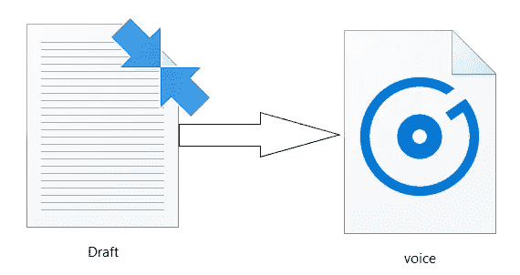

# 使用 Python 实现简单的文本到语音转换

> 原文：<https://towardsdatascience.com/easy-text-to-speech-with-python-bfb34250036e?source=collection_archive---------1----------------------->

## 文本到语音


Photo by [Oleg Ivanov](https://unsplash.com/@olegixanovpht?utm_source=unsplash&utm_medium=referral&utm_content=creditCopyText) on [Unsplash](https://unsplash.com/s/photos/text-to-speech?utm_source=unsplash&utm_medium=referral&utm_content=creditCopyText)

文本到语音(TTS)技术大声朗读数字文本。它可以将电脑、智能手机、平板电脑上的文字转换成音频。此外，各种文本文件都可以大声朗读，包括 Word、pages 文档、在线网页都可以大声朗读。TTS 可以帮助阅读困难的孩子。有许多工具和应用程序可以将文本转换成语音。

Python 附带了许多方便易用的库，在本文中，我们将探讨如何使用 Python 实现文本到语音的转换。

为了将文本转换成语音，Python 中提供了不同的 API。其中一个 API 是 Google 文本到语音转换，通常称为 gTTS API。这是非常容易使用的库转换输入的文本到一个音频文件，可以保存为 mp3 文件。它支持多种语言，语音可以以两种音频速度中的任何一种传送，快或慢。更多详情可在[这里](https://gtts.readthedocs.io/en/latest/module.html)找到

# 将文本转换成语音

## 代码:

导入 gTTS 库和“os”模块以播放转换后的音频

```
from gtts import gTTS 
import os
```

创建一个我们想要转换成音频的文本

```
text = “Global warming is the long-term rise in the average temperature of the Earth’s climate system”
```

gTTS 支持多种语言。请在这里查阅文档[。选择' en' - >英语并存储在语言变量中](https://gtts.readthedocs.io/en/latest/module.html)

```
language = ‘en’
```

创建一个名为 speech 的对象，并将文本和语言传递给引擎。标记为 slow = False，告知模块转换后的音频应具有高速。

```
speech = gTTS(text = text, lang = language, slow = False)
```

将转换后的音频保存在名为“text.mp3”的 mp3 文件中

```
speech.save(“text.mp3”)
```

使用 Windows 命令“开始”,后跟 mp3 文件名，播放转换后的文件。

```
os.system(“start text.mp3”)
```

## 输出


text.mp3 file

```
The output of the above program saved as text.mp3 file. Mp3 file should be a voice saying, 'Global warming is the long-term rise in the average temperature of the Earth’s climate system'
```

# 将文本文件转换成语音

这里，将文本文件转换成语音。读取文本文件并传递给 gTTS 模块

## 密码

导入 gtt 和 os 库

```
from gtts import gTTS 
import os
```

读取文本文件并存储到名为 text 的对象中。我的文件名是“draft.txt”

```
file = open("draft.txt", "r").read().replace("\n", " ")
```

选择语言英语

```
language = ‘en’
```

将文本文件传递到 gTTS 模块并存储到语音中

```
speech = gTTS(text = str(file), lang = language, slow = False)
```

将转换后的音频保存在名为“voice.mp3”的 mp3 文件中

```
speech.save("voice.mp3")
```

播放 mp3 文件

```
os.system("start voice.mp3")
```

## 输出



已将 draft.txt 文件转换为 voice.mp3

```
Draft.txt file saved as a voice.mp3 file.Play the Mp3 file to listen the text presented in the draft.txt file
```

## 注意:

GTTS 是一个将文本转换为语音的简单工具，但它需要互联网连接才能运行，因为它完全依赖谷歌来获取音频数据。

感谢阅读。请继续学习，并关注更多内容！

你也可以在 [KDnuggets](https://www.kdnuggets.com/2020/05/easy-text-speech-python.html) 上阅读这篇文章。