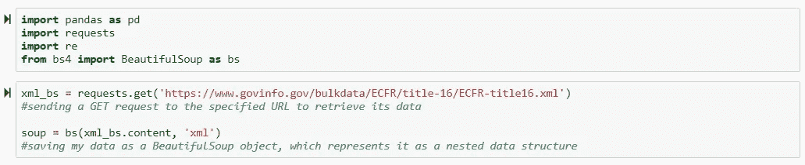
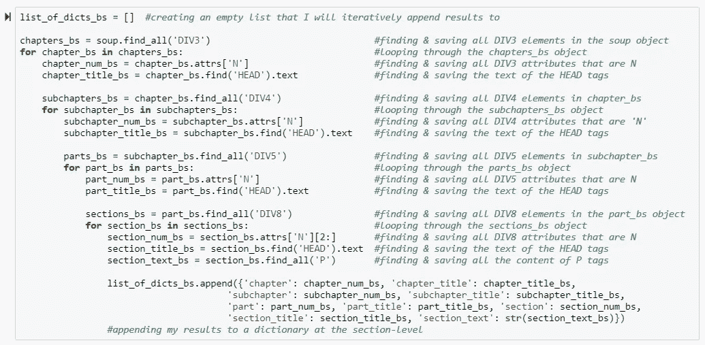
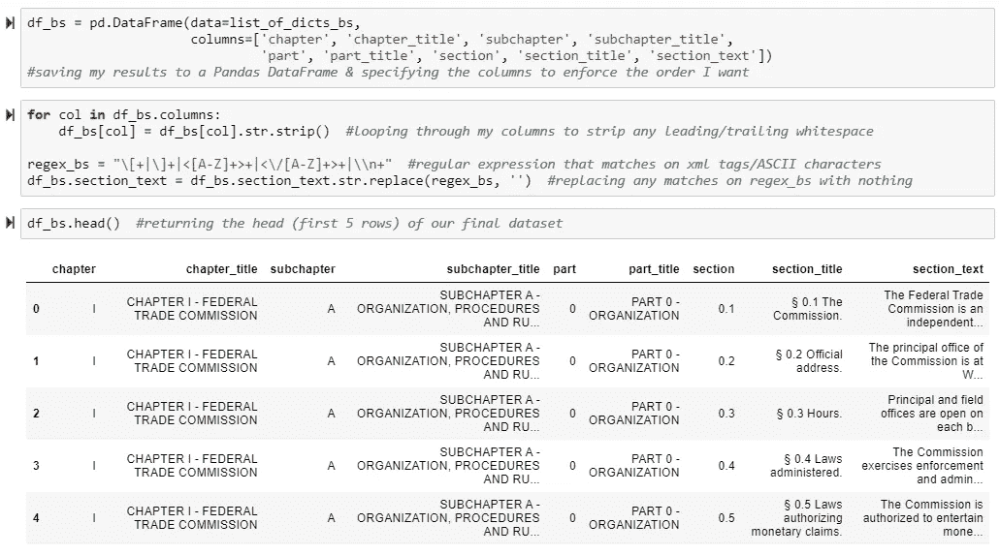
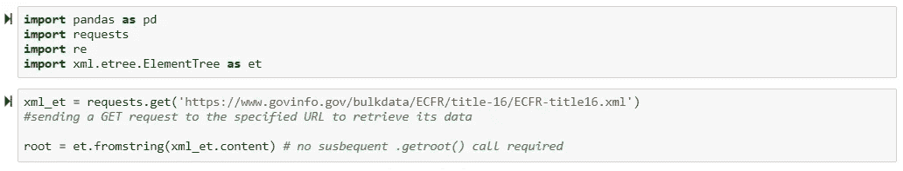
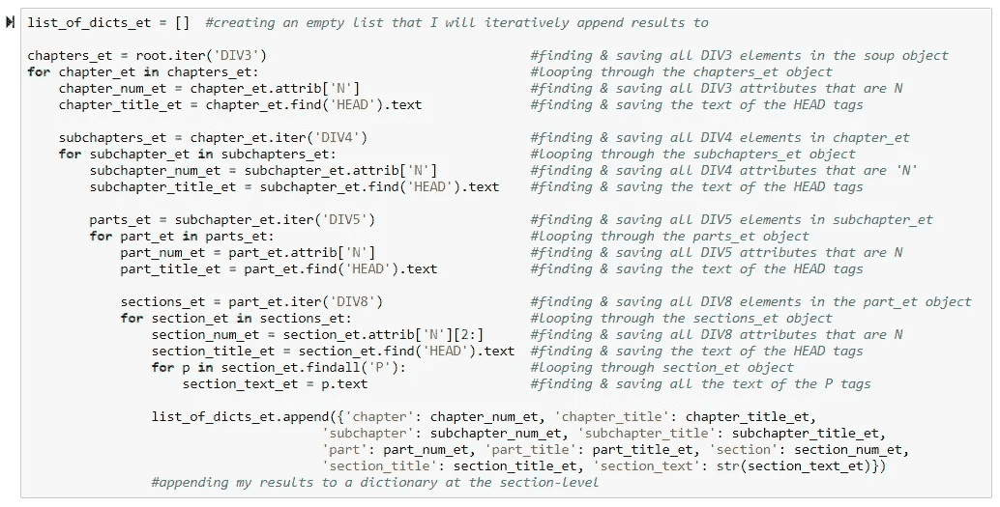
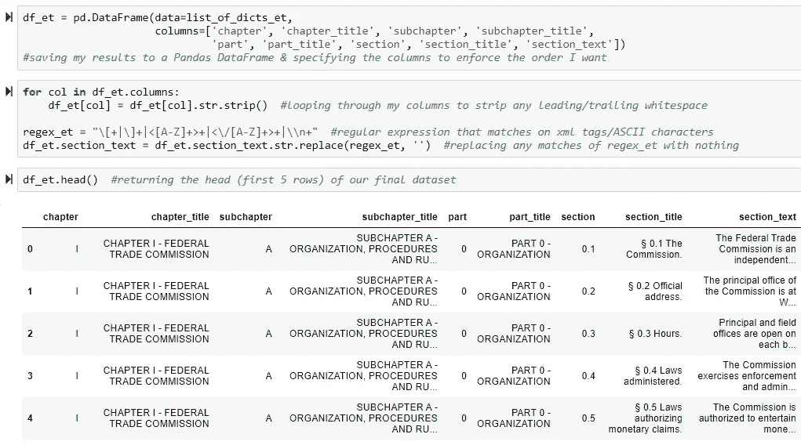

# 用 BeautifulSoup 和 ElementTree 解析 eCFR

> 原文：<https://towardsdatascience.com/ecfr-parsing-with-beautifulsoup-and-elementtree-8cf9d3ef8178?source=collection_archive---------21----------------------->

Photo by [Fabian Irsara](https://unsplash.com/@firsara?utm_source=medium&utm_medium=referral) on [Unsplash](https://unsplash.com?utm_source=medium&utm_medium=referral)

想象一下，你正试图理解在*标题 16 商业惯例*下*联邦法规(CFR)* 中公布的一般和永久规则。目前，您拥有*联邦法规电子代码(eCFR)* 供您使用。然而，在浏览之后，你意识到要找到你需要的信息需要太多的点击。如果您可以提取所有内容并将其保存到一个数据集，会怎么样？嗯，你可以，有了像 [ElementTree](https://docs.python.org/2/library/xml.etree.elementtree.html) 和 [BeautifulSoup](https://www.crummy.com/software/BeautifulSoup/bs4/doc/) 这样的 Python 库。

下面是我所有的[全注释代码](https://github.com/traintestbritt/ecfr_xml_parsing/blob/master/ecfr_parsing_notebook_with_beautiful_soup.ipynb)，我用它们中的任何一个库来解析 *eCFR 标题 16* 的 XML。作为奖励，我也只用 BeautifulSoup 写了 PySpark 代码，所以如果你对那个[感兴趣，点击这里](https://github.com/traintestbritt/ecfr_xml_parsing/blob/master/ecfr_parser_pyspark_.ipynb)。

## 用 BeautifulSoup 解析

在上面的代码片段中，我导入了我需要的所有库——创建数据帧的 Pandas、发送请求的 requests、使用正则表达式的 re 和用于解析的 BeautifulSoup。然后，我向 url 发送请求以检索其数据，并将其存储在变量`xml_bs`中。然后我将`xml_bs`传递给`bs`，后者返回一个 BeautifulSoup 对象，将 XML 文档表示为一个嵌套的数据结构。

虽然代码被完全注释掉了，但我将在下一个代码片段中提供更多的上下文。我创建了一个空列表，迭代地追加我检索到的所有数据。然后，我使用`.find_all()`找到所有的`DIV3`元素，并将它们存储在变量`chapters_bs`中。从那里，我开始遍历我的`soup`对象，寻找与`DIV3`元素相关的属性或标签，并将它们保存到各自的变量中。我继续像这样嵌套我的 for 循环并访问父对象 prior，这允许我保留我的 XML 文档的层次结构。请注意，我在部分级别附加了我的所有数据。

上面接下来的几个步骤非常简单——我将我的数据保存到 Pandas DataFrame，编写一个 for 循环来删除任何前导或尾随空格，编写一个正则表达式来删除我的`section_text`列中的标签和 ASCII 字符，并显示我的数据的前五行。

## 使用 ElementTree 解析

同样，在上面的代码片段中，我导入了我需要的所有库——除了用于解析的 ElementTree 之外，所有库都是相同的。我向 url 发送了一个请求来检索它的数据，并将其存储在变量`xml_et`中。然后我传递`xml_et`到`fromstring()`，后者将来自我的响应内容的 XML 解析成一个元素，这个元素是解析树的根元素。

这里的大部分代码保持不变，但是我将从头到尾再看一遍，以防您跳过。我创建了一个空列表，迭代地追加我检索到的所有数据。然后，我使用`.iter()`找到所有的`DIV3`元素，并将它们存储在变量`chapters_et`中。从那里，我开始遍历我的`root`对象，寻找与`DIV3`元素相关的属性或标签，并将它们保存到各自的变量中。我继续像这样嵌套我的 for 循环并访问父对象 prior，这允许我保留我的 XML 文档的层次结构。请注意，我在部分级别附加了我的所有数据。

同样，上面接下来的几个步骤很简单——我将我的数据保存到 Pandas DataFrame，编写一个 for 循环来删除任何前导或尾随空格，编写一个正则表达式来删除我的`section_text`列中的标签和 ASCII 字符，并显示我的数据的前五行。

一如既往，感谢阅读。