# 时间序列分析的计量经济学方法 Python 中的季节性 ARIMA

> 原文：<https://towardsdatascience.com/econometric-approach-to-time-series-analysis-seasonal-arima-in-python-28f5782ee23?source=collection_archive---------5----------------------->

## 自相关，时间序列分解，数据转换，Sarimax 模型，性能指标，分析框架

在这篇文章中，我们将讨论带有趋势和季节成分的时间序列数据的分析。将采用计量经济学方法来模拟数据的统计特性。这里的业务目标是预测。我们试图解释时间序列建模中涉及的各种概念，如时间序列成分、序列相关性、模型拟合、度量等。我们将使用 statsmodels 库提供的 SARIMAX 模型来模拟数据中的季节性和趋势。萨里玛(季节性 ARIMA)能够同时模拟季节性和趋势，不像 ARIMA 只能模拟趋势。

**内容:**

1.  时间序列数据的定义
2.  项目和数据介绍
3.  季节分解和时间序列成分:趋势、季节性、周期、残差
4.  时间序列数据的平稳性及其重要性
5.  自相关和偏自相关
6.  数据转换:对数转换和差分
7.  模型选择和拟合
8.  结论

从 GitHub 库访问完整的 Python 代码:[https://GitHub . com/jahangimmadov/sarima/blob/master/Seasonal % 20 time % 20 series % 20 analysis . ipynb](https://github.com/jahangirmammadov/sarima/blob/master/Seasonal%20Time%20Series%20Analysis.ipynb)

# 1.时间序列数据的定义？

> 时间序列数据是在时间间隔内测量的一系列数据点。换句话说，数据是时间 f(t) = y 的函数。
> 数据点可以每小时、每天、每周、每月、每季度、每年测量，也可以用更小或更大的时间尺度测量，例如几秒或几十年。

# 2.项目和数据介绍

我们在本文中使用的数据是 2000 年至 2019 年间美国 20 个主要城市的月度房屋销售指数。([https://fred.stlouisfed.org/series/SPCS20RPSNSA](https://fred.stlouisfed.org/series/SPCS20RPSNSA))。您可以从这个来源免费下载许多不同的代表美国经济的经济时间序列数据。你可能会看到相同数据的两个不同版本，季节性调整和非季节性调整。在这篇文章中使用的版本没有进行季节性调整，因为我们想模拟季节性和趋势。你可能会问为什么人们要在行业中使用季节性调整的数据。嗯，有时企业可能想知道经济事件对特定数据的真实影响，这可能与一个季度重叠。在这种情况下，季节性可能会掩盖或低估/高估经济事件的影响。例如:取暖油生产商可能想研究汽油价格下降对取暖油价格的影响。然而，尽管取暖油是一种汽油物质，冬季取暖油的价格却在上涨。汽油价格的下降应该反映在取暖油价格的下降上。然而，冬季取暖需求很大，导致价格略有上涨。通过从时间序列数据中去除季节性影响，您可能会看到取暖油价格实际上呈下降趋势。价格的轻微上涨是季节性的影响。在第 3 节中，我们将更详细地讨论季节分解。

如果我们观察数据的时间序列图，我们可以观察到 2000-2006 年的增长趋势，由于严重的金融危机，从 2007 年到 2012 年房屋销售的下降趋势，以及到 2018 年的增长趋势。我们还可以观察数据中的季节性，因为通常住房市场在年初并不活跃，销售通常在年中达到高峰，到年底销售又会下降。似乎是温暖的季节，尤其是夏天是美国房地产市场的好季节。

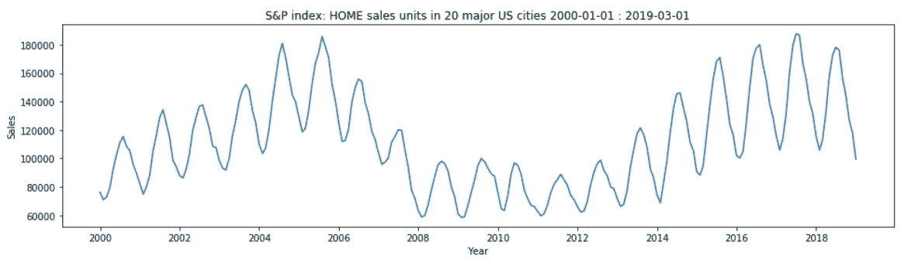

# 3.季节分解和时间序列成分:趋势、季节性、周期、残差

时间序列数据 Y 由趋势、周期、季节性和残差的组合组成。显然，你可能会遇到没有趋势、周期或季节性的时间序列。因此，识别时间序列数据的组成部分是您的任务。术语的定义如下:

> **趋势—** 长期向上或向下的运动。
> **周期—** 因经济运动而产生的周期性变化。它不同于季节变化。周期是时间序列数据的自回归分量的变化。周期发生在较长的时间间隔内，例如每 6-10 年，而季节变化发生在较短的时间间隔内。
> **季节性** **—** 季节性影响导致的数据变化。冰淇淋的销量在夏天很高，取暖油的销量在冬天很高，但在夏天很低。
> **残差—** 在时间序列数据中计算并去除其他分量后剩下的分量。它是随机、恒等和独立分布的。残差，R~ N(0，1)。

Statsmodels 库有一个函数叫做 seasonal_decompose，将时间序列 Y 分解成趋势、季节性和残差。虽然这是一个简单的分解算法，但在实践中，它非常直观，并且适用于 T、S 和 R 明显的时间序列数据。在解释下面的图表之前，我想谈谈这些组件之间的相互作用。
时间序列数据 Y 可以采用加法或乘法形式。在加法形式下，时间序列 Y 由时间序列分量之和构成，即 T，S，C，R:
***Y = T+C+S+R***

以乘法形式出现的时间序列 Y 是由时间序列分量的乘积形成:
***Y = T * C * S * R***

那么，房屋销售指数是乘法还是加法呢？如果你仔细观察住房指数的时间序列图，你可能会注意到，当趋势下降时(2008-2013 年)，季节性变化(季节性)变小，而当趋势上升时(2014-2019 年)，季节性变化变大。这种情况发生在乘法时间序列中，趋势 T 的小值导致小的 S，因为我们将 S 乘以 T。在加法时间序列中不会出现这种现象。

我们使用 statsmodels 中的**季节性分解(原始数据，‘乘法’)**函数将时间序列数据分解为趋势、季节性成分和残差。如果函数返回所有 3 个部分，即使您假设它们对于特定的时间序列数据不存在，也不要感到惊讶。在现实中，这些组件是由一个简单的算法生成的，这就是为什么分解函数不能说一个组件不存在，尽管计算出的值并不显著。因此，对于任何时间序列数据，您都会看到这三个组成部分。你必须知道如何阅读结果，并决定哪个模型(ARIMA 或萨里玛)适合数据。

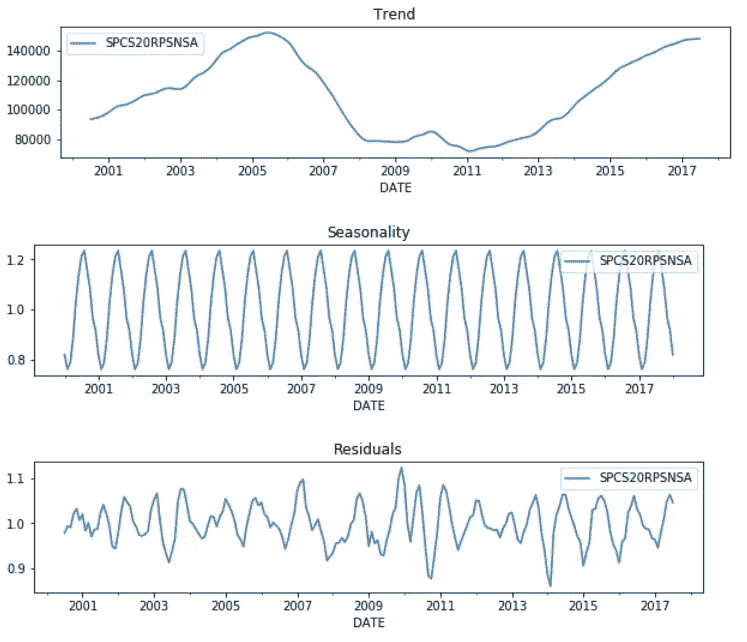

Plot of seasonal decomposition from statsmodels library

我们将尝试自己将数据分解成组件，以便更好地理解它们的派生和用法。可以采用窗口大小= 12 的移动平均来计算趋势。下图与统计模型库生成的趋势非常相似。

Moving average with window size=12

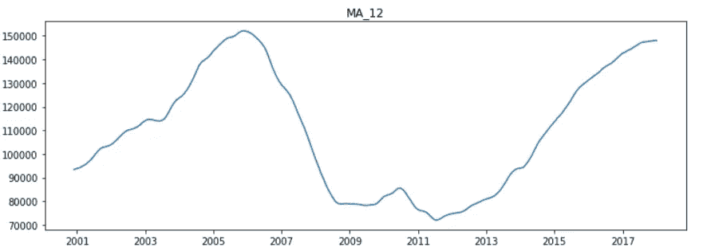

Plot of Moving average window size=12

还记得乘法模型， ***Y = T *C* S* R*** 吗？将 ***Y*** 除以 **T** 可以得到 ***Y/T=C*S*R*** 我们假设残差对于该数据来说太小，因为时间序列图看起来很平滑。我们的数据非常少，因此我们无法检测经济周期。我们把时间序列除以趋势得到一个季节成分， ***S=Y/T*** 。

Code snippet for seasonality decomposition

季节性的图形有点难理解，但是，这里给出的解释已经足够了。 *y=1.2(红色标记)*表示 2000 年 7 月-2000 年 7 月的销售额增加了 *20%* 。换句话说，六月的季节效应为+ *20%* 或 1.2 *T。另一方面，2003 年 2 月的 *y=0.8(绿色标记)*显示销售额下降 *20%* 。因此，对于一些不属于这种特殊情况的时间序列数据，您可能会看到季节性影响非常小，即 *y=0.0001* 。它显示了一个非常小的季节性影响，甚至不应该被认为是显著的。

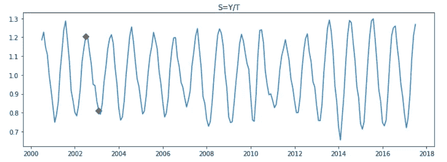

Seasonal Component

残差可以计算为 ***R = Y/(S*T)***

Code snippet for residuals decomposition

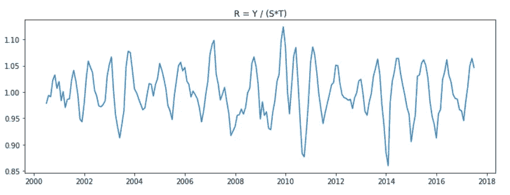

Resiudals component

还有其他一些方法来检测季节性。在下面的图表中，绘制了每年的月度房屋销售，正如你所看到的，每年都遵循几乎相同的模式，只是略有不同。房屋销售在夏季较高，冬季较低。

Code snippet for the monthly home sales graph

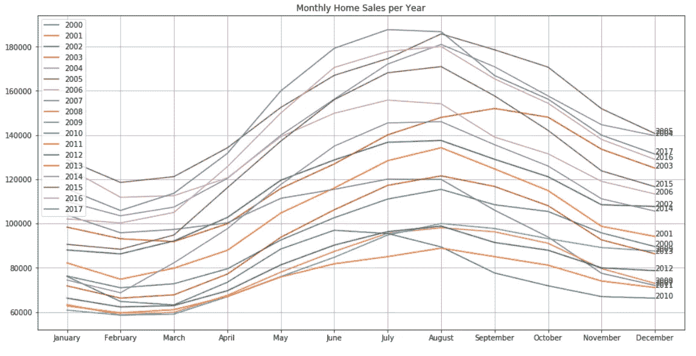

Monthly sales per year

# 4.时间序列数据的平稳性及其重要性

当我们在时间序列数据中有趋势和/或季节性时，我们称之为非平稳的。

> 平稳性是指数据的统计属性，如平均值、方差和标准偏差在一段时间内保持不变。

为什么我们希望统计属性随着时间的推移保持不变？因为我们在建立模型的过程中对样本数据进行了统计假设(一个很好的例子是 OLS 假设),而模型只能在这些假设下运行。当数据的统计属性改变时，模型不再能够代表数据的真实性质。

这就是为什么我们的预测/预测结果将不再有效。改变均值/方差将要求我们拟合另一个模型，而这个模型可能在短时间内有效，我们必须再次放弃它并拟合一个新的模型。看，这个过程看起来是多么的低效和不可靠。在拟合模型之前，我们必须使时间序列数据稳定。我们可以通过转换数据使时间序列平稳。通常，差分用于使数据稳定。我们将在下面的第 6 节中讨论它。

那么，如何检验一个时间序列数据是否平稳呢？第一个是目测时间序列图，并确定趋势或季节性。如果它们中至少有一个存在，那么时间序列数据就不是静态的。其次，您可以将数据分成 3 组，计算每组的均值和方差，并确认每组的均值和方差是否有实质性差异。第三种选择是使用 statsmodels 库中提供的统计测试之一。

> 扩展的 Dickey-Fuller 检验是其中最流行的，其中零假设，h0 =数据不是平稳的。ADF 测试结果提供测试统计和 P 值。p 值> = 0.05 意味着数据不是平稳的，否则，我们拒绝零假设，说数据是平稳的。

我们假设你知道什么是假设检验，以及 P 值意味着什么。如果你对这些术语不太熟悉，那么看看 p 值，如果它小于 0.05 (p 值< 0.05) then data is stationary if p-value > = 0.05 数据不是静止的。ADF 检验证实原始时间序列数据不是平稳的，其 *p 值约为 0.08*

Code snippet for ADF test

```
Time series data is not stationary. Adfuller test pvalue=0.0803366374517756
```

# 5.自相关和偏自相关

在建模之前，我们必须看一下 ACF 和 PACF 图，因为从现在起我们将会大量使用这些图。

自相关图显示时间序列数据与其自身滞后值的相关性。例如，滞后=1 时的自相关表示 y_t 和 y_t-1 之间的相关性。在滞后=2 时，corr(y_t，y_t-2)。在滞后=12 corr(y_t，y_t-12)时。在这个特定的例子中，与时间 t-12、t-24 等的数据点高度相关的时间 t 的每个数据点表示季节性。

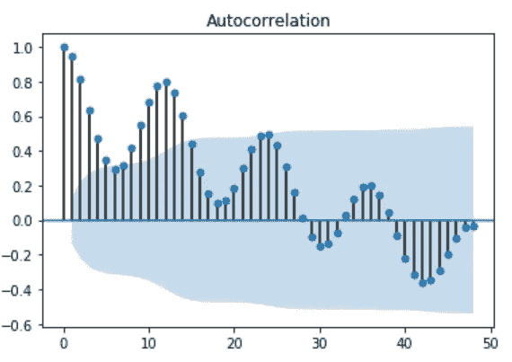

Autocorrelation plot of original home sales index data

下面的代码片段和散点图可以帮助您更好地理解滞后值之间的相关性，即自相关性。

Code snippet for correlation of lags

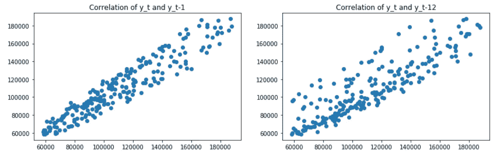

Correlation between lag values — highly correlated

回到 ACF 图，自相关图的蓝色阴影区域显示显著性水平。因此，阴影区域内的相关系数在这些滞后处表现出弱相关性，我们认为它们在分析中并不重要。
偏相关函数(PACF)给出了平稳时间序列与其滞后值的偏相关。

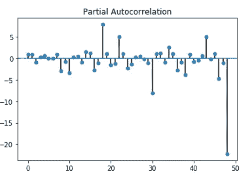

Partial autocorrelation plot of original home sales index data

PACF 去除了其他滞后的相关性贡献，给出了两个滞后之间的纯相关性，而没有其他滞后的影响。

我们使用 ACF 和 PACF 为 ARIMA 模型的 AR(p)和 MA(q)组件/特征选择正确的顺序。对于 AR 阶数 p，查看 PACF 图并选择一个滞后值，该值在相关性变得不明显之前具有显著的相关系数。对于 MA 订单 q，查看 ACF 图，并执行相同的操作。不要忘记你应该只从平稳时间序列的 ACF 和 PACF 图中得到这些值，而不是从上面的图中。上面给出的 ACF 和 PACF 图是原始数据的图，其是非平稳的。

# 6.数据转换:对数转换和差分

因此，让我们转换数据，使其稳定，这样我们就可以开始模型构建阶段。我们将原始数据分为训练数据和测试数据。训练数据将包含 2000 年至 2018 年的美国房屋销售数据，测试数据将包含 2018 年至 2019 年的数据。别忘了，你不能像对待横截面数据那样进行随机抽样。我们必须保持时间序列数据的时间行为(依赖于时间)。

房屋销售指数数据可以公式化为一个乘法模型，其中 Y= T*S*R。我忽略了周期，因为它实际上并不存在于该数据中。(S)ARIMA 模型是线性模型，如线性回归。我们无法将线性模型 SARIMA 拟合到由 Y = T*S*R 过程生成的数据。我们必须在拟合线性模型之前使 Y 为线性。从数学 ***中你可以知道 Log(a*b) = log(a) + log(b)*** 。我们必须对数据进行对数变换，使其呈线性。***log(Y)= log(T)+log(S)+log(R)。*** Log 变换使数据线性、平滑。

```
log_transformed_data = np.log(training_data)
plot_data_properties(log_transformed_data, ‘Log tranformed training data’)
```

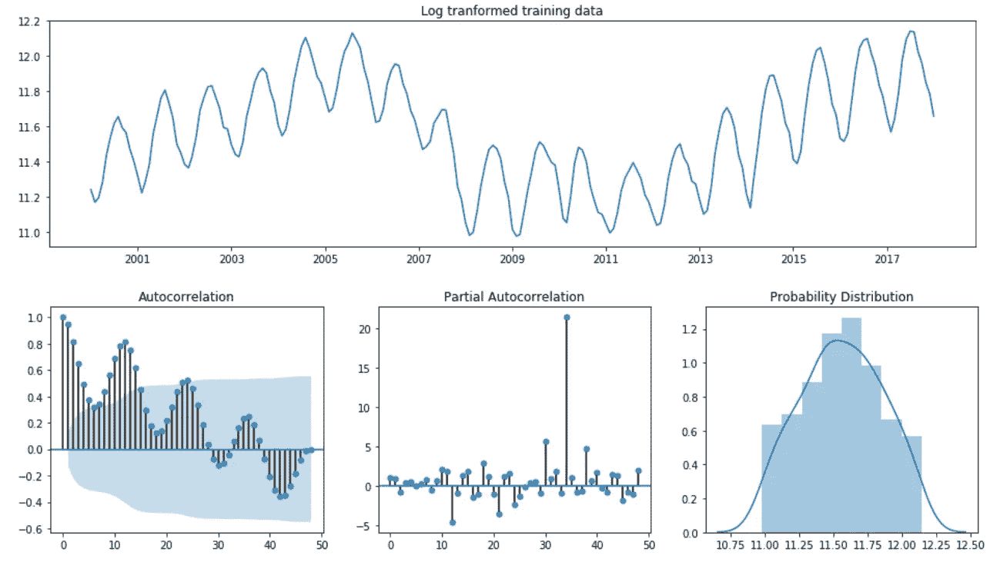

Properties of log transformed data

有时，日志转换本身可以使数据保持不变，但这里的情况并非如此。

```
test_stationarity(log_transformed_data)
Time series data is not stationary. Adfuller test pvalue=0.22522944188413385
```

差分是一种基本的操作或数据转换。是时间=t 时的 y 和时间=t-x 时的 y 之差***diff _ 1 = y _ t—y _ t-1***

差分使数据保持不变，因为它从数据中删除了时间序列成分，而您得到的是不同时间段之间的变化。注意，一阶差分只带走了趋势，而不是季节性。数据仍然不是静态的，因为它包含了季节性的影响。

```
logged_diffed_data = log_transformed_data.diff()[1:]
plot_data_properties(logged_diffed_data, 'Log transformed and differenced data')
```

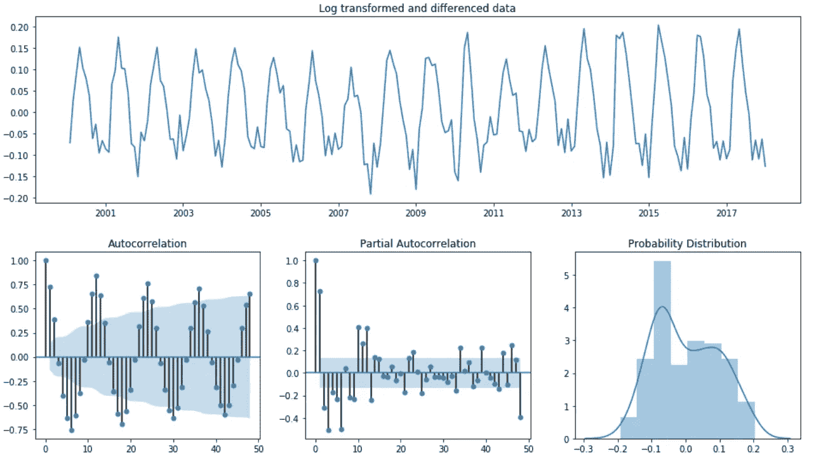

Log-transformed and 1st order integrated: non-stationary

```
test_stationarity(logged_diffed_data)
Time series data is not stationary. Adfuller test pvalue=0.20261733702504936
```

我们必须采用 12 阶差分来消除季节性。你可能会问，我们是如何决定采用 12 阶差，而不是 6 阶、8 阶或其他阶差的。通常，月数据的季节性滞后=12，周数据的季节性滞后=4，日数据的季节性滞后=30。或者你可以从 ACF 图中得到。对于这个特定的数据，第 12、24、36 个滞后高度相关。

数据现在是固定的。如果你看下图的直方图，它看起来像正常的钟形曲线。平稳数据是随机同分布的，图看起来像白噪声。白噪声只是平稳时间序列数据的一个例子。

```
seasonally_diffed_data = logged_diffed_data.diff(12)[12:]
plot_data_properties(seasonally_diffed_data, 'Log transofrmed, diff=1 and seasonally differenced data')
```

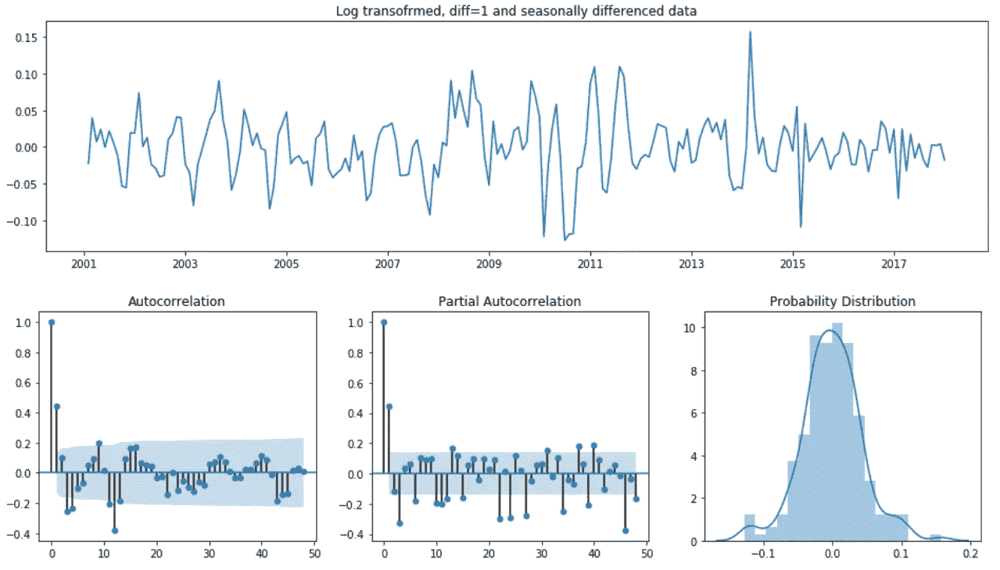

Stationary data

```
test_stationarity(seasonally_diffed_data)
Time series data is stationary. Adfuller test pvalue=0.0006264163287311492
```

# 7.模型选择和拟合

由于转换后的数据是稳定的，现在我们可以进入模型拟合阶段。我们之前简单聊过萨里玛。我想详细说明一下这个特殊的模型。季节 ARIMA 是 ARIMA 家族中的一个特殊成员，它可以对时间序列数据的季节成分进行建模。简单重述一下 ARIMA 的意思:

> AR —自回归模型是对时间序列数据的滞后值进行回归。滞后值成为自变量，而时间序列本身成为因变量。
> 
> y = A0+a1 * y t-1+a2 * y t-2，…..，a_k*y_t-k.

这里的主要任务是选择多少时间步长作为独立变量。不要让时间序列或滞后值这个词迷惑你，它们只是自变量。在线性回归中，您可以查看自变量和因变量之间的相关性，并选择高度相关的变量作为您的特征。在这里你也应该这样做。但是，您不必计算滞后值和目标变量之间的相关性，因为您可以使用 PACF 来确定要使用多少滞后。**平稳**数据的 PACF 在滞后=1 时具有显著的自相关，而在滞后=2 时下一个自相关变得不显著。理想情况下，AR 订单 p 应该为 1。由于 AR(p)和 MA(q)项相互影响，从自相关图中观察到的初始 p 和 q 值不再可靠，应作为起点。我们必须在 p 上进行参数搜索，以找到最优值。初步猜测将有助于定义网格搜索使用哪些值。在这种情况下，p =[0–2]就足够了。

> 积分的顺序:基本上，你对数据求了多少次差。我们有过一次 d=1。当您设置参数 d=1 时，不要忘记使模型适合无差异数据，因为算法将对其进行区分。如果您将模型拟合到静态数据，那么您就不再需要差分。可以让 d=0。我们需要差分来使数据稳定。
> 
> MA —移动平均模型:时间序列 y 在残差 w 上回归
> 
> **y = A0+a1 * w1+a2 * w2+…。+ a_k*wk**

查看 ACF 图，确定 ARIMA 模型的 MA 阶(q)。ACF 建议 ARIMA 模型的 MA 部分的阶数 q=1。但是，我们应该进行网格搜索，以找到一个最佳模型。我建议查看值 q =[0–2]

> 季节性模型—季节性特征必须与 AR 和 MA 一起添加到模型中，它有 4 个参数(P、D、Q、s)。
> 认为 P、D 和 Q 参数类似于 ar、I 和 MA 参数，但仅用于序列的季节性成分。

看 PACF 选择 P，看 ACF 选择 Q。季节差异的数量是 d，季节效应的频率是 s。

> P = 1 —因为我们在滞后=12 时有显著的相关性，但是，它们不够强，我们可能不需要在模型中有 AR 变量。这就是为什么我们应该在 P =[0–2]上进行网格搜索
> 
> D=1 —我们对季节性进行了一次差分
> 
> q = 1——根据 ACF 图，我们在滞后=12 时有很强的相关性。让我们也对参数 Q =[0–2]执行网格搜索。
> 
> s=12 —季节性频率，每 12 个月一次

**下面的 best_sarima_model** 函数对(P，D，Q)和(P，D，Q，s)参数进行网格搜索，以 AIC、BIC、HQIC 的统计指标作为评估标准，找到最佳模型。下 AIC，BIC，HQIC 意味着更好的模式。这些指标奖励拟合优度(对数似然)，惩罚过度拟合。在我们的例子中，有许多滞后特征会导致过度拟合。AIC、BIC 和 HQIC 平衡了可能性和自由度之间的权衡。你可以在他们的公式中看到这个属性。我不会深入讨论其他指标的细节，但会在下面举一个例子来支持我使用 AIC 的观点:

> -k 是模型中估计参数的数量，换句话说，是特征(滞后项)的数量。
> -L 是似然函数的最大值。
> **AIC = 2k — 2ln(L)**

我在行业中见过许多只使用其中一个指标作为模型选择标准的例子，但您可能会遇到这样的情况:一个模型的 AIC 可能比另一个模型低，而 BIC 却较高。这就是为什么如果 3 个指标中有 2 个较低，就要尝试选择一个模型。

Code snippet for model selection

请注意，我们正在为对数转换数据拟合一个模型，因此。我们已经设置了 d=1 和 D=1 参数，以便模型自己进行差分。如果您要将模型拟合到静态数据，则必须将积分阶数(D，D)设置为 0。我们用上面确定的参数评估了 SARIMA 模型。下面的总结显示了最好的模式，或者说最低的 AIC，BIC，HQIC。最好的模型建议我们不需要有 AR 特征，只需要 MA 和季节性 MA 特征。

```
best_model, models = best_sarima_model(train_data=log_transformed_data,p=range(3),q=range(3),P=range(3),Q=range(3))
```

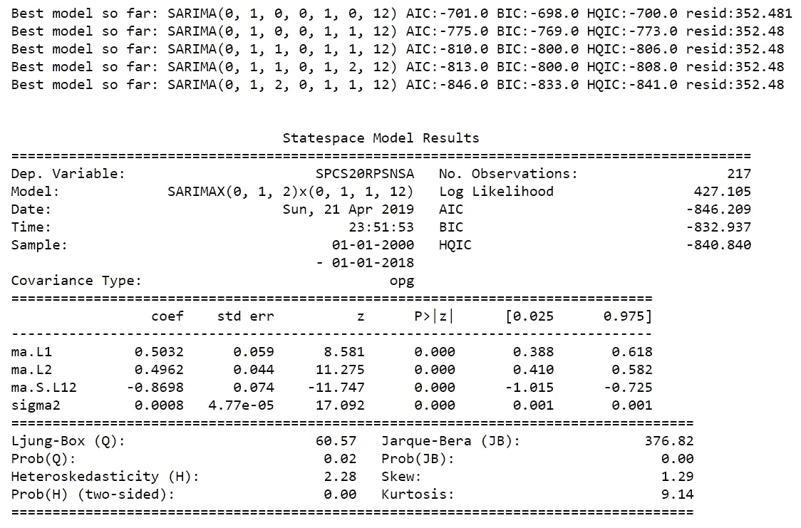

Model Summary of the best Sarima model

ARIMA 或萨里玛模型是通过使用最大似然估计和 OLS 假设适用于这一系列的模型。这些假设我不想在这里细说。这是另一篇文章的主题。然而，我们必须确认我们的模型符合这些假设。系数的 p 值< = 0.05。残差是平稳的和均方的。残差之间没有序列相关性。

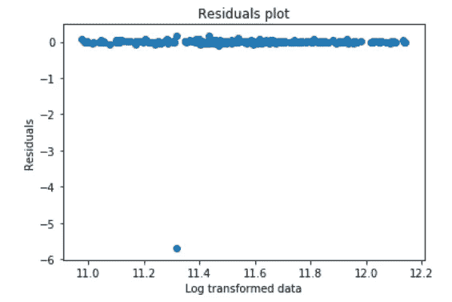

Endog vs Residuals Scatter plot

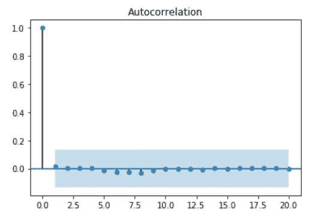

Residuals Autocorrelation plot: No correlation

我们将预测 2018 年 1 月 1 日至 2019 年 1 月 1 日的房屋销售情况。我将使用 MAPE——平均绝对百分比误差来评估模型性能。我们得到的最佳模型是 SARIMA(order=(0，1，2)，seasonal_order=(0，1，1，12)。我更喜欢时间序列分析中的 MAPE 误差度量，因为它更直观。Sklearn 不提供 MAPE 度量，所以我们要自己编码。公式:

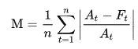

MAPE formula

Code snippet for MAPE

使用预测函数时，需要注意其参数的一些细微差别:

1.  type =“levels”意味着预测值将与 endog/training 值处于同一水平，在我们的情况下，它们是经过对数变换的，根本没有差异。然后，如果你注意到我们用 np.exp()将预测值换算成原始数据。记住，np.exp(np.log(a)) = a .所以，np.exp(np.log(原始数据))=原始数据
2.  dynamics = True，则使用 time = t 的预测值作为 time = t+1 的预测值。

```
preds_best=np.exp(best_model.predict(start=test_start_date,end='2019-01-01', dynamic=True, typ='levels'))
print("MAPE{}%".format(np.round(mean_abs_pct_error(test_data,preds_best),2)))MAPE:6.05%
```

我们大约制造。我们的预测误差为 6%。这并不意味着模型会在 6%的时间里表现不佳。相反，它转化为预测值将偏离实际值平均 6%。

用原始数据绘制预测值并查看结果。从下图中我们可以推断出什么？嗯，很多！该模型可以成功地捕捉季节效应，但是，不能捕捉趋势。房屋销售呈下降趋势，然而，该模型不能很好地捕捉它。它知道销量会下降，但由于季节效应，2018 年后会有下降趋势，这很难预测。这是因为我们得到的训练数据很少。

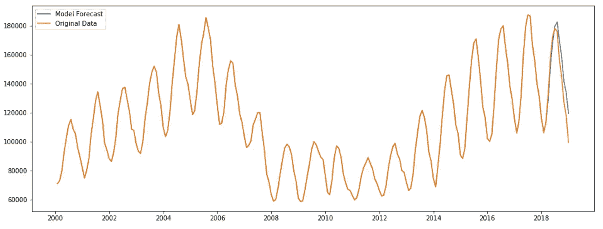

Forecasted data

如果我们有一个更大的数据集，我们可以识别一个经济周期，并对其建模。很可能，每 6-7 年的房屋销售就会减少一次。或者，如果这种下降趋势在 2019 年继续，我们对 2020 年的预测肯定会捕捉到这一趋势。

另一个更快捕捉趋势的选择是在模型中添加 AR 项。如果我们在模型中加入 1 或 2 个 AR 项，它可以更快地对趋势做出反应，并具有更少的 MAPE。下图显示了各型号的 MAPE。在 MAPE 测试中表现优于最佳模型的模型显示为绿色。

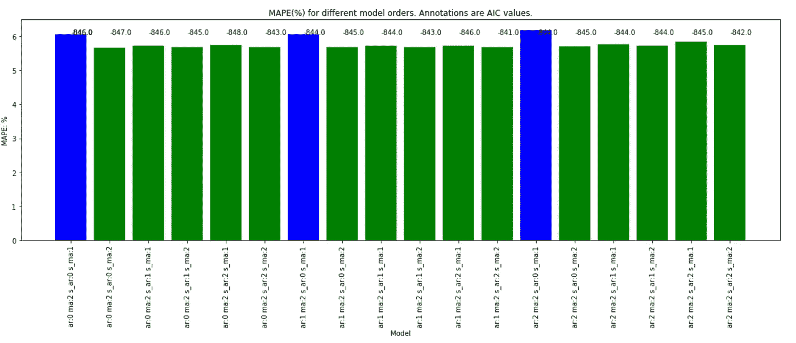

我们在模型中添加了 AR 术语，并且我们在测试指标方面有所改进。

```
agile_model = SARIMAX(endog=log_transformed_data,order=(1,1,2), seasonal_order=(1,1,2,12),enforce_invertibility=False).fit()
agile_model.summary()
```

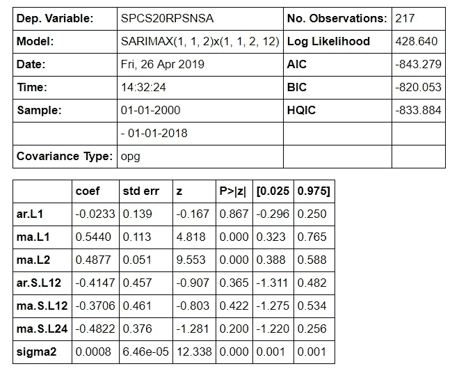

Model summary

测试 MAPE 现在是 5.67%，比 6.05%有所提高，这是最优模型的测试 MAPE。

```
agile_model_pred = np.exp(agile_model.predict(start=test_start_date,end=’2019–01–01', dynamic=True, typ=’levels’))
print(“MAPE{}%”.format(np.round(mean_abs_pct_error(test_data,agile_model_pred),2)))MAPE:5.67%
```

然而，如果你看看 AIC、BIC 和 HQIC，我们会得到更高的值，这意味着我们牺牲了模型的通用性。我们知道我们只有很少的数据点大约 300 个，在线性模型中有 6 个特征可能会导致过度拟合。如果你看一下上面的模型总结，特征系数的 P 值为 ar。马萨诸塞州 L1。阿肯色州 L2。马萨诸塞州第 12 中学。S.L12 和马。S.L24 高于 0.05%。

# 8.结论

我们在上面已经讨论了许多不同的概念，这些概念在分析和模型构建阶段都会用到。以下步骤总结了我们采取的方法，可用作类似项目的指南或框架:

1.  确定模型是乘法的还是加法的
2.  识别时间序列的组成部分:趋势、周期、季节性、残差
3.  将数据转换成线性
4.  如果数据不稳定，则使其稳定
5.  根据步骤 2，选择 ARIMA 或萨里玛模型
6.  为每个模型变量/特征定义订单参数
7.  做网格搜索，选择一个基于 AIC，BIC，HQIC 的最优模型
8.  检查模型残差是否符合 OLS 假设
9.  预测并计算预测误差:MAPE、梅等。