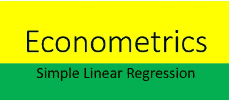
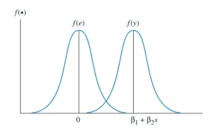
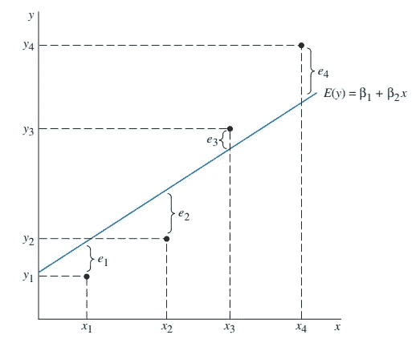

# 简单线性回归背后的计量经济学

> 原文：<https://towardsdatascience.com/econometrics-behind-simple-linear-regression-ae5037de92c9?source=collection_archive---------17----------------------->

准确描述机器学习的方法之一是找出现实世界问题的数学优化。有时，当试图使用机器学习解决现实世界的问题时，我们可能希望检查某些因素是否与某种影响有任何关联。

例如，一个家庭的周收入是否与一段时间内在某个地方花在食物上的钱有关联。在这个特殊的例子中，家庭的周收入是预测变量(自变量 X)，在食物上的花费是响应变量(因变量 Y)。

简单线性回归是在因变量和自变量之间建立关系的方法。最简单的情况是检查单个动作是否与响应有任何关系。这被称为简单的线性回归。在本文中，让我们看看简单线性回归背后的计量经济学。

# 目录

1.  **简单回归模型**
2.  **假设**
3.  **普通最小二乘法(OLS)**
4.  **使用 OLS 导出参数估计值**
5.  **超越建筑模型**

经济理论使用模型暗示了经济变量之间的许多关系。对于一个变量的给定值，这些模型用于估计/预测另一个变量的相应值。我们可以使用回归模型找到许多现实生活变量之间的关系，如收入-支出、学习时间-分数、身高-体重等。

**1。)简单回归模型**

*y= β1+ β2x+e*

简单线性回归对于寻找两个连续变量之间的关系很有用。

在这个模型中，我们通常指

y —因变量/解释变量/回归变量

x **—** 自变量/探索变量/回归变量

在这篇文章中，我们找到了收入和教育之间的关系。因此，相应的回归方程变成了

收益= *β1+β2Educ+e
β2，β2* —模型参数(常数)
*e* —误差项/不可观测误差(包括除教育以外影响收益的因素)

人们可以使用工作人群的随机样本数据来估计这个模型的参数。

**2。)假设**:

我们的估计从关于误差项的一些假设开始。

a.)u 的平均值，总体中的误差项为 0。随机误差的期望值为 *E(e)* =0

b.)误差项，将有恒定方差， *Var(e)* =常数

c.)我们需要假设 *u* 的平均值不依赖于 *x* 。
x、*u 都是独立的(对于给定的 x:u 不受影响)。即 *E(e│x)=E(e)=0=f(e)* 。*

这意味着， *E(y│x)= β1+β2x=f(y)*

举例:让 ***e*** —员工的能力。同样的受教育年限，两个员工的能力不一样。

下面是一个总体回归函数，它将 *f* (y)解释为 x 的线性函数，其中对于任何 x，y 的分布以 *f* (y)为中心

Source: Principles of Econometrics, 4th Edition

**3。)普通最小二乘**
到目前为止，我们还没有看到数据。回归背后的基本思想是从样本中估计总体参数β1， *β2* 。让我们从一个总体中选择一个大小为 n 的随机样本{( *易* ): i = 1，2，…，n}。
对于每个观测样本的回归方程，
*yi= β1+ β2xi+ei*

下面是人口回归线，从人口和相应的误差条款

Source: Principles of Econometrics, 4th Edition

*目的* **:** 利用数据确定变量之间的真实关系

*未知* **:** 真实关系，参数

由于误差项 *e* ，实际结果与真实关系不同

**4。)使用 OLS** 导出参数估计

我们的估计从一些假设开始。让我们回忆一下之前的假设，

*E(e│x)=E(e)=0
Cov(x，e)=E(xe)-E(x)E(e)
Cov(x，e)=0*

*原因* : *E(e)* =0(根据假设) *Cov(x，e)* =0(根据相同假设加上独立性)那么 *E(xe)* =0

我们现在有两个方程，

*E(e)* = 0 → (1)

*E(xe)* = 0 →(2)

用其他变量重写*e*:*x，y，β1，β2*

*e = y — β1- β2x*

在上述两个等式中代入 *e*

*E* (y — β1 — β2x) = 0

*E* [x(y — β1 — β2x)] = 0

现在我们有两个方程，两个未知数( *β1，β2* )

*E(X)* 是总体分布的算术平均值。 *E(X)* =∑( *Xi* /n)

将上述方程整形如下
*(∑(易- β1- β2x))/n=0
(∑ xi(易- β1- β2x))/n=0*

使用上述等式求解 *(β1，β2)* 得到
*Y- β2X= β1
(∑(xi-X)(易-Y))/(∑(xi-X) )= β2*
其中 *X，Y* 是 *x，y* 的算术平均值

**注**:*β2*的分母，即 *∑(xi-X)* 必须为> 0。但也有可能是零。
分母= 0 意味着 var(x) = 0

具有相同教育水平的每个人→β2-斜率估计量变得无穷大(形成一条平行于 y 轴的线)

因此，我们需要(x)中的一些变化来辨别(x)和(y)之间的关系
简而言之， *β2* (斜率估计)是(x，y)之间的样本协方差除以(x)的样本方差

*(Cov(x，y)/(Var(x))= β2*

如果 x 和 y 正相关，斜率将为正
如果 x 和 y 负相关，斜率将为负
只需要 x 在我们的样本中变化就可以得到估计值。

5.)**超越建筑模型**

在建立经济模型时，确保独立变量中存在小的方差(因为这会导致回归方程的斜率无穷大)。建立模型后，我们需要检查估计量的性质。这些属性包括对偏倚、一致性和效率的测试。因为这些性质将决定我们的估计有多精确。

**结束注释**

我希望你喜欢阅读这篇文章。然而，在回归模型和应用中仍有很多东西需要探索，我鼓励你们去阅读“计量经济学原理—第 4 版，作者:Carter Hill | Grifftiths | LIM”。如果您有任何建议/推荐，请在下面的评论中留下您的反馈。

感谢阅读。