# 基于 Gretl 的计量经济学——建立银行流失的地理分割模型

> 原文：<https://towardsdatascience.com/econometrics-with-gretl-building-a-geosegmentation-model-for-bank-churn-265cd6814866?source=collection_archive---------25----------------------->

## 使用逻辑回归、方差膨胀因子和优势比分析银行流失数据

# 格雷特是什么？

Gretl 是一个开源的统计软件包，是为计量经济学开发的，但也可以用于各种各样的数据。该程序是用 C++编写的，有许多扩展核心程序的社区源包。

该程序可以在[这里](http://gretl.sourceforge.net/#dl)下载，本教程中使用的数据可以在 [Kaggle 这里](https://www.kaggle.com/barelydedicated/bank-customer-churn-modeling/kernels)找到。

# 看一看数据

可以从*文件*选择下载的 csv 文件将数据加载到 Gretl 中。程序会提醒用户数据没有更新，并询问是否应该尝试构建一个时间序列，对于这个数据集，我们不需要这样做。

有两个窗口，一个包含名为 *string_table.txt* 的变量字符串值，主 Gretl 窗口显示数据中存在的变量的完整列表。

## 虚拟变量

变量**性别**和**地理位置**需要进行数字编码，这可以在 Grelt 中通过右击主屏幕中的变量并选择 **Dummify** 来完成，然后**对所有值**进行编码。为了使事情更简单，展开 Geography 和 Gender 变量并编辑值的属性。例如，右键单击“地理”下的“法国”并选择“编辑属性”，将“名称”字段从 **DGeography_1** 更改为**法国**。

## 检查变量

Exited 是因变量，因为它是利息的结果，本案例研究考察了可能与一个人离开或留在银行有关的因素。RowNumber、CustomerID 和 Surname 等变量不会影响一个人是留在银行还是离开银行，因此不使用这些列。剩下的变量将是回归变量。

*   信用评分——客户的信用评分会影响他们的决策
*   **地理** —客户所在的区域数据
*   性别——顾客的性别可能会影响他们的去留
*   **年龄** —顾客的年龄
*   任期——客户与银行交易的持续时间——更长的任期可以建立忠诚度
*   **余额**——客户的银行余额——可能会影响促销、利率和账户费用
*   **NumOfProducts** —客户订购了多少产品——更多的产品可能会导致更高的入住率
*   **HasCrCard**——不管客户是否有银行信用卡——增加银行在客户生活中的存在
*   **活跃会员** —过去 6 个月内客户与银行的活动——活跃客户更有可能留下来
*   **估计工资** —银行对客户工资的估计——高收入者可能在银行有更多投资
*   **退出** —客户是留在银行还是离开

# 构建模型

Gretl 使得数据建模变得非常容易。这是通过进入主窗口中的**模型**选项卡，导航至有限因变量(因为 exited 是一个离散变量)，然后导航至 logit(逻辑回归)，最后导航至 binary。

*   模型->有限因变量-> logit ->二元

然后，Gretl 将提示用户选择因变量(退出)和回归变量(上面的列表)。为了确定模型中变量的重要性，应勾选**显示 p 值**框。运行模型。

## 删除变量

运行第一次回归迭代会产生以下系数和 p 值:

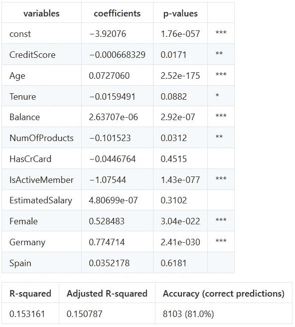

Model iteration 1

可以看出，西班牙的 p 值最高，这表明它不是一个显著变量，因此我们可以将西班牙排除在模型之外。在没有西班牙的情况下再次对数据进行建模时，精度没有提高，R 平方值也略有增加:

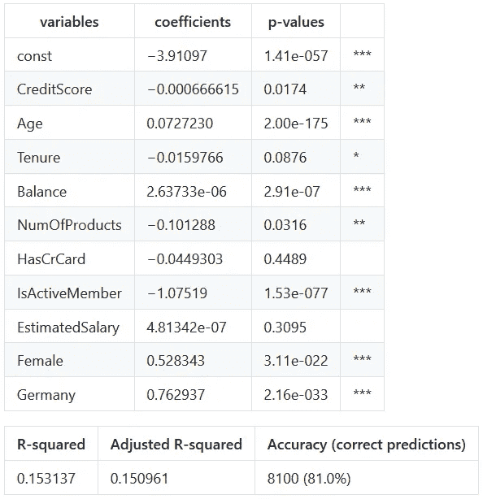

Model iteration 2

**HasCrCard** 和 **EstimatedSalary** 被删除，因为这些变量具有次高的 p 值(高于 0.05)。在没有这两个变量的情况下再次运行模型后，精确度和 R 平方得分略有增加。理想情况下，不应该有 p 值超过 0.05 的变量，但任期在 0.087 左右。任期可能会被取消，但从逻辑上讲，客户与银行关系的持续时间对他们的去留有一定影响。现在，模型显示没有 p 值高于阈值的变量(除了任期):

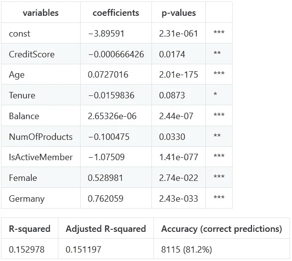

Model iteration 3

## 对数转换—平衡

由于 balance 的范围很大，从 1000 美元到 2000 美元增加一个单位会产生双倍的效果，而从 10，000 美元到 11，000 美元增加一个单位只会产生 10%的增长，因此需要对值进行转换，以便进行缩放。为了做到这一点，将记录日志，并在每一行增加 1，以防余额为 0。

在 Gretl 中，这是通过定义一个新变量并输入等式 log10(balance + 1)来完成的。以下是用 log_balance 替换 Balance 的结果:

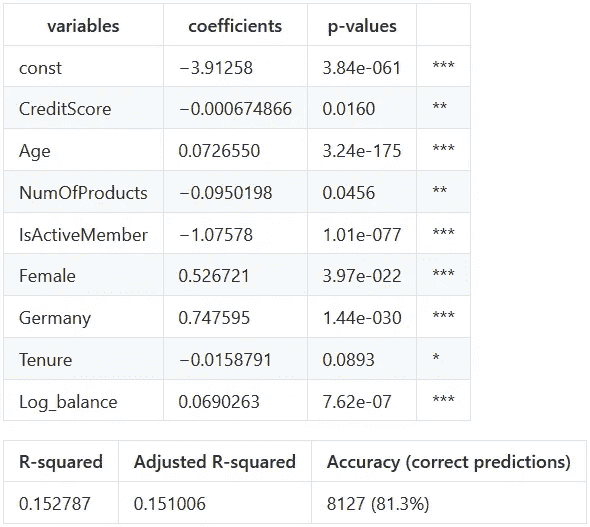

Model iteration 4

## 衍生变量——财富积累

派生变量可以更准确地表示一些字段，如余额和年龄。例如，随着年龄的增长，年轻人的余额可能较小，而老年人的余额可能较大。或者，一个年轻人可能有一份收入丰厚的工作，与可能失去储蓄的老年人相比，他可能有更多的存款。该指标可以更好地代表客户的财务状况。

为了创建这个衍生变量，银行账户的对数余额可以除以账户持有人的年龄。这个变量被称为财富积累。以下结果是用财富积累作为等式的一部分得出的:

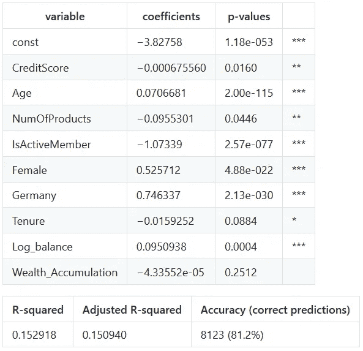

Model iteration 5

## 处理多重共线性

模型中包含 Wealth_Accumulation、Log_Balance 和 age 可能会显示精度下降和高 p 值，因为可能存在多重共线性。Gretl 可以检查共线性和方差膨胀因子(VIF)。对数余额和财富积累的 VIF 比其他变量高得多:

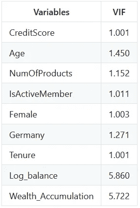

VIF with Log_Balance and Wealth_Accumulation

当去掉 Log_Balance 时，财富积累系数缩小:

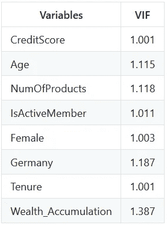

VIF with only Wealth_Accumulation

仅包含财富积累的模型的指标是:

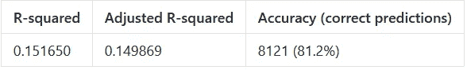

Model performance with Wealth_Accumulation

采用财富积累的对数可能是比未转换变量更好的度量。包括对数平衡和对数财富积累显示了共线性的影响，两个 VIF 分数都在 700 左右。

这种共线性效应可以通过取财富积累的对数并将其包含在 Log_Balance 旁边的等式中来进一步观察:

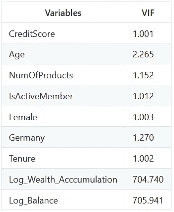

VIF with Log_Wealth_Accumulation and Log_Balance

包含 Log_Balance 和 Log_Wealth_Accumulation 变量的模型的指标是:

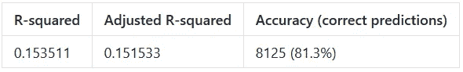

Model performance with Log_Wealth_Accumulation and Log_Balance

仅使用 Log_Wealth_Accumulation 评估绩效时，衡量标准如下:

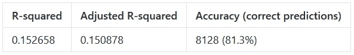

Model performance with only Log_Wealth_Accumulation

## 最终确定模型

当比较其中一个仅使用 Log_Wealth_Accumulation 而另一个仅使用 Log_Balance 的两个模型时，具有 Log_Balance 的模型导致更高的 R 平方得分(0.151006)，并且准确性仅差 Log_Wealth_Accumulation 准确性一个正确预测(8127 对 8128)。

# 结果——哪些变量影响最大？

为了确定哪些变量在确定银行流失率时最重要，需要计算每个系数的优势比。

## 计算优势比

简单逻辑回归方程:

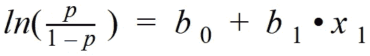

赔率等式:

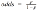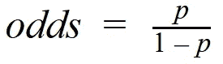

将比值代入逻辑回归方程(也称为对数比值):

取每边的指数:

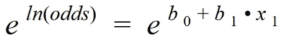

简化:

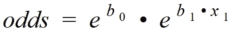

将变量增加一个单位:

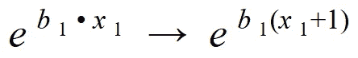

指数表明增加一个单位会导致倍增效应:

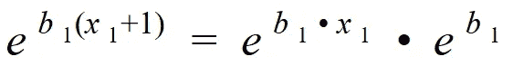

## 计算格雷特的优势比

这些比率可以在 Gretl 中使用功能包“优势比率”进行计算:

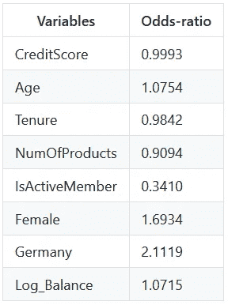

# 结论—银行可以瞄准谁来减少客户流失？

结果显示，最有影响力的变量是德国人、女性和积极成员。在这种情况下，优势比是看哪些因素导致客户离开。因此，当观察这家银行的客户流失时，一个住在德国或搬到那里的客户离开的几率增加了 2.1119 倍。此外，女性顾客离开的几率增加了 1.6934 倍。另一方面，成为活跃会员表明客户仍在银行工作。最终，如果银行想要减少客户流失并留住他们的客户群，他们必须瞄准他们的德国客户，尤其是德国女性，并努力增加这些客户在银行的活动。