# ecoVIZ

> 原文：<https://towardsdatascience.com/ecoviz-39a8e50c6c1?source=collection_archive---------31----------------------->

## 墨西哥城公共自行车共享系统的视觉探索

[*埃斯特万·卡斯蒂略·蒙德拉贡*](https://twitter.com/ecastillomon)

[*杰洛尼莫阿兰达巴罗瓦*](https://twitter.com/jeroaranda)

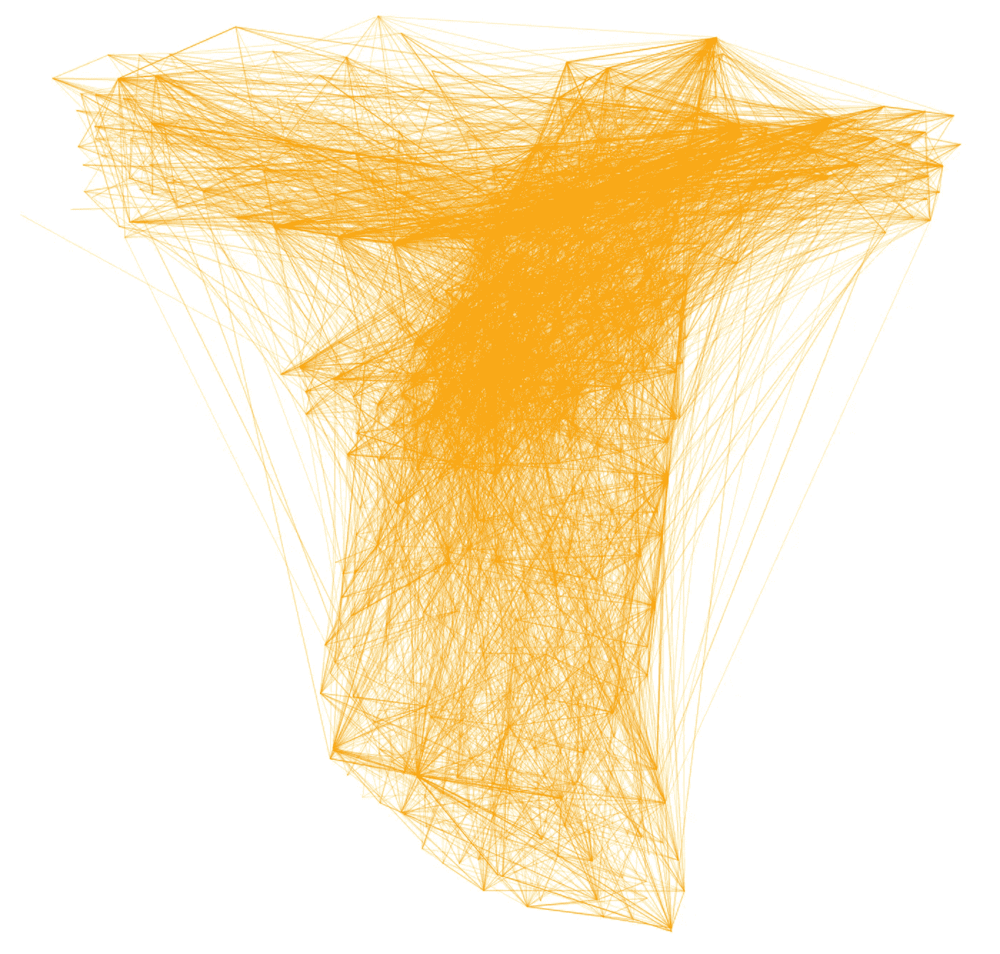

**Cover page.** The first 10,000 trips of September 2019

ecobici 网络是一个为大量用户提供服务的系统，因此，它是一个拥有 480 个站点的复杂系统，每月约有 600，000 次旅行。众所周知，骑自行车对健康有好处，可以节省用户的短途旅行时间，同时有助于保护环境，减少城市交通拥堵。

# 网络状态

由 **ECOBICI** 产生的数据量是巨大的，因为每个行程产生一个记录，这些行程中的每一个记录字段，例如:

*   用户的年龄和性别。
*   撤站和到站。
*   撤离和到达时间。
*   除其他外。

为了开始理解 **ECOBICI** 系统，让我们从**开始**可视化一周内的行程分布。

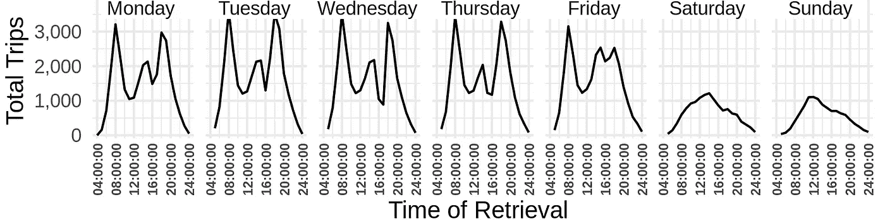

**Figure 1.** Distribution of withdrawals during a week of March 2019 every hour.

当我们将取款视为一个时间序列时，这些为工作日、周五和周末定义的模式立即凸显出来，让我们看看 2019 年 4 月每种类型的平均分布。

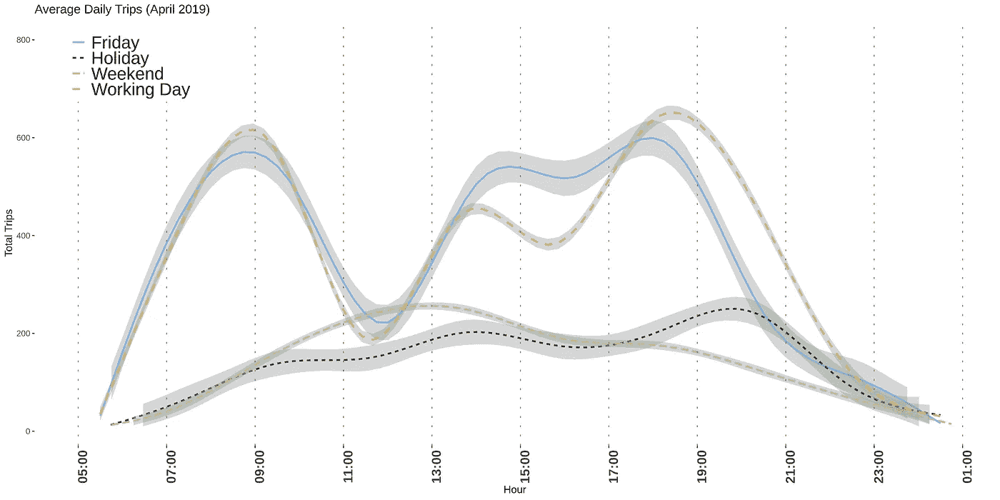

**Figure 2.** Withdrawal daily distribution in April 2019

看到工作日和周末之间的明显区别是很有趣的。除了星期五下午之外，工作日之间的分布似乎是相同的。在节假日，这在**图 2 中。**恰逢复活节假期周的日子，分布与周末几乎一致。工作日是出行次数最多的日子，这些日子具有双峰分布，高峰与工作日的出入时间一致。在周末，该系统在中午达到最大使用率。

# 工作日

工作日是最活跃的，在上午和下午有两个明显的高峰时间，看到前面的图表，我们可以毫无顾虑地确认工作日实际上是相同的，这就是为什么我们认为可视化工作日中的活动足以理解系统中的大多数活动。

以下视频显示的是 **ECOBICI** 在 2019 年 6 月 12 日的总活动量，选择这一天是因为在样本中是一个**普通**工作日，注意不要因为天气或其他原因选择非典型日。这一天共有 32，363 次出行，高峰时段每小时 3，738 次。

在高峰时段(大约早上 8 点和晚上 8 点)可以随意暂停。).

**Figure 3.** Activity throughout June 12, 2019

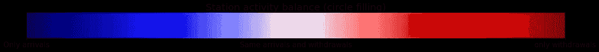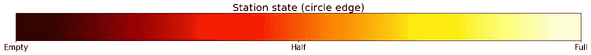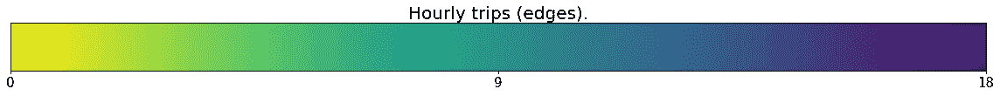

让我们花点时间来理解前面的图表，从而能够提取它给出的所有信息。让我们从把车站想象成每个圆圈开始。圆圈的大小对应于该站每小时的取款和到达的总和，140 次到达加上取款是该站每小时的最大活动。这些站里里外外都是彩色的。**内部**颜色响应每小时显示的余额，也就是说，在该站一小时内是否有更多的提款或到达。深红只代表撤回，深蓝代表到达，白色代表完美的平衡。**外观**颜色对应的是站点的状态，即 **ECOBICI** 在该时间段在该站点所占的自行车位比例，暗红色表示站点没有可用的自行车，白色表示站点已满。行程由两个站点之间的直线定义，显示每小时的行程次数。

视频的再现可以正确识别高峰时间，也可以看到早上公共交通附近的车站，如 Polanco 和 Buenavista 地铁站，是大多数旅行的起点，旅行的终点是高劳动力区域，如 Polanco 和 Reforma Avenue 的某些部分。这种现象在下午几乎完全相同，但方向相反，现在劳动力密集的区域变成了起点，而到达点是与更高范围的公共交通的交叉口。让我们来看看早高峰时段的一帧视频。

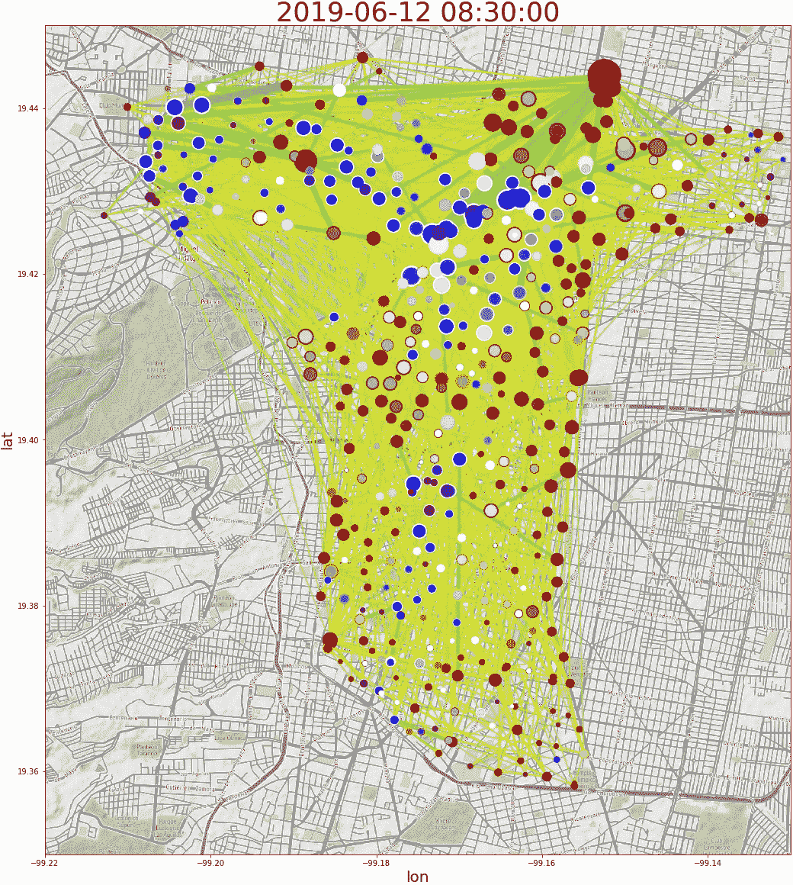

**Figure 4.** ECOBICI June 6 8:30 am. 2019

显示屏突出显示系统外围的饱和度。这表明该系统的大部分用户来自其他地方，他们可能对该系统的更广泛覆盖感兴趣。

此外，如果我们关注车站的状态(每个圆圈的边缘)，可以看到在到达和离开的每个突发之后，车站是满的和空的，具有许多到达的车站变得饱和(白色边界)，与具有许多撤回的车站变得空(黑色边缘)相反。

共享自行车系统的特殊动态表明，通过再平衡来强调库存优化，如 *— Castillo，2019 所示。*避免饱和和缝隙。

# 一点透视和尺度

ECOBICI 的用户是哪些人？通过工作日的旅行分布，我们可以推断，一般来说，这些用户对应于工作人员。让我们再深入一点，通过下面的图片来更好地理解他们的简介。

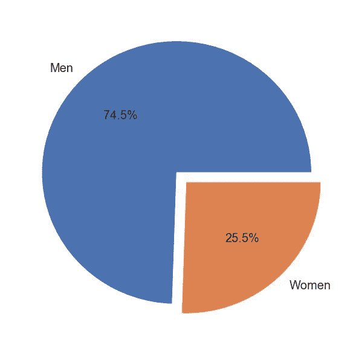

**Figure 5\.** Percentage of trips by sex in September 2019

看到性别在使用上的巨大差异可能是一个警告，表明存在性别问题，在更深入的分析中，这种差异可以在每个车站中可视化，以表明在 ECOBICI 覆盖的城市全景中妇女或多或少的安全区域。

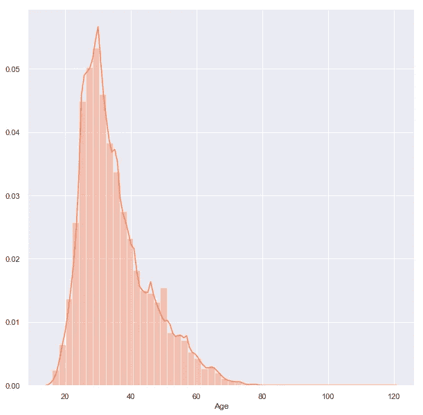

**Figure 7\.** trips by age histogram in September 2019.

另一方面，年龄的分布突出了社会项目的机会领域，如将青少年纳入系统，或鼓励 40 岁以上的人参加体育活动的可能性。

现在，让我们稍微放松一下对 **ECOBICI** 的关注，从**的规模**获得一些视角，让我们看看这个城市所包裹的系统。

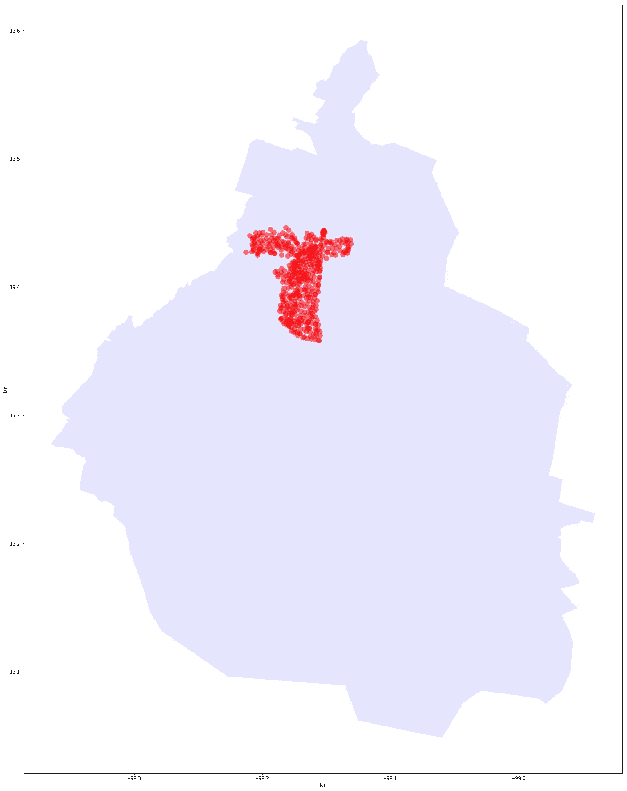

**Figure 7.** ECOBICI and Mexico city.

ECOBICI 占据了墨西哥城很小的面积！然而，重要的是要明白，墨西哥城的近三分之一被密尔沃基和埃尔阿胡斯科周围的森林地区占据，所以让我们通过放大一点来只关注市区。

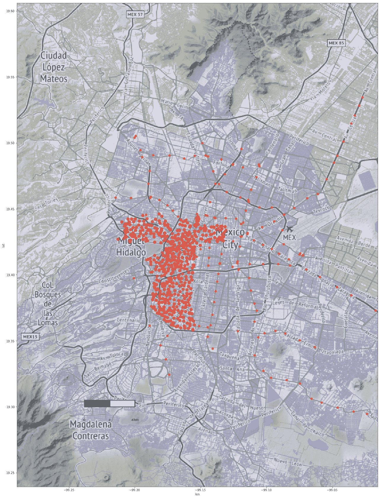

**Figure 8.** ECOBICI, subway(orange dots) and urban area.

扩展该系统的机会是巨大的，包括可能与墨西哥州的城市地区整合，以及与覆盖范围更广的其他交通系统整合。这也引发了人们的想象，即能够将农村地区的山区生态社区纳入其他肯定会促进社会福利的可能项目中。

# 汇总系统信息

由于本文是一个可视化练习，我们创建了下面的图表，目的是可以在大尺寸的打印中观察到它。它显示了 2019 年 9 月期间 **ECOBICI** 的总活动量。如果我们放大图表，我们可以详细观察每个车站的名称、其活动、车站之间的流量以及系统附近的地铁站。

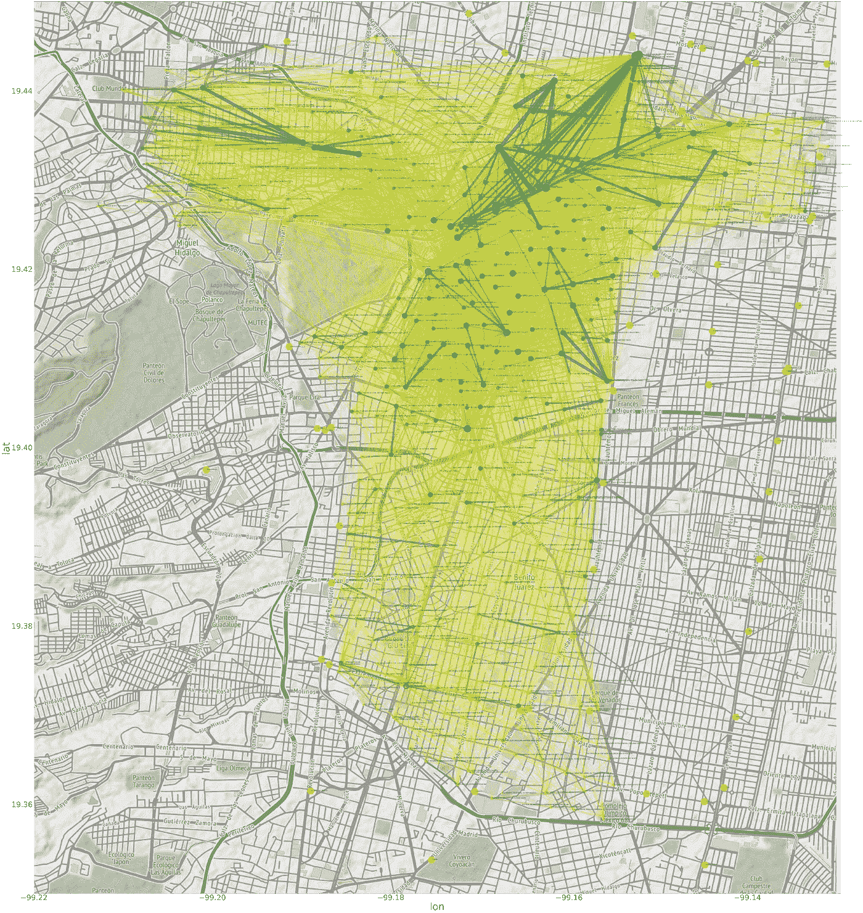

**Figure 9.** Flow during September 2019 [(Click here to see image full size)](https://est092.github.io/ecoVIZ/data/septiembre.png)

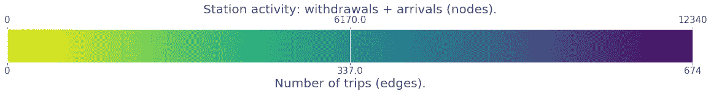

接近这种视觉化可以让你对一个可能的新自行车道和站点网络产生一个相当健壮的第一想法。免除要求，因为这些路线中的许多已经被占用，在公共道路上为这些生态自行车手和骑自行车的人留出一些咪表将认可他们，并为他们提供政府的安全保障，此外，即使对他们存在少数激励措施，也支持智能移动系统。扩大这些形式的流动性将改善许多目前处于红色数字的社会变量。

*   通过增加体育活动来增进健康。
*   由于碳氢化合物驱动的运输减少，空气质量提高。
*   道路拥堵减少。
*   减少其他公共交通系统的超载，特别是在著名的最后一英里。
*   除了使用自行车造成的其他已知影响之外。

# 结论

对当代社会项目规模的适当关注是其成功的最重要的变量之一，这就是为什么我们相信合作。我们还确信，公共解决方案的搜索和验证必须是一项集体工作，因此，在这个项目中开发的所有分析都可以复制，因为所有脚本都可以在这个公共[存储库](https://github.com/est092/ecoVIZ)中获得。最初的西班牙文[文章](https://est092.github.io/ecoVIZ/)是在 **Jupyter 笔记本**中设计的，而内容 50%是用 **Python** 和 **matplotlib** 图形制作的，50%是用 **R** 和 **ggplot** 制作的，以提及一些被占用的自由软件库。我们自豪地宣布，它在由 [CIMAT](https://www.cimat.mx) 举办的数据可视化竞赛中获得了第一名！

对数据的正确解读可以为公共政策的有效实施提供必要的杠杆，我们庆祝最近由交通部长发布的[公告](https://www.jefaturadegobierno.cdmx.gob.mx/comunicacion/nota/anuncia-gobierno-de-la-ciudad-de-mexico-nueva-licitacion-para-el-sistema-ecobici)对 **ECOBICI** 系统的新招标，我们希望获胜者考虑现有的信息，以前的解决方案是成功的，但是它已经达到饱和。如果新的解决方案能更好地被妇女和年轻人以及来自不同殖民地的人们所采用，那就太好了。

我们希望除了在读者的头脑中产生其他的东西之外，这些形象化的东西足以支持我们的叙述。