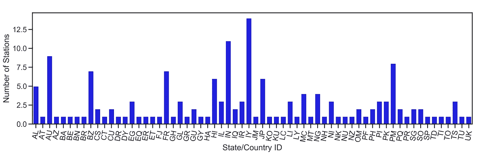

# 二战期间气象站的 EDA

> 原文：<https://towardsdatascience.com/eda-of-weather-stations-during-wwii-bddfff8e8872?source=collection_archive---------29----------------------->

## 与 GeoPandas 和 Seaborn 一起讲述一个不同的战争故事

第二次世界大战是人类历史上最致命的冲突之一，夺去了数百万人的生命，并塑造了我们至今的政治、社会和经济环境。除了武器和子弹，天气在冲突中也扮演了重要角色。

诺曼底登陆日本不应该在 6 月 6 日，但由于恶劣的天气条件而推迟了。太平洋剧院的部队不得不在战斗间隙承受相当大的降雨量。更不用说德军不得不面对[温特](https://en.wikipedia.org/wiki/Russian_Winter#German_invasion_of_1941)将军。

# 气象站数据集

在战后几十年的今天，由于 [*国家环境信息中心*](https://www.ncdc.noaa.gov/data-access/land-based-station-data/land-based-datasets/world-war-ii-era-data) 的努力，任何人都可以方便地下载战争期间许多国家的天气数据，但数据集也可以在 [Kaggle](https://www.kaggle.com/smid80/weatherww2/version/1) (以及互联网上的许多其他地方)获得。

这里的目标是检查气象站在全球的空间分布情况，并了解有多少气象站位于不同的国家。假设你要用一点代码更新 NCEI 的地图。

# 用`DataFrames`制作地图

像往常一样，首先从工具箱中拿出工具:

除了通常的`Pandas` *等*之外，为了制作地图，你将使用`[GeoPandas](http://geopandas.org/)`和`[Shapely](https://shapely.readthedocs.io/en/stable/manual.html)`包的组合，你可以安装:

现在你已经做好了一切准备，用`Pandas`读取数据集:

如果你从 Kaggle 下载数据集，你可能会看到两个文件:一个是实际的天气数据，另一个是关于气象站的信息，也就是你在上面读到的那个，所以我们将把天气分析留到另一个时间。数据集如下所示:

到目前为止，那只是另一个普通的`DataFrame`，所以你怎么能把它做成地图呢？首先，您需要创建另一个包含每个气象站的`'Longitude'`和`'Latitude'`的列，然后是`apply`和`Point`函数，这样`GeoPandas`就可以了解位置:

顺便说一下，您的`DataFrame`现在包含了`'Coordinates'`列，看起来像这样:

`'Latitude'`和`'Longitude'`的值共同构成一个`Point`像一个有序的对被绘制在一个笛卡尔平面上，有了这个信息你可以构成一个不同类型的`DataFrame`:一个由`GeoPandas`解释的`GeoDataFrame`。

最后，一切准备就绪，您可以看到二战期间全球气象站的分布:

`GeoPandas`可以读取你可能有的各种形状文件，但这里你使用的是来自[自然地球](https://www.naturalearthdata.com/)的简单标准`naturalearth_lowres`形状。

从表面上看，气象站的数量并不令人印象深刻，甚至与我们今天拥有的气象站相差甚远。除了这里和那里的几个点，没有关于美国天气的数据，更不用说饱受战争蹂躏的欧洲，但从好的方面来看，我们有一些非洲和太平洋剧院的电台，显然巴西也有一些。在这一点上，你应该花一分钟考虑一下在战争期间保存天气信息有多困难，你会看到上面的数量是相当可观的。

总共有 161 个气象站，但是每个国家有多少个？使用`Pandas`，这个问题很容易回答。

# 各国气象站

活动这一部分的目标是`groupby`将每个站点分配到其所在的国家和`count`总数量，这可以通过`Pandas`轻松完成:

你不喜欢`Pandas`有多优雅吗？任务已经完成，但是用`Seaborn`的手来策划一下也无妨:

单个来看，大多数国家只有一个自己的气象站，而澳大利亚和日本等太平洋沿岸国家明显高于平均水平。查看这些信息的另一种方式是通过直方图，这也很容易通过`Seaborn`获得:

现在，正如你所看到的，这里考虑的大多数国家在二战期间只有一个空间站，但我们并没有抱怨。虽然直方图非常简单，但它能很好地展示任何时间序列的频率分布。

# 结论

第二次世界大战气象站数据集非常有趣，如果你是一个历史迷，它也可以提供一些不错的新的好奇心。它也是[空中轰炸](https://www.kaggle.com/usaf/world-war-ii)数据集的同伴，所以也来看看这个。

只需一点探索性数据分析(EDA)，您就可以提供关于数据的新见解和信息，因此有时简单是最好的，一些工具永远不会过时。

如果你想下载源代码和上面的图表，有一个资源库[你可以直接到这里](https://github.com/willyhagi/flyingcircus/tree/master/WWII)去获取。

干杯！