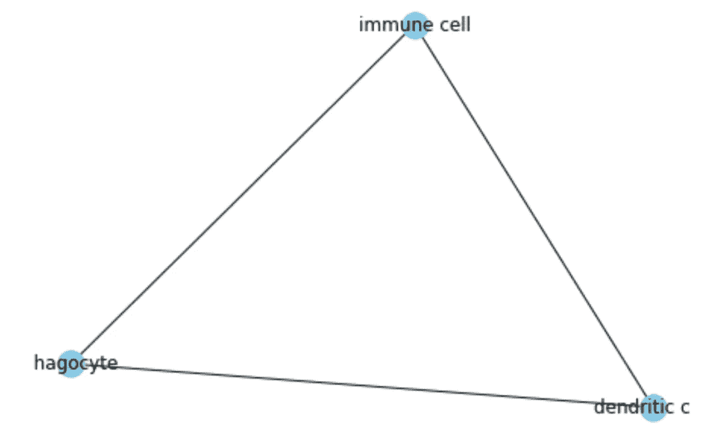

# 基于网络的图形 EDA x

> 原文：<https://towardsdatascience.com/eda-on-graphs-via-networkx-a79d2684da53?source=collection_archive---------20----------------------->

## 利用 networkx 库探索生态小区生境分类学

# 介绍

探索性数据分析(EDA)旨在发现数据中隐藏的结构。基于手头的数据，EDA 可能包括特征和标签的相关性分析、样本的分布分析、散点图、直方图等等。EDA 对于从建模和预测阶段可以利用的数据中获得洞察力非常有用。

从某种意义上说，图是一种特殊的数据结构，因为已知某些样本(相邻顶点)在某种程度上更相关。与大多数 ML 数据集不同，图可能没有明确的特征。在这种情况下，发现图中的结构变得更加重要，因为这是唯一的事情。

在这个故事中，我们将考虑细菌栖息地的分类。作为语义搜索项目的一部分，我和赛仑·帕拉尔对这个分类法很感兴趣。个体生态位是细菌可以生存的环境层次。个体生境通过定义栖息地(顶点)之间的*关系来指定层次，这是数据中唯一的交互类型。然而，每个顶点都与一个在本体中标识它们的 ID 和一个映射到真实名称的名称相关联。在 BioNLP 任务下共享了 OntoBiotope，其 2016 版可以在[这里](http://2016.bionlp-st.org/)找到。*

# 图表统计

我们对生态小区进行处理以创建一个无向图，其中两个节点是相邻的，如果它们之间有一个*关系。让我们先看看有多少个节点和边。注意，我们将 networkx 图存储在一个名为 *graph 的变量中。**

```
print(graph.number_of_nodes(), graph.number_of_edges())
2320, 2528
```

由于个体生态位是一种分类学，因此预期边的数量少于具有这么多节点的常规图。为了分析图形结构，让我们计算深度、直径和最大团大小。为了计算深度，我们计算从根到每个其他节点的最短路径，并找到最大最短路径距离。

```
depths_graph = nx.shortest_path_length(graph, source='OBT:000000')
depth = max(depths_graph.values())
diameter = nx.algorithms.distance_measures.diameter(graph)
max_clique_size = nx.algorithms.clique.graph_clique_number(graph)print(depth, diameter, max_clique_size)
10, 20, 3
```

我们看到离根最远的节点距离为 10，而最远的节点对距离为 20。假设我们的图有一个树状结构，直径是深度的两倍是一个普通的结果。另一方面，我们可以看到它不是一棵树，因为它包含一个 3 的团，这是树的一个禁忌结构。下面我们可以看到一个来自个体生态位的 3-集团。



A 3-clique from OntoBiotope.

# 节点统计

看了一下整个图的结构，现在让我们单独考虑节点。中心性度量经常用于描述节点的特征。尽管有许多变体，我们将考虑唯一的度和特征值中心性，因为大多数变体的行为相似。多亏了 networkx，计算这些分数非常简单。

```
degree_cent = nx.degree_centrality(graph)
eigen_cent = nx.eigenvector_centrality(graph)
```

当我们分析结果时，我们看到*实验介质*在两种情况下都具有最高的中心性分数。这个节点位于深度 1，并且与许多栖息地相邻，因为它有一个相当全面的定义。

# 改进

基于我们目前的分析，我们可以说，生态小区是一个具有小集团和很少中心节点的松散连接的图。因此，我们需要丰富其内容，以获得更多的洞察力。为此，我们利用分类提供的 PubMed 摘要。在提供的摘要中，对这些栖息地的提及已经被注释。

> 假设在抽象中共存的栖息地是相关的，我们可以在图中使它们相邻。

当我们使用这个假设时，我们在现有的图中引入了更多的边，并创建了新的关系。我们现在可以重新计算之前的统计数据。

```
depths_graph = nx.shortest_path_length(enriched_graph, source='OBT:000000')
depth = max(depths_graph.values())
diameter = nx.algorithms.distance_measures.diameter(enriched_graph)
max_clique_size = nx.algorithms.clique.graph_clique_number(enriched_graph)print(enriched_graph.number_of_edges, depth, diameter, max_clique_size)
3610, 10, 16, 15
```

这里我们看到边的数量显著增加。相应地，直径从 20 缩小到 16，集团数量从 3 增加到 15，这是一个巨大的变化！另一方面，树的深度仍然相同，这意味着从根到叶子的距离没有改变。然而，根据直径的减小， ***我们可以得出结论，新的路径是由树叶之间的共现关系引入的。***


The larges clique in the enriched OntoBiotope

现在让我们观察中心性的变化。我们一起绘制两个图的度和特征值中心性的直方图。我们采用中心性分数的对数来处理小数字。


Degree centrality histograms of the original and enriched graphs.

在上面的直方图中，我们看到富集导致了向高中心性节点的转移。 ***这意味着某些节点在 PubMed 摘要中比其余的*** 被提及得多。因此，低中心性节点的频率降低。


Eigenvalue centrality histograms of the original and enriched graphs.

特征值中心性直方图具有不同于度中心性的特征。我们观察到，在初始图中，中心性主要集中在同一个箱中。使用浓缩物，将这群人分散到两边。 ***因此，富集在数据中创造了一种方差，这种方差可以被机器学习模型所利用。***

# 结论

在这个故事中，我们从几个不同的方面分析了生物群落分类。在分析过程中，我们观察到该图的信息并不丰富，我们应用了基于文本共现的丰富。重新计算统计数据，我们已经看到中心性和扩大的子结构(如 15 人集团)的方差增加。请注意，EDA 是一个永无止境的迭代过程，它为建模阶段提供信息，也被建模阶段提供信息。如果你有兴趣，可以从[这个回购](https://github.com/rizaozcelik/bionlp-shared-task-entity-normalization)开始关注我们项目的状态。

## 参考

[1]http://2016.bionlp-st.org/