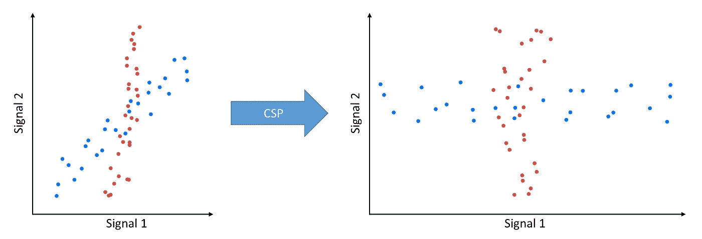
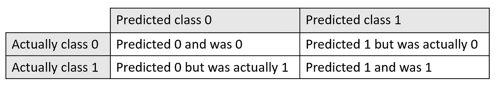
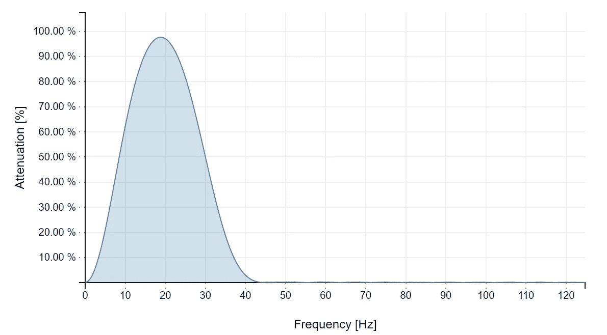
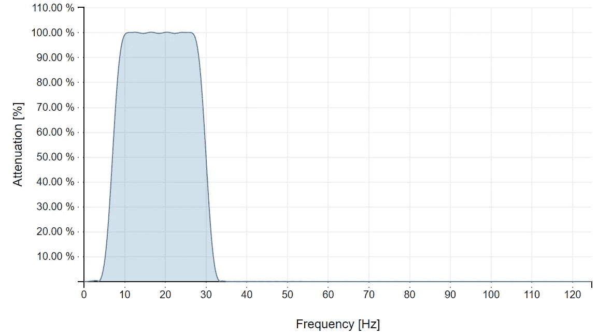

# 用 BCI.js 在 Node.js 中进行脑电运动想象分类

> 原文：<https://towardsdatascience.com/eeg-motor-imagery-classification-in-node-js-with-bci-js-d21f29cf165?source=collection_archive---------14----------------------->

## 检测与想象动作相关的脑电波

脑机接口(BCI)允许只使用你的思想来控制计算机和其他设备。实现这一点的一种流行方法是用脑电图(EEG)检测运动想象。本教程将介绍运动想象的检测和分类。我把它分成了五个部分:

1.  加载数据
2.  特征抽出
3.  训练分类器
4.  测试和分析结果
5.  改善结果

您可以在其 [GitHub repo](https://github.com/pwstegman/motor-imagery-tutorial) 中找到本教程中使用的完整代码和数据。

# 第 1 部分—加载数据

首先，为项目创建一个新目录。然后，在项目目录中，将数据下载到名为“data”的文件夹中。我们将使用在 http://bnci-horizon-2020.eu/database/data-sets 的[发现的‘四级运动想象(001–2014)’数据集。我已经将数据集制作成 CSV 文件，您可以从下面下载:](http://bnci-horizon-2020.eu/database/data-sets)

*   [右手训练. csv](https://github.com/pwstegman/motor-imagery-tutorial/blob/master/data/righthand-training.csv)
*   [右手测试. csv](https://github.com/pwstegman/motor-imagery-tutorial/blob/master/data/righthand-testing.csv)
*   [双脚测试. csv](https://github.com/pwstegman/motor-imagery-tutorial/blob/master/data/feet-testing.csv)
*   [foots-training . CSV](https://github.com/pwstegman/motor-imagery-tutorial/blob/master/data/feet-training.csv)

您还可以使用 bash 的[这个脚本](https://gist.github.com/pwstegman/d10bc2980e336294b7d2389f9b0c75bf)或 PowerShell 的[这个脚本](https://gist.github.com/pwstegman/7291c74ef43202faae6ab844c7ff224b)下载数据。

如果您想试验来自不同主题或数据集的数据，可以使用。mat 文件可以在本教程的 [GitHub repo](https://github.com/pwstegman/motor-imagery-tutorial) 中找到。您还可以在 [data/](https://github.com/pwstegman/motor-imagery-tutorial/tree/master/data) 目录中找到包含其他想象运动的 CSV 文件。

我们将使用 [BCI.js](https://www.npmjs.com/package/bcijs) 将数据加载到 Node.js 中。如果你没有安装 Node.js，可以在这里下载[。](https://nodejs.org)

一旦安装了 Node.js 和 NPM，通过在项目目录中运行以下命令来安装 BCI.js

```
npm install bcijs
```

现在我们可以从项目目录的根目录下的 classify.js 开始。首先需要 BCI.js 并加载相关的 CSV 文件。由于 CSV 加载方法是异步的，我们必须将它们包装在一个异步函数中，并使用 await 关键字，这样 Node.js 在文件加载之前不会继续:

# 第 2 部分—特征提取

一旦数据被加载，我们将使用[公共空间模式](https://en.wikipedia.org/wiki/Common_spatial_pattern) (CSP)作为特征提取方法的一部分。CSP 试图设计数据，使得当想象脚运动时，第一个信号将具有高的方差，而最后一个信号将具有最低的方差，而当想象右手运动时则相反。考虑到这一点，我们可以使用每个 CSP 信号的方差作为分类的特征向量。



本教程遵循 Christian Kothe 在他的 CSP 讲座[中描述的方法。如果你想了解更多，他有关于 CSP 和 BCIs 的精彩讲座。](https://www.youtube.com/watch?v=zsOULC16USU&list=PLbbCsk7MUIGcO_lZMbyymWU2UezVHNaMq&index=43)

现在我们可以开始研究特征提取方法了。CSV 中的每 750 个样本来自单独的 3 秒试验。我们可以使用 BCI.js 中的 windowApply 方法从每个试验中选择数据。第三个参数是窗口的大小，最后一个参数是窗口每次迭代应该走多少步:

对于每次试验，我们将数据分成大约四分之一秒的窗口或时段，我们可以使用 CSP 生成一个特征向量。取方差的对数使数据更加正态分布，这将有助于以后训练分类器。

我们传递 epochSize/2 作为窗口步长，因此窗口之间有 50%的重叠。方法 [bci.features.logvar](https://bci.js.org/docs/module-bcijs.features.html#.logvar) 用于计算每个 CSP 信号方差的对数。值“columns”被传递，因为在 2d 数组“cspSignals”中，每一列是一个信号，每一行是一个样本。最后，我们将每次试验的特征连接成一个长的特征向量阵列。

# 第 3 部分—训练分类器

现在我们有了特征，让我们学习一个分类器。线性判别分析(LDA)是 BCIs 的一种常用分类器。它使用训练集数据的均值和标准差来绘制两个类之间的分界线(或更高维度中的超平面)。你可以在 https://bci.js.org/examples/lda/找到关于 LDA 如何工作的视频演示。

要学习 LDA 分类器，您可以使用 [ldaLearn](https://bci.js.org/docs/module-bcijs.html#.ldaLearn) 方法:

# 第 4 部分—测试和分析结果

现在我们已经学习了一个分类器，让我们使用测试集来评估它。为此，我们将使用 [ldaProject](https://bci.js.org/docs/module-bcijs.html#.ldaProject) 方法。当预测是第一类时，它返回负数，当预测是另一类时，它返回正数。如果它返回一个接近零的值，那么它对分类就更加不确定。

一旦我们使用 ldaProject 来预测训练集数据的类别，我们就可以使用混淆矩阵来评估它的性能。混淆矩阵将数据放入 2x2 矩阵中，其中每个单元代表以下内容:



我们可以使用[混淆矩阵](https://bci.js.org/docs/module-bcijs.html#.confusionMatrix)方法计算这个混淆矩阵。最后，我们计算平衡的准确度(脚运动的准确度和右手运动的准确度的平均值)，以查看我们的分类器执行得有多好(完整的脚本可在此处找到):

通过运行这段代码，我们获得了以下结果:

混淆矩阵:

```
1243  275
198   1342
```

平衡精度:

```
0.84513
```

这是一个不错的结果，在 3058 个特征中，2585 个被正确分类。然而，当 ldaProject 返回值接近零时，我们可以通过让分类器返回“unknown”来实现更高的准确性。

通过过滤掉 LDA 预测接近零的值，我们可以看到添加“未知”会如何影响我们的结果:

通过这种修改，我们得到以下结果:

混淆矩阵:

```
925  81
67   940
```

平衡精度:

```
0.92647
```

34.17%的分类被返回为未知。虽然这是一个很高的百分比，在每秒四个分类的情况下，大约每三个结果中就有一个被丢弃仍然会产生相当快的响应时间。代价是，我们达到了 92.6%的准确率。通过一些改进，我们可以得到更高的结果。

# 第 5 部分—改善结果

## 带通滤波

我们可以通过对数据进行带通滤波来去除噪声和不需要的频带，从而进一步改善结果。在 Christian Kothe 关于 CSP 的[讲座中，他建议在 7 到 30 赫兹之间进行过滤。我们可以使用](https://www.youtube.com/watch?v=zsOULC16USU&list=PLbbCsk7MUIGcO_lZMbyymWU2UezVHNaMq&index=43) [fili](https://github.com/markert/fili.js) 添加一个带通滤波器:

```
npm install fili
```

然后，修改特征提取方法以包括带通滤波器:

这一修改为我们提供了以下结果:

混淆矩阵:

```
898  54
54   960
```

平衡精度:

```
0.94501
```

除了准确率上升到 94.5%，分类为未知的结果的百分比下降到 21.4%。

在修改后的代码中，您可以看到我们将 filterOrder 设置为 128。高阶滤波器意味着它可以更精确地过滤 7 到 30 Hz 之间的频率。Fili 包含一个关于滤波器阶数如何影响滤波器的[互动演示](http://markert.github.io/fili.js/)。例如，传入以下参数:

类型:FIR，Fs: 250，Fc: 7，Fc2: 30，FIR 阶数:32，计算:Sinc 带通

我们得到:



但是将滤波器阶数从 32 改为 128，我们得到:



在第一个例子中，只有大约 19 Hz 保持接近 100%,而其他频带被最小化。然而，在具有高阶滤波器的第二示例中，7 和 30 Hz 之间的值保持接近 100%,而其他频带被过滤到大约 0。

最后，如果我们允许更多的未知数，我们可以达到更高的精度。通过将分类方法中的阈值从 0.5 更改为 1，我们将未知百分比增加到 47.7%，并得到以下结果:

混淆矩阵:

```
672  16
22   599
```

平衡精度:

```
0.97066
```

## 逻辑回归

我们还可以将 LDA 视为一种降维方法，并将输出传递给逻辑回归，逻辑回归估计样本在每个类别中的概率。为此，我们可以使用 [js-regression](https://github.com/chen0040/js-regression) :

```
npm install js-regression
```

上述代码将 58.4%归类为未知，并给出以下结果:

混淆矩阵:

```
568  10
11   451
```

平衡精度:

```
0.97944
```

# 就是这样！

这是我的第一个教程。我感谢任何反馈，并将回答任何问题。如果你对更多与 BCI 相关的帖子感兴趣，你也可以在 Twitter 上找到我。

GitHub 上的 BCI.js:

[](https://github.com/pwstegman/bcijs) [## pwstegman/bcijs

### JavaScript — pwstegman/bcijs 中的脑电信号处理和机器学习

github.com](https://github.com/pwstegman/bcijs) 

BCI.js:

[](https://www.npmjs.com/package/bcijs) [## bcijs

### 脑电信号处理和机器学习

www.npmjs.com](https://www.npmjs.com/package/bcijs) 

其他库:

[fili](https://github.com/markert/fili.js) —一个用于 JavaScript 的数字过滤器库

[js-regression](https://github.com/chen0040/js-regression) —线性回归和逻辑回归的 JavaScript 实现

早在 2017 年，我就开始了 WebBCI 的工作，后来它变成了 BCI.js。我后来[在 WebBCI 上发表了一篇论文](https://www.researchgate.net/publication/325529881_WebBCI_An_Electroencephalography_Toolkit_Built_on_Modern_Web_Technologies)，并讨论了初步的基准测试以及用 JavaScript 处理脑电图的有效性。如果你很好奇或者想在发表的作品中使用 BCI.js，请查看我关于这个主题的论文:

页（page 的缩写）Stegman，C. Crawford 和 J. Gray，“WebBCI:建立在现代网络技术上的脑电图工具包”，载于《增强认知:智能技术》，2018 年，第 212-221 页。