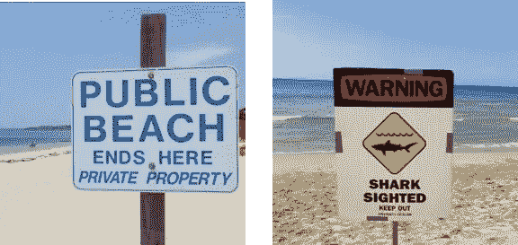
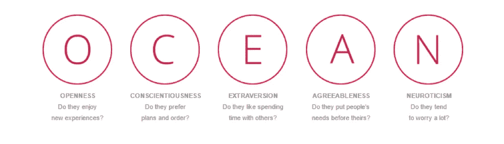
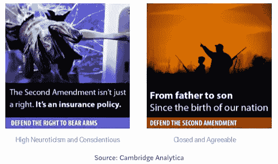

# 剑桥分析公司的脸书广告对 2016 年美国总统大选的影响

> 原文：<https://towardsdatascience.com/effect-of-cambridge-analyticas-facebook-ads-on-the-2016-us-presidential-election-dacb5462155d?source=collection_archive---------8----------------------->

剑桥分析公司(Cambridge Analytica)是一家广告公司，是 SCL 集团的一个分支，成立于 2013 年，但截至 2018 年 5 月 1 日已经停业。该公司有一个政治和商业部门，从他们的网站上看，政治部门“将预测数据分析、行为科学和创新的广告技术结合到一个获奖的方法中。”该公司在共和党初选中为特德·克鲁兹竞选团队工作，并成功帮助他获得第二多的选票，仅次于唐纳德·特朗普。该公司随后在大选中为特朗普竞选团队工作，并帮助他获胜。《剑桥分析》在特德·克鲁兹共和党初选中采用的策略之一是根据脸书用户的个性向其投放有针对性的广告。然而，该公司被迫删除了 2015 年通过脸书获得的所有数据(在川普和希拉里之间的大选之前)，因此最有可能的是，这种策略只被克鲁兹竞选团队使用。这篇文章将阐述前面提到的三种策略(行为科学、数据分析、创新广告技术)在运行微目标脸书广告时是多么的重要。此外，本文将描述广告的成功是如何被媒体、首席执行官 Alexander Nix 以及揭发者和前雇员 Christopher Wylie 限制和夸大的，原因各不相同。

在分析脸书广告的效果之前，重要的是要更详细地了解该公司的动机，以及它为什么成为主流新闻话题。该公司旨在通过向不同的人展示同一问题的不同广告来说服用户以某种方式投票。说服是通过收集脸书页面上用户喜好的信息，并使用这些数据创建预测个性的模型来完成的。亚历山大·科岗领导的全球科学研究机构剑桥分析公司被发现违反了脸书的服务条款，因此脸书要求科岗提供数据的所有公司，包括剑桥分析公司，在 2015 年删除所有脸书的数据。数据删除发生在特朗普和克林顿之间的 2016 年大选开始之前，因此剑桥分析公司声称，他们没有使用 GSR 的任何数据来帮助特朗普的竞选活动。当一名前雇员转变为揭发者克里斯托弗·威利(Christopher Wylie)接近媒体时，关于该公司的新闻曝光了。Wylie 和媒体关注了两个方面。一个方面是剑桥分析公司获取用户脸书数据行为的合法性，第二个方面是脸书广告的有效性及其道德问题。鉴于许多调查仍在进行中，法律影响超出了本文的范围，但将对脸书广告的成功进行评估。

要理解剑桥分析公司的脸书广告策略，你必须理解行为科学、数据分析和创新广告技术是如何结合在一起的。行为科学是指与人类或动物、行为和行动相关的研究领域。剑桥分析公司的最终目标是说服用户投票支持他们的客户，这包括显示最有可能导致行为改变的信息。下面的例子摘自 Alexander Nix 在 Concordia 峰会上的发言，说明了在传达信息时牢记行为科学的重要性。想象你正在沙滩上散步，看到了下面左边的标志。

Image sources: [http://massrealestatelawblog.com/wp-content/uploads/sites/9/2012/07/public-beach-sign.jpg](http://massrealestatelawblog.com/wp-content/uploads/sites/9/2012/07/public-beach-sign.jpg) [https://encryptedtbn0.gstatic.com/images?q=tbn:ANd9GcQUmyDglOdnQ6JC2AqpK6b0veP97Zw5LwScJIdTVZsoX-YyXMoa](https://encryptedtbn0.gstatic.com/images?q=tbn:ANd9GcQUmyDglOdnQ6JC2AqpK6b0veP97Zw5LwScJIdTVZsoX-YyXMoa)

左边的标志可能会让你转身离开，但如果你看到右边的标志，你会有更强烈的冲动这样做。这两个标志的动机都是为了确保你离开该地区，但右边的标志引起了更强烈的共鸣，可能是对所有人来说，因为害怕受到鲨鱼的攻击。在这个例子中，在看到右边的信息后，每个人可能都有最强烈的冲动采取行动离开海滩。然而，在政治领域，根据预先存在的信仰和价值观，不同的人可能更容易被不同的信息所说服，以支持同一个候选人或问题。剑桥分析公司因此假设，如果他们有一个衡量某人个性的标准，他们可以策划一个对他们来说最有说服力的广告。因此，他们将能够通过使用个性化的、有针对性的广告来说服许多具有不同个性的不同人对某一特定问题或候选人持有相同的观点。

为了通过使用行为科学来说服潜在的投票者以某种方式投票，人们需要一些关于广告目标是谁的信息。为了做到这一点，Cambridge Analytica 首先必须找到一种方法来获取数百万用户的原始数据。然后他们必须利用这些数据来预测用户的个性。这就是数据分析——从原始数据中提取有用信息的科学——的用武之地。《剑桥分析》求助于心理学家、剑桥大学研究员亚历山大·科岗。克里斯多佛·怀利当时是该公司的一名员工，负责处理与科岗的关系，科岗成立了一家名为全球科学研究(GSR)的公司。然后，科岗创建了一项调查，询问受访者的个性，并使用第三方在线调查供应商 Qualtrics 通过向每个人支付几美元来招募参与者。该调查要求受访者同意访问他们的脸书数据，包括他们喜欢的页面。

至关重要的是，科岗还可以访问受访者朋友的页面赞，因为这是脸书为开发者提供的一项功能。科岗在向英国议会“数字、文化、媒体和体育委员会”提交的证词中提到，从 2006 年到 2015 年，脸书 API 的核心功能是，只要用户的朋友没有关闭某些安全设置，你就可以收集他们的数据。没有更改脸书上某些隐私设置的被调查者的朋友，默认情况下也放弃了访问他们的页面赞。大约 270，000 人参加了此次调查，这使得科岗能够访问大约 3，000 万人的数据。这种挖掘数据的方法不是数据泄露，因为用户同意将他们的数据交给 GSR，参加调查的用户的朋友可能已经更改了他们的隐私设置，以确保 GSR 不会提取他们的数据。然而，也许脸书可以更好地向用户传达这种隐私设置的存在。目前，脸书在其服务条款中提到了这一点，这可能是大多数人没有仔细阅读。或许脸书可以在这方面再下功夫，让用户做一个小测验，确保他们在创建账户之前完全理解服务条款的内容。剑桥分析公司然后使用每个用户的脸书数据来预测他或她的个性。他们旨在通过对个人用户的五个关键人格特征进行评分来量化人格:开放性，责任心，外向性，宜人性，神经质，这是指大 5 或海洋人格模型。每个人在每个属性上的得分是通过检查每个用户的脸书页面喜好并根据页面喜好创建个性预测模型来确定的。

剑桥分析网站上提到的最后一个策略是创新广告技术。它指的是该公司旨在接触用户的更个性化的方式，包括脸书广告。Nix 将这种技术描述为向数百万用户显示相同信息的一揽子广告的对立面。他解释了“今天的交流变得越来越有针对性。这个房间里的每一个人都是个性化的。因此，创新广告技术(Nix 称之为 Concordia summit 上的演示，addressable ad tech)依赖于使用行为科学和数据分析后获得的结果，并通过高度个性化的渠道向观众展示，其中之一是脸书广告。

瑞典乌普萨拉大学的应用数学教授大卫·森普特在他的书《寡不敌众》中分析了剑桥分析公司模型的准确性。该公司使用回归模型来预测个性，他将回归模型描述为“利用我们已经掌握的关于一个人的数据，并使用这些数据来预测我们不知道的关于他或她的一些事情的模型。”(Sumpter，第。45).基于用户的个性，不同的广告出现在同一个问题上，希望说服不同的用户相同的信息。下面是亚历山大·尼克斯在协和女神峰会上的演讲中的一个例子。

这两个广告的动机都是为了说服观众支持第二修正案，该修正案允许人们拥有和携带武器的权利。高度新批判主义和责任感的人，倾向于担心很多，更喜欢秩序，所以左边的信息会引起更多的共鸣。封闭和随和的人把别人的需要放在自己的前面，但不喜欢新的体验，所以右边的信息会引起更大的共鸣。Christopher Wylie 认为这越界了，不再是说服，而是操纵。他声称，该公司在“道德灰色地带”运营，“试图通过抓住选民的弱点来操纵他们。”然而，“使用不正当的方法来颠覆公众的选举偏好并不是什么新鲜事，”在美国，这已经成为“选举的重复伴侣”，所以人们不应该对使用所谓的操纵策略感到惊讶。

基于个性的微目标用户的想法似乎比传统的营销方法更微妙，在传统的营销方法中，相同的信息显示给每个人。Sumpter 在他的书《寡不敌众》中分析了剑桥分析公司回归模型的准确性。他使用了由心理学家 Michal Kosinski 和他的同事创建的公开可用的数据集，他们创建了一个包含 2 万名脸书用户的匿名数据库。在 2 万名脸书用户中，19742 名是美国用户，其中 4744 名注册了他们喜欢的政党民主党或共和党，还喜欢了 50 多个脸书页面。Sumpter 首先旨在测试回归模型的准确性，因此创建了一个基于脸书·佩奇喜好预测政党忠诚度的模型。他的结论是，回归模型“对铁杆民主党人和共和党人非常有效”，但“没有揭示出 76%的用户没有把他们的政治忠诚放在脸书身上”。52–53).他还描述了为什么仅仅因为这个模型揭示了，例如，民主党人倾向于喜欢哈利波特，并不一定意味着其他哈利波特迷喜欢民主党人。因此，民主党采用的旨在让哈利波特迷投票的策略，不一定对他们有利。Sumpter 遇到的另一个限制是，“回归模型只有在一个人获得了 50 个以上的‘喜欢’时才有效，要做出可靠的预测，需要几百个‘喜欢’”(sum pter pg。53).他发现，在那个数据集中，只有 18%的用户“喜欢”50 个以上的网站。然而，这个问题似乎仅限于 Sumpter 使用的数据集，因为 2013 年的一项研究显示，美国人均脸书页面赞数为 70，而且这个数字一直在稳步上升。

可以说，剑桥分析公司专门用来预测性格的回归模型的最大局限性是，他发现脸书喜欢的性格预测模型的准确性。Sumpter 使用的数据集包含每个人在海洋人格模型上的得分信息。首先，Sumpter 创建了一个回归模型，根据脸书·佩奇的喜好来确定性格。然后他从数据集中随机选择两个人，根据模型对每个人的神经质水平做出的预测，根据神经质程度对他们进行排名。Sumpter 然后根据数据集中给出的两个个体的实际数据，将此与基于神经质的排名进行比较。他发现模型产生的排名与正确排名的匹配率只有 60%。然后，他在其他四种性格特征上尝试了这种方法，得到了大约 60%非常相似的结果。预测最准确的特征是开放性，但即使如此，预测的准确率也只有 67%。

亚历山大·科岗和亚历山大·尼克斯证实了从人们喜欢的脸书·佩奇来预测他们性格的困难。亚历山大·科岗在英国议会“数字、文化、媒体和体育委员会”的证词中表示，声称回归模型导致准确的结果是“科学上荒谬的”。在他提交给议会的书面证据中，他表示，该算法预测的每个人格特质的分数比随机猜测每个特质的分数更准确。然而，这比仅仅猜测每个人在每个属性上都正好处于中间更不准确，例如，同样内向和外向，同样封闭和开放，等等。此外，该模型只对 1%的人正确预测了所有五种性格特征，但对 6%的人预测错误。

科岗声称，他不知道从他的应用程序中收集的数据会被用来创建这样的回归模型。他认为，有一种更有效的方法来获取数据，在脸书做有针对性的广告。剑桥分析公司利用亚历山大·科岗生成的数据，根据海洋模型来预测人们的性格。因此，剑桥分析公司只能在科岗收集信息的 3000 万人中投放广告。他认为，更好的方法是利用脸书广告平台。脸书广告平台使开发者能够建立类似于人工选择的受众的受众。科岗描述了如何更容易地获得某些人的细节，这些细节准确地代表了特定的人格特征，然后使用脸书的工具来创建一个相似的观众，以达到与原始群体具有相同人格特征的一群人。

首席执行官亚历山大尼克斯自己证实了这些结果。他在给英国议会“数字、文化、媒体和体育委员会”成员的证词中声称。他认为科岗的数据集不是很有用，这只是他们 2016 年美国总统大选整体战略的一小部分。他在 Concordia 峰会上的演讲中，尼克斯公开吹嘘自己有能力运用脸书数据来调整一个对选举产生重大影响的极其强大的工具，我们该如何回应他的这一承认呢？答案来自尼克斯自己的证词，他声称自己过去在向潜在客户推销自己的公司时使用了夸张手法。这一观点得到了科岗的证实，他提到“尼克斯正试图推广(人格算法)，因为他有强大的经济动机来讲述剑桥分析公司如何拥有秘密武器的故事”。54).

尼克斯不是唯一一个夸大该公司对 2016 年大选影响的人。考虑到主流媒体的头条新闻，大多数人可能会相信那些预测脸书·佩奇性格的回归模型，推而广之，剑桥分析公司的模型非常准确。因此，我们如何引起标题的共鸣，如《连线》杂志的“脸书如何比你的朋友更了解你”，《美国消费者新闻与商业频道》和《每日电讯报》的“脸书比你的家庭成员更了解你”，以及《纽约时报》的“脸书比任何人都了解你”？所有这些文章都引用了同一个研究，由吴友友、米哈尔·科辛斯基和大卫·斯蒂尔韦尔进行，题为“基于计算机的人格判断比人做出的判断更准确”克里斯托弗·威利(Christopher Wylie)在向英国议会“数字、文化、媒体和体育委员会”作证之前提交的书面证据中也引用了同样的研究，并表示这是该公司方法成功的证据。这项研究首先让参与者参加一个有 100 个问题的测试，以确定他们在海洋人格模型上的分数。然后，该研究将使用每个人的脸书页面喜好创建的回归模型的预测能力与个人的朋友、亲戚、同事和配偶的预测能力进行了比较。他们通过让这些人回答一份有十个问题的问卷来衡量其他人的预测能力。他们发现回归模型与 100 项测试的相关性比其他人在 10 项问卷中的答案更好。然而，研究人员自己也承认，“我们的研究是有限的，因为人类法官只能使用一份关于五大特征的 10 项长的问卷来描述参与者。实际上，他们掌握的知识可能比问卷中评估的要多。”(悠悠)

因此，这些文章得出的结论，如美国消费者新闻与商业频道一篇文章的第一行“大学研究人员发现，通过使用你的脸书“喜好”来判断你的性格，计算机可以比你最亲密的朋友家人更好地确定你的性格”，与现实相比，是远远夸大的。布莱恩·康纳利(Brian Connelly)研究工作场所的个性，他也是多伦多大学管理系的副教授，斯卡伯勒声称，尽管引用的研究论文“有趣且具有挑衅性”，但“媒体正在耸人听闻地报道这些发现”(Sumpter。Pg。55).他说，反映这项研究结论的准确新闻标题应该是“初步调查结果表明，脸书和你的一个密友一样了解你(但我们坚持要看看脸书是否能预测你的行为)”。55).

然而，在克里斯托弗·威利(Christopher Wylie)的推动下，媒体声称剑桥分析公司的微观目标对帮助特朗普当选产生了巨大影响。在克里斯托弗·威利(Christopher Wylie)提交给英国议会“数字、文化、媒体和体育委员会”(Digital，Culture，Media and Sport committee)的书面证据中，他引用了一系列研究作为证据，“强调了使用社交媒体、自然语言或互联网点击流数据进行心理分析或大众说服的功效。”然而，在这些研究中，只有少数几个涉及到预测脸书喜欢的人的性格。在这些人当中，没有一个人得出结论说这样的模型会“打破脸书”，或者它们如此强大，以至于应该被称为“心理战工具”，正如 Wylie(《卫报》)所描述的那样。此外，Wylie 还声称，他成为告密者的原因之一是因为公司的脸书战略帮助 Trump 赢得了选举。他声称“唐纳德·特朗普让你意识到这有更广泛的影响”(《卫报》)，但没有提到脸书的数据在大选前被该公司删除了。

媒体夸张的一个突出例子是 2018 年 3 月 21 日特雷弗·诺亚在“每日秀”上的一个片段。诺亚认为剑桥分析公司的模型非常准确，并播放了一系列片段来支持这种说法。第一个片段来自 CNN 的一个故事，主持人说“根据你在脸书的喜好，可以预测你的水平高于你妻子对你的评价，也高于你父母或朋友对你的评价。”第二封信来自 Christopher Wylie，他表示，该公司“将试图找出我们认为你存在的任何精神弱点或脆弱性，并试图扭曲你对周围现实的感知。”诺亚随后暗示，特朗普竞选团队使用了这些数据，并表示剑桥分析公司(Cambridge Analytica)的运营水平高于传统广告，并播放了一段视频，视频中称“唐纳德·特朗普(Donald Trump)总统竞选团队雇佣的数据公司利用从数千万不知情的脸书用户那里秘密获取的信息，直接瞄准潜在的美国选民”，“整个行动围绕着欺骗、虚假的基层支持和一种似乎接近电子洗脑的战略”。诺亚没有展示这些片段的完整背景，只是展示了一些小片段，此外，剑桥分析公司删除了，或者至少声称删除了所有脸书的数据，并且根本没有使用这些数据来帮助川普，这一点根本没有提到。所有剪辑中的说法都是夸张的，并且没有提供这些说法背后的科学依据。

鉴于有证据表明该公司的回归模型不像声称的那样准确，有必要研究一下这种夸张背后的一些潜在原因。简单和耸人听闻的故事和标题可能会获得更好的收视率，因为这类文章过于简单，点击诱饵的性质。此外，关于唐纳德·特朗普从剑桥分析公司的脸书广告中获益的说法也是不准确的，因为该公司很可能在特朗普和希拉里之间的大选开始之前就删除了脸书的数据。然而，与更平衡的故事相比，批评特朗普的两极分化的故事可能会获得更高的收视率。此外，Wylie 离开公司时并不友好。他创建了一家名为 Eunoia Technologies 的竞争公司，该公司主要从事微定位和心理建模，就像剑桥分析公司一样。他也收到了《全球科学研究》的数据，随后被要求删除。然后，他“未能成功地向一个亲英国退出欧盟的派别推销他的服务，但确实从一个加拿大立法实体获得了一份 10 万美元的合同”(Freeze)，并“向共和党政治活动家科里·莱万多夫斯基(Corey Lewandowski)推销了可以代表唐纳德·特朗普(Donald Trump)2016 年总统竞选活动部署的微瞄准工具”(Mac)。因此，他有动机质疑剑桥分析公司的道德，并为公司创造负面宣传，这可能解释了他在描述公司努力的影响时的夸张。

剑桥分析公司(Cambridge Analytica)经营的脸书广告对 2016 年美国总统大选的影响被首席执行官 Alexander Nix、媒体和 Christopher Wylie 夸大了。回归模型还不太准确，脸书的微目标广告策略可能没有用于川普的竞选。虽然剑桥分析公司(Cambridge Analytica)在脸书投放的广告可能对 2016 年美国大选没有太大影响，但这只是社交媒体微定向广告领域的开始。脸书每月有 23 亿活跃用户，每天有 15 亿活跃用户，脸书是一个独一无二的工具。事实上，你的朋友可以通过一个小测验提取你在脸书的数据，这可能会让很多人感到惊讶。因此，随着世界各地脸书用户数量的持续增长，脸书负有向用户明确传达隐私选项的重要责任。这仅仅是使用微定位脸书广告的开始，如果你在选举前看到脸书的政治广告引起你强烈的共鸣，不要感到惊讶。

**作品被引用**

伯格尔哈尔。"恶意国内:剑桥分析反乌托邦."*计算机*，2018 年第 51 卷第 5 期，第 84–89 页。，doi:10.1109/mc.2018.2381135。

戴维斯，哈利。"特德·克鲁兹利用公司收集了数百万不知情的脸书用户的数据."*《卫报》*，《卫报新闻与媒体》，2015 年 12 月 11 日，[www . The Guardian . com/us-News/2015/dec/11/senator-ted-Cruz-president-campaign-Facebook-user-data](http://www.theguardian.com/us-news/2015/dec/11/senator-ted-cruz-president-campaign-facebook-user-data)

别动，科林。"克里斯托弗·威利(Christopher Wylie)策划的商业计划揭示了举报人对大数据的野心和焦虑."*《环球邮报》*《环球邮报》2018 年 5 月 5 日[www . The Globe and Mail . com/politics/article-business-plan-hatched-by-Christopher-wylie-sheds-light-on-whistle/。](http://www.theglobeandmail.com/politics/article-business-plan-hatched-by-christopher-wylie-sheds-light-on-whistle/.)

肯尼迪，梅里特。"“他们不在乎”:举报者称剑桥分析公司旨在破坏民主." *NPR* ，NPR，2018 年 3 月 27 日，[www . NPR . org/sections/the two-way/2018/03/27/597279596/they-don-t-care-believer-says-Cambridge-analytic a-seeks-underb-democr。](http://www.npr.org/sections/thetwo-way/2018/03/27/597279596/they-don-t-care-whistleblower-says-cambridge-analytica-seeks-to-undermine-democr.)

拉夫迪贾斯汀。"普通脸书用户喜欢多少页面？" *— Adweek* ，Adweek，2013 年 4 月 11 日，[www . Adweek . com/digital/how-number-pages-do-the-average-Facebook-user-like/。](http://www.adweek.com/digital/how-many-pages-does-the-average-facebook-user-like/.)

麦克莱恩。"剑桥分析公司的告密者希望他的新公司与特朗普竞选团队的经理合作." *BuzzFeed News* ，BuzzFeed News，2018 年 3 月 28 日，[www . BuzzFeed News . com/article/Ryan MAC/Cambridge-analytic a-Chris-wylie-eunoia-trump-campaign。](http://www.buzzfeednews.com/article/ryanmac/cambridge-analytica-chris-wylie-eunoia-trump-campaign.)

麦克考斯兰、菲尔和安娜·谢克特。"与川普有关的顾问从脸书数百万人那里收集数据."*NBCNews.com*，NBC 环球新闻集团，2018 年 3 月 17 日，[www . NBC News . com/News/us-News/Cambridge-analytic a-harved-data-millions-unscened-Facebook-users-n 857591。](http://www.nbcnews.com/news/us-news/cambridge-analytica-harvested-data-millions-unsuspecting-facebook-users-n857591.)

新闻，4 频道。"前剑桥分析公司首席执行官亚历山大尼克斯面临国会议员(完整版)." *YouTube* ，YouTube，2018 年 6 月 6 日，www.youtube.com/watch?v=weQ9E6e3aJo[t = 5747s](http://www.youtube.com/watch?v=weQ9E6e3aJo&t=5747s)。

新闻卫报。"剑桥分析报告密者克里斯托弗·威利出现在国会议员面前——观看直播."YouTube ，YouTube，2018 年 3 月 27 日，[www.youtube.com/watch?v=X5g6IJm7YJQ&t = 4872s。](http://www.youtube.com/watch?v=X5g6IJm7YJQ&t=4872s.)

尼克斯，亚历山大。 *YouTube* ，协和女神，2016 年 9 月 27 日，[www.youtube.com/watch?v=n8Dd5aVXLCc](http://www.youtube.com/watch?v=n8Dd5aVXLCc)。

史密斯，戴夫。"微型杀伤性武器:我们的“喜欢”如何劫持民主."*走向数据科学*，走向数据科学 2018 年 10 月 17 日，[走向 sdata Science . com/weapons-of-micro-destruction-how-our-like-劫持-民主-c9ab6fcd3d02](/weapons-of-micro-destruction-how-our-likes-hijacked-democracy-c9ab6fcd3d02) 。

寡不敌众:从脸书和谷歌到假新闻和过滤泡沫——控制我们生活的算法。布鲁姆斯伯里适马，2018。第五章

特雷弗·诺亚每日秀。"电子洗脑:剑桥分析公司阴险的脸书战略|每日秀." *YouTube* ，YouTube，2018 年 3 月 21 日，[www.youtube.com/watch?v=t7epj5tK54M](http://www.youtube.com/watch?v=t7epj5tK54M)。

基于计算机的性格判断比人类做出的更准确。2015 年 1 月 27 日，美国国家科学院，[www.pnas.org/content/112/4/1036?， *PNAS* sid = fef de0 d 1-d260-40e 6-84d 3-a 1992208031 a。](http://www.pnas.org/content/112/4/1036?sid=fefde0d1-d260-40e6-84d3-a1992208031a.)

英国，RT。“现场:剑桥分析研究员亚历山大科岗向国会议员作证。” *YouTube* ，YouTube，2018 年 4 月 24 日，[www.youtube.com/watch?v=hpzc26bzp1M&t = 5106s](http://www.youtube.com/watch?v=hpzc26bzp1M&t=5106s)。