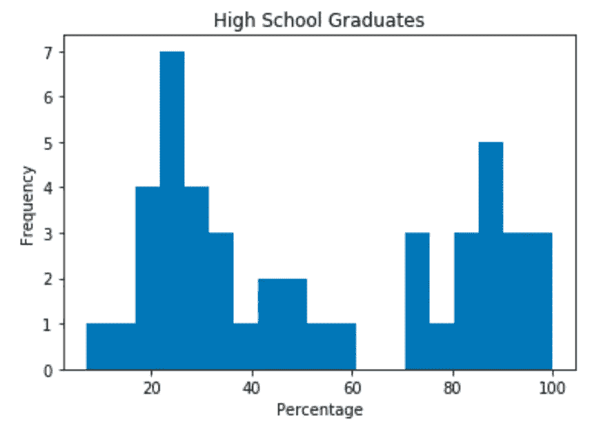

# 其他人的有效数据可视化

> 原文：<https://towardsdatascience.com/effective-data-visualization-for-other-humans-695e54a5dc71?source=collection_archive---------9----------------------->


Credit: [Markus Spiske](https://unsplash.com/@markusspiske) — Unsplash

> TL；灾难恢复—执行不当的数据可视化可能会向您的受众传达误导和潜在有害的信息。我们有责任维护我们传达给受众的信息中数据的完整性。

我们都知道数据的驱动力。它为组织制定明智的决策和影响结果提供了见解。目标很简单。开发解决方案，以技术和非技术受众都能有效利用的方式组织和呈现数据。今天，我们将讨论数据可视化的一些基础知识，以便有效地交流从数据中获得的见解，从而有效地吸引观众。

像任何科学一样，在您的方法中定义一致的方法将有助于简化您的过程，以利用数据可视化来最大化其有效性。想象一下，一篇长长的研究论文打印在一个内容结构复杂的无格式文档上。读者不会从这种格式的论文中获得多少教育价值。

# 规范化可视化数据的方法


Credit: [Olia Gozha](https://unsplash.com/@olia) — Unsplash

让我们从基础开始。

你想了解的任何东西都可以分解成可观察到的片段。这种科学形式在数据科学和统计学中很常见。简而言之，我们正在探索收集、发现和分析关于我们想要研究和观察的事物的大量信息的实践。

作为人类，传输到我们大脑的大部分信息都是视觉的。因为我们处理图像的速度比处理文本的速度快得多，所以利用数据可视化可以优化我们从数据中获得的价值。

[](https://medium.com/@kennelliott/39-studies-about-human-perception-in-30-minutes-4728f9e31a73) [## 30 分钟内 39 项关于人类感知的研究

### 这些是我 2016 年 4 月在 OpenVis 上的演讲笔记。最初这个演讲应该叫做…

medium.com](https://medium.com/@kennelliott/39-studies-about-human-perception-in-30-minutes-4728f9e31a73) 

为了从我们的数据中有效地呈现洞察力，挑战的一部分是决定哪种可视化技术将为最终用户提供最大的价值。系统地，我们可以对数据进行分类，并实例化一种标准化的方法。

我们将使用一个简单的例子，收集 1950 年美国 45 个职业的声望和特征的样本数据。这些数据可以从 Python3 的 datasets 包中的 *Rdatasets 项目*中公开获得。

```
import statsmodels.api as smdf = sm.datasets.get_rdataset('Duncan', package='carData').data
df
```

以下是返回的结果数据集:

```
 **[type]  [income]  [education]  [prestige]**
accountant          prof      62         86        82
pilot               prof      72         76        83
architect           prof      75         92        90
author              prof      55         90        76
chemist             prof      64         86        90
minister            prof      21         84        87
professor           prof      64         93        93
dentist             prof      80        100        90
reporter              wc      67         87        52
engineer            prof      72         86        88
undertaker          prof      42         74        57
lawyer              prof      76         98        89
physician           prof      76         97        97
welfare.worker      prof      41         84        59
teacher             prof      48         91        73
conductor             wc      76         34        38
contractor          prof      53         45        76
factory.owner       prof      60         56        81
store.manager       prof      42         44        45
banker              prof      78         82        92
bookkeeper            wc      29         72        39
mail.carrier          wc      48         55        34
insurance.agent       wc      55         71        41
store.clerk           wc      29         50        16
carpenter             bc      21         23        33
electrician           bc      47         39        53
RR.engineer           bc      81         28        67
machinist             bc      36         32        57
auto.repairman        bc      22         22        26
plumber               bc      44         25        29
gas.stn.attendant     bc      15         29        10
coal.miner            bc       7          7        15
streetcar.motorman    bc      42         26        19
taxi.driver           bc       9         19        10
truck.driver          bc      21         15        13
machine.operator      bc      21         20        24
barber                bc      16         26        20
bartender             bc      16         28         7
shoe.shiner           bc       9         17         3
cook                  bc      14         22        16
soda.clerk            bc      12         30         6
watchman              bc      17         25        11
janitor               bc       7         20         8
policeman             bc      34         47        41
waiter                bc       8         32        10
```

回顾此处可用的数据类型，我们有一组 45 个职业观察值*(行)*，包含以下特征:

*   **职业**:所担任角色的标识。
*   **类型**:具有以下级别的因子:教授、*专业和管理*；wc，*白领*；bc，*蓝领*。
*   **收入**:1950 年美国人口普查中年收入 3500 美元或以上(2017 年美元约合 36000 美元)的职业在职者的百分比。
*   教育:1950 年高中毕业生占在职人员的百分比(如果我们愤世嫉俗的话，我们会说这在 2017 年大致相当于博士学位)
*   **声望**:在一项社会调查中，认为该职业声望“好”或更好的受访者的百分比

> 理解这一切。

如果您是一名开发人员，并被要求使用上述数据的图形或图表来提供见解，这个简单的请求可能是一项令人生畏的任务。您希望在数据集中向最终用户传达什么？这张表格对声望和职业之间的关系提供了什么样的见解？

我们可以缩小我们的关注点，通过将我们的集合解构为更小的片段，使用数据可视化来帮助我们理解数据的复杂性。

# 选择正确的视觉很重要


Credit: [Harry Quan](https://unsplash.com/@mango_quan) — Unsplash

不管图表内容的准确性如何，选择错误的图表可能会向您的受众传达误导和潜在有害的信息。我们有责任维护我们发送的信息的完整性。此外，使用错误的视觉效果会错误地分类原本准确的信息。我们可以通过在正确的数据可视化下对数据进行分类来最小化这些错误。

**用于比较数值的条形图**

比较不同类别数量的一个实用方法是使用*条形图*。在我们的数据集中，我们可以在职业集合中比较职业类型的数量。


The x-axis represents the different categories, and the y-axis indicates the unit of measurement.

条形图易于解释，并允许最终用户快速比较不同*离散*类别数据的数量或频率。离散数据指的是我们计数的东西，而不是测量的东西。比如我们有六个 *wc* 职业类型。我们没有 6.3333 *wc* 职业类型。

下面是 Python3 中用于生成条形图的代码。

```
from matplotlib import pyplot as plttypeCounts = df['type'].value_counts()
typeCounts.plot(kind='bar', title='Type Counts')plt.xlabel('Type')
plt.ylabel('Number of Occupation Type')
plt.show()
```

## 用于可视化连续数据分布的直方图

*连续*数据是指沿标尺的测量值。与*离散*数据相反，C *连续*数据，或者说定量数据，是由测量的*T21【而不是我们统计的*数值来表示的。对于我们的数据集，记录了收入、教育和声望的百分比值，以量化数据样本中某个类别的度量。**

使用直方图，我们可以有效地向我们的观众展示哪个百分比组的高中毕业率最高。使用直方图，我们可以有效地显示我们的连续数据集的分布或形状。



Our distribution of high school graduates shows more occupations were more common in the lower percentage groups of students who graduated from high school.

下面是 Python3 中用于生成直方图的代码。

```
from matplotlib import pyplot as pltdf['education'].plot.hist(title='High School Graduates', bins=19)
plt.xlabel('Percentage')
plt.ylabel('Frequency')
plt.show()
```

## 用于比较相对数量的饼图

当您试图比较整体的各个部分时，饼图会很有用。与条形图相比，饼图可用于定义特定类别的完整上下文的可视化表示。我们可以通过将这些值分类来比较相对数量。有效使用时，饼图可以有效地显示整个数据集的比例。

从条形图中比较职业类型之间的频率，我们可以使用饼图生成更有效的比例可视化。


In comparison to the bar chart, proportions are easier to identify in a pie chart

## 用于比较定量值的散点图

我们可以把定量数据归类为你可以归类的东西。换句话说，这是包含独特性质的信息，您可以识别数据集并将其分类为可见的部分。

当您想要可视化和探索数字特征之间的*关系时，散点图是引人注目的。此外，散点图有助于识别属于*异常值*的数据点，即明显超出观察数据集范围的值。让我们通过可视化声望与收入水平的对比来看看职业数据。*


Notice the top left and bottom right are mostly empty. Higher income generated higher prestige evaluated, and low-income occupations made less prestige.

通过这种方法，您可以使用散点图有效地演示两个变量是如何相关的。你可以充分地想象一种关系的程度，并向观众突出一个变量如何影响另一个变量。

下面是生成散点图的相应代码:

```
from matplotlib import pyplot as pltoccupations = df[['prestige', 'income']]
occupations.plot(kind='scatter', 
                     title='Occupations', x='prestige', y='income')plt.xlabel('Prestige')
plt.ylabel('Avg Income %')
plt.show()
```

## 数值变化的折线图

我们经常想在一段时间内评估我们的数据集。*折线图*是一种非常有用的可视化技术，可以显示数值如何随着一个系列而变化。

对于这个例子，我们将从数据集包的 *Longley 数据集*中分析 1947-1962 年间的美国宏观经济变量。

```
import statsmodels.api as smdf = sm.datasets.longley.load_pandas().data
df **[TOTEMP]  [GNPDEFL] [GNP]   [UNEMP]  [ARMED]  [POP]    [YEAR]**
0   60323.0     83.0  234289.0  2356.0  1590.0  107608.0  1947.0
1   61122.0     88.5  259426.0  2325.0  1456.0  108632.0  1948.0
2   60171.0     88.2  258054.0  3682.0  1616.0  109773.0  1949.0
3   61187.0     89.5  284599.0  3351.0  1650.0  110929.0  1950.0
4   63221.0     96.2  328975.0  2099.0  3099.0  112075.0  1951.0
5   63639.0     98.1  346999.0  1932.0  3594.0  113270.0  1952.0
6   64989.0     99.0  365385.0  1870.0  3547.0  115094.0  1953.0
7   63761.0    100.0  363112.0  3578.0  3350.0  116219.0  1954.0
8   66019.0    101.2  397469.0  2904.0  3048.0  117388.0  1955.0
9   67857.0    104.6  419180.0  2822.0  2857.0  118734.0  1956.0
10  68169.0    108.4  442769.0  2936.0  2798.0  120445.0  1957.0
11  66513.0    110.8  444546.0  4681.0  2637.0  121950.0  1958.0
12  68655.0    112.6  482704.0  3813.0  2552.0  123366.0  1959.0
13  69564.0    114.2  502601.0  3931.0  2514.0  125368.0  1960.0
14  69331.0    115.7  518173.0  4806.0  2572.0  127852.0  1961.0
15  70551.0    116.9  554894.0  4007.0  2827.0  130081.0  1962.0
```

回顾此处可用的数据类型，我们有一组 16 个观察值，包含以下六个特征:

*   **总就业人数**:总就业人数
*   GNPDEFL : GNP 缩减指数
*   **GNP** : GNP *(国民生产总值)*
*   失业人数
*   **武装**:武装力量的规模
*   **POP** :人口
*   **年**:年(1947-1962)

让我们为样本数据创建人口变化的可视化。通过这种方法，您可以快速向受众传达数据中的趋势或模式。


From this chart, we can see the population sizes increase from year to year and shows an increasing trend.

下面是生成折线图的相应代码:

```
df.plot(title='Population', x='YEAR', y='POP')plt.xlabel('Year')
plt.ylabel('Population')
plt.show()
```

## 用于可视化分布的箱线图

也称为*盒须图，您可以将这种方法用于只有一个变量的数据集。这个数据称为*单变量*数据。*

让我们以纯文本和箱线图的形式来看看 Longley 数据集中的失业数据集。


Transforming patternless text into a perceptible visual form.

```
**[Unemployment]**
0         2356.0
1         2325.0
2         3682.0
3         3351.0
4         2099.0
5         1932.0
6         1870.0
7         3578.0
8         2904.0
9         2822.0
10        2936.0
11        4681.0
12        3813.0
13        3931.0
14        4806.0
15        4007.0
```

箱线图跨四分位数分布数据，并显示第 25 和第 75 百分位之间的数据。在图的方框内，我们可以看到第 50 个百分位数值内的数据范围，以及绿线中显示的*中值和*。

以下是箱线图的相应代码:

```
import pandas as pd
import statsmodels.api as sm
from matplotlib import pyplot as pltdff = sm.datasets.longley.load_pandas().data
df = pd.DataFrame({'Unemployment': dff['UNEMP']})
print(df) # tableplt.figure()
df['Unemployment'].plot(kind='box',title='Unemployment')
```

# 比较和缩放您的视觉效果

为了从数据中获得最大价值，您需要通过比较数据之间的关系来最大限度地发挥信息的价值。让我们利用到目前为止我们探索的一些技术来优化我们的数据可视化的有效性。

## 比较变量分布

如果我们用箱线图来比较两个或更多变量的分布会怎么样？拥有多个变量被称为*双变量* (2)变量或*多变量* (2+)变量。

让我们比较一下样本中失业、总就业和 GNP 数据的分布。

```
 **[Unempl..]  [Total Emp]   [GNP]**
0         2356.0      60323.0    234289.0
1         2325.0      61122.0    259426.0
2         3682.0      60171.0    258054.0
3         3351.0      61187.0    284599.0
4         2099.0      63221.0    328975.0
5         1932.0      63639.0    346999.0
6         1870.0      64989.0    365385.0
7         3578.0      63761.0    363112.0
8         2904.0      66019.0    397469.0
9         2822.0      67857.0    419180.0
10        2936.0      68169.0    442769.0
11        4681.0      66513.0    444546.0
12        3813.0      68655.0    482704.0
13        3931.0      69564.0    502601.0
14        4806.0      69331.0    518173.0
15        4007.0      70551.0    554894.0
```

让我们从一个常见的**问题**开始。以下是相应的箱线图。注意到我们的方框图中有什么可能误导人的地方了吗？


No good! This data is not scaled correctly, giving misleading results.

这个情节告诉你什么？我也不确定。这张图不好，因为我们的数据不成比例。

让我们看看下图中的缩放版本。


Scaled proportionally

当比较数据时，观察中的变量必须具有相同的度量和尺度。确保按比例缩放数据。这个数据不是特别有用，但它是为了在相同的尺度上演示数据。

以下是多元盒图的相应代码:

```
import pandas as pd
from matplotlib import pyplot as plt
import pandas as pd
dff = sm.datasets.longley.load_pandas().datadf = pd.DataFrame({'Unemployment': dff['UNEMP'],
                  'Total Emp': dff['TOTEMP'],
                  'GNP': dff['GNP']})scaler = MinMaxScaler()
df[['Unemployment', 'Total Emp', 'GNP']] = scaler.fit_transform(df[['Unemployment', 'Total Emp', 'GNP']])df.plot(kind='box', title='Distribution', figsize = (10,8))
plt.show()
```

## 有效地突出一种趋势

有时对于数据集，您会希望通过数据可视化来强调特定的趋势。之前，我们讨论了如何散点图你的数据。对于许多数据点，使用*趋势线*是一种有效的技术，可以使数据中的趋势变得清晰。

在这里，我们将构建一个散点图，以及我们时间段内总就业人数的趋势线。


***趋势线***

在这里，我们让最终用户清楚地看到，总就业人数和我们的时间段之间存在一个共线性。共线性关系是一种变量，它的值随着另一个变量的增加而减少。

以下是相应散点图和趋势线的代码:

```
dff = sm.datasets.longley.load_pandas().datadf = pd.DataFrame({'Year': dff['YEAR'],
                  'Total Emp': dff['TOTEMP']})df.plot(kind='scatter', title='Total Emp vs. Year', x='Year', y='Total Emp')plt.plot(np.unique(df['Year']), 
         np.poly1d(np.polyfit(df['Year'], 
                              df['Total Emp'], 
                              1))(np.unique(df['Year'])),  
         color='orange')plt.show()
```

# 结论


Credit: F[rank Mckenna](https://unsplash.com/@frankiefoto) — Unsplash

我们不断创新解决方案，以简化我们数据中的复杂性，并揭示以其他方式无法观察到的模式。为了有效地管理数据，我们探索了将数据解构为人脑可以有效消化的可管理片段的方法。

对于软件开发人员、分析师、产品经理和研究人员来说，我们如何将我们的发现传达给受众，这最终会推动我们为更大的整体所做工作的价值。

谢谢你。

如果你希望更深入地研究数学和数据可视化，我推荐你参加微软的 EdX DAT256:机器学习的基本数学。

# 参考

 [## Longley 数据集—stats models v 0 . 10 . 0 RC2+14 . gceea 76 ce 6 文档

### 朗利数据集包含各种美国宏观经济变量，这些变量被认为是高度共线的。它已经被使用…

www.statsmodels.org](http://www.statsmodels.org/dev/datasets/generated/longley.html)  [## CLPS 1091 S01:研究方法和设计

### 我们都健忘。我相信我们都有过这样的时刻，当我们走进一个房间，却忘了我们为什么去那里…

blogs.brown.edu](https://blogs.brown.edu/clps-1091-s01-spring-2017/2017/05/02/humans-visual-creatures/)  [## 数据集包—stats models v 0 . 10 . 0 RC2+8 . g 551671 aa 1 文档

### Rdatasets 项目提供了对 R 的核心数据集包中可用的数据集和许多其他常见 R…

www.statsmodels.org](https://www.statsmodels.org/dev/datasets/index.html) [](https://courses.edx.org/courses/course-v1:Microsoft+DAT256x+1T2018/course/) [## 课程| DAT256x —模块 04 | edX

### 机器学习的基本数学](https://courses.edx.org/courses/course-v1:Microsoft+DAT256x+1T2018/course/) [](https://blog.hubspot.com/marketing/great-visualization-examples) [## 伟大的数据可视化看起来像什么:12 个复杂的概念变得简单

### 也许今天是艰难的一天。也许你醒晚了。你错过了你的锻炼，然后你的公共汽车，然后关闭电梯…

blog.hubspot.com](https://blog.hubspot.com/marketing/great-visualization-examples) [](https://statistics.laerd.com/statistical-guides/understanding-histograms.php) [## 直方图—了解直方图的属性、它们显示的内容以及何时和如何使用…

### 直方图-了解直方图的属性，它们显示的内容，以及何时和如何使用它们

statistics.laerd.com](https://statistics.laerd.com/statistical-guides/understanding-histograms.php) [](https://chartio.com/learn/dashboards-and-charts/what-is-a-scatter-plot/) [## 什么是散点图以及何时使用它

### 散点图是强大的数据可视化工具，可以传达大量信息。本教程将解释…

chartio.com](https://chartio.com/learn/dashboards-and-charts/what-is-a-scatter-plot/)