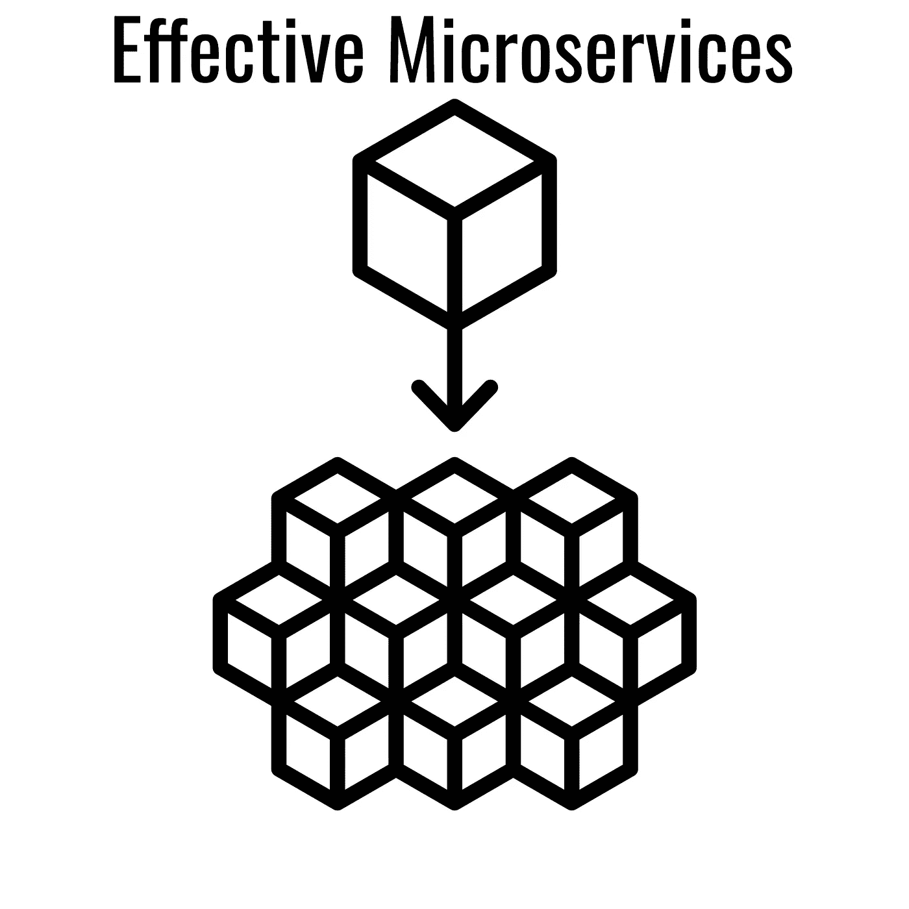

# 有效的微服务:10 个最佳实践

> 原文：<https://towardsdatascience.com/effective-microservices-10-best-practices-c6e4ba0c6ee2?source=collection_archive---------0----------------------->

## 权威指南

## 正确实施微服务架构的 10 个技巧

Effective Microservices: 10 Best Practices

在之前的一篇文章中: [**微服务架构:简要概述以及为什么你应该在你的下一个项目中使用它**](/microservice-architecture-a-brief-overview-and-why-you-should-use-it-in-your-next-project-a17b6e19adfd) **，**我已经详细讨论了微服务架构以及在现代软件开发中使用它的优点/缺点。那么，微服务架构到底是什么？以下是我的定义:

> **微服务架构是关于将软件系统分解成可独立部署的 autonomus 模块，这些模块通过轻量级、语言不可知的方式进行通信，它们共同实现业务目标*。***

软件系统是复杂的。由于人脑只能处理一定限度的复杂性，大型软件系统的高复杂性导致了许多问题。大型复杂的软件系统很难开发、增强、维护、现代化和扩展。多年来，有许多尝试来解决软件系统的复杂性。70 年代期间，*的模块化软件开发被[***的戴维·帕纳斯***](https://www.computer.org/profiles/david-parnas)**和**[***埃德格·w·迪杰斯特拉***](https://history.computer.org/pioneers/dijkstra.html)*引进来应对复杂情况 20 世纪 90 年代， ***分层软件架构*** 被引入，以应对商业应用的复杂性。自本世纪初 ***、面向服务的架构*** 脱颖而出，开发复杂的业务应用。 ***微服务架构*** 是处理现代软件应用复杂性的最新方法论。一个问题可能会出现:为什么我们突然需要一种新的软件开发方法？简而言之，在过去的十年里，与软件开发相关的整个生态系统发生了显著的变化。如今，软件使用敏捷方法开发，使用 CI/CD 部署在 Container+Cloud 上，保存在 NoSQL 数据库上，在现代浏览器或智能手机上呈现，机器通过高速网络连接。由于这些因素，微服务架构在 2012 年诞生。****

# **微服务或整体:**

**主要有两组人对微服务和整体服务持相反的观点。对于一个团体来说，微服务架构完全是关于**货物崇拜**或**炒作驱动的开发**，这只是技术上瘾的开发人员的游乐场。对于另一群人来说，微服务架构是“**统治一切的架构**”，它可以消除任何软件系统的复杂性。在我看来，微服务和整体架构是相辅相成的。对于从长远来看是精益的应用程序，整体架构是正确的方法。另一方面，对于大型复杂或有可能变得大型复杂的应用，微服务架构是正确的解决方案。现代软件开发如此庞大，以至于微服务架构和整体架构将以 SQL 和 NoSQL 共存的方式共存。**

# **最佳实践:**

****

**以正确的方式设计微服务架构是非常具有挑战性和困难的。与为所有人提供一个解决方案的整体架构相反，微服务架构为不同的问题提供不同的解决方案。如果选择了错误的解决方案，那么微服务架构只是一个定时炸弹，注定要爆炸。设计糟糕的微服务架构比一整块还糟糕。为微服务架构定义一套最佳实践也很有挑战性。我曾经在一些会议上看到一些著名的受人尊敬的软件工程师提出了微服务架构的最佳实践，但这是适得其反的。**

**在这里，我提出了一些最佳实践，这些实践将有助于开发有效的微服务应用程序，其中目标项目应该存在 6 个月以上，团队规模为中型到大型(6 个以上的开发人员)。完全公开，还有一些关于微服务架构最佳实践的其他帖子，例如 [**微服务架构的特征**](https://martinfowler.com/articles/microservices.html#SynchronousCallsConsideredHarmful)**by**[***马丁福勒***](https://martinfowler.com/) 或 [**微服务模式**](https://microservices.io/patterns/microservices.html) by [***克里斯理查森***](https://www.chrisrichardson.net/) 或采用 [**微也有一些很棒的演讲，例如**](https://microservices.io/patterns/microservices.html) **[**微服务模式和反模式*****斯蒂芬·蒂尔科夫***](https://www.youtube.com/watch?v=RsyOkifmamI)[**大卫·施米茨**](https://www.youtube.com/watch?v=X0tjziAQfNQ)[**微服务原则*****萨姆·纽曼*微服务失败的 10 个技巧****](https://www.youtube.com/watch?v=PFQnNFe27kU) 此外，我还整理了一些书籍，这些书籍对于设计微服务至关重要，包括:********

*** [## 5 本最佳微服务书籍

### 以正确的方式设计微服务架构的必备书籍

towardsdatascience.com](/5-best-microservices-book-db981ef9c433) 

**1。领域驱动设计:**开发微服务的最大挑战是将一个大型复杂的应用程序分割成小的、自治的、可独立部署的模块。如果微服务没有以正确的方式划分，那么将会有紧密耦合的微服务，它们将具有整体式服务的所有缺点和微服务的所有复杂性，也称为**分布式整体式服务**。幸运的是，在这方面已经有一个非常有用的解决方案。[***Eric Evans***](https://twitter.com/ericevans0?lang=en)【当时的软件工程顾问，在不同公司的商业应用中遇到了反复出现的关于软件复杂性的问题，并在 2004 年出版的《 [**领域驱动设计:解决软件核心的复杂性**](http://dddcommunity.org/book/evans_2003/) 》一书中总结了他的宝贵见解。该书概述了三个核心概念:

*   软件开发团队应该与业务部门或领域专家紧密合作。
*   架构师/开发人员和领域专家应该首先进行战略设计:找到有界的上下文和相关的核心领域和无处不在的语言、子域、上下文图。
*   然后，架构师/开发人员应该进行战术设计，将核心域分解成细粒度的构建块:实体、值对象、聚合、聚合根

关于领域驱动设计的详细讨论超出了本文的范围，但是你应该阅读 DDD 的原著 [**领域驱动设计:解决软件核心的复杂性**](http://dddcommunity.org/book/evans_2003/)**[***Eric Evans***](https://twitter.com/ericevans0?lang=en)或者稍微现代一点的 DDD 的书 [**实现领域驱动设计**](https://www.amazon.com/Implementing-Domain-Driven-Design-Vaughn-Vernon/dp/0321834577/ref=sr_1_3?keywords=Domain+driven+design&qid=1574198067&s=books&sr=1-3) 【红皮书】Vaughn Vernon 如果将一个大型系统划分为核心域和子域，然后将核心域和子域映射到一个或多个微服务，那么我们将得到理想的松耦合微服务。**

****2。数据库每微服务:**将复杂的应用拆分成微服务模块后，下一个挑战出现了，数据库怎么办？我们是否应该在微服务之间共享数据库。问题的答案是双刃剑。一方面，在微服务之间共享数据库会导致微服务之间的强耦合，这与微服务架构的目标正好相反。即使数据库中很小的变化也需要团队间的同步。此外，在一个服务中管理数据库的事务和锁定也非常具有挑战性。但是管理多个分布式微服务之间的事务/锁定是一项艰巨的任务。另一方面，如果每个微服务都有自己的数据库/私有表，那么在微服务之间交换数据就打开了挑战的潘多拉魔盒。因此，许多杰出的软件工程师提倡在微服务之间共享数据库，作为一种实用的解决方案。然而，在我看来，微服务是关于可持续和长期的软件开发。因此，每个微服务都应该有自己的数据库(或私有表)。**

****3。微前端:**不幸的是，大部分后端开发人员对前端开发有一种落后的看法，认为前端开发很简单。由于大多数软件架构师是后端开发人员，他们很少考虑前端，并且前端通常在架构设计中被忽略。在微服务项目中，后端通常与数据库非常好地模块化，但只有一个整体前端。在最好的情况下，他们考虑一个最热门的温泉(反应，角，Vue)来开发整体前端。这种方法的主要问题是，前端单片和后端单片一样糟糕，正如我之前描述的**。还有，当前端因为浏览器的变化而需要现代化的时候，那么它就需要一个大爆炸式的现代化(*这就是为什么那么多公司还在使用过时的 Angular 1 框架*的原因)。网络很简单，但是非常强大，并且提供了内在的超越性。有许多方法可以开发基于 SPA 的微前端:使用 iFrame、Web 组件或 via (Angular/React)元素。****

******4。持续交付**:微服务架构的一个关键 USP 就是每个微服务都可以独立部署。如果您有一个包含 100 个微服务的系统，并且只有一个微服务需要更改，那么您可以只更新一个微服务，而不涉及其他 99 个微服务。但是在没有自动化的情况下独立部署 100 个微服务(DevOps，CI/CD)是一项艰巨的任务。为了充分利用这种微服务特性，需要 CI/CD 和 DevOps。使用没有 CI/CD、DevOps、自动化的微服务架构，就像买了最新的保时捷，然后用手刹开。难怪 [**CI/CD**](https://martinfowler.com/bliki/MicroservicePrerequisites.html) 被微服务专家 ***马丁福勒*** 列为使用微服务架构的三大先决条件之一。****

******5。可观察性**:微服务架构的主要缺点之一是软件开发变得简单，但却牺牲了运营。有了一个整体，监控应用程序就简单多了。但是有许多微服务在容器上运行，整个系统的可观察性变得非常关键和复杂。甚至日志记录也变得复杂起来，要将来自许多容器/机器的日志聚集到一个中心位置。幸运的是，市场上已经有很多企业级的解决方案。例如， **ELK/Splunk** 为微服务提供日志记录。 **Prometheus/App Dynamics** 提供行业级监控。微服务世界中另一个非常重要的观察工具是跟踪。通常，对一个微服务的一个 API 请求会导致对其他微服务的多个级联调用。为了分析微服务系统的延迟，需要测量每个微服务的延迟。 **Zipkin/Jaeger** 为微服务提供出色的跟踪支持。****

******6。统一技术栈**:微服务架构告诉我们，对于一个微服务，要采取最适合那个微服务的编程语言和框架。不应该从字面上理解这种说法。有时，微服务可能需要新的技术堆栈，例如，对于 CPU 繁重/高性能任务，可能会选择 C++/Rust 等编程语言。如果一个微服务配合机器学习，也许 Python 是更好的选择。但是在没有任何坚实理由的情况下使用不同的编程语言/框架会导致太多的编程语言和框架而没有任何真正的好处。想想这样一个场景，一个微服务是用 Spring Boot + Kotlin+ React + MySQL 开发的，另一个是用 JakartaEE+Java+Angular+PostgreSQL 开发的，下一个是用 Scala+Play Framework+VueJS+Oracle 开发的，那么维护不同的编程语言、数据库、框架将需要大量的工作，而不会有太大的收益。****

******7。异步通信:**微服务架构中最具挑战性的设计决策之一是服务之间如何通信和共享数据。当每个微服务都有自己的数据存储时，这就更加重要了。通常，一个微服务可以独立存在，但它不能单独实现所有的业务目标。所有的微服务一起工作来实现业务目标，并且一起工作，它们需要交换数据或触发其他微服务来完成任务。微服务之间最简单和最常见的通信方式是通过同步 REST API，这是一个实用但短期的解决方案。如果服务 A 调用服务 B，服务 B 调用服务 C，服务 C 同步调用服务 D，那么延迟就会增加。此外，由于微服务大多是分布式系统，它们可能会失败。同步微服务通常会导致故障级联，即一个服务中的故障会导致其他服务中的故障。微服务之间的同步通信也导致了微服务之间的紧密耦合。对于长期解决方案，微服务应该异步通信。微服务之间的异步通信有多种方式:通过消息队列(如 Kafka ),通过异步 REST (ATOM)或 CQRS。****

******8。微服务优先:**许多专家认为，对于新项目，最好从松散耦合的整体架构开始，因为微服务架构需要大量的初始工作来设置操作。在他们看来，一旦项目变得足够成熟,“精心”设计的整体可以很容易地转化为微服务。然而，在我看来，这种方法在大多数情况下都会失败。实际上，Monolith 内部的模块是紧密耦合的，这使得它很难转变为微服务。此外，一旦应用程序投入生产，在不分解应用程序的情况下将其转变为微服务将会困难得多。因此，我的建议是，如果最终有计划使用微服务架构，就从微服务开始。****

******9。基于库的基础设施:**在微服务软件开发的早期，网飞主要使用 Java 编程来开发微服务。他们还开发了许多库(**网飞 OSS 栈包括 Hystrix，Zuul** )。许多公司效仿网飞，开始使用 librariesNetflix OSS。后来，许多公司(包括网飞)发现，由于庞大的体积和冷启动问题，Java 并不是开发微服务的事实语言。网飞后来采用了多语言微服务模式，并决定不再进一步开发网飞 OSS，这导致了跟随者公司陷入困境。因此，与其在特定语言库(如基于 Java 的网飞操作系统)上大量投资，不如使用框架(如服务网格、API 网关)更明智。****

****10。组织方面的考虑:差不多 50 年前(1967 年)， [**梅尔文·康威**](https://en.wikipedia.org/wiki/Melvin_Conway) 给出了一个观察，一个公司的软件架构是受组织结构限制的(**康威定律**)。尽管这一观察已有 50 年历史，但麻省理工学院和哈佛商学院最近发现，该定律在现代仍然有效。如果一个组织计划开发微服务架构，那么它应该相应地制定团队规模(两个“美式”披萨团队:7 个 2 人)。此外，该团队应该是跨职能的，理想情况下将有前端/后端开发人员，运营工程和测试人员。只有更高的管理层也相应地改变他们的观点和视野，微服务架构才会起作用。******* 

*****如果你觉得这很有帮助，请分享到你最喜欢的论坛上( **Twitter，脸书，LinkedIn** )。高度赞赏评论和建设性的批评。感谢阅读！*****

*****如果你对微服务架构感兴趣，也可以看看我下面的文章:*****

***** [## 微服务架构及其 10 个最重要的设计模式

### 微服务架构、每个微服务的数据库、事件源、CQRS、Saga、BFF、API 网关、扼杀者、电路…

towardsdatascience.com](/microservice-architecture-and-its-10-most-important-design-patterns-824952d7fa41)  [## 透过宣传看:模块化整体软件架构真的死了吗？

### 现代软件开发中模块化整体软件体系结构的真实性检验

medium.com](https://medium.com/@md.kamaruzzaman/looking-beyond-the-hype-is-modular-monolithic-software-architecture-really-dead-e386191610f8)  [## 微服务架构:简要概述以及为什么您应该在下一个项目中使用它

### 微服务架构的背景以及微服务架构相对于整体架构的优势

towardsdatascience.com](/microservice-architecture-a-brief-overview-and-why-you-should-use-it-in-your-next-project-a17b6e19adfd)*****