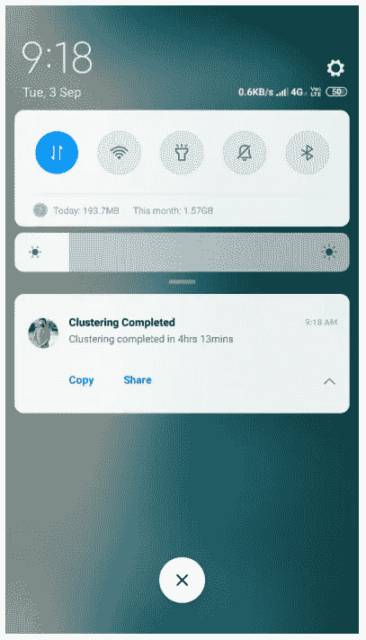
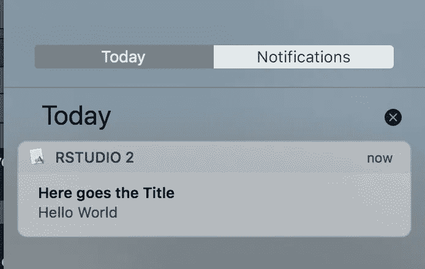
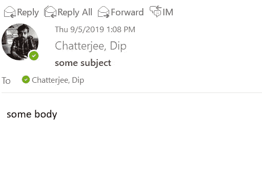

# R 中有效的通知机制

> 原文：<https://towardsdatascience.com/effective-notification-mechanisms-in-r-82db9cb8816?source=collection_archive---------29----------------------->

## 在这里，我们探索不同的 R 通知机制，并看看每种机制的优缺点。


Photo by [Prateek Katyal](https://unsplash.com/@prateekkatyal?utm_source=unsplash&utm_medium=referral&utm_content=creditCopyText) on [Unsplash](https://unsplash.com/search/photos/notification?utm_source=unsplash&utm_medium=referral&utm_content=creditCopyText)

想象一下，运行一个聚类算法需要 4-5 个小时才能完成，现在你要么等待它完成，要么随着你的耐心减少，每小时检查一次，看看这个过程是否已经完成。


想象所有这样的场景，然后想象一个通知机制，它会让你知道进度或者一旦完成就通知你。

我们是来讨论这个问题的。

让我们从最简单的通知机制开始这篇短文，这个机制被亲切地称为“beepr”。

## beepr

顾名思义，它只是在函数被调用时发出声音。代码是这样的:

```
library(beepr)
beep()
```

你也可以从 10 种你想要的声音中选择。这是一个非常简单易用的软件包，关于可用声音的更多细节，你可以参考[这里](https://www.r-project.org/nosvn/pandoc/beepr.html)。

## RPushbullet

这是我个人最喜欢的一个，RPushbullet 利用[push pullet](https://www.pushbullet.com/)API 跨设备发送通知。它可以是任何东西，浏览器/android/ios，只要你在设备上安装了 pushbullet 你就好。

```
**Step 1:** Install pushbullet app in your phone/browser
**Step 2:** Access pushbullet settings from your browser and get the token/key for your account.
**Step 3:** Run
*library(RPushbullet)
pbSetup()* **Step 4:** Once you run the above step you will be asked to enter the token and select the registered device in the r console itself, do that.
**Step 5:** Run a similar code with your message and you are done
*pbPost("note", "Clustering Completed", "Clustering completed in 4hrs 13mins")*
```



这不仅仅是笔记，你也可以发送链接，文件作为一个信息和通知将显示在注册的设备。

通常这是我发现最有用的一个。它非常容易安装，也是所有解决方案中最实用的，不管你的代码是运行在服务器上还是桌面上。

## `notifier`

这是一个基于桌面的通知包，可以用来在 macOS，Windows 和 Linux 上发送桌面通知。这里有一篇关于 macOS 实现这个[的文章](https://datascienceplus.com/send-desktop-notifications-from-r-in-windows-linux-and-mac/)。但不幸的是，我无法让它在我的 Windows 10 机器上工作，它总是出现这样或那样的错误。但是步骤很简单，如果你能做到，请告诉我。

```
#install.packages("devtools") if devtools is not installed
devtools::install_github("gaborcsardi/notifier")library(notifier)
#composing the first notification message

notify(
  title = "Here goes the Title",
  msg = c("Hello","World")
  )
```



这张图是 macOS 用的，取自[这里](https://datascienceplus.com/send-desktop-notifications-from-r-in-windows-linux-and-mac/)。这也是在桌面环境中获得通知的一种非常方便的方法，但是如果您的代码在服务器上运行，这种方法就没什么用了。

## 邮件

通过 [mailR](https://www.rdocumentation.org/packages/mailR/versions/0.4.1) 包，你可以从 r 发送电子邮件。但是我不喜欢使用这个，你必须在脚本中传递用户 id/密码，这不太安全。但你仍然感兴趣的是下面的代码。

```
install.packages(“mailR”)
library(mailR)send.mail(from = “[sender@gmail.com](mailto:sender@gmail.com)”,
 to = c(“[recipient1@gmail.com](mailto:recipient1@gmail.com)”, “Recipient 2 <[recipient2@gmail.com](mailto:recipient2@gmail.com)>”),
 replyTo = c(“Reply to someone else <[someone.else@gmail.com](mailto:someone.else@gmail.com)>”),
 subject = “Subject of the email”,
 body = “Body of the email”,
 smtp = list(host.name = “smtp.gmail.com”, port = 465, user.name = “gmail_username”, passwd = “password”, ssl = TRUE),
 authenticate = TRUE,
 send = TRUE)
```

如果需要的话，你可以参考[这篇文章](https://medium.com/@randerson112358/send-email-using-r-program-1b094208cf2f)以获得更多的细节和解决谷歌不太安全的应用程序问题的方法。

## `RDCOMClient — Outlook`

这是另一个特别有帮助的方案，如果你在日常生活中必须展望未来的话。安装和运行起来非常简单

```
library(RDCOMClient)
## init com api
OutApp <- COMCreate("Outlook.Application")
## create an email 
outMail = OutApp$CreateItem(0)
## configure  email parameter 
outMail[["To"]] = "test@test.com"
outMail[["subject"]] = "some subject"
outMail[["body"]] = "some body"
## send it                     
outMail$Send()**#edit to add attachment** outMail[["Attachments"]]$Add(path_to_attch_file)**#edit to change “from” (send from secondary mailbox)** outMail[["SentOnBehalfOfName"]] = "yoursecondary@mail.com"
```



加上发送附件和从另一个邮箱发送的额外优势，这在各种情况下都很有用。

现在就这些了，现在有了这些，在 R 中实现通知就容易多了，希望能让我们的生活轻松一点。