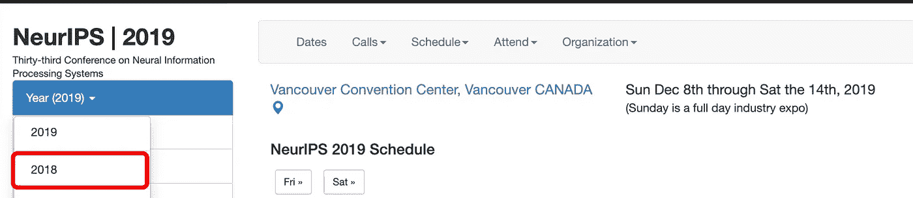

# 寻找深度学习论文的有效方法

> 原文：<https://towardsdatascience.com/effective-way-for-finding-deep-learning-papers-daa27415ad16?source=collection_archive---------12----------------------->

Woman holding book on bookshelves — Photo by Becca Tapert on Unsplash

最近，我看到了一段吴恩达教授的精彩视频，他在斯坦福大学的计算机科学课上解释了如何在人工智能领域出类拔萃。

我将在下面改写他的话。

> 深度学习发展得足够快，即使你已经学习了深度学习的基础，当你从事特定的应用时，你也需要阅读研究论文，以掌握最新的想法。

吴教授分享了一个简单而有效的阅读计划技巧。它包括以下步骤:

*   *选择一个你感兴趣的主题(例如语音识别、文本摘要、用 GANs 生成图像)。*
*   *列出 10-20 篇论文/文章/博客文章。*
*   *逐渐将此列表扩展到 50+篇论文。*

此外，他还提出了几个寻找资源的地方，包括 [Twitter](https://twitter.com/search?q=%23ArtificialIntelligence) 、[机器学习 subreddit](https://www.reddit.com/r/MachineLearning/) 、 [NIPS](https://nips.cc/) 、 [ICML](https://icml.cc/) 和 [ICLR](https://iclr.cc/) (后 3 个是机器学习会议)。

遵循这个技巧，我想到了一个问题:

> 找到合适的论文集需要花费多少时间和精力？

在奉献了几个小时并最终成功地找到了一套我渴望的论文和文章后，我决定分享我的经验并在这一旅程中帮助他人。

## 如何开始？

第一步是**决定一个特定的主题/问题**。就我而言，我有兴趣了解更多关于深度学习如何应用于任何类型贷款(抵押贷款、个人贷款、信用卡等)的信用风险评估。)

一旦你有了主题，最好把所有与它相关的关键词列下来。对我来说，这些是:*信用，贷款，借贷，抵押贷款，风险，评估，分数，银行，金融。*

当你搜索一篇论文/文章/博客文章时，将这些关键词与“深度学习”、“机器学习”或“神经网络”结合起来，以获得所需的结果。

## 在网上寻找资源

寻找合适的资源可能需要 1 小时到 1-2 天的时间。这真的取决于你有多大决心找到“完美”的试卷。然而，人们应该避免在研究上花费不必要的时间，只要他/她找到 3-4 篇论文，实际的阅读就可以开始了。下面列出了几种查找资源的有效方法。

*   标准谷歌搜索

有目共睹的是，谷歌搜索上述关键词是第一步。不幸的是，我没有发现这种方法如此有效，因为结果通常不包括实际的解决方案，而是主题的概述，适合任何读者。

然而，如果你搜索[谷歌学术](https://scholar.google.com/)，找到你需要的东西的可能性要高得多。

*   **探索顶级机器学习会议**

第二步是浏览过去几年会议的所有标题，并提取听起来有趣的内容。例如，让我们看看 [NIPS 会议](https://nips.cc/Conferences/2019)并尝试找到提交的论文列表。

*   首先，转到[https://nips.cc/](https://nips.cc/)，将年份从 2019 年改为 2018 年、2017 年等。

*   对于每一年，将 URL 从[https://nips.cc/Conferences/2019](https://nips.cc/Conferences/2019)更改为[https://nips.cc/Conferences/2019/Workshopbook](https://nips.cc/Conferences/2019/Workshopbook)并点击回车。包含今年所有论文摘要的“研讨会手册”PDF 将开始自动下载。

*   最后，浏览各章节，挑选与你的主题相关的论文。

其他会议的网站上也有“研讨会手册”，您可以通过类似的方式获得。

*   **搜索最流行的在线研究论文库**

这类网站包括[arxiv.org](https://arxiv.org/)、[语义学者](https://www.semanticscholar.org/)、[科学导报](https://www.sciencedirect.com/)等。在每个平台上使用您预定义的关键字和“高级搜索”选项来查找感兴趣的资料。

注意:有些文件可能是私有的，需要购买。请记住，如果你是学生(来自任何大学)，你可以免费获得这些论文。您也许可以使用您的学生凭据登录并获取 pdf。否则，请向您的学校寻求进一步的指导。

## 深入研究一篇论文

找到一套与你的主题完全匹配的论文的过程可能是乏味且耗时的。你很可能会找到相关的论文(在相同或相邻的领域)，但不完全是你需要的。

不要忘记，研究人员是基于以前的发现来完成他们的工作的，每篇论文都包括大量的参考文献。

下面是我如何利用上面的陈述找到我想要的东西:

1.  在看了 NIPS 2018 研讨会的书籍后，我发现了一个很棒的研讨会，名为*“人工智能在金融服务中的挑战和机遇:公平性、可解释性、准确性和隐私的影响”。*
2.  大多数论文并不完全是关于评估信用价值，而是关于让金融领域使用的深度学习模型更具解释力的新方法。
3.  我认为，为了让作者讨论模型的可解释性，他们必须查看(并引用)实际的算法。令人惊讶的是，我发现最初的 3-4 个参考正是我所需要的。

这种方法帮助我扩展了资源列表，找到了真正有用的材料。

## 过滤噪音

在这最后一节，我想回顾一下我在选择特定论文时所关注的几件事。这有助于我过滤大部分噪音，让我专注于更少但质量更高的来源。

*   *作者* —论文可以由不同领域的不同研究人员发表。我通常会在 LinkedIn 或 Twitter 上查找作者的姓名和机构。例如，一篇由大型银行/金融机构的研究人员撰写的关于深度学习的信用风险评估的论文是一个优质材料。此外，好学校(斯坦福、麻省理工、蒙特利尔大学)和公司(脸书、谷歌、百度)通常拥有最强的研究人员。
*   *发表日期* —深度学习领域正在快速发展，因此 5 年前的一篇论文在今天可能无关紧要。我倾向于寻找更近期的材料，但从不忽视很久以前的好论文，尤其是如果它介绍了一种突破性的技术。
*   *被引用次数* —如果一篇论文没有被引用，通常这并不自动意味着它不是一篇高质量的材料。我经常看被引用的次数，只是为了了解论文的受欢迎程度，但这从来不是决定性因素。

这就是我有效搜索研究论文和文章的方法。如果你有任何意见或建议，请在评论区分享。

# 谢谢你的阅读。希望你喜欢这篇文章🤩我祝你今天过得愉快！