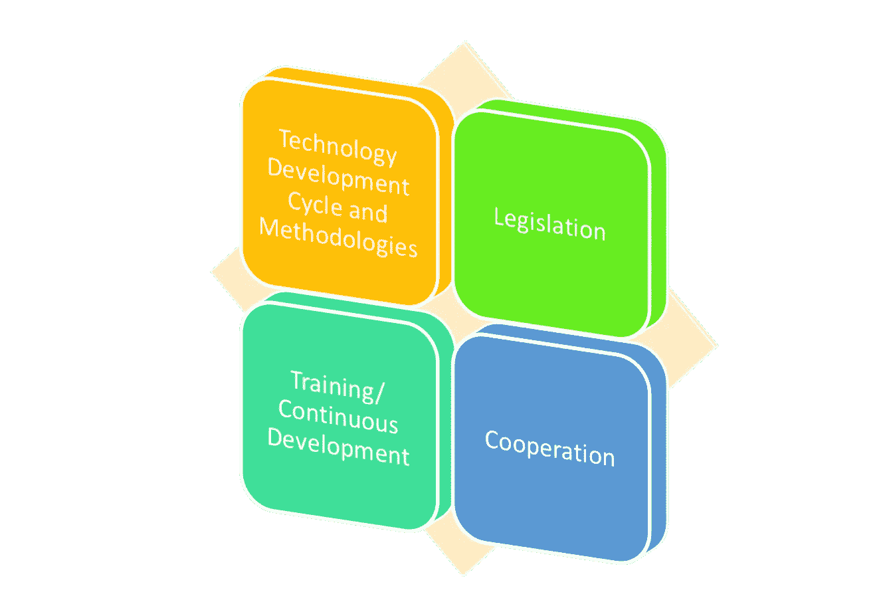
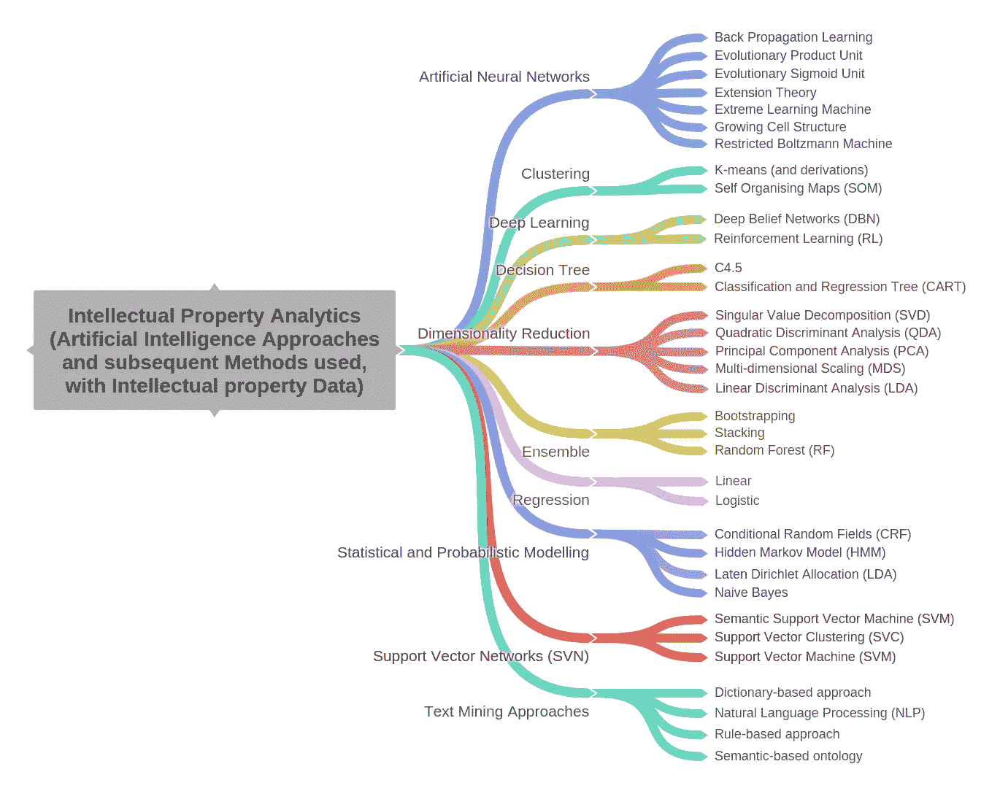
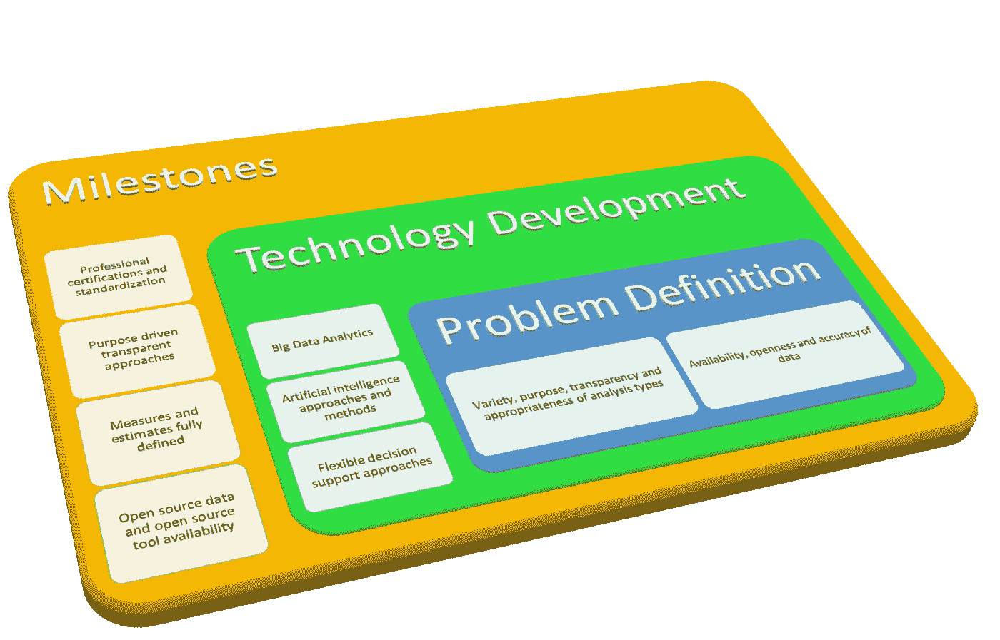

# 有效挖掘专利数据的真正价值

> 原文：<https://towardsdatascience.com/effectively-exploiting-the-real-value-of-patent-data-990fbb3d0a43?source=collection_archive---------15----------------------->

B [**ig 数据**](https://www.ibm.com/analytics/hadoop/big-data-analytics) 在[制造](https://www.ifm.eng.cam.ac.uk/insights/automation/factories-of-the-future-and-implications-for-automation/)和运营的所有领域越来越可用，这为实现有竞争力的数据驱动型经济提供了价值。随着数据可用性的增加，支持**和 [**工业 4.0**](https://www.epo.org/news-issues/news/2017/20171211.html) 的数据可用性增加，这为更好的决策和战略制定带来了巨大的机遇，从而推出了下一代创新和[颠覆性技术](https://www.ifm.eng.cam.ac.uk/insights/strategic-asset-management/intelligent-assets-for-the-infrastructure-of-the-future/)。**

**O 在过去的二十年里，专利分析和知识产权分析领域有了长足的发展( [Trippe，2003](https://pdfs.semanticscholar.org/bcd7/beec3e15a7351a98b402e9fd84ef82f841d7.pdf)； [Aristodemou 等人，2018](https://www.sciencedirect.com/science/article/pii/S0172219018300103?via%3Dihub) 。随着专利数据的数字化(1984 年的 [BACON 项目](https://www.epo.org/mobile/about-us/timeline.html))以及过去几十年来数据质量和分析技术的不断改进，世界上最大的[技术信息库](http://www.wipo.int/econ_stat/en/economics/research/#patent)已经变得越来越容易获取，成本也在迅速降低。**

**在最近的一项研究中，我们使用了[技术路线图方法](https://www.ifm.eng.cam.ac.uk/insights/roadmapping/improve-your-roadmap/)来探索专利分析的未来，我们确定了 11 项优先技术，如[人工智能](https://www.investopedia.com/terms/a/artificial-intelligence-ai.asp)和人工神经网络，行业专家认为这些技术在专利分析领域中以更高的比率被采用是非常重要的。**

****

**Fig. 1 Future of Patent Analytics Technology Roadmap Enablers (Source: Aristodemou and Tietze, 2017)**

**我们确定了采用这些计算机科学技术的需求，以补充决策流程并提供决策支持( [Aristodemou 和 Tietze，2017](https://www.ifm.eng.cam.ac.uk/insights/innovation-and-ip-management/exploring-the-future-of-patent-analytics/https://www.ifm.eng.cam.ac.uk/insights/innovation-and-ip-management/exploring-the-future-of-patent-analytics/) )。此外，我们确定了 4 个使能支柱，它们可以促进上述目标的实现；即技术开发周期和方法、立法、持续发展和合作(图 1)。**

**在全球创新经济中，[知识产权的重要性正在迅速增加，并且变得更加复杂](https://www.wipo.int/wipo_magazine/en/2018/05/article_0001.html)。人工智能(AI)、大数据分析和区块链等新技术可用于应对知识产权领域面临的日益严峻的挑战。我们将**知识产权分析(IPA)** 定义为:**

> ****分析大量知识产权信息的数据科学，以发现关系、趋势和模式，从而做出决策。****

****

**Fig. 2 Artificial Intelligence Methods used with Intellectual Property Data (Source: Aristodemou et al., 2018)**

**具体来说，在最近发表在《世界专利信息》特刊上的一篇论文中，我们回顾了 57 篇最近发表的文章，该论文题为【TechMining 的知识产权信息高级分析。在元数据分析之后，我们将它们分为 4 大类:**、知识管理、技术管理、经济价值以及信息的提取和有效管理**，然后确定其中使用的具体方法和算法。图 2 显示了文献中使用的知识产权分析方法的拓扑结构，如 Aristodemou 等人在 2018 年[中所讨论的。](https://www.sciencedirect.com/science/article/pii/S0172219018300103?via%3Dihub)很明显，研究中存在所有三种学习模型类型:[监督、半监督和非监督模型](https://machinelearningmastery.com/supervised-and-unsupervised-machine-learning-algorithms/)；大多数文章都集中在人工神经网络的使用上。此外，还值得注意的是，所使用的大多数方法都是在数据预处理阶段，即在运行任何算法之前准备专利数据。这显示了这些技术在以这样一种方式构建专利数据中的重要性，使得模型是可感知的和可理解的。用计算机科学的语言来说，这表明了**“垃圾输入垃圾输出”(GIGO)** ，或者换句话说**“合理输入合理输出”(SIRO)** 对于任何模型的重要性。**

**C 因此，公司需要密切注意保护和利用这些隐藏在数据本身中的有价值的信息。过去，知识产权安全的重点是保留员工掌握的知识，**而现在，重点正转向利用、连接、分析和保护数据。凭借强大的算法和计算机速度，我们现在能够根据个人和组织的需求提取和分析大量数据。****

****

**Fig. 3 Data Analysis mini-Technology Roadmap Summary (Source: Aristodemou and Tietze, 2017)**

**这可以通过图 3 中的微型技术路线图部分实现。在短期内，重要的是稳定和建设一个有效的、以目标为导向的基础设施。随着对现有分析技术的进一步理解，这将在如何使用分析工具来避免黑盒方面建立透明度。随后可以开发定制的方法，使用人工智能方法对中期专利数据进行有效的数据分析，从长期来看则是一个完全适应的系统。使用开源社区和开放数据的其他举措可以促进这些过程。**重要性在于从专利中获得的技术价值和专利的经济价值之间的联系，即市场愿意为一项这样的发明及其利益支付多少钱。****

# **参考资料:**

*   **Aristodemou，l .，& Tietze，F. (2018 年)。知识产权分析(IPA)的最新发展:一篇关于人工智能、机器学习和深度学习方法的文献综述，用于分析知识产权(IP)数据。世界专利信息，55 37–51。【https://doi.org/10.1016/j.wpi.2018.07.002 **
*   **Aristodemou，l .和 Tietze，f .，2017 年。探索专利分析的未来。英国剑桥大学制造研究所技术管理中心(CTM)洞察报告，ISBN:978–1–902546–84–1。请访问:[https://www . IFM . eng . cam . AC . uk/insights/innovation-and-IP-management/exploring-the-future-of-](https://www.ifm.eng.cam.ac.uk/insights/innovation-and-ip-management/exploring-the-future-of-)patent-analytics/**
*   **Trippe，a . j .(2003)“Patinformatics:任务到工具”，*世界专利信息*，25(3)，第 211–221 页。doi:[10.1016/s 0172–2190(03)00079–6](http://10.0.3.248/S0172-2190(03)00079-6)**

# **关于作者:**

**Leonidas Aristodemou 是人工智能、技术和创新管理领域的博士研究员。他是剑桥大学制造研究所(IfM)技术管理中心(CTM)创新和知识产权管理(IIPM)小组的成员。他目前是伦敦艾伦图灵研究所的访问学者。他目前的研究围绕着大数据的使用、应用机器学习和知识产权分析；更具体地说，他分析知识产权数据的大数据集，并使用深度学习模型预测技术价值/影响。预计这将改善创新管理模式中的技术战略决策过程。**

## **轮廓**

**领英:[https://www.linkedin.com/in/leonidasaristodemou/](https://www.linkedin.com/in/leonidasaristodemou/)**

**剑桥:【http://www.eng.cam.ac.uk/profiles/la324 **

**图灵:[https://www . Turing . AC . uk/people/博士生/leonidas-aristodemou](https://www.turing.ac.uk/people/doctoral-students/leonidas-aristodemou)**