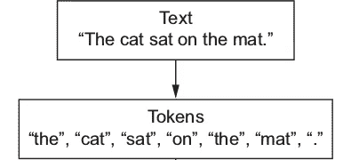
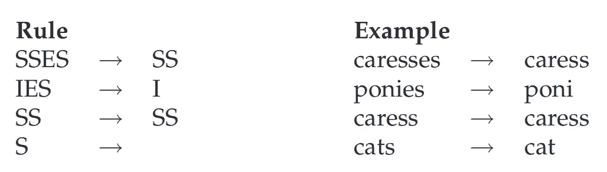

# 有效地预处理文本数据第一部分:文本清洗

> 原文：<https://towardsdatascience.com/effectively-pre-processing-the-text-data-part-1-text-cleaning-9ecae119cb3e?source=collection_archive---------3----------------------->

> 本文的内容直接来源于 Francois Chollet 的《使用 Python 进行深度学习》和 Manning、Raghavan 和 Schütze 的《信息检索导论》。本文中使用的一些信息图表也取自上述书籍。

文本是一种数据形式，在人类历史中已经存在了几千年。所有影响所有宗教的神圣文本，所有诗人和作家的作品，他们那个时代最聪明的头脑做出的所有科学解释，所有定义我们的历史和未来的政治文件，以及各种明确的人类交流，这些“所有”都定义了以我们所谓的**文本**形式存在的数据的重要性。

在我之前的文章 [*有效的数据预处理和特征工程，*](https://becominghuman.ai/effective-data-preprocessing-and-feature-engineering-452d3a948262) 中，我已经用三个主要步骤解释了预处理的一些一般过程，这三个步骤是“转换成向量、归一化和处理缺失值”。本文将介绍将文本数据转换成某种形式的向量的前传步骤，更多的是关于数据清理。

文本只是一个单词序列，或者更准确地说，是一个字符序列。但是，当我们通常处理语言建模或自然语言处理时，我们更关心作为一个整体的单词，而不仅仅是担心我们的文本数据的字符级深度。这背后的一个原因是，在语言模型中，单个字符没有很多“上下文”。像' d '，' r '，' a '，' e '这样的字符不单独包含任何上下文，但当以单词的形式重新排列时，它们可能会生成单词“read”，这可能解释了你可能正在做的一些活动。

矢量化只是一种将单词转换成长串数字的方法，这些数字可能具有某种复杂的结构，只有使用某种机器学习或数据挖掘算法的计算机才能理解。但即使在此之前，我们也需要对文本执行一系列操作，以便我们的文本可以被“清洗”掉。数据“清理”的过程可能因数据来源的不同而不同。文本数据清理的主要步骤如下所示，并附有解释:

# 删除不需要的字符

这是文本清理过程中的主要步骤。如果我们从 HTML/XML 源中删除一些文本，我们需要去掉所有的标签、HTML 实体、标点符号、非字母和任何其他可能不属于该语言的字符。这种清理的一般方法包括正则表达式，可以用来过滤掉大部分不需要的文本。

有些系统保留了重要的英文字符，如句号、问号、感叹号等。考虑一个例子，你想对人类生成的推文进行一些情感分析，你想把推文分类为非常生气、愤怒、中性、高兴和非常高兴。简单的情绪分析可能会发现很难区分快乐的情绪和非常快乐的情绪，因为有些时候只有语言无法解释。

考虑语义相同的两个句子:

“这菜不错。”，还有“这个。食物。是。很好！！！！！！！!"。

明白我想说什么了吗？同样的词，但完全不同的情感，唯一能帮助我们看出不同的信息是过度使用的标点符号，这显示了某种“额外”的感觉。

由非字母组成的表情符号也在情感分析中发挥作用。“:)，:(，-_-，:D，xD”，所有这些，当被正确处理时，可以帮助进行更好的情感分析。即使你想开发一个系统来分类某个短语是不是讽刺，这样的小细节也是有帮助的。

撇号是一种重要的标点符号，需要小心处理，因为许多文本都可以基于撇号。像“不是，不应该，没有，本来会，可能不会，你们都已经”这样的术语就像一种疾病一样渗透到在线文档中，幸运的是，我们也有治愈这种疾病的方法。这里的是一个很好的词典，收录了所有这些单词的缩写，你可以用它来将包含撇号的单词转换成正式的英语术语，用空格隔开。

# 以正确的格式编码

有多种数据编码可供选择，如 UTF-8 编码、拉丁编码、ISO/IEC 编码等。UTF-8 是大多数电脑最常用的编码之一，因此将文本转换为 UTF-8 编码总是一个好主意。但是，根据应用程序和您的编程环境，您也可以用其他格式编码。

# 标记化和资本化/去资本化

标记化就是把一个句子拆分成单词的过程。

Tokenization of a sentence

您可能已经意识到，上面的例子不仅标记了句子，还确保了所有的单词都是小写的。这个例子不仅划分了个体实体，而且摆脱了所涉及的资本主义(没有双关的意思)。资本化和去资本化同样取决于应用程序的用途。如果我们只关心术语，而不是它们的“存在强度”，那么所有小写的术语都应该没问题，但是如果我们想区分任何情感，那么大写的东西可能意味着不同于小写的东西。请参见下面的示例:

“我们去高地吧！”

“我们去高地吧！”

同样，后者比第一句表现出更多的热情。

# 移除/保留停用字词

这个清理步骤还取决于预处理后您最终将对数据做什么。停用词是使用非常频繁的词，它们太频繁了，以至于有点失去了它们的语义。像“of，are，the，it，is”这样的词是停用词的一些例子。在文档搜索引擎和文档分类等应用中，关键字比一般术语更重要，删除停用词可能是一个好主意，但如果有一些应用，例如歌曲歌词搜索或搜索特定引用，停用词可能很重要。考虑一些例子，比如“生存还是毁灭”，“看看你让我做了什么”等等。这些短语中的停用词实际上起着重要的作用，因此不应该被删除。

有两种常见的删除停用词的方法，这两种方法都相当简单。一种方法是对所有出现的单词进行计数，并提供计数的阈值，并去除出现次数超过指定阈值的所有术语/单词。另一种方法是有一个[预定的停用词列表](https://gist.github.com/sebleier/554280)，它可以从标记/标记化句子列表中删除。

当在基于语义/情感分析的系统上工作时，一些人类表达，如“哈哈哈，lol，lmfao，brb，wtf”也可以是有价值的信息，但是对于需要更正式类型的应用程序的系统，这些表达也可能被删除。

# 打破附字

文本数据可以包含连接在一起的单词，单词之间没有空格。社交媒体上的大多数标签都是像“# AwesomeDay、#DataScientist、#BloggingIsPassion”等。天啊。这样的术语也需要注意，一个简单的方法是根据大写字母拆分这些术语，如果我们保留大写字母，这是可能的。如果我们不想保留大写，那么这个步骤应该在标记化步骤中执行，就在所有内容都变成小写之前。

# 词汇化/词干化

词干化和词元化的目标都是将一个单词的屈折形式，有时是衍生相关形式减少到一个共同的基本形式。“也就是说，词干化/词汇化有助于我们将全部术语的数量减少到某些“根”术语。

组织者，组织者，组织者，有组织的所有这些都可以归结为一个词根，也许是“organiz”。

*词干提取*是一种简单的方法，通过定义在单词末尾去掉一些字符的规则来减少单词的词根，希望在大多数情况下能得到好的结果。

Examples of stemming

*词汇化*相对来说是一种更系统的方法，做词干化做的同样的事情，但是涉及一些词汇和词法分析。

同样，词干化和词汇化过程应该只在需要的时候执行，因为单词的词缀包含可以利用的附加信息。比如“更快”和“最快”的词根相同，但语义却互不相同。因此，如果您的应用程序只与术语相关，正如大多数搜索引擎和文档聚类系统所做的那样，那么词干化/词条化可能是一个选项，但对于需要考虑一些语义分析的应用程序，词干化和词条化可能会被放弃。

# 拼写和语法纠正

这些技术是在处理文本数据时获得更好结果的好方法。在一个场景中，你需要为一些正式的用例训练一个聊天机器人，并且你有很多可用的人类对话文本数据，那么你可能要执行拼写和语法纠正，因为如果你的聊天机器人在垃圾上得到训练，它也可能会犯很多错误。此外，由于计算机不擅长区分“awesome”和“awesum ”,同一单词的这两个变体最终将具有不同的特征向量，并将被不同地处理。我们不希望发生这种情况，因为这两个术语都是相同的，只是有一个拼写错误。人为错误不应该对计算机的学习方式产生影响，这一点很重要。如果计算机开始犯和人类一样的错误，那么它们将和那些经常犯错的人一样没用。

总结这篇文章，数据清理就是去除数据中的“噪音”。但是您的应用程序决定数据中哪些内容是噪声，哪些不是噪声。一旦你弄清楚你需要从数据中保留什么，丢弃什么，那么你肯定会有一个按你计划的方式工作的应用程序。

如果你已经执行了上面提到的步骤，或者甚至是其中的一些步骤，那么现在你应该有一个由多个列表组成的矩阵 **X** ，其中每个列表都包含一个句子中经过清理和标记的单词。现在，下一步是使用一种技术，将所有的标记化列表转换成向量 **v** 。这个问题将在接下来的文章中讨论，标题为“[有效地预处理文本数据第二部分:实现](https://link.medium.com/sq7ITHLycab)”。

对于任何疑问/评论/批评，我都愿意进行建设性的沟通。

数据科学快乐！