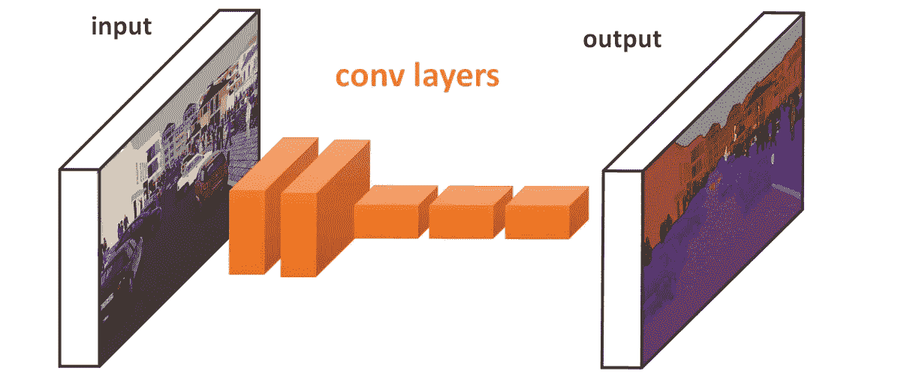
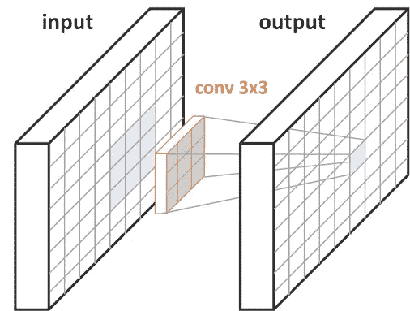
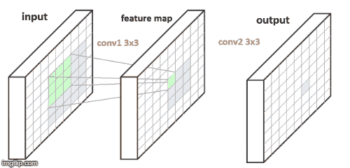
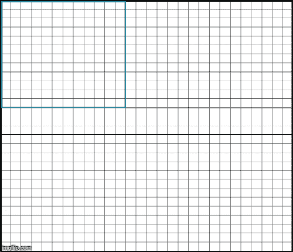
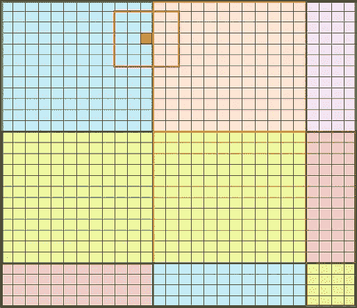
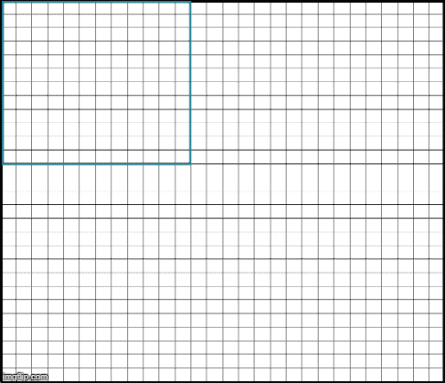
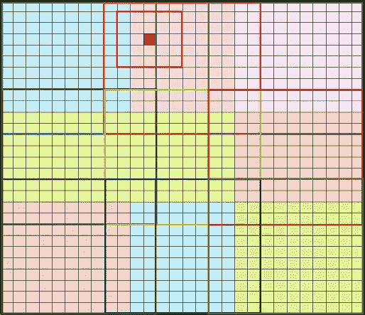
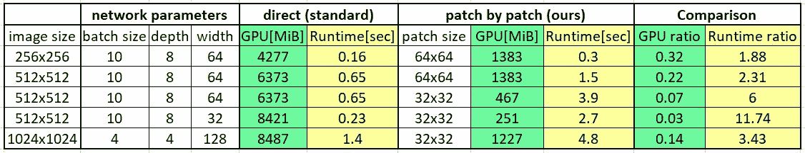

# 运行全卷积网络的有效方法

> 原文：<https://towardsdatascience.com/efficient-method-for-running-fully-convolutional-networks-fcns-3174dc6a692b?source=collection_archive---------14----------------------->

全卷积(深度神经)网络(fcn)通常用于计算机视觉任务，如语义分割、超分辨率等。它们最好的特性之一是它们适用于任何大小的输入，例如不同大小的图像。然而，在大规模输入(如高分辨率图像或视频)上运行这些网络可能会消耗大量 GPU 内存。在这篇文章中，我将介绍一个简单的方法来缓解这个问题。所提出的算法将 GPU 内存使用率降低到只有 3–30%。

# **什么是全卷积网络？**

一个完全卷积的网络(从现在开始:FCN)是一个仅由卷积层组成的网络。如果你对卷积层不熟悉，这里的是初学者指南。为了简单起见，在这篇文章中，我们将关注图像，但这同样适用于视频或其他类型的数据。

A fully convolutional network for segmentation. input and output images from [Nvidia dev blog](https://devblogs.nvidia.com/image-segmentation-using-digits-5/)

对于图像处理中的许多任务，要求输入和输出图像具有相同的尺寸是很自然的。这可以通过使用具有适当填充的 fcn 来实现(TensorFlow 中的[‘相同’)。因为这是一个标准程序，从现在开始我们假设它成立。](https://www.tensorflow.org/api_docs/python/tf/nn/conv2d)

***在这种架构下，输出图像中的每个像素都是对输入图像中的相应补片进行计算的结果。***

***这个斑块的大小称为网络的感受野(RF)。***

这是一个关键点。我们将很快看到算法如何使用这个属性

FCN with one layer: 3x3 convolution. each output pixel corresponds to a **3x3** patch in the input image

FCN with 2 layers: each is a 3x3 convolution. each output pixel corresponds to a **5x5** patch in the input image

上面我们可以看到带有一个(顶部)和两个(底部)3×3 conv 层的 fcn 的插图。在一层(顶部)的情况下，右侧的蓝色输出像素是对左侧蓝色输入面片的计算结果。当有两层(底部)时，我们在输入和输出之间有一个特征图。特征图中的每个绿色像素(中间)都是在一个 3×3 绿色输入面片(左侧)上计算的结果，与一个图层的情况相同。类似地，每个蓝色输出像素(右)是对蓝色 3x3 特征图块(中)的计算结果，该特征图块源自 5x5 蓝色输入块(左)。

# **所以..有什么问题**？

如前所述，理论上，我们可以将网络应用于任何输入大小。然而，实际上，计算通过网络的正向传递需要在内存中保存巨大的特征图，这会耗尽 GPU 资源。我在研究视频和 3d 图像时遇到了这个限制。网络根本无法在我们花哨的 NVIDIA v100 GPUs 上运行，这促使我开发了这个解决方案。

# **通过 FCN 传递大量输入的有效方式**

传统 CNN 以完全连接的层结束。因此，每个输出像素都是整个输入的计算结果。在 fcn 中情况并非如此。正如我们所见，只有来自输入的感受野大小的小块影响单个输出像素。因此，要计算单个输出像素，不需要将整个特征图保存在内存中！

换句话说:

***我们可以一次计算一小部分输出值，同时只传递输入中必要的像素。这大大减少了 GPU 的内存使用！***

让我们来看看下面的例子:
我们的输入是一个 28x28 的图像，如下图所示。由于内存限制，我们可以通过最大 12x12 的网络补丁。最简单的方法是从原始输入(下图中的轮廓)输入 12×12 的面片，并使用 12×12 的输出面片来构建 28×28 的输出图像。

Each output pixel is the result of a different patch passing through the network. For example, orange pixels are the result of passing the orange 12x12 patch.

不幸的是，这种方法不会产生与一起传递整个 28x28 输入相同的结果。原因是边界效应。

# 解决边界效应

为了理解这个问题，让我们看看下图中标记的红色像素。周围的红色方块代表感受野，在本例中大小为 5x5，跨越蓝色和橙色区域。为了正确计算红色输出像素，我们需要同时计算蓝色和橙色像素。因此，如果我们像在天真的方法中那样分别运行蓝色和橙色的补丁，我们将没有必要的像素来精确地计算它的值。显然，我们需要另一种方法。

Red — a boundary pixel and the receptive field around it

那么我们如何才能让它变得正确呢？我们可以使用**重叠的**补丁，这样每个 5×5 补丁将包含在通过网络的 12×12 补丁之一中。重叠量应该比感受野(RF -1)少 1 个像素。在我们的例子中，感受野 RF=5，所以我们需要 4 个像素的重叠。下面的动画演示了不同的图像补丁如何在给定的限制下通过网络传递。它显示了每个 12×12 输入面片(轮廓)在输出(填充)中贡献了更少量的像素。例如，蓝色方形轮廓比蓝色像素填充的区域大。

Overlapping patches. For example, orange pixels are the result of passing the orange 12x12 patch.

回到我们标记的红色像素。现在，如下图所示，由于重叠，它可以正确计算。它的 5x5 周围补丁完全包含在橙色 12x12 补丁中(轮廓)

***实际上，每个像素都有一个 12×12 的小块包含其感受野大小的周边*** *。* ***这样我们可以确保同时运行整个 28x28 图像的效果。***

red — a boundary pixel and the receptive field around it

# 结果

下表给出了一些关于 GPU 内存使用和运行时间的实验结果。正如所承诺的，内存消耗是显着减少！

注意:尽管每个图像的运行时间较慢，但是使用这种方法我们可以并行传递多个图像，因此**节省了时间**。例如，在第 3 行中，使用该算法我们可以同时运行 13 个图像，这将花费与使用直接方法仅运行 6 个图像一样多的时间。

with patch by patch algorithm GPU memory usage is reduced by 67%-97% compared to standard method

实验在 NVIDIA Tesla K80 GPU 上运行。

感谢本·范斯坦、因娜·格里涅维奇、阿维夫·内塔尼亚胡和[阿耶莱特·萨皮尔斯坦](https://www.facebook.com/profile.php?id=100009603042010&fref=gs&__tn__=%2CdlC-R-R&eid=ARDN5dslDbkN_2uFKrGWbq2vcDPRbaAnjl8U_U692Yemo1nhHAbjzbertqeUHGyto7gIcbc6cElvUy5C&hc_ref=ART9kBGQIb4vP1sv47pW19nMtpWuaglZXreTu9doUCi81dm9iXoDQYHkLOxQt0KO3ns&dti=1215117901926035&hc_location=group)