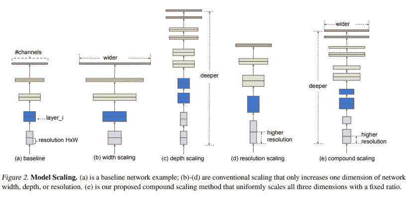
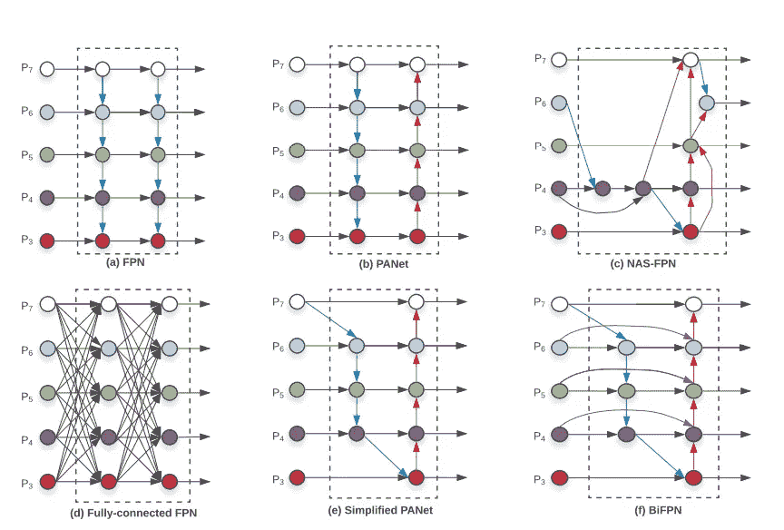
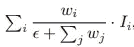
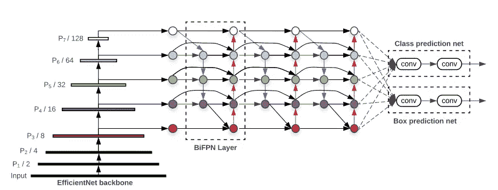
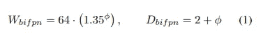
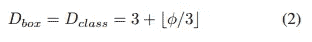
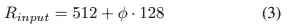
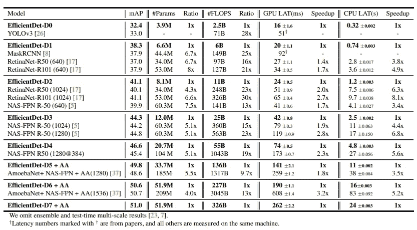

# EfficientDet:可扩展和高效的对象检测综述

> 原文：<https://towardsdatascience.com/efficientdet-scalable-and-efficient-object-detection-review-4472ffc34fd9?source=collection_archive---------10----------------------->

谷歌大脑团队最近发表了另一篇基于他们预览工作的对象检测论文，EfficientNet。该论文的作者提出了一种可扩展的检测架构，同时在广泛的资源限制范围内实现更高的准确性和效率。与其他检测网络相比，EfficientDet 网络系列可实现类似的性能，同时减少参数和触发器的数量。

# 效率净值汇总

在深入研究 EfficientDet 纸之前，我们首先需要了解 EfficientNet 纸。与 EfficientDet 不同，该网络旨在提升 ImageNet 域中的网络性能。EfficientNet 论文中的核心概念是网络在多个维度(输入分辨率、深度、宽度)上的复合扩展。EfficientNet 不是只扩展网络的一个或两个维度，而是扩展网络的所有维度。

如上图所示，传统方法只增加了网络的一个维度(宽度、深度或分辨率)。这可以通过手动调整缩放系数来提高模型的性能，但是找到正确值的过程是一个冗长的过程，并且经常导致次优的精度和效率。

当在 EfficientNet 中执行复合缩放时，使用固定的缩放系数统一执行每个维度中的调整。例如，当给定 2^N 计算资源时，我们可以通过α^N 增加网络深度，通过β^N 增加宽度，通过γ^N 增加图像大小，其中α、β和γ是通过在原始小模型上的小网格搜索确定的常系数。使用多目标神经架构搜索来执行找到基础效率 Net-B0 的过程。然后，从找到的基线网络开始，应用复合缩放方法来放大网络的维度。

要了解更多关于 EfficientNet 论文的信息，我建议在这里阅读论文[。](https://arxiv.org/abs/1905.11946)

# 效率检测

在 EfficientDet 论文中，做出了两个主要贡献:(a) BiFPN 允许双向快速多尺度特征融合。(b)一种新的复合缩放方法联合放大主干、特征网络、盒/类网络和分辨率。使用 BiFPN 和新的复合缩放，形成了一系列高效的 Det 网络，在准确性和效率方面优于以前的对象检测器。

## BiFPN

BiFPN 的目标是以自上而下的方式有效地聚合多尺度特征。上图显示了基于 FPN 的不同汇总方法的比较。从(a)开始，典型的 FPN 网络融合了从 3 级到 7 级的多尺度特征。PANet 架构(b)在 FPN 之上增加了一个额外的自底向上的路径，以有效地利用较低层次的特性。节点之间的连接也可以通过使用神经结构搜索来找到。如(c)所示，这些连接不同于人类构建的连接。

通过比较这三种架构，作者观察到 PANet 比 FPN 和 NAS-FPN 实现了更好的准确性，但代价是更多的参数和计算。从 PANet 架构开始，为了提高模型效率，EfficientDet 的作者首先删除只有一个输入边的节点，并创建 PANet 架构的简化版本，如(e)所示。直觉是，如果一个节点只有一条输入边而没有特征融合，那么它对旨在融合不同特征的特征网络的贡献将会更小。然后，如果节点处于同一级别，作者会从原始输入向输出节点添加一条额外的边。这样做是为了在不增加太多成本的情况下融合更多功能。最后，与只有一个自上而下和一个自下而上路径的 PANet 不同，双向(自上而下和自下而上)路径被视为一个要素网络图层，并多次重复同一图层以实现更高级别的要素融合。最终提出的 BiFPN 架构如(f)所示。

当特征被融合在一起时，利用**加权特征融合**。由于不同分辨率下的不同输入特征对输出特征的贡献不相等，因此在进行特征融合时，每个输入的额外权重充当比例因子。具体而言，使用上式所示的**快速归一化融合**。通过在每个ω后应用 relu 来确保每个ω的正定性，并添加ϵ以避免数值不稳定。

## 复合缩放

网络复合扩展的目的是扩大基线模型(EfficientDet D0)的规模，以涵盖广泛的资源限制。一个简单的复合系数φ联合放大了主干网络(BiFPN)、类/箱网络和分辨率的所有维度。在 EfficientNet 论文中使用了网格搜索，但使用了基于启发式的缩放方法，因为对象检测器比图像分类模型具有更多的缩放维度。

**(a)主干网络:**使用与 B6 efficient net-B0 相同的宽度/深度比例系数来恢复 ImageNet-pretrained 检查点。

**(b) BiFPN 网络:**使用等式(1)，BiFPN 网络的宽度以指数方式增长，深度以线性方式增加，以将深度值舍入为小整数。

**(c)盒/类预测网络:**预测网络的宽度固定为总是与 BiFPN 相同，但是预测网络的深度使用等式(2)线性增加。

**(d)输入图像分辨率:**由于在 BiFPN 中使用特征级别 3–7，输入分辨率必须能被 2⁷ = 128 整除，因此使用等式(3)图像的分辨率线性增加。

# 结果

使用复合比例方法，可生成一系列 EfficientDet 网络(efficient det D0–07)。上表显示了 COCO 数据集上模型的单尺度性能。与以前的检测机相比，EfficientNet 型号在各种精度或资源限制下实现了更高的精度和效率。请注意，EfficientDet-D0 模型实现了与 YOLOv3 相似的精度，但触发器数量减少了 28 倍。此外，与 RetinaNet 和 Mask-RCNN 相比，EfficientDet-D1 实现了相似的精度，但参数减少了 8 倍，触发器减少了 25 倍。

对于那些想了解 EfficientDet 更多信息的人，我建议阅读整篇文章。下面提供了链接。

# 参考

 [## EfficientNet:重新思考卷积神经网络的模型缩放

### 卷积神经网络(ConvNets)通常是在固定的资源预算下开发的，然后按比例放大用于…

arxiv.org](https://arxiv.org/abs/1905.11946)  [## EfficientDet:可扩展且高效的对象检测

### 模型效率在计算机视觉中变得越来越重要。在本文中，我们系统地研究了各种模型

arxiv.org](https://arxiv.org/abs/1911.09070)