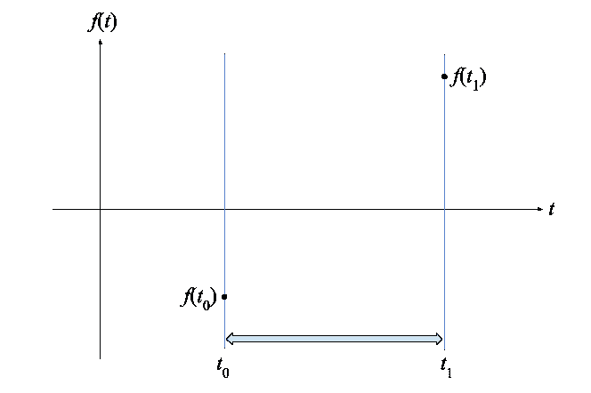
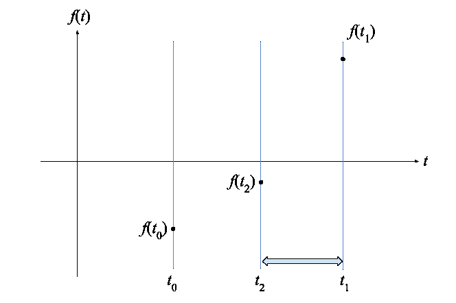
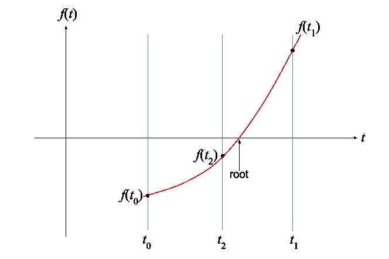
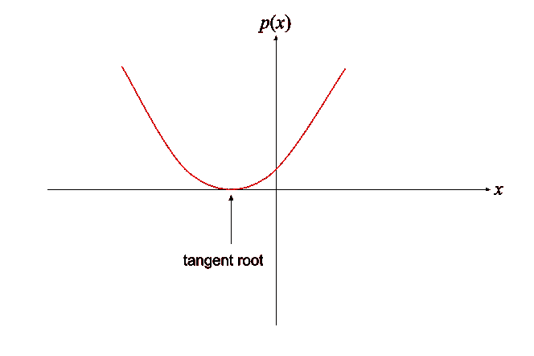

# 高效地寻找昂贵函数的根

> 原文：<https://towardsdatascience.com/efficiently-finding-a-root-of-an-expensive-function-80431c035bb?source=collection_archive---------34----------------------->

## 解释了二次插值，用 Python 编写了示例代码

Photo by [Josh Riemer](https://unsplash.com/@joshriemer?utm_source=medium&utm_medium=referral) on [Unsplash](https://unsplash.com?utm_source=medium&utm_medium=referral)

有时候在科学编程中，你需要使用一个平滑的实值函数 *f* ( *t* )来计算开销。具体来说，你可能需要找到函数值变为零的地方。我最近在我的[开源天文图书馆](https://github.com/cosinekitty/astronomy)工作时遇到了这个问题。我想知道月出月落的时间。这包括计算地球的自转和月球绕地球的轨道，以确定在特定地理位置的观察者所看到的月球何时穿过地平线。

在我的例子中， *f* ( *t* )是观察者在时间 *t* 看到的月亮在地平线以上或以下的视在角高度。找到月出或月落时间意味着找到 *t* 的值，使得 *f* ( *t* )=0。用数学术语来说，我想找到函数 *f* 的*根*。

评估 *f* ( *t* )包括计算月球位置，这需要上千次浮点运算。我想尽量减少我不得不评估 *f* ( *t* )的次数，因为我找到了一个足够好的值 *t* 。我寻找精确到几秒钟以内的时间。

解决这类问题的一个相当好的方法是在开根之前找到时间 *t* ₀，在开根之后找到另一个时间 *t* ₁。假设你知道时间间隔足够小，在它里面不会有一个以上的根。(在我的例子中，我知道一个小时内不可能有一次以上的月出。)

假设你确定 *f* ( *t* ₀) < 0，f( *t* ₁) > 0。情况看起来是这样的:

There must be at least one root in the interval indicated by the arrow.

鉴于 *f* 是一个连续函数，在 *t* ₀和 *t* ₁之间至少有一个 *t* 的值，使得 *f* ( *t* )=0。连续函数不可能不经过零就从负值变成正值。

为了取得进展，我们在区间中间的时间 *t* ₂评估函数:

假设你发现 *f* ( *t* ₂) < 0。现在你已经了解了一些新的信息。你已经发现根一定在更窄的区间内的某个地方*t*₂<t*t*t<t*t*₁:

The uncertainty of the root’s location has been cut in half.

或者，如果您发现 *f* ( *t* ₂) > 0，您可以将您的搜索限制在左边的半区间，*t*₀<t<t₂.

无论哪种方式，您都可以将音程切成两半，并选择哪一半必须包含根。重复这样做被称为二分搜索法。您可以不断迭代，直到时间间隔变得相当小。

如我所说，二分搜索法是一种相当快速的方法。但是在某些条件**下，使用*二次插值*比二分搜索法**求函数的根要快得多。以下是条件:

*   该功能为**平滑连续**。
*   该函数在很小的区间内很好地近似为抛物线*t*₀<t<t*t*₁.非正式地说，在给定的区间上，函数有少量的曲率。
*   在函数值过零的 *t* ₀和 *t* ₁之间，必须有**恰好一个 *t* 的**值。换句话说，函数在给定的时间间隔内必须有唯一的根。

设置类似于上面的二分搜索法，在三个等间距的参数值 *t* 处评估函数。不同的是，你**求的是经过三点**的唯一二次函数。二次函数在小间隔上逼近昂贵函数 *f* 的值。二次函数看起来像这里的红色曲线:

Finding an approximate root using a quadratic curve.

一旦有了通过三点的抛物线的公式，就可以使用二次公式来求解抛物线与 *t* 轴相交的 *t* 的值。

那么你如何找到抛物线呢？让我们一步一步来。首先，我们将把在范围*t*₀≤*t*≤*t*₁内变化的时间变量 *t* 替换为一个抽象参数 *x* ，它具有更方便的范围 1≤ *x* ≤+1。这将使数学更简单。

花点时间来验证一下

*   如果 *t* = *t* ₀，那么*x*= 1；
*   如果 *t* = *t* ₂，那么*x*= 0；
*   而如果 *t* = *t* ₁，那么 *x* =+1。

第三种情况为真，因为₂位于₀和₁的中间，因此分子和分母相等。

第二步是写一个通用的抛物线函数 *p* ( *x* ):

总是恰好有一条抛物线通过这三个点。我们的下一个目标是找到导致抛物线 *p* ( *x* )通过我们为昂贵函数 *f* 评估的三个点的 *Q* 、 *R* 和 *S* 的值。我们写出反映这一要求的三个线性方程:

根据已知值 *f* ( *t* ₀)、 *f* ( *t* ₂)和 *f* ( *t* ₁)解这个三线性方程组，我们发现:

在继续之前，你的算法必须检查特殊情况。**如果 *Q* =0，表示直线，而不是抛物线，通过所有三点。**换句话说，*p*(*x*)=*Rx*+*S*。求根求*x*=*S*/*R*。当 Q=0 时，还需要检查 *R* =0，以避免被零除。这种情况下，线是水平的，因此没有零交叉。否则，如果 *Q* 不为零，则继续执行以下步骤来寻找 0、1 或 2 个实根。

为了找到当 *Q* ≠0 时二次曲线 *p* ( *x* )的根，我们使用熟悉的二次公式:

下一个特例是平方根*R*4*QS*是否为负。如果*R*4*QS*<0，则 *p* ( *x* )没有实根。当 *p* ( *x* )对于 *x* 的所有值总是为正或总是为负时，就会发生这种情况。因为抛物线从不穿过零点，所以您的求解器必须报告失败。

您必须在自己的应用中决定如何处理*R*4*QS*= 0 的情况。当平方根为零时，表示 *p* ( *x* )有一个切根，表示抛物线的顶点刚好接触横轴，但不穿过横轴，如下:

在我的天文学代码中，把这算作月出或月落是没有意义的。所以我选择将*R*—4*QS*≤0 视为失败。这种行为反映在下面的示例 Python 代码中。

如果你已经排除了上面提到的特例，现在你有两个候选值 *x* ，这要感谢二次公式中的运算符。您的代码应该检查这两个值，看看它们中的哪一个(如果有的话)在 1≤ *x* ≤+1 的范围内。超出此范围的任何值 *x* 都应该被丢弃，因为它超出了您指定的搜索间隔。即使您想使用这些异常值中的一个，抛物线也不能被认为是原始函数 *f* 在搜索区间之外很远的一个很好的近似。

在我的天文学用例中，我知道*先验地*我的搜索区间必须包含至多一个有效根。因此，如果 *x* 的两个值满足搜索间隔，我也会报告失败。

假设您最终得到了唯一的有效值 *x* ，最后一步是将 *x* 转换回您的独立变量 *t* :

现在你知道了。通过仅评估一个昂贵的函数三次，并且假设该函数在封闭区间内是充分抛物线的，我们现在有了一个很好的近似 *t* ，使得 *f* ( *t* )=0。

但是 *t* 有多准呢？这个问题没有简单的答案。您将不得不试验您自己的函数和区间大小来找出答案。

您可能会发现混合方法很有帮助:首先使用二分搜索法缩小足够小的区间(基于实验测试)，然后使用二次插值完成这项工作。我自己的算法(参见天文引擎的 [Python 版本中的函数`Search`)使用了一种更复杂的混合算法，试图猜测二次插值的非常小的区间，这种算法在大多数时候都有效。当猜测不正确时，它退回到二分搜索法。在我的性能测试中，这与“纯”二分搜索法一样准确，但是计算时间只有 1/6。](https://github.com/cosinekitty/astronomy/blob/master/source/python/astronomy.py)

## Python 示例代码

以下是示例 Python 代码，演示了如何使用二次插值来寻找近似根。您可以随意使用函数`QuadraticInterpolate`作为自己应用程序的起点。