# 用于假新闻检测的自组织网络分析

> 原文：<https://towardsdatascience.com/ego-network-analysis-for-the-detection-of-fake-news-da6b2dfc7c7e?source=collection_archive---------9----------------------->

## 结合网络分析和自然语言处理来确定推特上“假新闻”的来源

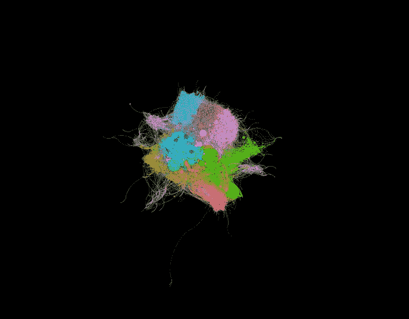

Twitter network of verified users with over 1 million followers. Circles (nodes) represent users and the lines connecting the circles represent one user “following” another. Colors represent classes determined through modularity clustering.

虽然“假新闻”在互联网时代之前就已经存在[很久](https://www.politico.com/magazine/story/2016/12/fake-news-history-long-violent-214535) [了，但今天似乎比以往任何时候都更难确定新闻来源的可靠性。在对这个话题做了一些研究后，我发现有人正在用](https://en.wikipedia.org/wiki/Propaganda)[图论](https://en.wikipedia.org/wiki/Graph_theory)做一些[的工作](https://arxiv.org/pdf/1804.10233.pdf)，看看我们是否可以使用机器学习来帮助检测假新闻的来源。我对网络的力量和我们可以从中获得的信息非常感兴趣，所以我决定看看是否可以建立一个分类模型，在自我网络中找到模式，以检测假新闻。

# 什么是自我网络？

自我网络(在人类社会网络分析中也称为个人网络)由称为**自我**的焦点节点和与自我直接连接的称为 Alters 的节点组成，边显示自我与祭坛之间或祭坛之间的链接。自我网络中的每一个改变者都有自己的自我网络，所有的自我网络结合起来形成社会网络。在这样的网络中，自我可以是人，也可以是商业环境中的产品或服务。在下图中，我看到了所有 Twitter 认证用户的自我网络，这些用户拥有超过 100 万的追随者。每个圆圈代表一个经过验证的 twitter 用户节点(圆圈的大小与总粉丝数有关)，连接它们的线或边代表彼此“追随”的节点(感谢为我提供 Twitter 边列表的 [Luca Hammer](https://github.com/lucahammer) )。请务必查看他的[媒体](https://medium.com/@Luca)中关于探索和可视化网络数据的精彩帖子。这个图形可视化，以及您将在本文中看到的所有其他图形可视化，都是使用 [Gephi](https://gephi.org/) 创建的。

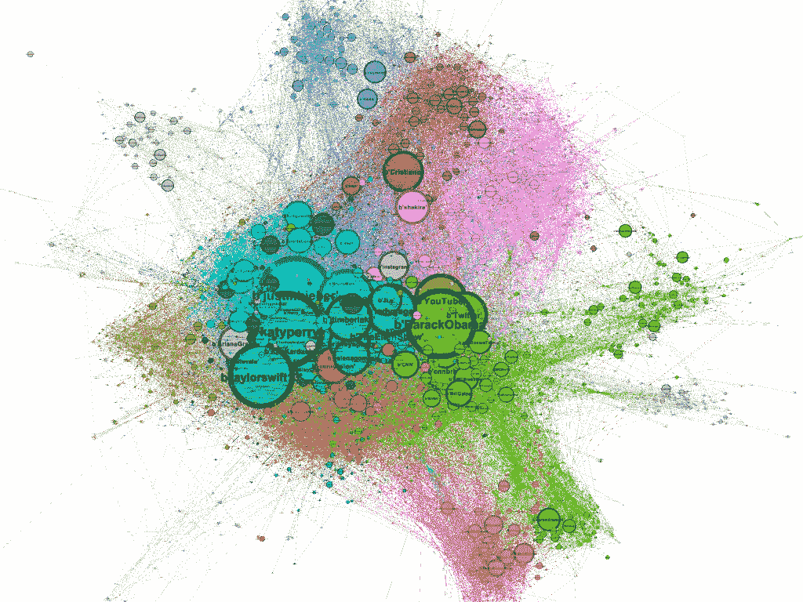

出于这个项目的目的，我决定分析严格验证的 Twitter 网络，因为我觉得用户有一种自然的趋势，即更信任 Twitter 官方验证的来源。

# 训练数据问题:我如何决定哪些节点代表假新闻源？

在这个项目开始时，我面临的最大问题可能是如何确定哪些 Twitter 帐户被归类为我的训练数据的假新闻来源。没有一个普遍认可的方法来确定新闻是否是假新闻，如果有，它首先就不是一个问题。但是我必须从某个地方开始。幸运的是，我能够在 ICWSM 2015 年论文[“cred bank:一个带有相关可信度注释的大规模社交媒体语料库”](http://comp.social.gatech.edu/papers/icwsm15.credbank.mitra.pdf)附带的 [CREDBANK](https://github.com/tanumitra/CREDBANK-data) 数据中找到一个奇妙的数据集。如果你有时间，我强烈建议看看报纸，但这里有 TLDR:

> 总的来说，CREDBANK 由 6000 多万条推文组成，分为 1049 个现实世界的事件，每个事件都由 30 名[亚马逊机械土耳其](https://www.mturk.com/)的工作人员进行注释以提高可信度(以及他们选择注释的理由)。CREDBANK 的主要贡献是编制了一个独特的数据集，以系统和全面的方式将社交媒体事件流与人类可信度判断联系起来

通过将这个数据集与 Twitter 网络数据相结合，我能够创建自己的数据集来训练分类模型。该数据包括 69，025 个经过验证的用户，以及他们之间的所有连接。在这些用户中，66，621 个被确定为真实新闻的来源，2，404 个被确定为虚假新闻的来源。我认为是假的消息来源是那些超过 5%的推文被亚马逊土耳其人可信度评级机构评为部分准确以下的人。

# 网络 EDA

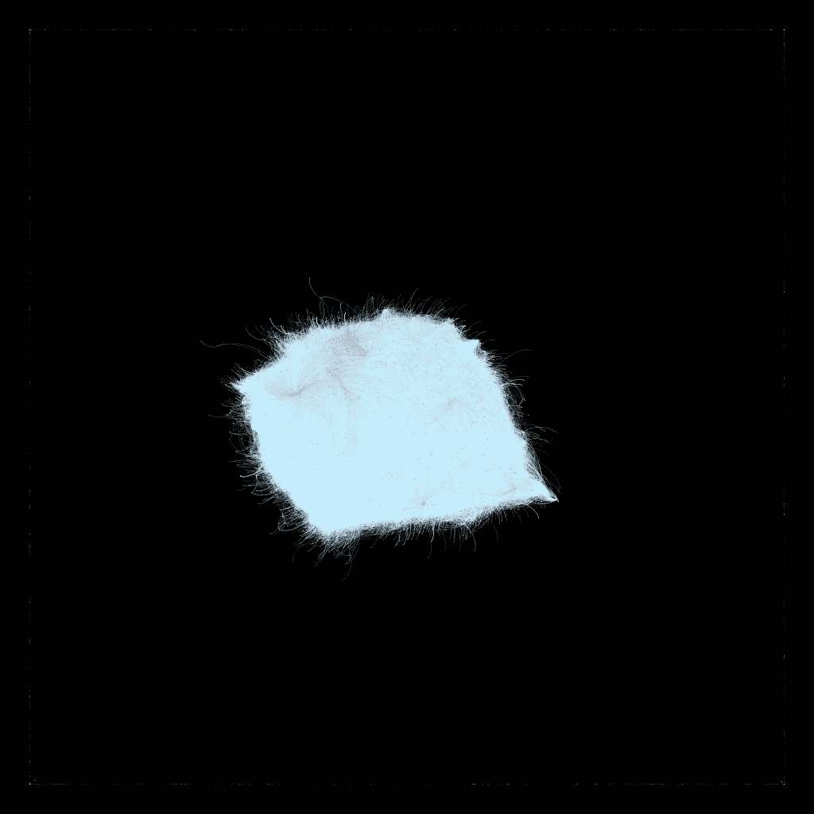

This is the network graph of all sources in my dataset. Blue dots and lines represent NOT fake sources and red dots and lines represent fake sources.

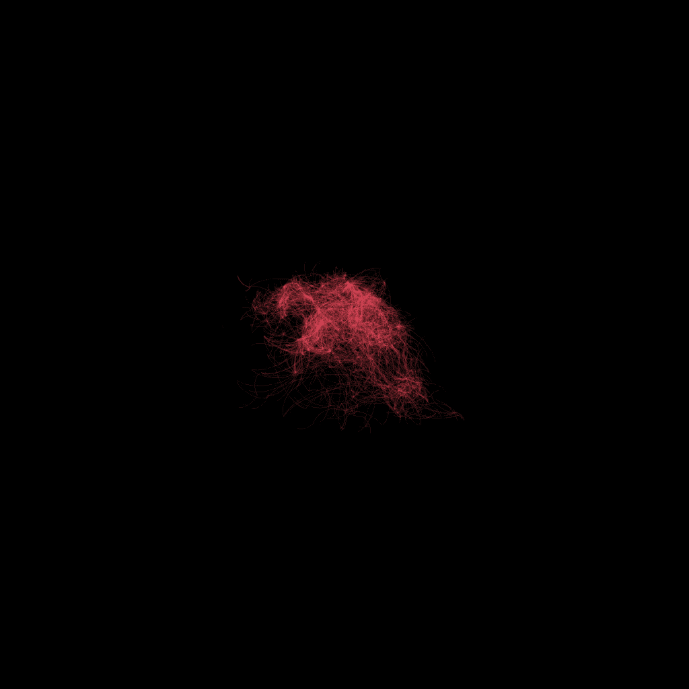

Same graph as above, but with fake sources only

在收集和组织数据之后(我使用图形数据库 [Neo4j](https://neo4j.com/) 来存储网络数据)，第一步是对网络数据进行初步的探索性分析。在我最初的分析中，我使用了两种网络算法，特征向量中心性和 PageRank。特征向量中心性算法仅在数据样本上运行，因为在大型网络上计算中心性度量需要相当长的时间。

> 特征向量中心性是网络中节点影响力的度量。基于到高得分节点的连接比到低得分节点的同等连接对所讨论节点的得分贡献更大的概念，相对得分被分配给网络中的所有节点。高特征向量分数意味着一个节点连接到许多本身具有高分数的节点。
> 
> PageRank 被广泛认为是一种检测图中有影响力的节点的方法。它不同于其他中心性算法，因为一个节点的影响取决于其邻居的影响。
> 
> 来源-[https://github . com/neo4j-graph-analytics/graph-algorithms-notebooks](https://github.com/neo4j-graph-analytics/graph-algorithms-notebooks)

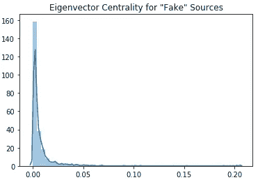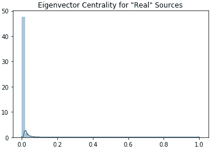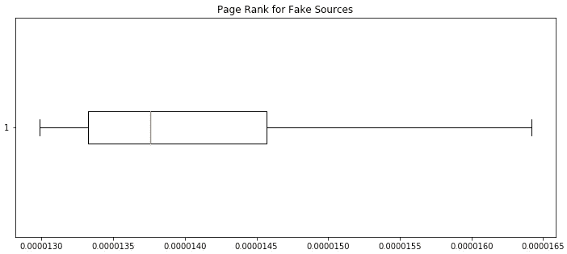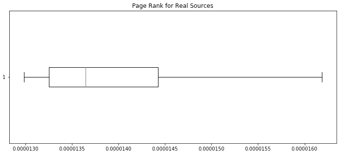

我使用 Python 库 [NetworkX 的](https://networkx.github.io/)实现这些算法来确定上面显示的统计数据。

如您所见，尽管真实源的特征向量中心性度量的分布要大得多，但总体而言，虚假源和真实源的数字非常相似。我将不得不寻找一些其他的方法来区分这两种类型的节点。

# 通过鲁汶社区检测进行聚类

社区检测的 Louvain 方法是一种用于检测网络中的社区的算法。它最大化每个社区的模块性得分，其中模块性通过评估社区内的节点与它们在随机网络中的连接程度相比有多密集来量化节点到社区的分配的质量。

我决定在网络数据上运行这个算法，看看是否有假的来源被放在类似的类中。在下面的第一幅图中，我用每个节点被分配到的类的颜色来可视化网络图。第二张图片只包含假消息来源。

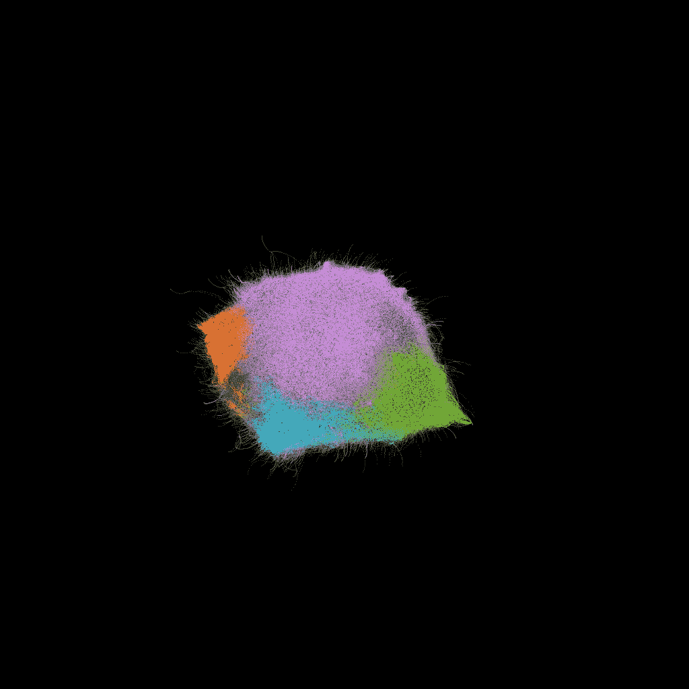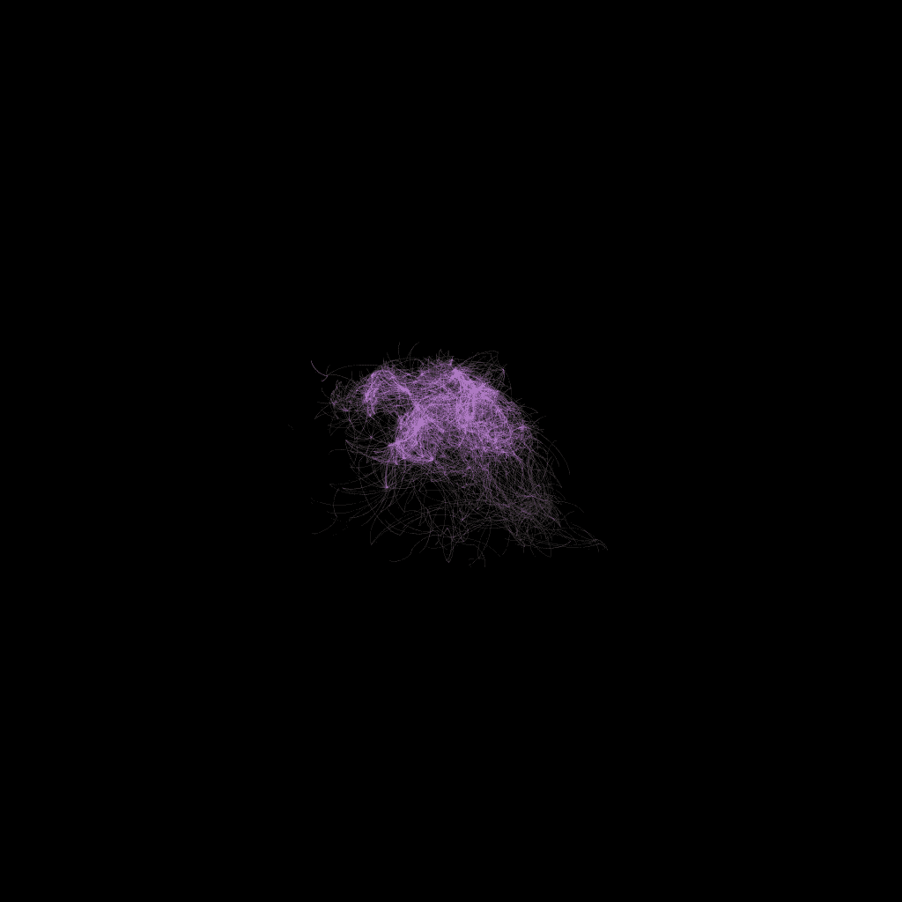

看起来绝大多数的假新闻来源被放在了紫绿类，很明显所有的假新闻来源主要位于网络图的一个区域。这确实很好地消除了 25838 个真实来源(通过这种聚类方法将 25838 个节点放在没有任何虚假来源的类中)，但仍然不足以完全隔离虚假新闻来源。为此，我不得不求助于 node2vec。

# Node2Vec

根据[斯坦福网络分析项目](https://snap.stanford.edu/)，node2vec 的创建者:

> node2vec 框架通过优化邻域保持目标来学习图中节点的低维表示。目标是灵活的，并且该算法通过模拟有偏的随机行走来适应网络邻域的各种定义。具体来说，它提供了一种平衡探索-开发权衡的方法，这种权衡反过来又导致表示服从从同质到结构等价的等价谱。

基本上，node2vec 算法将使我能够在不止一个维度(具体来说，对于这个项目，是 128 个维度)上嵌入所有节点，作为为图上的节点位置设计新功能的一种方式。对于我的模型，我使用了[算法的这个](https://github.com/eliorc/node2vec)实现。

以下是我选择的参数:

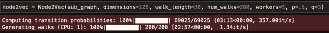

不幸的是，即使为每个节点设计了这 128 个新特性，我最初建立分类模型的尝试也没有成功。由于大的类别不平衡(不到 4%的节点是假源)，我的算法总是预测所有的源是真实的。我需要一些其他的区别特征来帮助这些分类算法。

# 单词嵌入

node2vec 的想法实际上来自单词嵌入，这是一种矢量化策略，通过训练神经网络从文本语料库中计算单词向量，从而产生高维嵌入空间，其中语料库中的每个单词都是该空间中的唯一向量。在这个嵌入空间中，向量相对于其他向量的位置捕获语义。

我决定在递归神经网络中使用每个 Twitter 用户的档案描述进行分类。网络内部的嵌入层计算单词嵌入向量。这个神经网络的输出将是 Twitter 账户描述来自真实或虚假账户的概率。然后，我将结合 node2vec 的特征使用这些概率来构建最终的集成分类模型。以下是递归神经网络的细节:

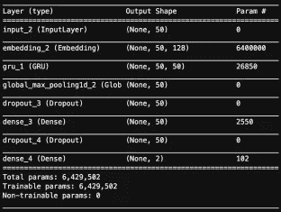

Model Summary

# 最终分类模型

我使用 node2vec 的特征和神经网络的概率对支持向量机和 XGBoost 模型进行了网格搜索。由于高类别不平衡(预测所有“真实”将导致大约 96.5%的准确率)，我决定将我的搜索集中在具有高[召回率和高](https://en.wikipedia.org/wiki/Precision_and_recall)准确率的模型上。

## XGBoost 和 SVM 网格搜索结果

下图显示了我的 XGBoost 和 SVM 分类器的最佳参数，以及最终模型的混淆矩阵:

## XGBoost

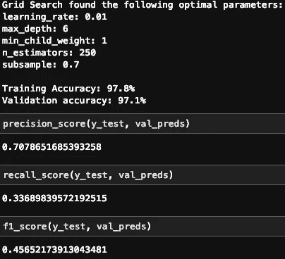

## SVM

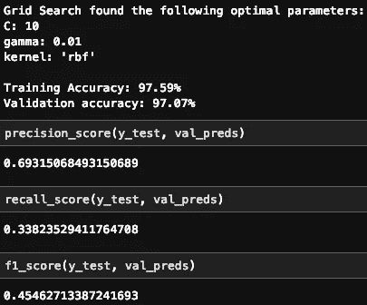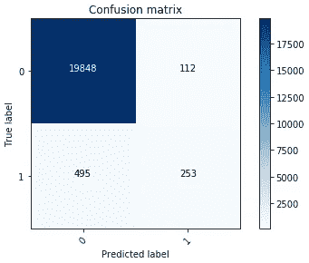

正如你在上面看到的，XGBoost 模型在精确度上表现稍好，而 SVM 模型在召回率上表现稍好。

# 结论

这些分类模型表现得相当好，尤其是考虑到大的类别不平衡。很明显，单词嵌入功能在模型检测真阳性的能力方面有很大的不同。虽然我想严格根据网络特征对节点进行分类，但可能不足以区分那些被分类为假的节点。然而，我确实认为网络分析在检测假新闻方面有很大的潜力。我遇到的一些问题只是与网络的巨大规模有关(正如我之前提到的，由于其规模，我无法计算整个网络的中心性度量)，并且在数据中肯定会发现更多的模式。

如果你想查看我的项目回购和我的全部分析，你可以在这里找到:[https://github.com/briansrebrenik/Final_Project](https://github.com/briansrebrenik/Final_Project)

使用的工具:

*   [Neo4j 图形数据库](https://neo4j.com/)
*   [Gephi](https://gephi.org/)
*   斯坦福网络分析项目的 Node2Vec
*   [Node2Vec 算法实现](https://github.com/eliorc/node2vec)
*   [网络 X](https://networkx.github.io/)
*   [Keras](https://keras.io/)
*   [纸张空间渐变](https://www.paperspace.com/gradient)

数据来源:

*   来自 [Credbank](http://compsocial.github.io/CREDBANK-data/) 的“假新闻”数据
*   推特网边缘来自[卢卡·哈默](https://github.com/lucahammer)