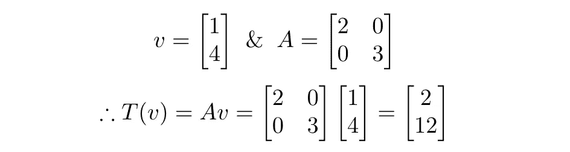
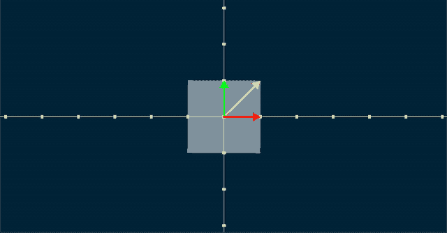

# 特征向量和特征值——你需要知道的一切

> 原文：<https://towardsdatascience.com/eigenvectors-and-eigenvalues-all-you-need-to-know-df92780c591f?source=collection_archive---------1----------------------->

Image by joiom - [https://pixabay.com/illustrations/seamless-pattern-background-seamless-1822616/](https://pixabay.com/illustrations/seamless-pattern-background-seamless-1822616/)

# “Eigen”——词的起源

" [Eigen](https://www.dictionary.com/browse/eigen-) "是一个德语单词，意思是“自己的”、“合适的”或“有特点的”。

# 什么是特征向量和特征值？

让我们看看[维基百科](https://en.wikipedia.org/wiki/Eigenvalues_and_eigenvectors)对特征向量和特征值有什么说法:

> 如果 *T* 是从向量空间 *V* 经过[域](https://en.wikipedia.org/wiki/Field_(mathematics)) *F* 到自身的线性变换并且 **v** 是 *V* 中不是[零向量](https://en.wikipedia.org/wiki/Zero_vector)的向量，那么 **v** 是 *T* 的**特征向量**如果*T*(这个条件可以写成如下等式
> 
> **T ( v ) = λ v**
> 
> 其中 *λ* 是 *F* 域中的标量，称为**特征值**、**特征值**，或者与特征向量 **v** 相关联的**特征根**。

看起来很困惑，对吧？我们先分解一下，了解什么是线性变换。

# 线性变换

假设 A 是一个 m×n 大小的矩阵。给定一个向量

那么 t 是从 R^n 到 R^m 的线性变换

这是怎么用的？假设您想要沿 x 轴将 2d 向量缩放 2 倍，沿 y 轴缩放 3 倍。假设向量 v 是[1，4]，那么在缩放之后它应该是[2，12]。这可以通过以下方式完成:

对于一个向量来说，这可能看起来微不足道。但是假设您有 n 个想要缩放的 2d 向量，您可以通过一次矩阵乘法操作一次转换所有这些向量。线性变换广泛应用于计算机图形学、游戏引擎、统计学等领域。

这种操作不仅仅限于缩放，我们还可以将线性变换矩阵用于翻转矢量、旋转矢量、剪切矢量等。如果你对这个话题感到不舒服，我推荐你看一下 3Blue1Brown 关于线性变换的教程。

# **回到特征向量和特征值**

假设我们在 2d 空间中有一个正方形，正方形上的每个点都是一个向量，我将只使用 3 个向量，如下所示。

假设我们沿着 y 轴将正方形缩放 2 倍，如下所示

Scaling by a factor of 2 along y-axis

如果你注意到*红色* *矢量*在线性变换后具有相同的比例和方向。*绿色矢量*的比例发生变化，但方向仍然相同。而*黄色向量*既没有相同的比例，也增加了与 x 轴的角度，因此其方向也改变了。如果我们仔细观察，除了红色矢量*和绿色矢量*之外，其他所有矢量的方向都改变了。因此我们可以说红色和绿色向量是特殊的，它们是这个线性变换的**特征** **。这些向量被称为该线性变换的**特征向量**。并且它们由于变换而在尺度上的变化被称为它们的**特征值**。其中对于*红色矢量*的特征值是 1，因为它的比例在变换前后是恒定的，而对于*绿色矢量*，它的特征值是 2，因为它放大了 2 倍。****

让我们看看另一个线性变换，我们沿着 x 轴剪切正方形。

Shear along x-axis

如果你猜红色向量是本征向量，你猜对了，它的本征值是 1。

如果我们顺时针旋转这个正方形 90 度。

Rotate by 90 degrees clockwise

这里没有特征向量(学术人士会认为这种情况下有复杂的特征向量，但这已经超出了本文的范围，所以为了简单起见，我们还是坚持没有特征向量的情况)。如果我们把正方形旋转 180 度，而不是 90 度。

Rotate by 180 degrees clockwise

这里所有的向量和三个彩色向量都是特征值为-1 的特征向量。

让我们来看一个特例，我们沿着 x 轴和 y 轴相等地缩放正方形。

Scaling equally along x and y axis

这里所有的向量都是特征向量，它们的特征值就是比例因子。

现在让我们回到[维基百科对特征向量和特征值的](https://en.wikipedia.org/wiki/Eigenvalues_and_eigenvectors)定义:

> 如果 *T* 是从向量空间 *V* 经过[域](https://en.wikipedia.org/wiki/Field_(mathematics))F 到自身的线性变换，并且 **v** 是 *V* 中不是[零向量](https://en.wikipedia.org/wiki/Zero_vector)的向量，那么 **v** 是 *T* 的**特征向量**如果 *T* 这个条件可以写成如下等式
> 
> **T ( v ) = λ v**
> 
> 其中 *λ* 是域 *F* 中的标量，称为与特征向量 **v** 相关联的**特征值**、**特征值**或**特征根**。

让我们看看这个等式是如何工作的，在第一种情况下，我们沿着 y 轴将一个正方形缩放了 2 倍，其中*红色向量*和*绿色向量是*特征向量。

Scaling by a factor of 2 along y axis

线性变换前:

线性变换后:

我们可以使用下面的等式显示线性变换后的结果:

让我们把这个问题扩大到三维。假设我们沿着 z 轴旋转一个立方体，那么沿着 z 轴的向量就是特征值为 1 的特征向量。

如果我们超过 3 维，就很难想象和计算出特征向量。即使在 2d 或 3d 中的某些情况下，也不是那么容易。那么我们如何计算特征向量呢？

我们知道对于任何特征向量 v，

假设变换矩阵是 a。因此，

从以上两个等式我们可以推断出，

将这些术语放在一起，

现在λ只是一个标量。因为 A 是一个矩阵，如果我们能把它转换成一个矩阵，我们就可以把 v 作为一个公式化。为此，我们可以将λ乘以单位矩阵 I。因此，

现在，对于右侧的 0，要么(A-λI)应该是 0，要么/和 v 应该是 0。但是如果你还记得特征向量的定义，它是非零向量。所以(A-λI)应该总是 0，v 才是特征向量。我们可以通过计算矩阵的行列式来计算矩阵运算是否为 0。

因此，

让我们用同样的例子来看看这是否可行，即沿着 y 轴将一个正方形缩放 2 倍。

这里，变换矩阵 A 可以表示为:

现在我们知道了，

输入 A 的值并进一步求解:

我们知道，

求解λ = 1，我们得到:

这意味着对于 v2=0 任何向量，该向量是特征值为 1 的特征向量。对于任何垂直矢量都是如此，在我们的例子中是红色矢量。

求解λ = 2，我们得到:

这意味着对于 v1=0 任何向量，该向量是特征值为 2 的特征向量。对于任何垂直矢量都是如此，在我们的例子中就是*绿色矢量。*

# 特征向量的重要性

特征值在数学中如此重要的原因太多了。以下是我现在想到的一些应用:

*   主成分分析在降维和目标/图像识别中的应用。(参见 [PCA](https://en.wikipedia.org/wiki/Principal_component_analysis)
*   通过计算图像的特征向量进行人脸识别(见[特征脸](http://en.wikipedia.org/wiki/Eigenface))。
*   物理学——稳定性分析，旋转体的物理学(见[稳定性理论](https://en.wikipedia.org/wiki/Stability_theory))。
*   谷歌用它来为你的搜索结果排名页面[(见 PageRank](http://en.wikipedia.org/wiki/PageRank) )。

# 实际的失误

华盛顿州的[塔科马海峡大桥](https://en.wikipedia.org/wiki/Tacoma_Narrows_Bridge)在建造了 4 个月后于 1940 年倒塌。这被拍成电影，后来被戏称为“盖尔平”。

它的崩溃可以用特征值来解释。在许多大学物理教科书中，该事件被描述为基本强迫共振的例子，风提供了与自然结构频率相匹配的外部周期频率，即使桥梁故障的真正原因是气动弹性颤振，而不是共振。不要进入辩论，坚持这个博客的目的是解释特征向量和特征值，这个自然频率可以用最小幅度的特征值来表征。

我希望你现在理解了特征向量和特征值背后的理论。如果你想获得更多关于特征向量的直觉，我推荐这个视频教程