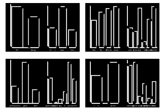
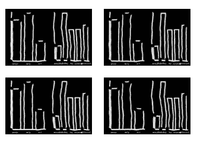
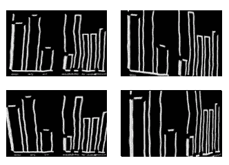
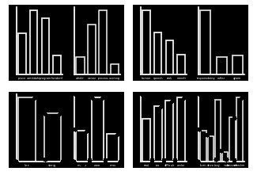

# 图像的弹性变形

> 原文：<https://towardsdatascience.com/elastic-deformation-on-images-b00c21327372?source=collection_archive---------16----------------------->

当前技术发展如此之快，我们的处理能力比以往任何时候都强。我们现在能够保存大量的数据，并对它们进行处理以获得相关信息。然而，即使我们有强大的硬件基础设施，如果我们没有足够的数据来训练我们的算法，我们也无法取得令人满意的结果。数据是 ML 和 DL 问题中最重要的部分。如果我们没有庞大的数据集，这些领域的所有快速发展都是不可能的。

大多数情况下，我们无法找到大量不同的数据类型，我们需要从现有的数据集创建新的数据集。为此，我们可以应用几种技术和算法。今天，我将主要关注图像数据集。图像用于物体检测、图像分类等几个问题。我们需要训练我们的模型同一对象类型的许多不同版本，以便为将来的目的快速确定它。然而，我们可能没有足够的数据集，这是大多数问题的瓶颈。

为了解决这个问题，我发现了一个非常棒的 Python 库。它被称为“增强器”。它有许多不同的技术来从数据集生成新的图像。Augmentor 真的很快，它每秒可以创建大约 100 张图像。它能自动增强图像。我用 Augmentor 用几种技术来创建手绘的条形图。首先，您可以通过以下方式快速安装 Augmentor

```
pip install Augmentor
```

之后，您需要将它添加到您的项目中，并创建一个管道。流水线只是图像操作的一系列操作。

```
import Augmentor
p = Augmentor.Pipeline('./pathToImages')
```

一旦实例化了管道对象，就可以向其中添加操作。你可以在这里找到增强器文档。操作示例有:

```
p.rotate(probability=0.7, max_left_rotation=10, max_right_rotation=10) 
p.zoom(probability=0.5, min_factor=1.1, max_factor=1.5)
```

每个操作都有一个概率值，用于指定一旦图像通过管道，应用该操作的可能性有多大。

如果您想随机应用类似鱼眼的操作，并且不想旋转或缩放以保留一些图像特征，我会推荐这样的管道:

```
p.random_distortion(probability=1, grid_width=3, grid_height=3, magnitude=5)
p.gaussian_distortion(probability=1, grid_width=3, grid_height=3, magnitude=5, corner='bell', method='in')
```

我将把这条管道应用到我的数据集中。下面是我的数据集中的一个例子:



它创建了惊人的图像数据集。当我将示例结果应用于反色 Python 绘图时，我会分享它们。



管道准备就绪后，您可以通过以下方式调用来创建数据集:

```
p.sample(10000)
```

简单地说，它使用您的数据集创建随机增强的 10.000 图像样本，并扩展您的限制。默认情况下，它们存储在目录的输出文件夹中，但是您可以在实例化管道对象时更改它。如果您只想处理一次图像以对数据集应用操作，则可以调用:

```
p.process()
```

你可以用它来裁剪或调整你的图像，为此你还需要给你的操作赋予概率 1。

Augmentor 还提供了许多不同的其他操作。您可以对图像应用几何和透视变换。但是，这些转换可能会导致图像上的信息丢失，如下图所示。

```
p.shear(0.5, 10, 10)  #Size Preserving Shearing
p.skew_tilt(0.5, magnitude=0.2) #Perspective Transforms
```



在这些例子中，我也使用随机删除角，因为大多数时候人们不会在绘图中画出完美的形状，而边缘在真实的绘图中也不会出现。为了实现这个想法，您可以使用一个简单的函数，如；

```
def remove_corners(image):
    img=cv2.imread(image,0)
    corners = cv2.goodFeaturesToTrack(img, 100, 0.01, 10)
    corners = np.int0(corners)

    for corner in corners:
        n = random.randint(1,4)
        if(n != 3):
            x,y = corner.ravel()
            cv2.circle(img,(x,y),3,255,-1)
    return img
```

我将此功能应用于文件夹中的图片。顶部的图像是源数据集，下面是应用了“移除角点”功能的图像。



OpenCV 很容易做到这一点。它读取图像，找到图像内部的角点，并对它们进行着色，以消除它们。我添加了简单的概率方法来从均匀分布中确定 75%的角点，并移除它们以向我们的数据集添加一些随机方法。