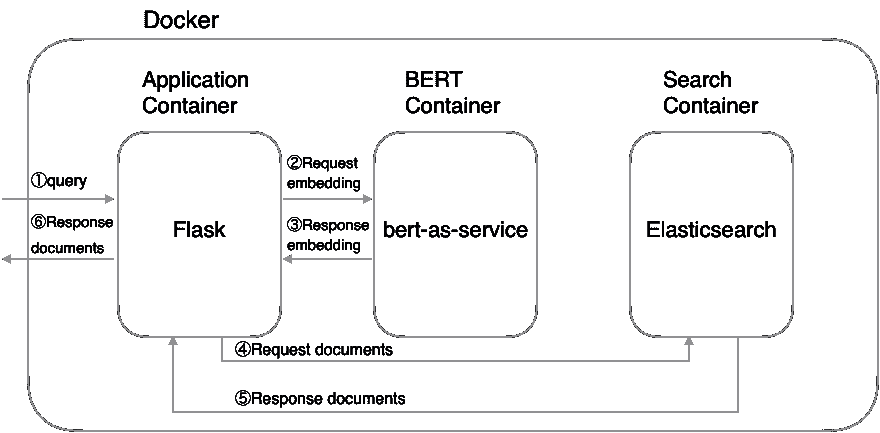

# Elasticsearch 遇见 BERT:用 Elasticsearch 和 BERT 构建搜索引擎

> 原文：<https://towardsdatascience.com/elasticsearch-meets-bert-building-search-engine-with-elasticsearch-and-bert-9e74bf5b4cf2?source=collection_archive---------7----------------------->

在这篇文章中，我们使用一个预先训练好的 BERT 模型和 Elasticsearch 来构建一个搜索引擎。Elasticsearch 最近发布了[带矢量场的文本相似度搜索](https://www.elastic.co/jp/blog/text-similarity-search-with-vectors-in-elasticsearch)。另一方面，您可以使用 BERT 将文本转换成固定长度的向量。所以一旦我们用 BERT 把文档转换成向量，存入 Elasticsearch，就可以用 Elasticsearch 和 BERT 搜索相似的文档。

本文通过以下架构实现了一个包含 Elasticsearch 和 BERT 的搜索引擎。这里我们用 Docker 把整个系统分为三个部分:应用、BERT、Elasticsearch。目的是使每项服务更容易扩展。



System Architecture

我在这篇文章中只展示了重要的部分，但是整个系统都是在下面的 GitHub 库中用`docker-compose.yaml`编写的。请查看存储库:

*   [https://github.com/Hironsan/bertsearch](https://github.com/Hironsan/bertsearch)

这个职位的计划是:

1.  下载预先训练好的 BERT 模型
2.  设置环境变量
3.  下水码头集装箱
4.  创建弹性搜索索引
5.  创建文档
6.  索引文件

# 1.下载预先训练好的 BERT 模型

首先，下载一个预先训练好的 BERT 模型。以下命令是下载英语模型的示例:

```
$ wget [https://storage.googleapis.com/bert_models/2018_10_18/cased_L-12_H-768_A-12.zip](https://storage.googleapis.com/bert_models/2018_10_18/cased_L-12_H-768_A-12.zip)
$ unzip cased_L-12_H-768_A-12.zip
```

# 2.设置环境变量

你需要设置一个预先训练好的 BERT 模型和 Elasticsearch 的索引名作为环境变量。这些变量在 Docker 容器中使用。下面是一个将 *jobsearch* 指定为索引名和*的示例。/cased_L-12_H-768_A-12* 作为模型的路径:

```
$ export PATH_MODEL=./cased_L-12_H-768_A-12
$ export INDEX_NAME=jobsearch
```

# 3.启动码头集装箱

现在，让我们使用 Docker compose 启动 Docker 容器。这里要启动三个容器:应用程序容器、BERT 容器和 Elasticsearch 容器。查看 [docker-compose.yaml](https://github.com/Hironsan/bertsearch/blob/master/docker-compose.yaml) 了解更多详情。

```
$ docker-compose up
```

注意，我建议你应该给 Docker 分配更多的内存(8GB 以上)。因为 BERT 容器需要大内存。

# 4.创建弹性搜索索引

您可以使用 create index API 向 Elasticsearch 集群添加新的索引。创建索引时，可以指定以下内容:

*   索引的设置
*   索引中字段的映射
*   索引别名

例如，如果您想要创建带有`title`、`text`和`text_vector`字段的`jobsearch`索引，您可以通过以下命令创建该索引:

```
$ python example/create_index.py --index_file=example/index.json --index_name=jobsearch
# index.json
{
  "settings": {
    "number_of_shards": 2,
    "number_of_replicas": 1
  },
  "mappings": {
    "dynamic": "true",
    "_source": {
      "enabled": "true"
    },
    "properties": {
      "title": {
        "type": "text"
      },
      "text": {
        "type": "text"
      },
      "text_vector": {
        "type": "dense_vector",
        "dims": 768
      }
    }
  }
}
```

注意:`text_vector`的`dims`值必须与预训练的 BERT 模型的 dims 相匹配。

# 5.创建文档

一旦创建了索引，就可以为一些文档编制索引了。这里的要点是使用 BERT 将文档转换成矢量。产生的矢量存储在`text_vector`字段中。让我们将您的数据转换成一个 JSON 文档:

```
$ python example/create_documents.py --data=example/example.csv --index_name=jobsearch
# example/example.csv
"Title","Description"
"Saleswoman","lorem ipsum"
"Software Developer","lorem ipsum"
"Chief Financial Officer","lorem ipsum"
"General Manager","lorem ipsum"
"Network Administrator","lorem ipsum"
```

完成脚本后，您可以获得如下所示的 JSON 文档:

```
# documents.jsonl
{"_op_type": "index", "_index": "jobsearch", "text": "lorem ipsum", "title": "Saleswoman", "text_vector": [...]}
{"_op_type": "index", "_index": "jobsearch", "text": "lorem ipsum", "title": "Software Developer", "text_vector": [...]}
{"_op_type": "index", "_index": "jobsearch", "text": "lorem ipsum", "title": "Chief Financial Officer", "text_vector": [...]}
...
```

# 6.索引文档

将数据转换成 JSON 后，可以将 JSON 文档添加到指定的索引中，并使其可搜索。

```
$ python example/index_documents.py
```

# 7.打开浏览器

去 [http://127.0.0.1:5000](http://127.0.0.1:5000/) 。下面是一个求职的例子。你可以看到“我在找律师”查询返回类似“法律助理”和“律师”的工作。


# 结论

在这篇文章中，我们用 Elasticsearch 和 BERT 实现了搜索引擎。虽然 BERT 的执行速度有问题，但是像这种架构一样把 BERT 当成一个独立的容器，很容易伸缩，所以我认为问题是可以解决的。希望这篇文章对你有用。

*   [https://github.com/Hironsan/bertsearch](https://github.com/Hironsan/bertsearch)