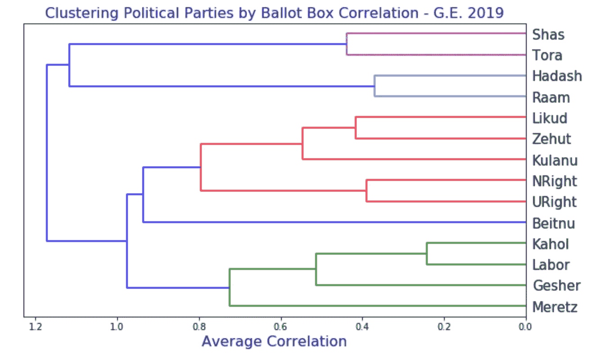
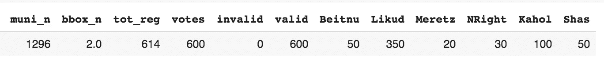
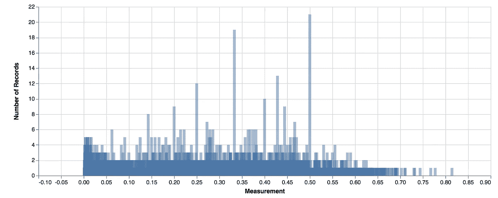
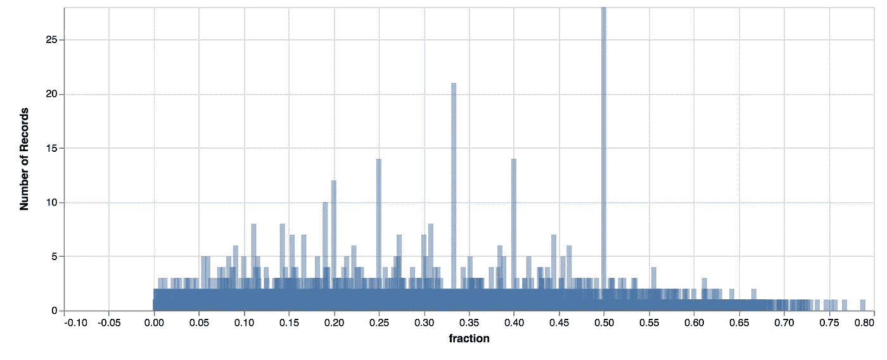
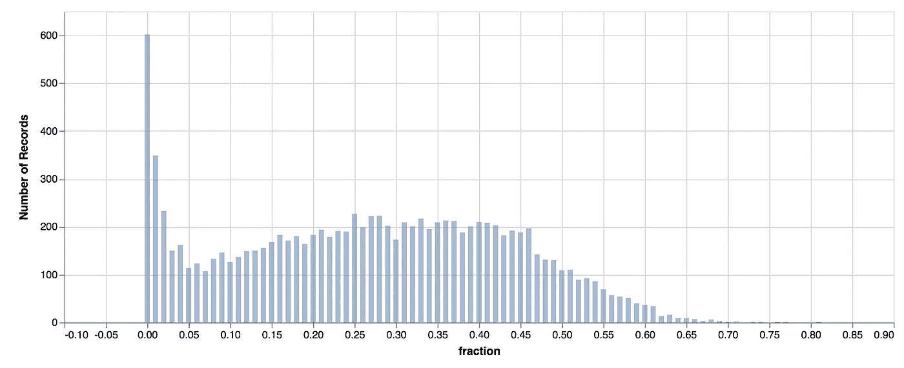
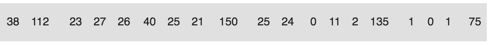
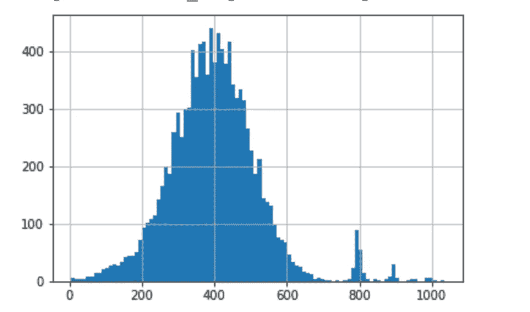
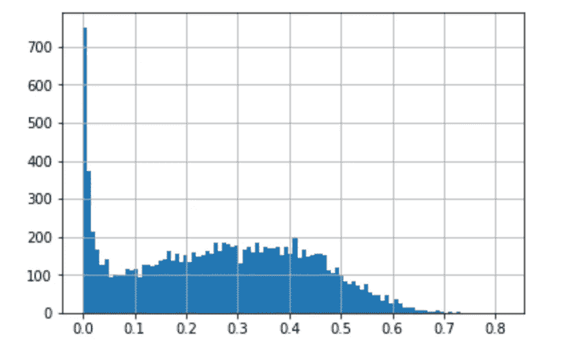

# 对一些可疑统计数据的天真解释；大选数据探索。(第一部分)

> 原文：<https://towardsdatascience.com/election-data-exploration-israel-2019-general-election-cd3c2b0f2f05?source=collection_archive---------26----------------------->

## 放眼 2019 年以色列大选。当然，有些结果看起来很奇怪，但是有证据证明确实存在渎职行为，或者有更简单的解释吗？

我最喜欢的统计学类比(Cassie Kozyrkov 所做的)是对英美法律体系的类比。
**【无效假设】**被推定无罪(导致无罪释放)，而对其的拒绝只能是因为提出了“排除合理怀疑”的有罪证据**。**“我们选择的 P 值是超出合理怀疑的水平。(视所涉问题而有所不同)

你的故事始于社交媒体上的一个帖子。在一个特定的投票站，下面的“异常”正在流传。
所有政党都得到了“非常整数”的选票

**

*这些看起来确实很可疑。好了，我们开始吧。*

## ****TL；*博士和免责声明***

**在这个多部分系列中，在某些情况下，我将能够对* ***表面上可疑的结果*** *给出简单、无辜的数学解释。在其他情况下我不会。注意，投票箱有一万多个，所以* ***即使是罕见的数值异常，预计*** *也会出现几次。**

## *入门指南*

*我开始寻找其他异常。也许整数太明显了，但是一个政党获得三分之一选票的几率有多大呢？一半？*

## *直方图时间*

**

***True Data:** Here is a histogram of the vote fraction of a specific party in all polling stations; **Note** the most common values are reduced small rationals: 1/2, 1/3, 3/7, 1/4, 2/5, 1/5, 4/9\. weird, right?*

## *谋杀吗？！？我们“抓到他们”了吗？*

*在我回答之前，你能不能想出一个解释来解释为什么恰好 1/2 这么受欢迎？[花一分钟时间]*

*[节拍]*

*好吧，小有理分式有更多的优势。300 个中有 100 个，303 个中有 101 个，这样就可以得到**正好是**的 1/3。但是要得到 200/601，你必须有一个非常具体的选票统计，和一个非常具体的政党的选票统计。所以这些价值观并不常见。这足以解释这件怪事吗？下面是一个简单模型的结果(我们随机选择投票站的总票数，以及特定政党的总票数，给定该政党的全国总票数)*

**

*The small rationals making an appearance again, even in a **random model**. (described in appendix B)*

## *无损直方图*

*那么，现在我们对数据中的这些有理数有了一个简单的解释，那么看待我们的数据有什么好的方法呢？如果我们让直方图从一开始就做它想做的事情，即绑定数据，会怎么样？如果我们取 100 个箱，我们可以看到箱 50 是否比箱 51 或 49 更有可能，从而做出判断。*

**

*Binning makes the rational anomalies disappear.*

*看起来我们没有足够的证据定罪。在零假设为真(没有捏造)的世界里，提出的证据实际上相当合理，一点也不令人惊讶。这并不是说没有一个计票结果被捏造并被设定为某个特定政党的 1/2 选票的情况，这只是**而不是看起来的阴谋**(几十个投票站同意相同的比例。)*

# *接下来*

*这篇文章将是系列文章的第一篇。在接下来的几周里，我将探索其他异常现象。
我将重温引发这一切的异常现象，并探索政党之间一些怪异的理性关系。(即一方获得另一方的 1/2 或两倍)*

*如果你注意到其他一些奇怪的线，你想让我看看，评论，我会看看。*

## *准备好*

*激起你对这一排选票的兴趣(来自一个投票站)。
注意重复出现的理性关系。例如**25–25–75–150**；**27–135**它还有数字 **21，23，24，25，25，26，27** 。可疑，当然。有罪？*

**

*Is that weird enough to be suspect or just a coincidence? **find out next week.***

# *附录 A —加载数据的代码。*

*每个投票站的计票结果都在这里[https://media21.bechirot.gov.il/files/expb.csv](https://media21.bechirot.gov.il/files/expb.csv)*

*这里有一些样本 python，用于加载该文件(11K 行)，并将列重命名为 English，这样您可以自己查看，并发现一些更可疑的结果。
还包括生成上述直方图的代码。*

* [## 谷歌联合实验室

### 编辑描述

colab.research.google.com](https://colab.research.google.com/gist/avishalom/e89aca0c1a852cc548db0d35a5c9ea8e/load-election-data.ipynb) 

# 附录 B 简化模型

拟合每个投票站的有效投票数的正态分布(以 400 为中心，sigma=100，忽略 800 处的峰值)

以及给定国家党分数的每个党的票数的泊松分布，从与该党每次投票的国家投票分数相匹配的分布中选取λ。

我知道这有点过于简单，例如，PCA 解释不同城市不同政党的投票趋势会更好。但是现在这已经足够好了，它为所有那些小的有理数提供了一个可行的理由。*