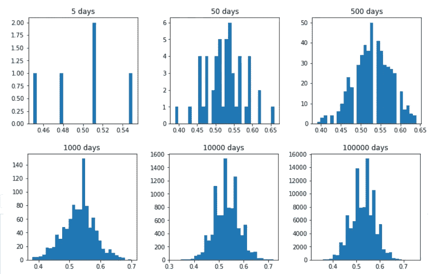
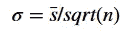
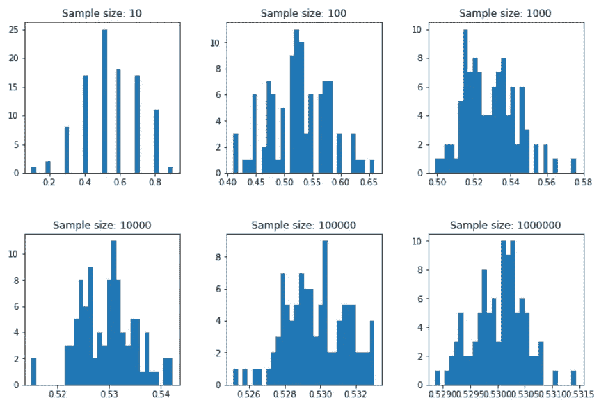
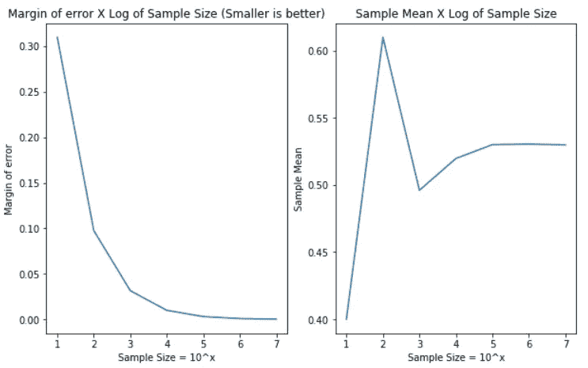

# 用 Python 实现选举投票模拟、误差幅度和中心极限定理

> 原文：<https://towardsdatascience.com/election-poll-simulation-margin-of-error-and-central-limit-theorem-with-python-43f96909a4c6?source=collection_archive---------10----------------------->

在学习中心极限定理(CLT)时，我错过了一些更基本的东西，比如一些显示样本大小如何影响该定理所告诉的结果的图表，它与选举投票等概念的关系以及一些相关代码。有很多很好的文章解释了什么是 CLT，为什么它很重要，以及它背后的数学原理，下面是我找到的一些很好的链接:

*   [理解中心极限定理](/understanding-the-central-limit-theorem-642473c63ad8)
*   [一个小样本能告诉我们大量人口的什么情况？—第一部分](/https-medium-com-aparnack-what-can-a-small-sample-teach-us-about-a-big-population-part-1-b7c048c22bf2)
*   [中心极限定理—维基百科](https://en.wikipedia.org/wiki/Central_limit_theorem)
*   [可汗学院统计课程视频](https://www.youtube.com/watch?v=JNm3M9cqWyc&list=PL1328115D3D8A2566&index=25)

在本文中，我更侧重于模拟选举投票，使用可变大小的样本，并将其作为中心极限定理的材料。在这篇文章的最后，你应该了解一些:

*   如何使用 Python 生成随机样本和简单图形；
*   什么是中心极限定理；
*   选举投票的人数如何影响其结果和对结果的信心；
*   如何选择样本的大小，以使您的投票或测试具有预期的误差幅度和置信度。

为了更好地使用本文，您还应该熟悉[正态分布和 Z 检验](https://en.wikipedia.org/wiki/Normal_distribution)，因为我们将使用它来分析我们的选举投票结果，并支持中心极限定理。

这里是 Kaggle 上这篇文章所用代码的链接。

# 模拟选举投票

注意:这段代码更侧重于演示而不是性能，有其他更快的方法来模拟这一点。

假设我们将在两个候选人 Alice 和 Bob 之间进行总统选举，并且我们想要尝试预测谁将是获胜者。假设有一个方法，如果一个人对 Alice 投票，则返回 1，否则返回 0。[注意，我使用了二项式分布生成器来创建伯努利](https://stackoverflow.com/questions/47012474/bernoulli-random-number-generator)随机变量:

This function should return 0 or 1 according to a Bernoulli Distribution with Mean = 0.53\. It is like a biased coin simulation.

如果我们能问世界上所有的人他们会投票给谁，我们就能发现获胜者和全体人口投票背后的分布。然而，这通常是不可能的，所以我们做选举民意调查，询问一小群人的意见，试图估计真实的人口结果。比方说，对于每一个不同的日子，我们能够从 n 个人那里获得投票选项:

This method could have an output with a list like this one: [1, 0, 0, 0, 0, 1, 1, 0, 1, 0]

然后假设，在 5 天的时间间隔内，我们每天采访 100 个人，询问他们的候选人是谁。这样，我们将有 5 个相同分布的不同样本，每个样本的大小为 100。由于读取一组 500 个元素并不简单，我将显示每天的平均值:

In my case I got this output [0.51, 0.48, 0.45, 0.51, 0.54], could we say that Alice would win with only those samples?

现在想象一下，我们有无限的金钱和时间，所以我们可以在 5 天、50 天、500 天、1000 天、10000 天和 100000 天做同样的事情。让我们看看使用直方图来总结结果会发生什么:

Result of the previous embedded code section

对于仅仅 5 天，直方图没有太大帮助，但是随着我们增加天数(样本)，我们可以开始看到一个钟形分布。

随着天数的增加，直方图应该开始变得越来越呈钟形，均值越来越接近人群的真实均值，这是一种直觉，因为大多数日子的样本均值应该与其原始分布相似。然而，正如您所看到的，我们不需要无限长的时间来猜测谁会在这种情况下获胜。

我之前提到的“直觉”可以用中心极限定理(CLT)来解释。[据维基百科](https://en.wikipedia.org/wiki/Central_limit_theorem):

> 中心极限定理(CLT)证明，在某些情况下，当添加独立的随机变量时，即使原始变量本身不是正态分布的，它们的正态和也趋向于正态分布(非正式的“钟形曲线”)。该定理是概率论中的一个关键概念，因为**它意味着适用于正态分布的概率和统计方法可以适用于许多涉及其他类型分布的问题。**

有很多文章解释了这个定理的数学背景及其结果，但是现在我想把重点放在这个定理在我们的选举投票例子中的实际应用上。

对我们来说，这个定理的重要结论是**如果你从任何概率分布中得到多个样本，这些样本的均值集合趋向于正态分布**。这样，我们就有了一个数学背景来假设任何采样结果都遵循正态分布。

现在你应该问“然后呢？”。对于任何给定的正态分布，如果我们知道它的均值和方差，我们可以找到一个大小为 2*Y [的值的区间，随机变量可能以 C%的概率](https://en.wikipedia.org/wiki/Standard_normal_table)假设该区间。例如，回到我们的选举投票，我们可以发现 Alice 会有 X%的选票，误差为 Y%,对我们的结果有 C%的信心。因此，如果我执行选举投票 100 次，C%*100 次，Alice 将以 X%的选票加上 Y%的误差幅度获胜。

让我们用一个有趣的公式来应用这些概念，这个公式是从中心极限定理推导出来的，用来求这些值。它让我们使用样本的平均值(s 条)和样本的大小(n)来估计真实总体平均值的标准差(σ):

当与真实总体平均值比较时，估计的标准偏差σ与我们估计的误差成比例。这样，理想的情况是σ为零。实现这一点的一个方法是增加样本量。在下面的直方图中，我将模拟多次投票，保持样本数量不变(100)，但增加样本大小 n，这与我在之前的直方图中所做的不同:

Result of the previous embedded code section

请注意，随着样本量的增加，x 轴间隔变得越来越小，条形越来越接近平均值，这表明我们获得了更精确的结果。在现实生活中，我们无法获得这样大小的样本，但是，**由于中心定理的限制，我们可以计算任何大小为 n 的样本的误差幅度，检查其显著性，如果幅度对我们来说不够大，就增加 n 值。**

为此，我们需要像处理正态分布一样处理数据。我们使用估计的标准偏差来应用 z 检验，找到满足我们期望的误差范围和期望的置信度的值的区间。回到第一天，从我的 100 人样本中，我可以说 Alice 将赢得 95%信心的误差幅度是多少？

得到这些值后，我们可以查阅标准的正态表，看看有多少标准差满足期望的置信度。基于这个[规则](https://en.wikipedia.org/wiki/68%E2%80%9395%E2%80%9399.7_rule)，我们知道两个标准差的间隔应该覆盖 95%的情况。

基于 z 测试的误差范围测试步骤:

*   获取样本；
*   计算样本均值和样本标准差；
*   利用中心极限定理求其与总体真实均值的估计标准差；
*   使用一个标准的正态表或者这个[规则](https://en.wikipedia.org/wiki/68%E2%80%9395%E2%80%9399.7_rule)来知道我们的区间应该包含多少标准差来满足我们期望的置信度；
*   因为我们想要 95%的置信度，我们需要 2 个标准差。

下面是对我们的选举投票方法执行 z 测试的方法:

Method to get the mean with some margin of error from our election poll simulation. For example, I got this output when I executed it in my machine: {‘error’: 0.09981983770774223, ‘mean’: 0.53}

如果当 n =100 时，您从最后一次代码执行中获得错误值，您会注意到它相当大(几乎 10%)，所以这对我们没有太大帮助，因为我们将有一个介于 43%和 63%之间的区间。

如果你还记得估算总体真实均值的标准差的公式，**你会注意到，当我们增加 n 时，我们减少了标准差。所以，这解释了为什么越来越多的人参与投票会给我们带来更精确的结果**。让我们分析一下在选举投票场景中增加样本量的影响:

Result of the previous embedded code section

在样本量为 10 的情况下，我们有几乎 30%的误差( *ergh* ！)，然后有 100 个人时，我们有 10%，我们开始从只有 1000 个人时得到好的值(3%)。当样本量大于或等于 1000 时，样本均值也稳定在 0.53 左右。

这是一个很好的结果，因为我们也可以使用一些预先计算的表格，如[这个](https://www.isixsigma.com/tools-templates/sampling-data/margin-error-and-confidence-levels-made-simple/)来发现我们应该使用哪个样本大小来获得所需的误差幅度，请注意，这些值几乎与我们在之前的图表中获得的值相同。

最后，我们可以说，如果我们以 95%的置信度对 10000 人进行民意调查，Alice 将以 53%的选票获胜，误差幅度为+-1%。让我们用我们的方法来检查这个结果:

This method call returned: {‘error’: 0.009978328316907597, ‘mean’: 0.5329} which is what I said on the previous paragraph, yay!

## CLT 之后呢？

现在，您已经了解了如何衡量您的投票、控制样本大小以及讨论其结果。这一知识的一个有趣的应用是进行[零假设检验](https://en.wikipedia.org/wiki/Null_hypothesis)(你可以在许多学术研究和 cia 中找到的那个著名的 **p 值**的来源)。

查看汗学院的视频[，了解如何对一个问题进行零假设检验，以检查一种新药是否真的有效。](https://www.youtube.com/watch?v=-FtlH4svqx4)

也请让我知道你对这个故事的想法，如果文本有错误，请发评论，或者如果你喜欢阅读，请点击鼓掌按钮。再见！