# Python 中函数式编程的要素

> 原文：<https://towardsdatascience.com/elements-of-functional-programming-in-python-1b295ea5bbe0?source=collection_archive---------0----------------------->

## 了解如何使用 Python 中的 lambda、map、filter 和 reduce 函数来转换数据结构。


Photo by [Markus Spiske](https://unsplash.com/@markusspiske?utm_source=medium&utm_medium=referral) on [Unsplash](https://unsplash.com?utm_source=medium&utm_medium=referral)

> “面向对象编程通过封装活动部分使代码可以理解。函数式编程通过最大限度地减少活动部分，让代码变得可以理解。”:[迈克尔·费哲](https://www.amazon.com/Working-Effectively-Legacy-Michael-Feathers/dp/0131177052/ref=as_li_ss_tl?ie=UTF8&qid=1470702619&sr=8-1&keywords=Working+with+Legacy+Code&linkCode=sl1&tag=devdaily-20&linkId=2fee99425a0027b3ac69953055fb9e9e)

世界上有多种编程语言，它们可以被分类的类别也是如此。一个**编程范例**就是这样一种方式，它试图根据编程语言的特性或编码风格对它们进行分类。编程范式本质上是一种编程风格或方式。

大多数时候，我们将 Python 理解为一种面向对象的语言，其中我们以类、对象和方法的形式对数据建模。然而，面向对象编程也有几种替代方案，函数式编程就是其中之一。

以下是业界流行的一些传统编程范例:

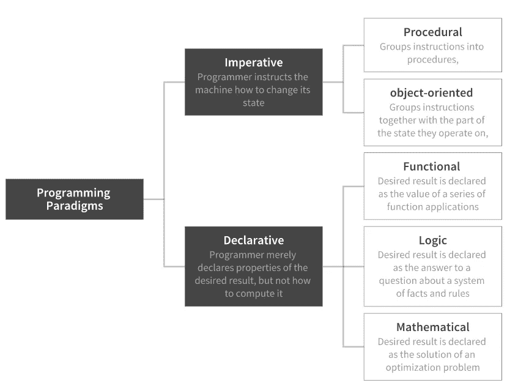

Conventional programming paradigms: Content Source [Wikipedia](https://en.wikipedia.org/wiki/Programming_paradigm)

# 函数式编程

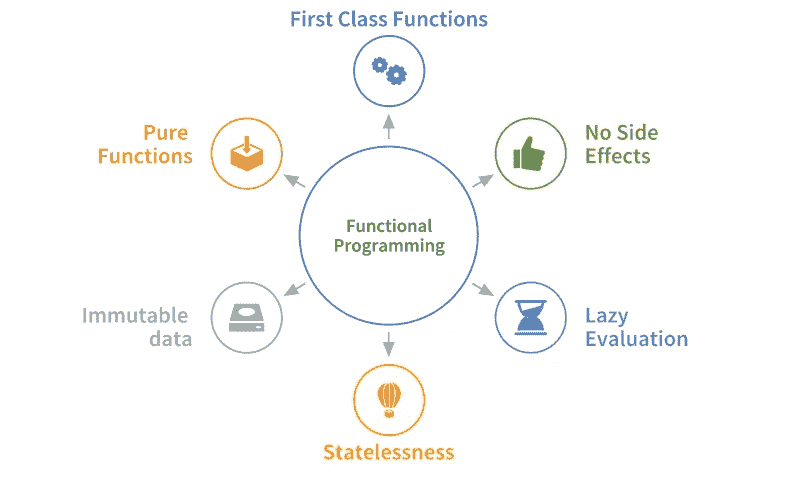

The Functional Programming Paradigm

根据维基百科， [*函数式编程*](https://en.wikipedia.org/wiki/Functional_programming) *是一种编程范式，一种构建计算机程序的结构和元素的风格，它将计算视为数学* ***函数*******避免*** *改变* ***状态*** *和* ***可变****

**上述定义起初听起来可能令人困惑，但它本质上试图提出以下几个方面:**

*   **FP 依赖于函数，一切都是用函数来完成的。此外，FP 关注于**定义**做什么，而不是执行一些动作。该范例的功能被视为**一级**功能。这意味着函数被像其他对象一样对待，我们可以将它们赋给变量或者传递给其他函数。**
*   **函数式编程中使用的数据必须是**不可变的，**即永远不应该改变。这意味着如果我们需要修改列表中的数据，我们需要用更新的值创建一个新的列表，而不是操作现有的列表。**
*   **用 FP 写的程序应该是**无状态**。无状态函数不知道它的过去。功能程序应该像第一次执行任务一样执行每一项任务。简单地说，函数只依赖于作为参数传递给它们的数据，而不依赖于外部数据。**
*   **懒惰是 FP 的另一个特性，我们不会计算我们不需要的东西。工作只在需要时做。**

**如果这有意义的话，这里有一个 OOP 和 FP 之间的比较图表，它会让事情变得更加明显。**

**[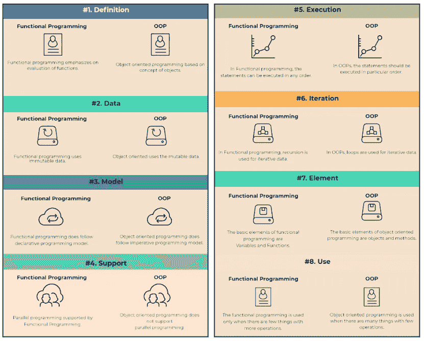](https://imgur.com/a/Jz5iynH)

**Original Image:** [**www.educba.com**](https://www.educba.com/)** 

**Python 提供了 lambda、filter、map 和 reduce 等特性，可以很容易地演示函数式编程的概念。本文中使用的所有代码都可以从相关的 [Github 库](https://github.com/parulnith/Elements-of-Functional-Programming-in-Python)中获得，或者可以通过点击下图在 my_binder 上查看。**

**[](https://mybinder.org/v2/gh/parulnith/Elements-of-Functional-Programming-in-Python/master)**

# **λ表达式**

****Lambda 表达式**——也称为“匿名函数”——允许我们在一行中创建和使用一个函数。当我们需要一个只使用一次的短函数时，它们很有用。它们通常与 map、filter 和 sort 方法结合使用，我们将在本文后面看到这些方法。**

**让我们用 Python 写一个函数，计算`5x + 2`的值。**标准方法**是定义一个函数。**

**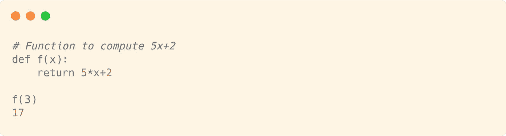**

**现在让我们使用 **Lambda** 函数来计算相同的表达式。为了创建一个 lambda 表达式，我们键入关键字 lambda，后面跟着输入。接下来，我们输入一个冒号，后跟将作为返回值的表达式。**

**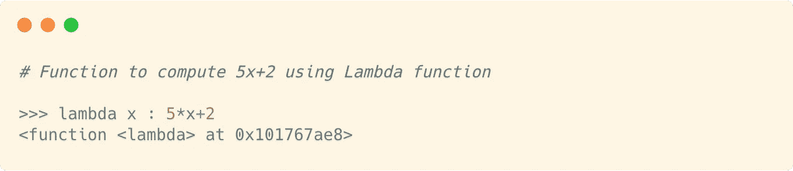**

**这个 lambda 函数将接受输入 x 并返回`5x + 2`，就像前面的函数`f`一样。然而，有一个问题。Lambda 不是函数的名称。这是一个 Python 关键字，说明后面是一个匿名函数。那么我们如何使用它呢？一种方法是给它一个名字。**

**让我们称这个λ表达式为`g`。现在，我们可以像使用其他函数一样使用它。**

**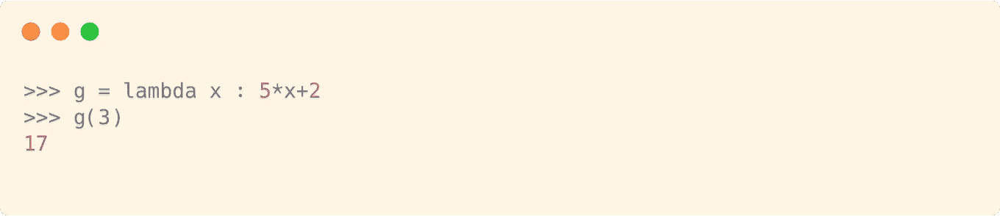**

## **具有多个输入的 Lambda 表达式。**

**下面的例子展示了 lambda 函数如何在有或没有输入值的情况下使用。**

**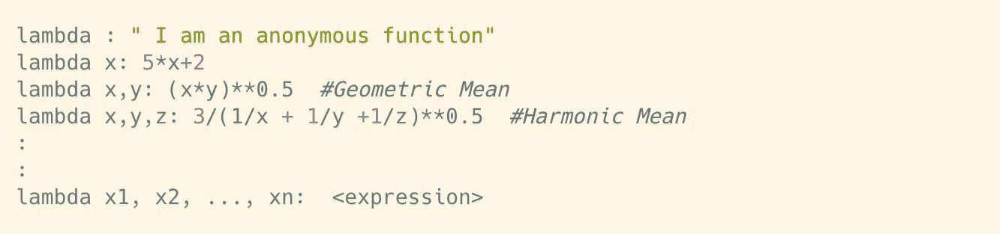**

## **没有输入的 Lambda 表达式。**

**现在，让我们看看 Lambda 函数的一个常见用法，我们没有给它命名。假设我们有一个美国前七任总统的列表，我们希望按照他们的姓氏对这个列表进行排序。我们将创建一个 Lambda 函数来提取姓氏，并将其用作排序值。**

**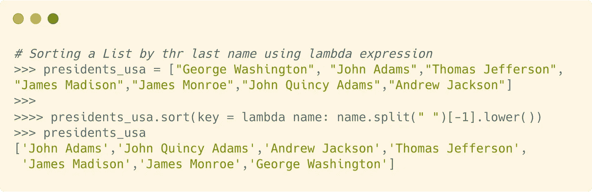**

> **map、filter 和 reduce 函数简化了使用列表的工作。当与 lambda 表达式一起使用时，它们通过在一行代码中完成大量工作，使我们的生活变得更加轻松。**

# **地图功能**

**[map](https://docs.python.org/3/library/functions.html#map) 函数将函数应用于 *iterable* 的每一项，产生结果。当与列表一起使用时，`Map`通过将函数应用于 input_list 中的所有项目，将给定的列表转换成新的列表。**

## **句法**

```
**map(function_to_apply, iterables)**
```

## **使用**

**假设我们有一个计算立方体体积的函数，给定其边(a)的值。**

```
**def volume(a):
    """volumne of a cube with edge 'a'"""
    return a**3**
```

**如果我们需要计算许多不同边长的立方体的体积，该怎么办？**

```
**# Edge length in cm
edges = [1,2,3,4,5]**
```

**有两种方法可以做到这一点——一种是使用**直接**方法，另一种是使用**映射**函数。**

**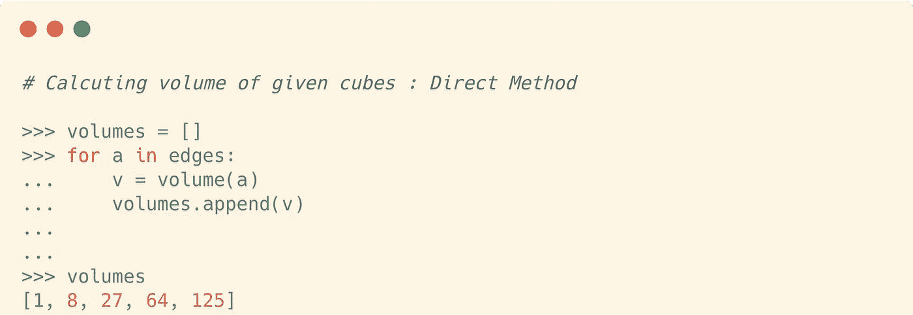**

**现在让我们看看如何使用一行带有 map 函数的代码来完成这项任务。**

**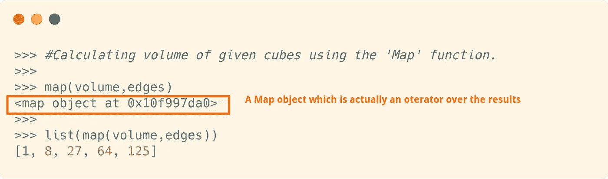**

**map 函数接受两个参数。第一个是函数，第二个是我们的列表、元组或任何其他可迭代的对象。这里，map 函数将音量函数应用于列表中的每个元素。**

**这里需要注意的一点是，map 函数的输出不是一个列表，而是一个 map 对象，它是结果的迭代器。但是，我们可以通过将映射传递给 list 构造函数，将它转换成一个列表。**

## **例子**

**现在让我们来看一个例子，它演示了如何使用`lambda`函数和`map`函数。我们有一个包含五个人的姓名和身高的元组列表。每个高度都是厘米，我们需要把它转换成英尺。**

**我们将首先使用 lambda 表达式编写一个转换器函数，它将接受一个元组作为输入，也将返回一个元组。**

**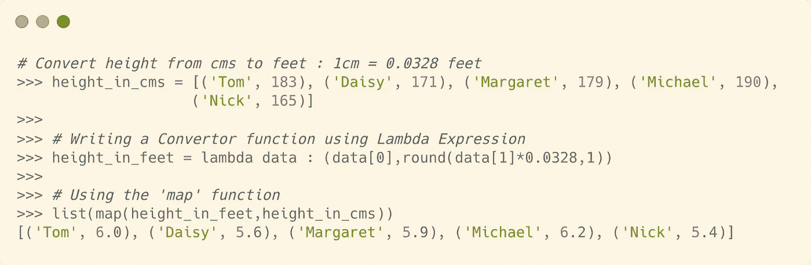**

# **过滤功能**

**' [filter'](https://docs.python.org/3/library/functions.html#filter) 函数从那些 *iterable* 的元素中构造一个迭代器，对于这些元素*函数*返回 true。这意味着 filter 函数用于从列表、元组或其他数据集合中选择某些数据，因此得名。**

## **句法**

```
**filter(function, iterable)**
```

## **使用**

**让我们看一个例子，我们想从一个给定的输入列表中获得所有大于 5 的数字的列表。**

**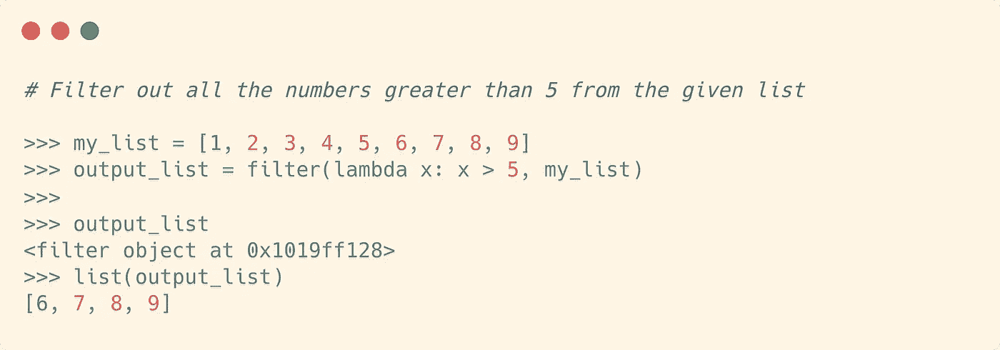**

**我们首先创建一个 lambda 函数来测试输入，看它是否大于 5。接下来，我们传入数据列表。filter 函数将只返回函数为真的数据。同样，返回值不是一个列表，而是一个过滤器对象。这个对象必须被传递给一个列表构造函数来获得输出。**

## **例子**

**当数据包含缺失值时，会出现一个有趣的“filter”函数用例。这是一个包含一些亚洲国家的列表。请注意，许多字符串是空的。我们将使用过滤函数来删除这些丢失的值。我们将传递 none 作为第一个参数，第二个参数是之前的数据列表。**

**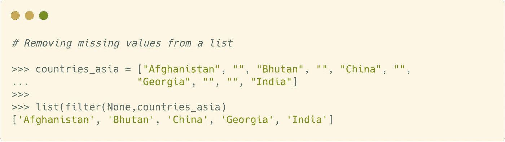**

**这将过滤掉在布尔设置中被视为 false 的所有值。**

# **Reduce 函数**

**' r [educe](https://docs.python.org/3/library/functools.html?highlight=functools%20reduce#functools.reduce) 函数有点不寻常，从 Python 3 开始，它不再是一个内置函数。相反，它被移到了`functools` 模块。“reduce”函数通过从左到右对*序列*的项目累积应用一个函数，将给定列表转换为单个值，**

## **句法**

```
**reduce(func, seq)**
```

**其中 reduce 不断地将函数`func()`应用于序列 seq 并返回一个值。**

## **使用**

**让我们借助一个简单的例子来说明`reduce`函数的工作原理，这个例子计算一组整数的乘积。**

**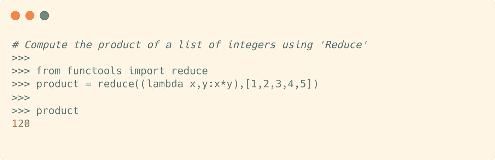**

**下图显示了计算的中间步骤:**

**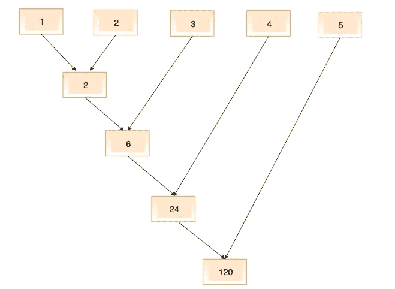**

**Source: [Working of ‘Reduce’ function in Python](https://www.python-course.eu/lambda.php)**

**然而，Python 的创始人吉多·范·罗苏姆不得不这样评价“reduce”函数:**

> **如果真的需要就用 functools.reduce 然而，在 99%的情况下，显式 for 循环更具可读性。**

**上述程序也可以用显式 for 循环来编写:**

**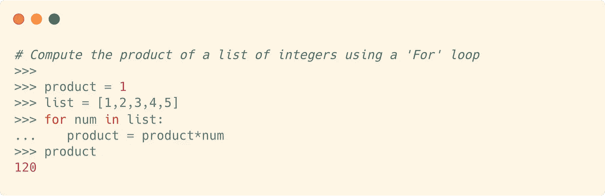**

## **例子**

**“reduce”函数可以在一行代码中确定包含整数的列表的最大值。Python 中确实有一个名为`max()`的内置函数，它通常被用作`max(list_name)`。**

**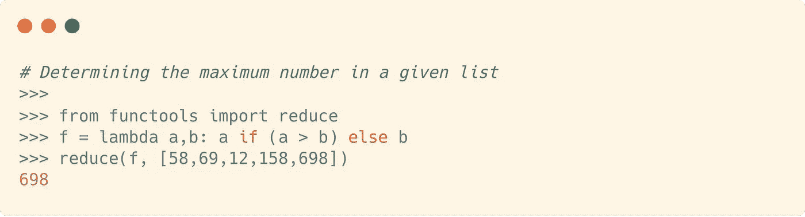**

# **列表理解:映射、过滤和归约的替代**

**[列表理解](https://docs.python.org/3/tutorial/datastructures.html#list-comprehensions)是一种在 Python 中定义和创建列表的方法。在大多数情况下，列表理解让我们在一行代码中创建列表，而不用担心初始化列表或设置循环。**

**它也是 lambda 函数以及 map()、filter()和 reduce()函数的替代品。有些人认为这是编写函数的一种更为复杂的方式，也更容易理解。**

## **句法**

**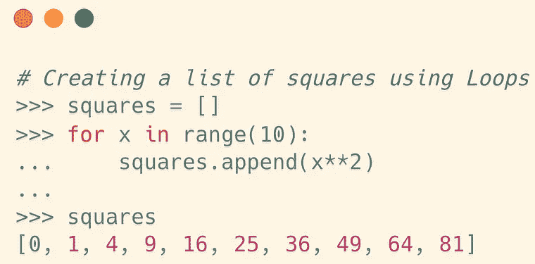****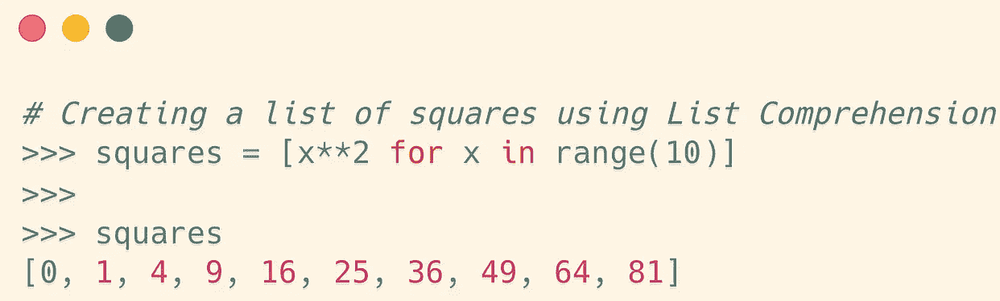**

## **使用**

**让我们试着用`list comprehensions.`复制上面章节中使用的例子**

*   ****列表理解与地图功能****

**我们将 map 函数与 lambda 函数结合使用，将高度列表从厘米转换为英尺。让我们用列表理解来达到同样的结果。**

**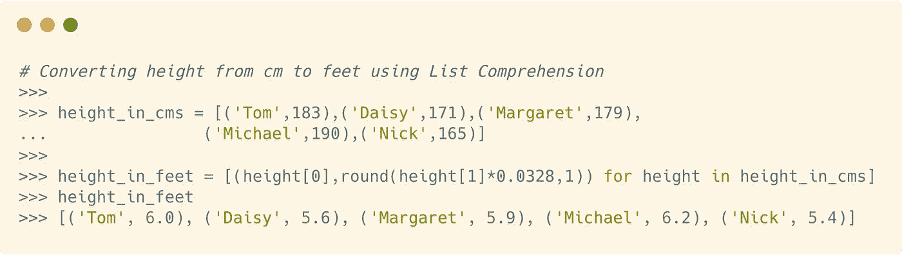**

*   ****列表理解与过滤功能****

**我们使用了 filter 函数来删除亚洲国家列表中缺少的值。让我们用列表理解来得到同样的结果。**

**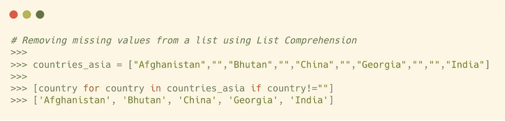**

*   ****列表综合与归约功能****

**同样，我们可以用列表理解快速确定包含整数的列表的最大值，而不是使用 lambda 和 reduce。**

**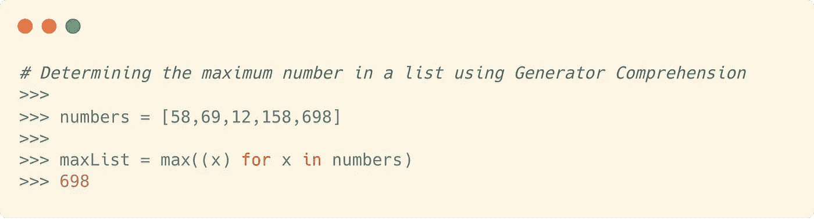**

**我们在上面使用了一个生成器表达式，它类似于列表理解，但是用圆括号代替了方括号。**

**列表理解是一个多样化的主题，需要一篇自己的文章。记住这一点，这里有一篇我写的文章，它不仅涵盖了 python 中的列表理解，甚至还涵盖了字典、集合和生成器理解。**

**[](/comprehending-the-concept-of-comprehensions-in-python-c9dafce5111) [## 理解 Python 中的“理解”

### 理解和实现 python 中的列表、字典、集合和生成器。

towardsdatascience.com](/comprehending-the-concept-of-comprehensions-in-python-c9dafce5111)** 

# **结论**

**map、filter 和 reduce 函数极大地简化了使用列表和其他可迭代数据集合的过程。有些人对使用它们有所保留，特别是因为列表理解似乎更友好，然而它们的有用性不能被忽视。**

# **参考**

*   **不要害怕函数式编程**
*   **[函数式编程 HOWTO](https://docs.python.org/3.7/howto/functional.html)**
*   **[λ，滤波，缩小，贴图](https://www.python-course.eu/lambda.php)**