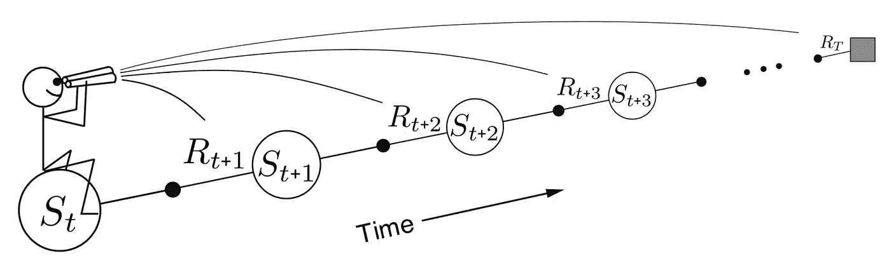
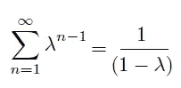
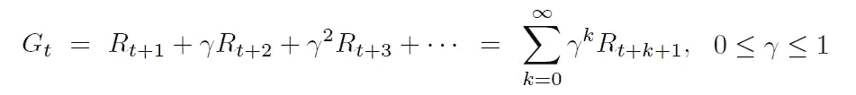
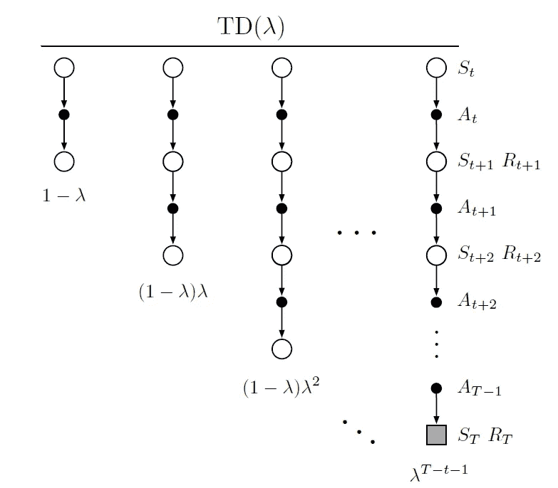
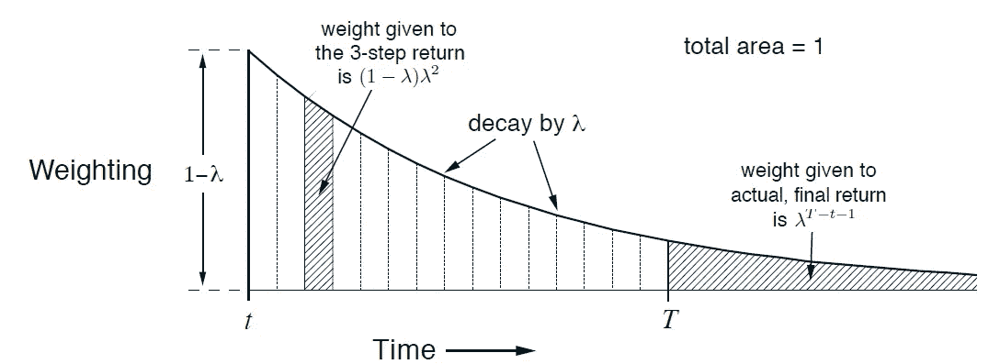
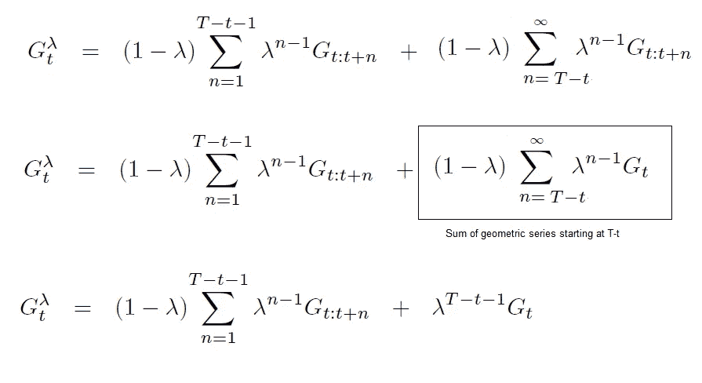
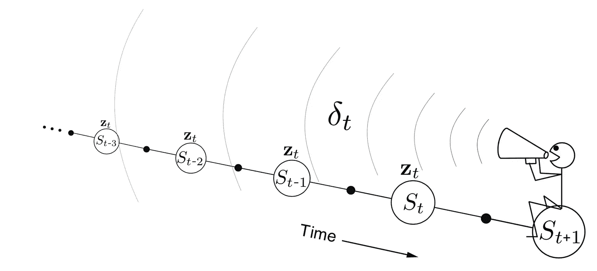
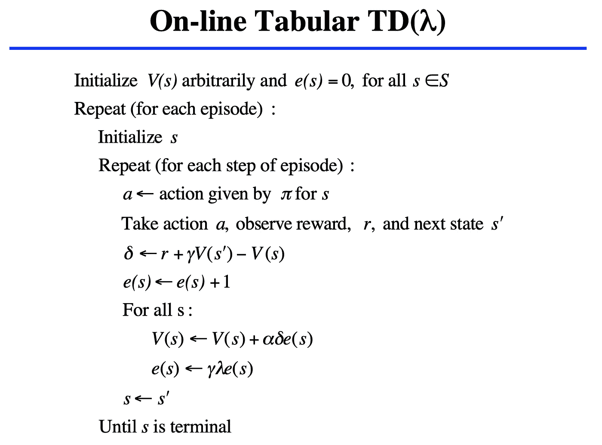
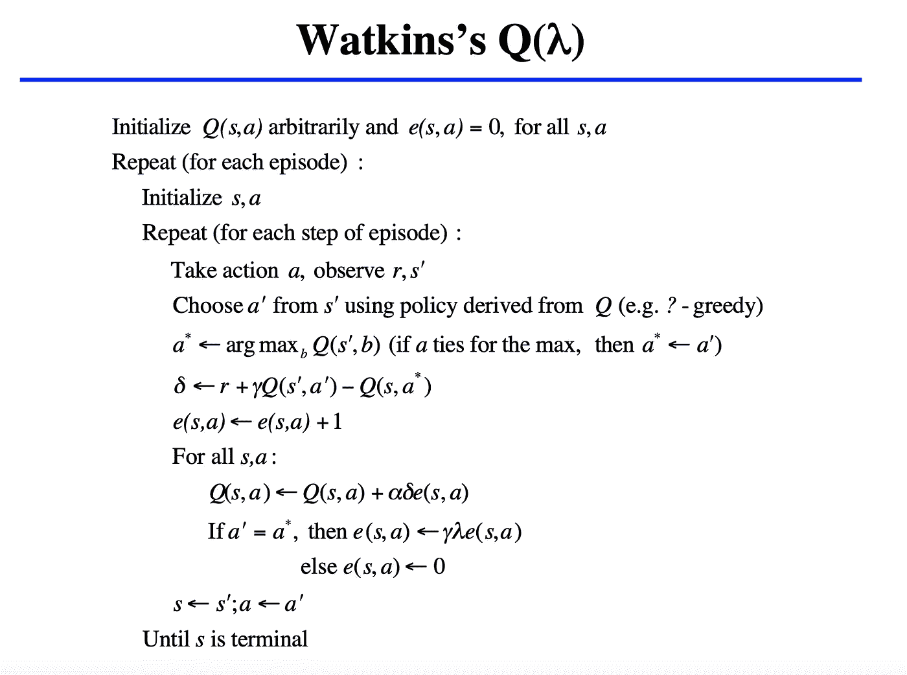

# 强化学习中的资格痕迹

> 原文：<https://towardsdatascience.com/eligibility-traces-in-reinforcement-learning-a6b458c019d6?source=collection_archive---------5----------------------->

## 有时候向后看并没有那么糟糕

Photo by [Didier Provost](https://unsplash.com/@lampe_91?utm_source=medium&utm_medium=referral) on [Unsplash](https://unsplash.com?utm_source=medium&utm_medium=referral)

**更新**:学习和练习强化学习的最好方式是去 http://rl-lab.com

# 什么是资格痕迹？

简而言之，合格轨迹是一种数学技巧，可以提高强化学习中[时间差](/td-in-reinforcement-learning-the-easy-way-f92ecfa9f3ce)方法的性能。

资格跟踪的好处如下:

*   提供一种以在线方式(不要等待剧集结束)和在没有剧集的问题上实现蒙特卡罗的方法。
*   提供一种使用短期记忆向量的算法机制。
*   通过**存储单个向量** **存储器**而不是特征向量列表来提高计算效率。
*   学习是不断进行的，而不是在一集结束时等待结果。

# 前瞻性的观点

请记住，在[中，时间差](/td-in-reinforcement-learning-the-easy-way-f92ecfa9f3ce)和[蒙特卡罗](https://medium.com/@zsalloum/monte-carlo-in-reinforcement-learning-the-easy-way-564c53010511)方法基于未来奖励更新状态。这可以通过直接向前看一步或者等待一集结束来实现。

这种方法被称为前瞻。

In Forward View we look ahead n steps for future rewards

在 TD(0)中，我们向前看一步，而在蒙特卡洛中，我们向前看，直到这一集结束，我们收集贴现结果。然而，有一个中间地带，我们向前看 n 步。

# n 步前瞻视图

正如上一节所解释的，展望未来可能会有所不同，从向前一步到一集结束，就像蒙特卡洛的情况一样。因此，n 步是某种中间地带。
请记住，在蒙特卡洛中，我们执行剧集，获取它们的回报 G *i* 并对这些回报进行平均，以计算状态值。
请注意，每集的长度(步数)可能会因集而异。它不是常数！

类似地，我们将对 n 步前瞻进行同样的操作。就像在蒙特卡洛一样，每集的步数不一定相同。
*NB。在本节中，我们不再将一个情节称为必须通过达到终止状态而终止的多个步骤，而是简单地称为多个步骤(终止状态不再是一个要求)。*

因此，让我们定义所有这些迭代的平均回报，如下所示:

其中 G( 𝛌，t)是所有收益 G(t，t+n)的加权平均值，g(t，t+n)是单个剧集的收益，其中每集从 t 开始，到 t+n 结束，n 从 1 到无穷大。𝛌是一个值在[0，1]之间的权重。
在所有加权平均中，权重之和必须为 1，这是因为

重要备注:很容易注意到，对于 n 较大的剧集，𝛌对 n 次方的贡献变小，G(t+n)的贡献也会很小。
但是嘿！我们已经知道，通过使用收益定义中的贴现因子γ(ɣ):

但是请记住，这是一个不同的问题，例如在蒙特卡洛，V(s)是从已经播放的剧集中计算出的所有回报 Gi 的**平均值**。所有的地理标志对 V(s)的贡献是相等的，即使奖励会根据它们与州 s 的距离而打折扣。

在这里，问题是不同的，所有 Gi 对 V(s)的贡献并不相同，但是它们是加权的，并且每个权重随着每集内的步数而变小。

下图显示了每集如何根据长度进行加权。

这张照片显示了重量如何随着时间(或 n 步)的增加而变小。

简而言之，如果一个情节在 3 步之后终止，与其回报相关联的权重远远大于在 T 步处终止的情节(其中 T 远大于 3)。
同样重要的是注意到重量呈指数下降。

让我们重写当剧集在时间 T 终止时的返回。
注意，时间步长 T 之后的返回总是 Gt(这是时间步长 T 时的返回),这仅仅是因为不再有状态，并且最后看到的返回是在 T。

当𝛌为 0 时，Gt 的表达式显示的是 TD(0)的公式(注意这个上下文中的 0 到幂零按照惯例是 1，更多信息见这个[维基百科文章](https://en.wikipedia.org/wiki/Zero_to_the_power_of_zero))，当𝛌为 1 时，Gt 就变成了蒙特卡洛的公式。

# 问题还没有解决！

所有这些细节，但我们仍然没有解决问题…

因为每个状态的更新依赖于当前不可用的后来的事件或奖励，所以前瞻视图实现起来有些复杂。

但到目前为止，我们一直在这么做！
我们正在向前看 n 步…
然而，这将通过采用一种新的方法来改变:向后看。

# 后视 TD( 𝛌)

假设一个代理人在一个环境中随机行走，发现了一个宝藏。然后他停下来向后看，试图知道是什么让他找到了这个宝藏？自然，靠近宝藏的台阶比远离宝藏的台阶更有价值。因此，较近的位置比较远的位置更有价值，因此它们被赋予更大的价值

这是如何实现的，是通过一个叫做合格痕迹的向量***【E】***。
具体地，合格痕迹是状态 ***E(s)*** 或状态动作 ***E(s，a)*** 的函数，并保存 V(s)的衰减值。

那么，我们如何从向前看过渡到向后看，资格跟踪在其中的作用是什么？

还记得我们说过的前视，每个情节对当前状态的贡献随着情节中的步数(n)呈指数衰减(𝛌的 n 次方)。
使用相同的逻辑，当我们处于状态 s 时，我们不是向前看，看到一集的衰减回报(Gt)向我们走来，而是简单地使用我们拥有的值，并使用相同的衰减机制将其向后抛出。

例如，在 TD(0)中，我们将 TD 误差定义为:

该误差将向后传播，但是以衰减的方式。
类似于随着距离渐行渐远的声音。
我们实现这一点的方法是将𝜹乘以每个州的资格跟踪。

其中 Et 更新如下:

Backward View propagates the error δ to previous states

符号 1(St = s)意味着，当我们处于状态 s 时，我们分配完整的值，当它向后传播时，它以指数形式衰减。

对于所有状态，合格的跟踪更新从 E(s) = 0 开始，然后当我们经过每个状态(**由于执行动作**)时，我们递增 E(s)以增加状态的值，然后对于所有的，我们通过ɣ𝛌 (E(s) = ɣ𝛌 E(s)衰减 E(s)

与 n 步前向视图相比，合格轨迹的主要优点是只需要一个轨迹向量，而不是存储最后 n 个特征向量。

# 使用资格跟踪的算法

以下是几个使用资格跟踪的算法。

# 结论

资格跟踪是一种在时间差“目标”和蒙特卡罗“回报”之间进行加权的方式。这意味着我们不使用一步 TD 目标，而是使用 TD(λ)目标。
换句话说，它微调目标以获得更好的学习性能。

## 资源

《强化学习:导论》，萨顿&巴尔托著