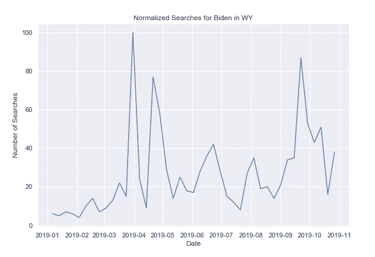

# 伊丽莎白·沃伦在 2020 年总统竞选中领先:Python 中的一项分析

> 原文：<https://towardsdatascience.com/elizabeth-warren-is-leading-the-2020-presidential-race-an-analysis-in-python-967e272d15da?source=collection_archive---------27----------------------->


Photo by [Element5 Digital](https://www.pexels.com/@element5) on [Pexels](https://www.pexels.com/photo/i-voted-sticker-lot-1550340/)

在这篇文章中，我们将使用 python Google trends API py trends 来分析哪些领先的民主党候选人被搜索得最多。

要安装 pytrends，请打开命令行并键入:

```
pip install pytrends
```

接下来打开一个 IDE(我使用 Spyder)并导入 pytrends:

```
from pyrtends.request import TrendReq
```

接下来，我们指定主机语言、时区和有效负载。我们将主机语言指定为英语(“en-US”)，时区为中部标准时区，即“360”，我们可以将 google 属性过滤器(gprop)保留为空字符串。我们还设置了 category = 0，对应与该关键字相关的所有类别。

让我们来看看乔·拜登从 2019 年 1 月到 2019 年 10 月在纽约的数据:

```
pytrends = TrendReq(hl='en-US', tz=360)
pytrends.build_payload(['Biden'], cat=0, timeframe='2019-01-01 2019-10-31',  gprop='', geo='US-NY')
```

然后，我们将 dataframe 定义为结果 pytrends 对象，并打印前五行:

```
pytrends = TrendReq(hl='en-US', tz=360)
print(df.head())
```


我们还可以使用 seaborn 和 matplotlib 来绘制“Biden”搜索的时间序列:

```
import matplotlib.pyplot as plt
import seaborn as sns
import pandas as pdsns.set()
df['timestamp'] = pd.to_datetime(df.index)
sns.lineplot(df['timestamp'], df['Biden'])plt.title("Normalized Searches for Biden in NY")
plt.ylabel("Number of Searches")
plt.xlabel("Date")
```


让我们为怀俄明州的拜登做同样的事情:



我们也可以看看纽约的桑德斯:


为了进行比较，我们可以覆盖拜登，桑德斯和沃伦在纽约的搜索:


Biden(blue), Sanders(orange), Warren(green)

根据谷歌趋势数据，伊丽莎白·沃伦似乎比拜登和桑德斯更受欢迎。我们也可以看看怀俄明州的同样情况，那里有 68%的共和党人:


Biden(blue), Sanders(orange), Warren(green)

沃伦在怀俄明州也一直领先。看看几个摇摆州会很有意思。让我们来看看密歇根州:


Biden(blue), Sanders(orange), Warren(green)

沃伦在密歇根州遥遥领先，尽管该州被认为是战场州。

爱荷华州有:


Biden(blue), Sanders(orange), Warren(green)

最后让我们看看佛罗里达州:


Biden(blue), Sanders(orange), Warren(green)

值得注意的是，在撰写本文时，[《纽约时报》](https://www.nytimes.com/interactive/2020/us/elections/democratic-polls.html)报道称，根据民调显示，拜登领先(26%)，沃伦紧随其后(21%)。有趣的是，尽管拜登领先，但在民主党、共和党和摇摆州，越来越多的人在寻找沃伦。

在美国各州进行这种分析，看看沃伦是否一直处于领先地位，这将是一件有趣的事情。

最后，为了使这些代码易于重用，我们可以将它们封装在一个函数中:

```
import matplotlib.pyplot as plt
import seaborn as sns
import pandas as pd 
from pytrends.request import TrendReqdef get_searchs(candidate, state):
    pytrends = TrendReq(hl='en-US', tz=360)
    pytrends.build_payload([candidate], cat=0, timeframe='2019-01-01 2019-10-31',  gprop='',geo='US-{}'.format(state))    
    df = pytrends.interest_over_time()

    print(df.head())

    sns.set()
    df['timestamp'] = pd.to_datetime(df.index)
    sns.lineplot(df['timestamp'], df[candidate])

    plt.title("Normalized Searches for Biden, Warren and Sanders in {}".format(state))
    plt.ylabel("Number of Searches")
    plt.xlabel("Date")
```

例如，我们可以调用函数在马萨诸塞州进行搜索，如下所示:

```
get_searches('Biden', 'MA')
get_searches('Sanders', 'MA')
get_searches('Warren', 'MA')
```

我们得到了下面的图:


Biden(blue), Sanders(orange), Warren(green)

感谢您的阅读。这篇文章的代码可以在 [GitHub](https://github.com/spierre91/medium_code) 上找到。