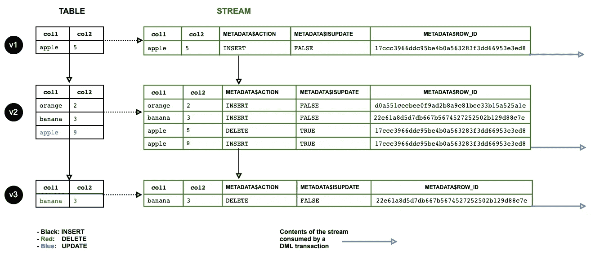
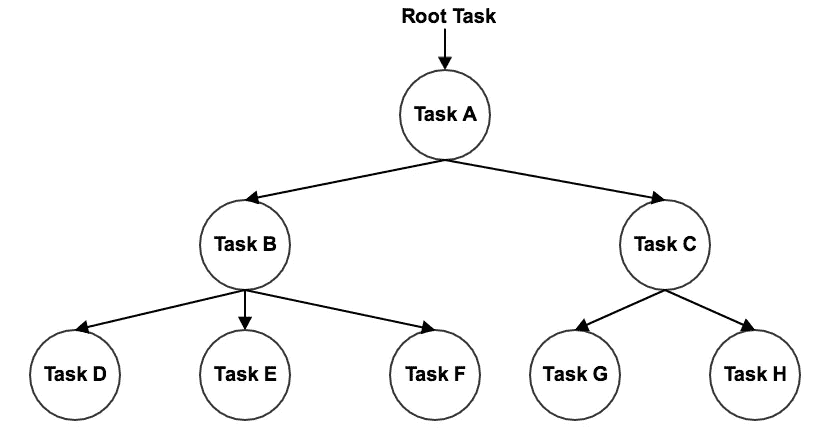

# 雪花数据仓库中的 ELT 数据流水线——使用流和任务

> 原文：<https://towardsdatascience.com/elt-data-pipelining-in-snowflake-data-warehouse-using-streams-and-tasks-ae6eb7c083de?source=collection_archive---------5----------------------->


在我之前的帖子中:

> 使用 Azure Portal Web UI 为雪花数据仓库在 Azure Blob 存储上构建 Snowpipe
> 
> [https://medium . com/@ qiuyujx/building-snow pipe-on-azure-blob-storage-using-azure-portal-we b-ui-for-snow flake-data-warehouse-f0cdd 7997250](https://medium.com/@qiuyujx/building-snowpipe-on-azure-blob-storage-using-azure-portal-web-ui-for-snowflake-data-warehouse-f0cdd7997250)

Snowpipe 被引入用于自动发现云存储(例如 Azure Blob 存储)中的新数据文件，然后将数据加载到某个表中。

Snowpipe 是实现上述目的的一个非常方便的工具。然而，Snowpipe 本身只被认为是 ELT 的“E”(提取)，因为在 Snowpipe 创建语句中只允许使用`COPY INTO`命令。换句话说，我们可以用它轻松实现以下目标:

*   加载不同格式的数据文件，如 CSV、JSON、XML、Parquet 和 ORC
*   采用和调整数据源以获得更好的兼容性，比如剥离 JSON 的外部数组和 XML 的外部元素
*   更改列名
*   更改列顺序
*   省略列
*   将数据/时间字符串解析为数据/时间对象

因此，出于以下原因，数据流水线的其余部分需要流和任务:

1.  一些数据转换可能是必要的，比如数字计算和字符串连接。
2.  数据源不是典型的三范数格式，需要根据一定的关系加载到多个表中。
3.  ELT 作业可能不限于追加表，还包括更复杂的需求，如要实现的 SCD(渐变维度)。

因此，我们不得不在雪花中涉及其他对象来完成数据管道。

# 雪花溪流

雪花流对象用于跟踪对表的任何更改，包括插入、更新和删除，然后可以被其他 DML 语句使用。steam 对象的一个典型用法是 CDC(变更数据捕获)

## **标准视频点播附加流**

我们可以在 Snowflake 中定义两种类型的流，标准流和仅附加流。标准流将捕获对表的任何类型的更改，而仅追加流只捕获插入的行。前者可用于一般目的，而后者可用于典型的 ELT 模型中，当我们只对摄取的新行感兴趣时。

例如，我们可以使用 Snowpipe 从云存储中的 CSV 文件自动获取数据，并复制到临时表中。然后，一个流将捕获这个批量插入动作，并记录这些新行的**偏移量**。

## **流偏移**

雪花流在物理上不存储、包含或复制任何数据。它只是在当前时间拍摄跟踪表的快照(例如，在创建流时)，然后流会将对此表所做的每个更改记录为附加元数据。表格的前一版本和当前版本之间的差异称为**偏移**。

当其他 DML 语句使用流的偏移量时，偏移量将被重置，并且流将所使用的数据视为表的“先前”版本。典型的消耗流偏移量的 DML 语句是`INSERT INTO ... SELECT ... FROM STREAM`。

以下是流消费流的一个示例:

1.  假设一个表中已经有一百万行。我们在这个表上创建一个流，这个流没有偏移量，因为这个表的当前版本是快照。
2.  假设有 1000 行从 Snowpipe `COPY INTO`语句插入到表中。
3.  该流将这 1000 行记录为其偏移量。
4.  假设现在我们从流中读取这 1000 行，并将它们插入到另一个表中。
5.  该流现在将没有偏移量，因此它将是空的，因为我们已经消耗了先前的偏移量。

很明显，雪花流是为英语教学过程设计的。例如，我们有一个高频率的数据被接收到数据库中，我们每 5 分钟消耗一次数据。该流将保证我们每次使用新数据时没有遗漏和重叠。这确实是一个在其他数据库管理系统中实现起来很复杂的逻辑，或者我们可能需要使用额外的编程语言来实现这一点。

## **流列**

因为 stream 实际上是原始表的快照，所以原始表中的所有列也可以在 stream 中访问。例如，如果原始表有 3 列名为`col1`、`col2`和`col3`，那么我们可以简单运行

```
SELECT col1, col2, col3
FROM the_stream;
```

检索此流中的偏移量。

此外，还有 3 个额外的列是专门针对流对象的元数据:

*   `METADATA$ACTION`表示该行的更改类型。可以是`INSERT`也可以是`DELETE`。请注意，没有“更新”操作。一行的更新将由两行表示，一行是前一行的`DELETE`，另一行是新行的`INSERT`。您会发现这非常方便，因为通过比较这两行，您可以在流中获得关于更新了哪些特定字段的信息。
*   `METADATA$ISUPDATE`表示该行是否因更新而生成。这个列是一个额外的指示器，它允许您获得所有带有`INSERT`和`DELETE`的行，但实际上是因为更新而生成的。
*   `METADATA$ROW_ID`是特定行的唯一 ID。即使该行被更新，它也不会改变，并且在将来的任何进一步的偏移更新中保持不变。

这是一张来自官方文档的图片，非常清晰地展示了数据流。



Image courtesy: [https://docs.snowflake.net/manuals/user-guide/streams.html](https://docs.snowflake.net/manuals/user-guide/streams.html)

# 雪花任务

雪花任务就是这样一种对象，它可以安排 SQL 语句作为重复事件自动执行。

是的，我对每个任务都使用“an”SQL 语句。目前，这是雪花任务的一个限制。希望在未来的更新中，它将支持事务适当的`BEGIN`和`COMMIT`关键字，以便我们可以在一个事务中执行一系列 SQL 语句，并利用任务来调度该事务。

尽管有这样的限制，雪花确实提供了多 SQL 语句调度的方法，这被称为**任务树**。顾名思义，我们可以在一个树形结构中定义多个任务。几个小贴士:

*   一个任务可以有多个任务作为其子任务，所以子任务将在父任务完成时执行。
*   一个任务只能有一个父任务。
*   因此，任务树实际上只是一棵树，而不是 DAG。所以，你可以考虑它可以做“fork”，但是没有“join”。

下面是一个简单任务树的图表。



Image courtesy: [https://docs.snowflake.net/manuals/user-guide/tasks-intro.html](https://docs.snowflake.net/manuals/user-guide/tasks-intro.html)

## 触发任务

触发任务有两种方式，一种是通过定义计划，另一种是通过另一个任务触发。

雪花支持两种类型的任务调度定义，“CRON”表达式和时间间隔。CRON 表达式可以定义任务将被触发的确切日期/日期/时间，它非常强大，可以实现任何简单到复杂的需求，例如

*   在每天的特定时间运行任务
*   在一周中某一天的某个时间运行任务
*   支持时区
*   支持夏令时

关于 CRON 表达式的具体语法，请访问这个免费网站进行详细的解释和实验:

 [## 免费在线克隆表达式生成器和描述-FreeFormatter.com

### 使用易于使用的在线界面生成 quartz cron 表达式。将 cron 表达式转换成可读文本…

www.freeformatter.com](https://www.freeformatter.com/cron-expression-generator-quartz.html) 

另一种调度定义的方法要简单得多，就是简单的定义时间间隔。例如，如果我希望任务每 5 分钟触发一次，那么就这样定义它:

```
SCHEDULE = '5 MINUTE'
```

触发任务的另一种方式是定义父任务，这被认为是构建任务树。例如，如果我们想在`TASK1`结束时触发`TASK2`，只需简单定义:

```
CREATE TASK TASK2
...
AFTER "TASK1"
AS
<SQL>
```

## **有条件的任务**

可以通过“WHEN”子句用条件来定义任务，该子句用于决定是否应该执行该任务。

这是一个非常方便的功能。例如，如果您用您的“根任务”设置一个条件，当条件不满足时，整个任务树将根本不会运行。

此外，如果这种“条件测试”发生在雪花的云服务层(使用元数据而不是对表的 SQL 查询)，则这种条件测试的成本为零，因此如果条件不满足，则没有成本。

# 通过流使用任务

雪花任务和流被一起用来构建数据管道是非常常见的。一个非常典型的使用模式是:

1.  Snowpipe 将原始数据加载到临时表中。
2.  雪花流是在 staging 表上创建的，因此被摄取的新行将被记录为偏移量。
3.  然后，雪花任务通过一些 DML 语句消耗流偏移量，以进一步将数据加载到生产表中，可能包括一些更复杂的转换。
4.  在实践中，会有一个任务树来执行多个 SQL 语句，以便执行复杂的转换，有时会将转换后的条目填充到多个生产表中。
5.  一些中间表可能需要由任务树中的任务创建。
6.  在任务树的最后可能会有一些任务来清理一些临时表。

我们已经介绍了需要集成 Snowpipe 和 Stream 的典型场景。现在，对于流和任务，还有一个非常典型的使用模式，那就是系统变量`SYSTEM$STREAM_HAS_DATA`。

具体来说，变量`SYSTEM$STREAM_HAS_DATA`将返回一个布尔值，表明在可消费的流中是否存在偏移。因此，我们可以简单地将这个条件放在任务定义的“WHEN”子句中。因此，如果流中没有新内容，任务将不会被执行。例如:

```
CREATE TASK mytask1
  WAREHOUSE = mywh
  SCHEDULE = '5 minute'
WHEN
  SYSTEM$STREAM_HAS_DATA('MYSTREAM')
AS
  INSERT INTO ... ;
```

在这个例子中，只有当流“MYSTREAM”中存在消耗性偏移时，才会执行任务“mytask1”。否则，将跳过该任务，并在 5 分钟后再次检查状况。

## 还有一个提示

请记住，默认情况下，刚刚创建的任务将被暂停。有必要通过如下方式“改变”任务来手动启用此任务:

```
ALTER TASK mytask1 RESUME;
```

# 未来作品

本文从理论上介绍了雪花流和任务。画出了使用 Snowpipe -> Stream -> Task 构建 ELT 数据管道的概貌。在下一部分中，我将使用一个真实的示例数据源来构建 ELT 数据管道，使用这些雪花组件和必要的 SQL 脚本演示，这将更具实践性。

[](https://medium.com/@qiuyujx/membership) [## 通过我的推荐链接加入灵媒-陶

### 作为一个媒体会员，你的会员费的一部分会给你阅读的作家，你可以完全接触到每一个故事…

medium.com](https://medium.com/@qiuyujx/membership) 

如果你觉得我的文章有帮助，请考虑加入 Medium 会员来支持我和成千上万的其他作者！(点击上面的链接)

# 资源

雪花溪流官方文档:【https://docs.snowflake.net/manuals/user-guide/streams.html 

雪花任务官方文档:
https://docs . snow flake . net/manuals/user-guide/Tasks-intro . html

免费在线 CRON 表达式生成器:
[https://www . free formatter . com/CRON-expression-generator-quartz . html](https://www.freeformatter.com/cron-expression-generator-quartz.html)