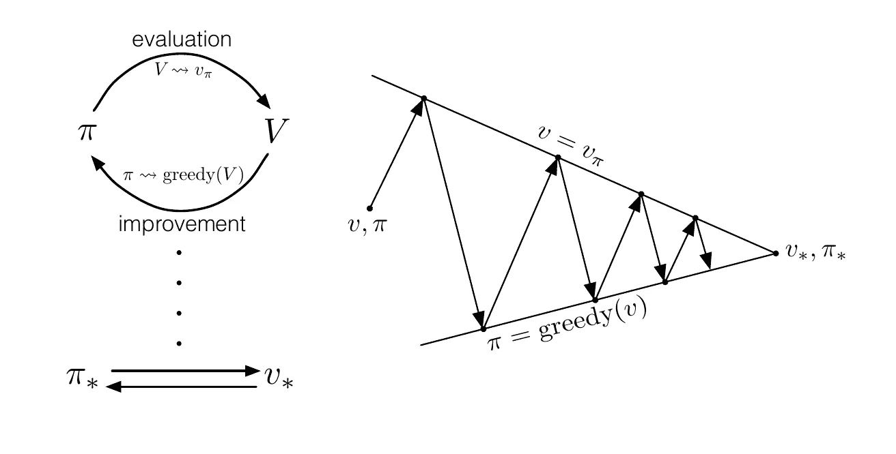
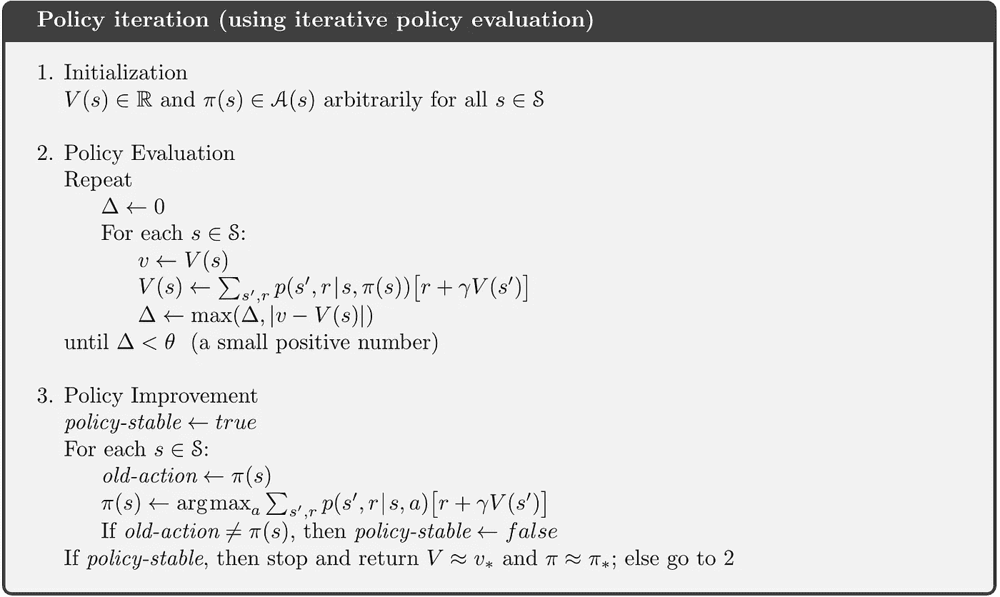
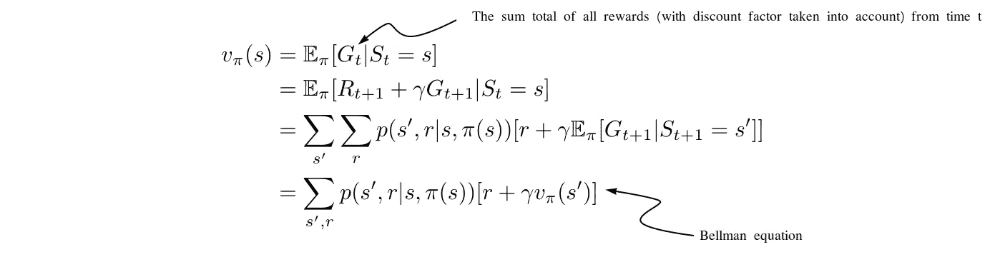
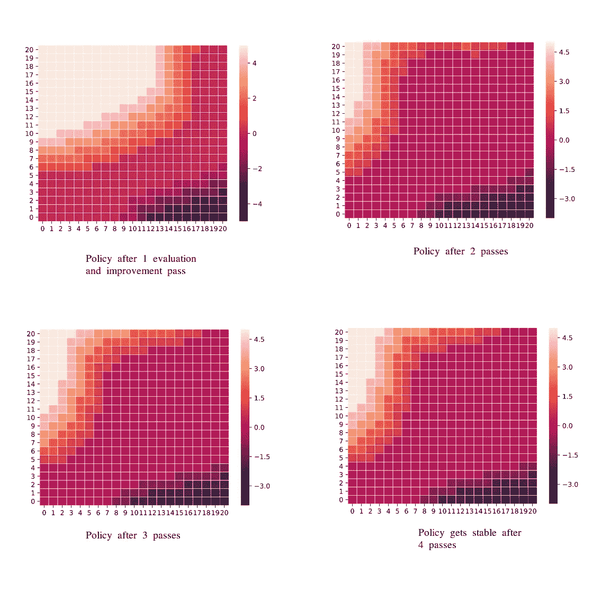
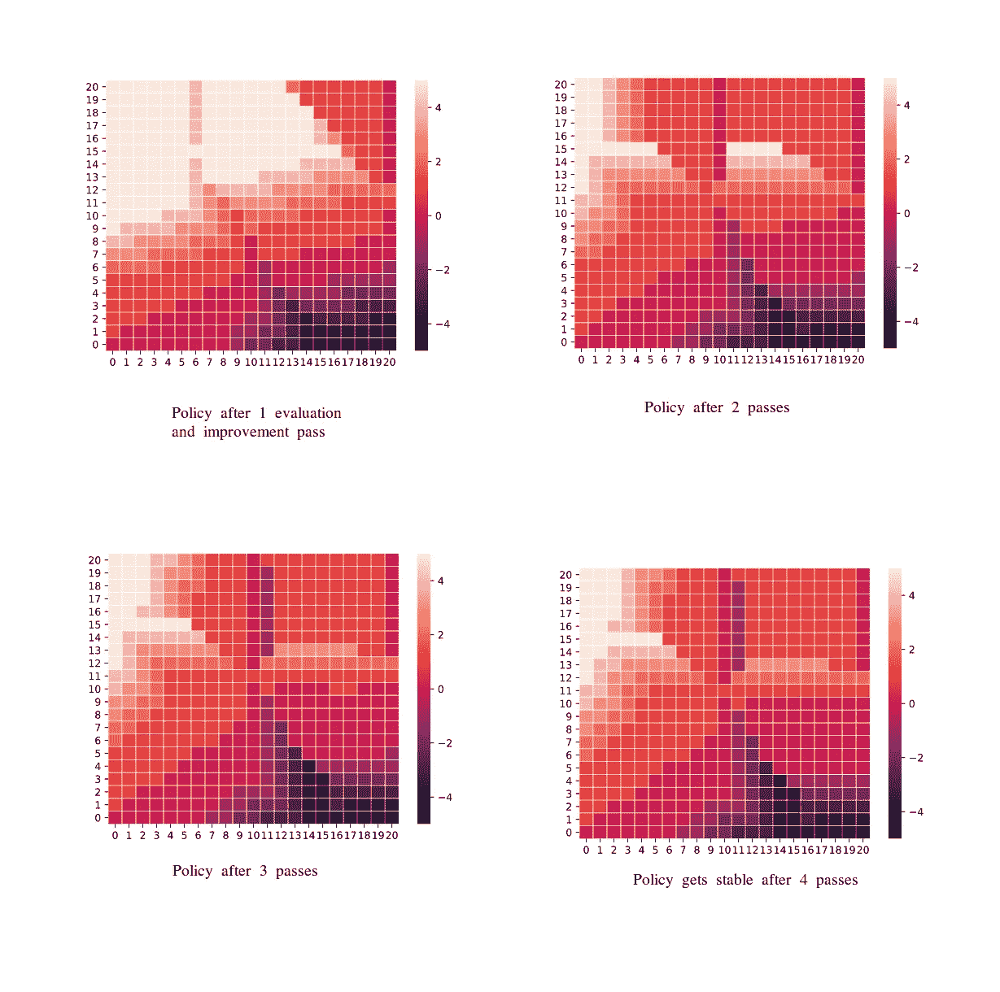

# 阐释强化学习中的策略迭代——杰克的租车问题

> 原文：<https://towardsdatascience.com/elucidating-policy-iteration-in-reinforcement-learning-jacks-car-rental-problem-d41b34c8aec7?source=collection_archive---------12----------------------->

[1]: Generalized Policy Iteration

在这篇博文中，我将尝试通过使用强化学习中的策略迭代算法来解决 Jack 的租车问题，从而阐明该算法。这个问题和它的变体分别在萨顿和巴尔托的书(强化学习:导论，第二版)中的例子 4.2 和练习 4.5 中给出。

# 问题陈述

杰克为一家全国性的汽车租赁公司管理着两个地点。每天，都会有一定数量的客户来到每个地点租车。如果杰克有一辆车，他就把它租出去，国家公司给他 10 美元。如果他在那个位置没有车，那么生意就没了。汽车在归还的第二天就可以出租了。为了帮助确保汽车在需要的地方可用，Jack 可以在两个地点之间连夜移动汽车，每移动一辆汽车的费用为 2 美元。

我们假设每个位置请求和返回的汽车数量是一个泊松随机变量。回想一下，如果 X 是泊松随机变量，那么

假设第一个和第二个位置的租赁请求的λ是 3 和 4，返回请求的λ是 3 和 2。

为了稍微简化问题，我们假设每个位置不能超过 20 辆汽车(任何额外的汽车都返回给全国性的公司，因此从问题中消失),并且在一个晚上最多可以将五辆汽车从一个位置移动到另一个位置。我们将贴现率γ设为 0.9，并将其公式化为一个连续的有限马尔可夫决策过程，其中时间步长为天，状态为一天结束时每个位置的汽车数量，而行动为一夜之间在两个位置之间移动的汽车净数量。

# 但是解决这个问题意味着什么呢？

解决这个问题意味着解决两件事，首先，杰克应该在一夜之间在每个地点之间移动多少辆车，以最大化他的总期望回报，即，在给定的情况(状态)下，他的策略(政策)应该是什么；其次，如果杰克知道这个策略，他如何比较哪些情况比其他情况更好(价值)？

# 初始设置

让我们先用代码写出我们知道的最初的东西。从问题中，我们知道杰克可以获得两种类型的奖励，第一种是他租车时的 10 美元奖励，第二种是他从一个位置移动到另一个位置的每辆车的-2 美元奖励(注意，后一种奖励是负的)。

现在我们定义一个 poisson_ class，它取一个参数λ，计算对应的概率质量函数。它有两个数据成员α和β，表示 pmf 值大于ε(此处为 0.01)的 n 值的区间[α，β]。我们将ε以下的 pmf 值设置为零，然后对结果分布进行归一化。

例如，对于λ = 3，数据成员α、β和 val 的值为:

# 策略迭代算法

在我们继续之前，为了确保所有的读者都在同一页上，让我们快速修改一下这里的术语价值和策略的含义。

在我们的汽车租赁示例中，系统在任何时候的状态都是一对两个数字，第一个和第二个位置的汽车数量。给定一个状态，杰克必须选择一个动作，即他可以从第一个位置移动到第二个位置的汽车数量，反之亦然。根据问题，可以在-5 到+5 之间变化，其中+n 代表 Jack 将 n 辆车从第一个位置移动到第二个位置。

策略是从状态到行动的映射，例如，给定一个状态，Jack 应该在一夜之间移动多少辆车。现在，假设杰克有某个策略π，那么给定这个π，**一个状态(比如 s)的值就是杰克从 s 出发，之后跟随π时会得到的期望回报。**

[1]: The Policy Iteration Algorithm

如上图所示，策略迭代算法由三部分组成。让我们在解决租赁问题的背景下分别讨论这些组件。

第一部分是初始化。如上图所示，我们任意初始化值和策略矩阵。将它们初始化为零也可以。请注意，给定一个策略，我们为每个状态定义一个值，因为我们的状态是一对两个数字，其中每个数字取 0 到 20 之间的值，因此我们用形状矩阵(21 x 21)来表示值。策略取一个状态，输出一个动作；因此，它也可以用相同形状的矩阵来表示。

第二个组成部分是政策评估。通过政策评估，我们的意思是遵循这个政策，任何国家的价值应该是什么。如上所述，给定一个政策π，一个状态(比如 s)的值就是杰克从 s 出发，之后跟随π时会得到的期望回报。

这种与状态值相关联的期望概念可以写成上图所示的形式，由此可以推导出贝尔曼方程，如图所示。

这个贝尔曼方程形成了在策略评估组件中显示的值更新的基础。

Value Update

在许多这样的更新之后，V(s)收敛到一个几乎满足(最多有一些θ误差)贝尔曼方程的数，因此代表状态 s 的值。

第三个组成部分是政策改进。给定一个状态(比如 s)，我们指定π(s)等于使期望报酬最大化的动作。我们说，当任何状态下的行动最大化步骤都没有引起策略的变化时，策略变得稳定。

我们循环运行策略评估和改进组件，直到策略变得稳定。

# 结果

上图以热图的形式显示了通过评估和改进后的策略。回想一下，策略由包含[-5，5]范围内的动作值的矩阵表示。

# 给原来的租赁问题增加了非线性

让我们看看，如果我们在上面的问题中加入一些非线性因素，会发生什么:

1.  Jack 在第一个地点的一名员工每天晚上乘公交车回家，并且住在第二个地点附近。她很乐意免费接送一辆车到第二个地点。每增加一辆车仍然要花 2 美元，所有向相反方向移动的车也是如此。
2.  此外，Jack 在每个位置都有有限的停车位。如果超过 10 辆汽车在一个地点过夜(在任何汽车移动之后)，那么使用第二个停车场必须产生 4 美元的额外费用(与有多少辆汽车停在那里无关)。

可以很容易地添加这些条件来修改原始代码。如果需要，我们将有一个额外的奖励-第二个停车场 4 美元(注意，这个奖励是负的)。

生成的策略(通过评估和改进)如下图所示。

# 结论

我们使用动态规划解决了上述问题。我们存储了中间值和策略矩阵，并在策略评估和改进功能中使用它们。然而，为了使用贝尔曼更新，我们需要知道环境的动态，就像我们在租赁示例中知道奖励和下一个状态的概率一样。如果只能从底层分布中采样，不知道分布本身，那么可以用蒙特卡罗方法来解决相应的学习问题。

Github 库:[https://github.com/thunderInfy/JacksCarRental](https://github.com/thunderInfy/JacksCarRental)

# 参考

[1]萨顿和巴尔托(2017 年)。强化学习:导论。剑桥，麻省理工学院出版社

[2] S. David 关于通过动态规划进行规划的讲座(【https://www.youtube.com/watch?v=Nd1-UUMVfz4】T2)。