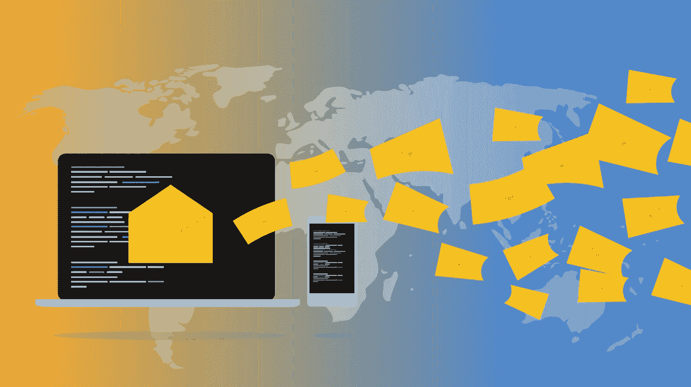
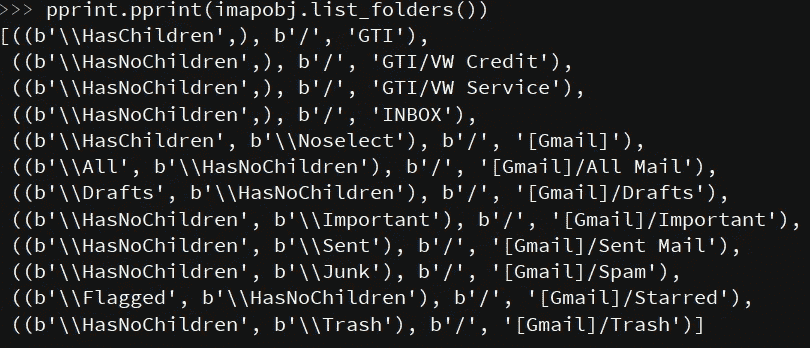
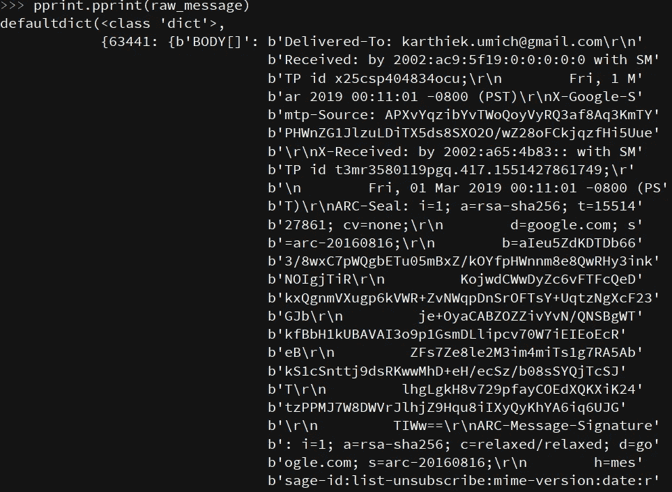
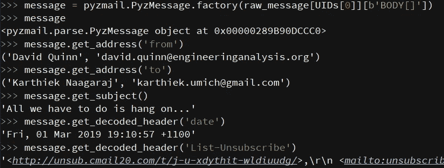
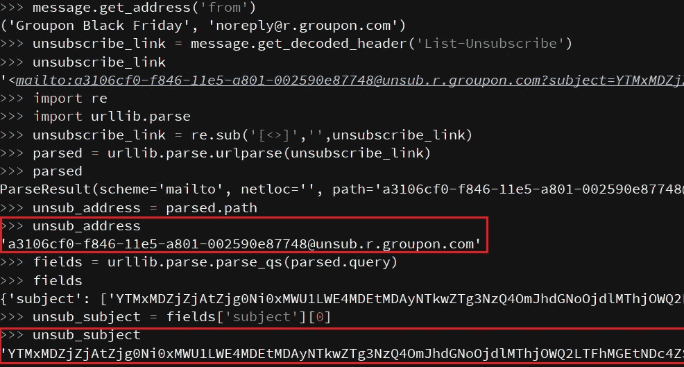
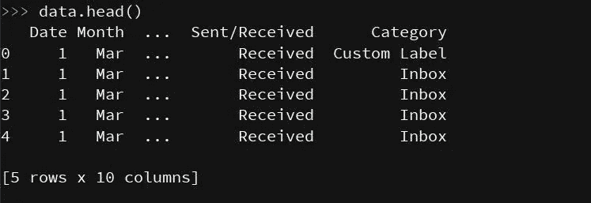
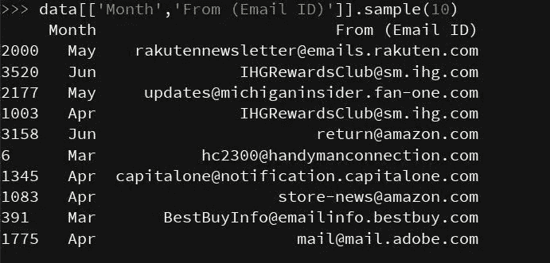
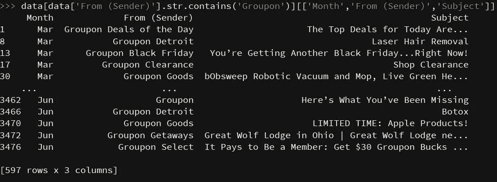
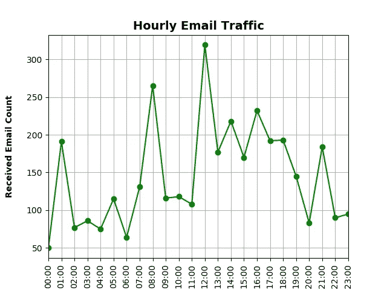
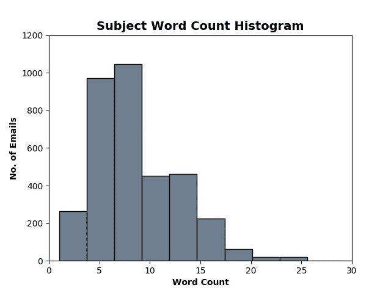

# 电子邮件自动化、分析和可视化

> 原文：<https://towardsdatascience.com/email-automation-analytics-and-visualization-53b022e0f9a0?source=collection_archive---------8----------------------->

## 使用 Python 的 Imapclient、Smtplib、Pandas 和 Matplotlib 库的详细教程

[Image by ribkhan on Pixabay](https://pixabay.com/users/ribkhan-380399/)

# 介绍

阅读、回复甚至整理电子邮件往往会耗费大量时间。虽然今天有许多电子邮件客户端竭尽全力使这方面的生活变得更容易，但如果能够以编程的方式执行与电子邮件相关的任务，这将非常有用。让我们考虑一个这种方法可以派上用场的场景——电子邮件混乱。现在，可以说互联网上充斥着如何减少电子邮件混乱的建议。虽然所有这些技巧都有可能帮助你今后更有效地使用你的电子邮件，但如果目前你的收件箱已经到了无法恢复的地步，手动清理几乎是不可能的，那该怎么办？一个典型的例子是——我妻子的收件箱里有来自 300 多个不同发件人的 35000 多封电子邮件。她确信这些邮件大多与营销有关，但她认为，单独退订这些邮件太费力了，这也是有道理的。本文的第一部分讨论了这个问题，并解释了如何使用 python 的 imapclient 和 smtplib 库发送、检索、分类、删除和取消订阅电子邮件。

另一方面，让我们假设你是一个电子邮件组织忍者，完全控制着你的收件箱，一丝不苟地给每一封邮件贴上标签并归档。你可能会对一些关于你的电子邮件的统计数据感兴趣，比如谁给你发的电子邮件最多，你的流量是多少，或者你典型的电子邮件回复时间是多少。这篇文章的第二部分正是为了这个目的，演示了如何使用 Pandas 分析电子邮件数据，以及如何使用 Matplotlib 创建可视化工具

> 请注意，虽然这里使用 Gmail 来说明各种概念，但代码可以通过一些小的修改与任何电子邮件客户端一起工作，因为大多数情况下只使用通用 Python 库，而不是客户端特定的 API。此外，请记住，这里显示的教程只是这些 Python 电子邮件库所能实现的一小部分。所以我强烈建议您以此为起点，然后扩展它以满足您的需求。我们将只看运行这个项目所需的关键代码片段。你可以在我的 [*GitHub*](https://github.com/knaaga/Email_Python.git) 库中找到完整的代码。

# 第 1 部分:自动化

## 步骤 1:连接到服务器并登录

在使用 Python 访问您的电子邮件之前，您需要更改您的 google 帐户设置，以允许访问不太安全的应用程序。否则，google 将阻止您的代码尝试登录该帐户。现在，出于安全原因，我建议在运行完代码后，将该设置改回默认状态。

Less secure app access in Gmail

完成后，我们可以使用该帐户的用户名和密码登录到服务器。在运行时接受您的用户名和密码作为用户输入，而不是硬编码，这总是一个好的做法。

Establishing connection to the IMAP and SMTP servers

IMAP (Internet 邮件访问协议)是一种标准协议，它指定了如何与电子邮件服务器通信以检索邮件。由 [*RFC3501*](https://tools.ietf.org/html/rfc3501) 定义。Imapclient 是一个 python 第三方库，它在底层使用 python 的标准 imaplib 库，但提供了一个更干净、更易于使用的 API，特别是在解析和错误处理方面。SMTP(简单邮件传输协议)和 Smtplib 相当于发送邮件的 IMAP 和 Imapclient。

导入这些库之后，我们连接到服务器并创建一个 IMAP 对象和一个 SMTP 对象。对于不同的电子邮件服务，这里使用的服务器名称是不同的。根据许多提供商的要求，我们为 IMAP 启用了安全套接字层(SSL)加密，为 SMTP 启用了传输层安全性(TLS)加密。同样，加密类型和端口号取决于提供商。

## 步骤 2:搜索和检索电子邮件

我们可能希望对多个文件夹执行搜索操作。为此，让我们首先获取可用文件夹的列表。

List of email folders

我们使用 pprint 模块使文件夹列表看起来更易读。您可以看到，用户创建的文件夹和 Gmail 自己的文件夹(技术上来说，是标签)都显示出来了。您可以选择遍历多个文件夹来搜索电子邮件，但是对于本教程，只使用收件箱文件夹。

Searching for emails

这里，我们首先告诉 Python 将内存分配从默认值 10，000 字节增加到 10，000，000 字节。如果没有这一点，万一我们的搜索返回大量的电子邮件，Python 可能会引发一个异常。注意 _MAXLINE 命令属于 Imaplib 库，而不是 Imapclient 库。在下一行中，我们使用 select_folder()方法选择要搜索的文件夹。将 readonly 关键字设置为 true 可防止此文件夹中的邮件被意外删除。

然后我们搜索四个月时间范围内的电子邮件。search()方法接受各种各样的搜索关键字，允许您按发件人、收件人、主题或正文内容、可见、不可见、已回答或未回答的标志等进行搜索。例如，要搜索来自特定发件人的邮件，搜索关键字应为['FROM '，' sender@example.com']。IMAPClient 类的[文档](https://imapclient.readthedocs.io/en/2.1.0/api.html)包含了更多关于这个的信息。

搜索结果存储在 UIDs 变量中，该变量是符合搜索条件的每封电子邮件的唯一整数 id 列表。这个 ID 稍后将用于检索相应的消息。

## 步骤 3:对检索到的邮件进行分类

Categorizing emails

一旦我们有了 uid 列表，我们就使用 get_gmail_labels()方法根据它们的标签对邮件进行分类。请注意，这个特殊的方法是专门针对 Gmail 的。要在其他电子邮件客户端实现这一点，我建议循环遍历之前获得的文件夹列表，并基于此进行分类。这里使用的分类完全是任意的，主要是为了说明这个过程。例如，一封邮件可以被分配所有三个标签——“已加星”、“重要”和“收件箱”。此处的代码会将该邮件归入“已加星”类别。

## 步骤 4:提取消息属性

Extracting email attributes

在这个片段中发生了很多事情。首先，我们创建几个列表，用于保存电子邮件的不同属性。然后，我们遍历 uid 列表，并使用 fetch()方法检索对应于特定 ID 的消息体。当我们使用 pprint()打印 raw_message 的内容时，看起来是这样的。

Contents of the raw message

我们可以看到，这打印出了一个嵌套的字典，并且“Body[]”键的内容是一种非常模糊的格式。实际上，它是 RFC 822 T1 格式的，用于 IMAP 服务器。另一个模块 pyzmail——可以用来解析这些原始消息，并将它们转换成 PyzMessage 对象，从这些对象中可以找到“发件人”、“收件人”、“主题”、“正文”等字段。可以很容易得到。Pyzmail 是一个高级库，可以解析 imapclient 下载的电子邮件，并将其转换为简单的字符串值。它本质上掩盖了相当复杂的 MIME 结构和编码/解码。

The PyzMessage object

请记住，在某些邮件中，日期的格式可能略有不同。如果你想把它分成日、年、时间等，你需要写适当的代码。get_decoded_header()方法在这里特别有用，因为它可以用来从任何消息头中提取信息。为了理解这里到底发生了什么，我们显示了电子邮件的原始内容，如下所示。

Displaying the original email contents in Gmail

Some of the headers in the original message

这些是 get_decoded_header()方法正在访问的头。例如，get_decoded_header('Subject ')将产生与 get_subject()相同的输出。我们将所有这些不同的属性存储在列表中，以便在以后的分析代码中使用它们。

关于列表-取消订阅标题的注意事项—包含此标题并使取消订阅变得简单和一键操作过程被认为是良好的电子邮件实践，但它可能不会出现在所有邮件中。如果没有链接，这里给出的逻辑将不起作用。这篇是一篇很棒的文章，详细解释了这一点。我们这里的目的是提取退订链接，然后使用其中的信息自动退订不必要的电子邮件。我们只关心那些带有退订邮件地址的退订链接，而不关心那些带有需要点击才能退订的 http 链接的链接。

最后，请记住，检索消息和提取不同的属性不是一个超快的过程。处理大约 1000 封邮件大约需要 2-3 分钟。

## 步骤 5:删除和取消订阅

提取了各种电子邮件属性后，我们可以根据使用这些属性构建的一个或多个条件删除多封邮件或取消订阅邮件列表。例如，我们可以选择删除过去六个月收到的所有邮件，或者退订来自特定发件人的电子邮件或主题中包含特定单词的电子邮件。

Deleting messages

在上面的代码片段中，我们在收件箱中搜索主题中包含单词“Best Buy”的所有邮件，并获取它们的唯一 id。然后，我们使用 delete_messages()方法将所有这些消息标记为\Deleted，并使用 expunge()方法删除它们。请注意，有些客户端会在没有等待 expunge()调用的情况下删除邮件。由于 Gmail 标签的设置方式，这里的情况略有不同。我们将标签\Trash 添加到邮件中，以便立即将它们移动到 Trash 文件夹中。如果我们遵循前面的方法，邮件将被存档，但不会被删除。

自动退订需要一些额外的代码，因为它涉及到发送电子邮件到从退订链接提取的地址。必须进行一些解析工作，从链接的“mailto”部分提取地址，从“subject”部分提取主题(如果适用)。具体来说，它展示了如何从退订链接中提取相关信息。

Extracting information from the unsubscribe link

您可以看到退订链接是 html 格式的。所以用 Python 的 urllib 模块和 re 模块从中分离出地址和主题。一旦我们有了这个，我们就可以使用 smtplib 模块发送退订电子邮件。

Unsubscribe from emails

让我们来看一下这段代码。首先，电子邮件库 MIMEmultipart 方法允许我们构造多部分消息。然后，我们遍历 uid 列表，根据搜索条件找到退订链接。在本例中，我们尝试取消订阅 Groupon 电子邮件。如前所述，一旦我们从取消订阅链接中提取了地址和主题，我们就创建消息对象，并为其分配“to”和“subject”属性。最后，我们使用 send_message 方法发送退订电子邮件。如果返回一个空字典，则表明发送成功，并且没有电子邮件发送失败的地址。

## **步骤 6:断开与服务器的连接**

Disconnecting from the IMAP and SMTP servers

一旦我们完成了各种电子邮件操作，我们断开与服务器的连接。这是通过对 smtp 对象使用 quit()方法和对 imap 对象使用 logout()方法来实现的。

# 第 2 部分:分析和可视化

## **熊猫数据框**

在本节中，我们将使用 Pandas 和 Matplotlib 模块来分析一些统计数据并将其可视化。在此之前，让我们将在上一节中获得的数据写入 excel 表中。如果您想在 Python 之外执行任何分析，这可能会很有用。我们将使用如下所示的 openpyxl 库来完成这个任务。

Writing email data to excel

这里，我们首先创建一个 workbook 对象，然后创建一个 worksheet 对象。接下来，我们编写各种标题，如日期、时间、发送者等。进入表格的第一行。然后，我们用上一节中的电子邮件数据列表填充相应的列。最后，我们保存电子表格。如果你想了解更多关于通过 Python 使用 excel 的信息，请参考这些文档页面，它们解释了用于[读取](https://xlrd.readthedocs.io/en/latest/)和[编写](https://openpyxl.readthedocs.io/en/stable/)电子表格的模块。

接下来，我们用熊猫来读这个 excel 表。Pandas 是一个强大的 Python 模块，提供了大量的数据分析工具。它通常被称为 Python 语言的 SQL。你可以在这里阅读更多信息

Using Pandas to read an excel sheet

这里的数据变量包含 DataFrame，它本质上是一个二维或多维的结构。以下代码片段不言自明，显示了如何从该结构中选择、过滤和打印数据。

Printing the whole dataframe

Printing the first five rows

Printing the last five rows

Printing only two columns from a random sample of ten data points

Filtering based on substring match

## 使用 Matplotlib 进行可视化

本教程的最后一节展示了如何使用 matplotlib 库来创建一些有助于更好地理解数据的可视化。为此，我们使用了包含 3000 多封电子邮件的数据集

1.  **每周邮件流量**

Weekly email traffic

这张图向我们展示了一周中不同日子的电子邮件总量分布情况。我们在这里看到一些周一忧郁的迹象，然后电子邮件数量在接下来的四天里或多或少地稳定下来，最终在周末逐渐减少。这里的第一行代码用于按照正确的顺序排列不同的类别(一周中的每一天)。如果没有这个，默认情况下将使用字母顺序对类别进行排序。

**2。每小时的电子邮件流量**

Hourly email traffic

在这个图中，我们看到了一天中收到的电子邮件的分布。不知什么原因，中午似乎有一个明显的高峰。在这里的代码中，我们首先根据发送/接收来过滤电子邮件。然后，我们在排序之前提取时间戳的小时部分。

**3。热门发送者**

Top senders

此条形图显示了特定时间段内前二十名发件人及其发送的电子邮件数量。value_counts()方法用于计算特定条目的出现次数，nlargest()方法用于输出出现次数最多的条目。tolist()方法将一个数据序列转换成一个列表。Groupon 似乎是这里最大的罪犯！

**4。主题词统计直方图**

Subject word count

这是一个直方图，显示了电子邮件主题中使用的字数分布。看起来大约五到十个单词是这里的首选范围。为了对单词进行计数，主题字符串被分割成单词列表，并且该列表的长度作为单独的列存储在数据框中。

**5。主题行中的常用词**

Common subject words

这是一个有趣的条形图，显示了电子邮件主题行中经常出现的单词。这里的代码稍微有点复杂。首先，使用 split()方法分隔主题中的单词。使用 fillna()方法将空的主题条目转换为字符串“none”是一个好主意，因为空条目可能会在以后产生问题。接下来，我们将 2d 列表转换成一个小写单词列表。在这个分析中，我们对诸如“the”、“is”等常用词不感兴趣。因此，我们使用这些单词创建了一个例外列表，并过滤掉所有包含三个或更少字母的单词。最后，我们将单词和它们的频率分成两个不同的列表，并绘制它们。这里出现频率高的词表明大多数被分析的电子邮件都与营销相关。

## 结论

到目前为止，我们已经很好地理解了如何使用 Python 执行与电子邮件相关的任务，使用 Pandas 分析电子邮件统计数据，并使用 Matplotlib 可视化它们。这些概念可以扩展到各种应用，包括一些涉及机器学习的应用。以下是一些可能的使用案例:

*   使用电子邮件的内容构建和训练一个垃圾邮件分类器，并将其性能与 Gmail 或 Outlook 中的内置分类器进行比较。
*   使用 K-means 等聚类算法对相似的电子邮件进行分组。
*   使用自然语言处理技术的情感分析
*   电子邮件营销分析—点击率、跳出率、响应时间等。

## **资源**

*   [GitHub 上的完整代码](https://github.com/knaaga/Email_Python.git)
*   [RFC 3501 协议](https://tools.ietf.org/html/rfc3501)
*   [Imapclient 文档](https://imapclient.readthedocs.io/en/2.1.0/api.html)
*   [列表-退订标题](https://www.postmastery.com/list-unsubscribe-header-critical-for-sustained-email-delivery/)
*   [Xlrd 文档](https://xlrd.readthedocs.io/en/latest/)
*   [Openpyxl 文档](https://openpyxl.readthedocs.io/en/stable/)
*   [熊猫文档](https://pandas.pydata.org/pandas-docs/stable/)