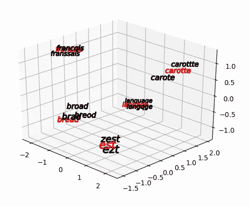
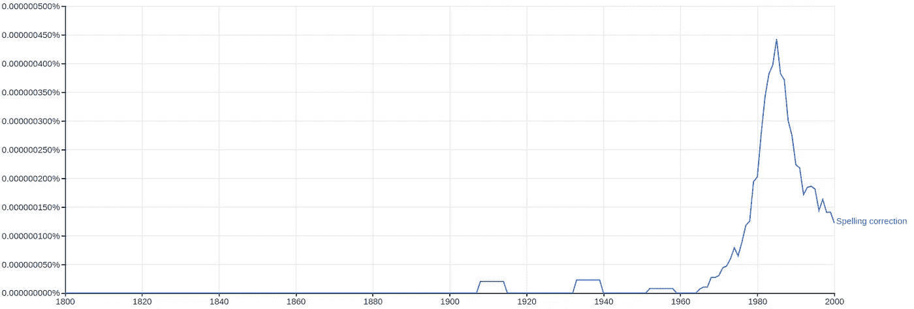

# 用于拼写纠正的嵌入

> 原文：<https://towardsdatascience.com/embedding-for-spelling-correction-92c93f835d79?source=collection_archive---------15----------------------->


Photo by [Da Nina](https://unsplash.com/@daninasplash?utm_source=medium&utm_medium=referral) on [Unsplash](https://unsplash.com?utm_source=medium&utm_medium=referral)

尽管自 70 年代以来一直在进行自动拼写纠正，但在缺乏大量用户数据的情况下，仍然很难解决。

噪声文本对于许多 NLP 任务来说是有问题的，因为它导致基于机器学习的技术的准确性降低，并且增加了诸如 Word2Vec 或 GloVe 之类的流行技术不能处理的词汇表外(OOV)单词的数量。

因此，作为管道预处理的一部分，我们探索了几种方法来主动纠正输入数据的拼写，以提高下游任务的准确性。在这里，我们将重点讨论如何通过字符级嵌入来解决这个问题。我们的工作可以从头开始训练，使用和可视化，可以通过点击[](https://github.com/Lettria/Char2Vec)****【1】链接下载和实验。****

# ****介绍****

****拼写错误可以分为三类，需要不同的处理方法:****

1.  ******实词错误** : ' **三个'**拼成'**有'******

****真实的单词错误是最难纠正的，因为它们依赖于上下文，为了纠正它们，我们必须分析所有的数据来检查语义一致性和语法。根据所使用的算法，我们引入了错误地纠正准确句子的可能性，并增加了大量的处理时间。处理这个问题最常见的方法是 seq2seq 模型或使用统计数据，如 ngram 令牌。****

******2。简短形式** : ' **you'** 拼写为' **u'******

****简写形式的特点是与想要表达的单词共用几个字母。就 [**编辑距离**](https://en.wikipedia.org/wiki/Edit_distance#targetText=In%20computational%20linguistics%20and%20computer,one%20string%20into%20the%20other.) 而言,“u”比“你”更接近“我”,因此基于字典的方法不太有效。****

******3** 。**非单词错误** : ' **fast'** 拼写为' **fsat'******

****非单词错误是最常见的，大多是由错别字引起的，这将是我们这里的重点。****

****拼写纠正可以分为三个主要任务:****

1.  ****以一个句子作为输入，确定哪些单词拼写错误。****
2.  ****从拼写错误的单词中，查找替换的候选列表。****
3.  ****从列表中选择合适的候选人。(在自动校正的情况下)****

****因为我们只对非单词错误感兴趣，所以确定哪些单词拼写错误只需对照字典进行检查，尽管必须特别注意专有名词。****

# ****候选人选择****

****有几种不同的方法来选择候选人:****

*   ****最简单的方法是计算你的单词和整个词典之间的编辑距离。虽然这种方法很准确，但是非常昂贵。****
*   ****[**语音算法**](https://en.wikipedia.org/wiki/Phonetic_algorithm)【2】如 Soundex、Phonex 或 Metaphone。这些算法将任何字符串编码成一个短序列，允许字符串索引的发音。“hurry”和“hirry”都将返回“H600”。通过预处理您的整个词典并按语音代码索引，您可以很容易地找到发音相似的候选词。运行时很快，但它只纠正语音错误。****
*   ******计算你的单词的可能拼写错误列表**(插入、删除、换位或替换)，并将其与你的字典匹配。虽然这比简单的方法要好，但是由于拼写错误的集合以 54 * length+25 的速率增加，所以速度非常慢。更多解释见[**Peter nor vig**](https://norvig.com/spell-correct.html)【3】的优秀文章。****
*   ******对称拼写校正**采用前面的想法，并通过计算字典和拼写错误的单词的拼写错误来扩展它。详见 [**符号拼写**](https://github.com/wolfgarbe/SymSpell)【4】。这种技术既准确又非常快，但代价是大量的预计算和磁盘空间，并且需要字典的频率列表。****

## ****字符级嵌入****

****我们已经探索了解决这个问题的另一种方法，即使用单词嵌入在字符级别表示单词。流行的单词嵌入方法，如 Word2Vec，试图通过语义来表示单词，因为这对各种任务非常有用。然而，通过使用基于字符的模型，有可能基于单词拼写来构建单词嵌入。****

****这个想法类似于语音算法，其目的是在相同的单一度量(字符串或浮点数)下表示相似的单词，但是我们通过使用 n 维嵌入来扩展这个想法。****

****我们的方法如下:****

*   ****训练模型以产生字符级单词嵌入****
*   ****向量化我们的整个字典，并建立一个有效的搜索索引****
*   ****矢量化拼写错误的单词并查找最近的邻居****

****该模型使用两层 LSTM 来构建选定大小的嵌入。更高的维度以更长的计算时间为代价提供更精确的结果，对于我们的使用，我们已经满足于维度 150。该模型通过向其传递一组单词来训练，这些单词要么是*两个完全不同的单词*，要么是*单词及其拼写错误*。训练目标是使相似元组的两个嵌入之间的差异的范数最小化*，并使不同单词的差异最大化。*****

****已经使用 600k 单词的字典生成了训练数据，并且为每个单词生成了编辑距离 1 或 2 的几个拼写错误。我们对 AZERTY 键盘上原始字符附近的拼写错误赋予了更高的概率(因为我们是用法语工作的),以便模型支持这些错误。由于缺乏明确的训练指标，很难准确知道何时停止训练，但在经历了几百万次训练后，我们对结果感到满意。****

****一旦经过训练，该模型就可以用于向量化单词。通过使用 PCA 将它们投影到 2D 平面上，我们可以获得以下可视化:****

```
**python usage_visualisation.py**
```

********

****The original model we used was developed by [IntuitionEngineering](https://github.com/IntuitionEngineeringTeam/chars2vec).****

****成功！相似的单词似乎在向量空间中被分组在一起。****

****这本身不是很有用，所以现在我们要对整个 60 万单词字典进行矢量化。在现代 CPU 上，这个过程大约需要 10 分钟。****

****最后一步是构建一个索引，它允许有效地搜索最近的向量。由于我们不需要 100%的准确性，更关心计算速度，我们将使用[**NMS lib**](https://github.com/nmslib/nmslib)【5】，一个专门用于 ANN(近似最近邻)搜索的库。****

****这个库允许我们在索引中搜索给定向量的 k 个最近邻。我们可以调整 k 个最近邻的数量，以恢复计算时间与精确度之间的平衡。一旦我们得到了最近邻的列表，我们可以使用编辑距离进一步过滤，只保留相关的建议。****

****这为我们提供了以下输出(法语):****

```
**python usage_correction.py 'langqge'**
```

> ******编辑距离 1:**
> langqge:[' langage ']****
> 
> ******编辑距离 2:**
> langqge : ['langages '，' lange '，' langé'，' langage']****

## ****结果****

****我们已经在通过我们的拼写错误生成器生成的语料库(大约 4k 个句子)上测试了我们的模型。我们的衡量标准是准确性，我们将准确性定义为在候选列表中找到正确单词的百分比。****

****在整个语料库中，chars2vec 模型的准确率为 85%，而标准语音算法的准确率约为 40%。结合这两种方法，我们有 90%的准确率。主要的瓶颈是 4 个字符或更少的单词，它们的性能不好。****

****这是意料之中的，因为:****

*   ****那么大的单词在短编辑距离内有很多邻居。****
*   ****3 个字母的单词中的打字错误比 10 个字母的单词更有影响力，这使得模型更难在向量空间中正确地映射单词。****

# ****校正选择****

****虽然我们前面的例子直接给出了我们想要的答案，但在编辑距离内经常有几个候选人，必须做出选择。****

****我们尝试了两种不同的方法:****

*   ****概率性:使用建立在大型语料库上的频率列表，选择最常用的词。明显的缺点是一些不常用的单词可能永远不会被选择，虽然这种方法非常简单，但却提供了很好的准确性。****
*   ****语义:根据候选词与句子中周围单词的语义相似性对候选词进行排序。这可以通过取一个预先训练的跳格词 2Vec 并计算嵌入的候选词和周围词(或整个句子)之间的平均距离来完成。虽然计算量很大，但这对于具有良好语义的单词给出了非常好的结果，尽管对于可以在任何上下文中使用的单词如“there”、“I”、“are”不是非常有效。****

****根据经验，我们发现语义方法对于较长的、不常用的单词非常有效，而概率方法对于较短的单词更好。将这两种方法与手工制作的规则相结合，我们在随机生成的语料库上获得了大约 70 %的正确率。****

## ****未来工作:N-grams 令牌****

****理想的方法是将两者结合起来，而不是在语义和频率之间进行选择。这可以通过使用单词 N 元语法的频率表来实现。****

****为了建立这些表，在非常大的语料库上对 N 个单词的连续序列进行计数和编译。对此可用的最佳资源是 [**谷歌图书 N-gram**](https://books.google.com/ngrams/)【6】**，它是通过分析各种语言的大约*500 万本图书*而构建的。******

************

******‘Spelling Correction’ bi-gram occurrences******

******原始数据可通过此 [**链接**](http://storage.googleapis.com/books/ngrams/books/datasetsv2.html)【7】获得，尽管由于文本数量庞大，下载并将其编译成可用状态需要大量时间。******

# ****结论****

****使用字符级嵌入可以获得良好的整体性能，尤其是对于较长的单词。通过手工制作的预处理规则和适当的候选项选择，这为现有的拼写校正解决方案提供了一种体面的替代方案。****

****进一步的工作将包括与预先存在的流行解决方案和 n-gram 令牌的使用适当的基准。在此期间，这个包可以免费试用:[**char 2 vec**](https://github.com/Lettria/Char2Vec)【1】。****

****[1][https://github.com/Lettria/Char2Vec](https://github.com/Lettria/Char2Vec)****

****[2]https://en.wikipedia.org/wiki/Phonetic_algorithm****

****[3]https://norvig.com/spell-correct.html****

****[https://github.com/wolfgarbe/SymSpell](https://github.com/wolfgarbe/SymSpell)****

****[https://github.com/nmslib/nmslib](https://github.com/nmslib/nmslib)****

****[https://books.google.com/ngrams/](https://books.google.com/ngrams/)****

****[7][http://storage . Google APIs . com/books/n grams/books/datasetsv 2 . html](http://storage.googleapis.com/books/ngrams/books/datasetsv2.html)****