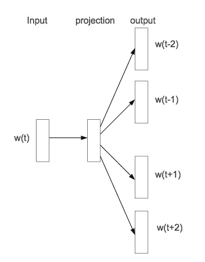

# 利用深度学习嵌入图

> 原文：<https://towardsdatascience.com/embedding-graphs-with-deep-learning-55e0c66d7752?source=collection_archive---------9----------------------->

稀疏表示是分类器的天然杀手。当前的图形数据结构，如邻接矩阵和列表，都受到这种稀疏性的困扰。本文将讨论矩阵分解、DeepWalk 和 Node2Vec 等技术，这些技术将稀疏图数据转换成低维连续向量空间。


Converting Adjacency Matrices to low-dimensional continuous vector spaces.


This diagram shows the results of embedding a graph on the left into a 2-dimensional representation which can be plotted and clustered based on metrics such as Euclidean distance

历史上，矩阵分解一直是降低图形数据维数的流行方法。这包括 SVD(奇异值分解)和 MDS(多维标度)等技术。这些技术的问题在于，它们本质上具有矩阵乘法的运行时间(通常为 n，尽管是 n^(2.37)和 n^(2.77，这些都可以通过诸如库珀史密斯-维诺格拉德或斯特拉森算法之类的巧妙技巧来实现。

对于许多问题来说，n 次运行时间并不太可怕。然而，对于有数千甚至数百万用户的图形表示来说，这是灾难性的。此外，当新用户和连接添加到图表中时，必须重新计算。twitter 转发或媒体关注者等社交网络图是动态的，不断发展的。

我们可以使用深度学习，而不是使用矩阵分解来表示图形！

DeepWalk(链接如下)是第一篇优雅地阐述深度学习用于表示图的论文之一。

 [## 深度行走:社交表征的在线学习

### 我们提出了 DeepWalk，一种学习网络中顶点潜在表示的新方法。这些潜在的…

arxiv.org](https://arxiv.org/abs/1403.6652) 

DeepWalk 的灵感来自于图形表示和文本标记之间的相似性。天真地说，文本标记被编码为一个热点向量。例如，你可以用一个很长的向量来表示词汇表的大小，并为每个单词保留一个索引。单词“tiger”的编码如下:

```
One-hot encoding of text
[ 0 0 .. 0 0 1 0 0 .. 0 0 ] = "tiger"
```

自然，这些文本的稀疏表示破坏了下游任务(如情感预测)的分类模型。拯救者是跳格模型的引入(如下图所示):



Skip-gram 模型的工作原理是在句子之间滑动上下文窗口，并建立一个深度神经网络，该网络将单词标记作为输入，并将其映射到上下文窗口中出现的其他单词的预测。中间表示(在上图中表示为“投影”)是文本标记的低维表示。


DeepWalk 采用了这个想法，并将其扩展到图形数据。然而，文本数据自然包含某种非常适合上下文窗口的结构。DeepWalk 的作者通过随机行走构造邻域来模拟这种结构，因此得名“DeepWalk”。


上图用于描述随机漫步。从节点“Connor”开始，我们以概率 a、b、c 和 d 前往 Erika、Daniel、Ben 或 James。在 DeepWalk 中，a = b = c = d，但在 Node2Vec 中，这些概率在整个行走过程中都是参数化的。

沿着图随机行走会产生如下邻域:

```
Examples of Vertex Neighborhoods
(Connor, James, Jon, Bob, Joe)
(Connor, James, Jon, James, Connor)
(Connor, Erika, Connor, Daniel, Connor)
```

然后，上下文窗口滑过这些邻域，并训练一个跳格模型。

训练跳格模型的两个重要想法是**分层 Softmax** 和**负采样**。该图像突出了分层 Softmax 的思想。


Image taken from [Galina Olejnik](https://medium.com/u/6da21bd709d?source=post_page-----55e0c66d7752--------------------------------)’s explanation: “Hierarchical softmax and negative sampling: short notes worth telling” which can be found on towards data science: [https://towardsdatascience.com/hierarchical-softmax-and-negative-sampling-short-notes-worth-telling-2672010dbe08](/hierarchical-softmax-and-negative-sampling-short-notes-worth-telling-2672010dbe08)

想象一下一个 facebook 网络，其中有数百万用户需要预测顶点邻域。这将导致 softmax 层具有数百万个隐藏单元。这种灾难可以通过在二叉树中构造顶点空间并预测沿树的路径来避免。例如，如果网络中有 8 个用户，那么只需要 3 个值就可以从根节点遍历到任何一个单独的节点。

下一个想法(在 Word2Vec 中是至关重要的想法)是负采样。负采样基本上抛弃了直接预测上下文窗口中的单词的思想，而是将上下文预测任务视为二元分类问题。一旦你有了一个上下文对，你就随机抽样否定对，然后让模型标注这个单词是否出现在上下文中。


Example of negative sampling, coffee and Gorilla do not appear in the context window and are thus labeled as ‘0’ in the binary classification task.

另一个在 DeepWalk 上构建的有趣的论文是 Node2Vec(链接如下):

 [## node2vec:可扩展的网络特征学习

### 网络中节点和边上的预测任务需要在学习所使用的工程特征方面进行仔细的努力

arxiv.org](https://arxiv.org/abs/1607.00653?context=cs) 

Node2Vec 分解了使用随机行走来构造顶点邻域的思想。首先看两种遍历图形的极端方法，面包优先和深度优先搜索:


他们发现，如果你在深度优先搜索中遍历节点，得到的嵌入将捕捉到同质性。同向性指的是具有小的最短路径距离的节点应该在新的表示中彼此靠近地嵌入。他们还发现，如果在广度优先搜索中遍历节点，得到的嵌入将捕获结构等价。上图中的结构等价很容易解释，尽管 u 和 s6 没有共享任何邻居，但它们都是各自社区的中心。

Node2Vec 的作者因此建议将随机游走参数化，以便它可以构建更多的语义顶点邻域:


总之，本文介绍了 DeepWalk 和 Node2Vec，并展示了它们如何使用深度学习将图形嵌入到低维表示中。与必须重新计算的矩阵分解方法相比，跳跃图模型方法具有适应网络变化的优点。感谢您的阅读，如果您想回顾这篇文章，请查看下面的视频！