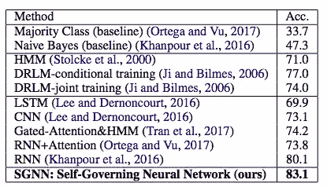

# 无嵌入深度学习 NLP 模型

> 原文：<https://towardsdatascience.com/embeddings-free-deep-learning-nlp-model-ce067c7a7c93?source=collection_archive---------20----------------------->

## 什么是单词嵌入

Photo by [Edward Ma](https://unsplash.com/@makcedward?utm_source=medium&utm_medium=referral) on [Unsplash](https://unsplash.com?utm_source=medium&utm_medium=referral)

[单词嵌入](/3-silver-bullets-of-word-embedding-in-nlp-10fa8f50cc5a)(例如 word2vec，GloVe)在几年前被引入，并从根本上改变了 NLP 任务。有了嵌入，我们不需要在大多数 NLP 任务中导致非常高维特征的一键编码。我们可以用 300 个维度来代表超过 100 万个单词。

不同种类的嵌入，如[字符嵌入](/besides-word-embedding-why-you-need-to-know-character-embedding-6096a34a3b10)，句子嵌入(如[跳读](/transforming-text-to-sentence-embeddings-layer-via-some-thoughts-b77bed60822c)和[推断](/learning-sentence-embeddings-by-natural-language-inference-a50b4661a0b8))，上下文嵌入(如 [ELMo](/elmo-helps-to-further-improve-your-word-embeddings-c6ed2c9df95f) 和 [BERT](/how-bert-leverage-attention-mechanism-and-transformer-to-learn-word-contextual-relations-5bbee1b6dbdb) )是近年来发展起来的。我们一直都需要嵌入层吗？有时这可能不可行，因此 Ravi S .和 Kozareva Z .引入了无嵌入深度学习模型。

# 设备上

我们可以在云中或内部轻松分配 1 GB 内存和 16 个 CPU 来部署 sexy 模型。我们不需要牺牲模型准确性来减少模型占用空间，也不需要在大多数企业级基础架构中产生大量的大型模型。

有时，我们别无选择，只能将模型部署到设备，而不是利用云基础架构。原因可以是

*   `Sensitive Data`:数据可能无法从设备发送到云端
*   `Network`:高速网络可能无法覆盖。

因此，如果我们将模型部署到智能 Swatch 或物联网设备等设备，则需要一个非常小的模型。没有人想在你的 Android Wear 操作系统中加载 1 GB 的型号。将模型部署到设备时面临的挑战:

*   `Small memory footprint`
*   `Limited storage`
*   `Low computational capacity`

# 自治神经网络

因为目标是将模型部署到小型设备。它不能是高资源需求的。因此，SGNN 的目标是:

*   `Tiny memory footprint`:加载预训练嵌入时没有初始化。
*   `On-the-fry`:将输入文本实时转换为低维特征。

## 投影神经网络

Ravi S .和 Kozareva Z .利用投影神经网络模型架构来减少内存和计算消耗，而不是使用具有高占用空间的原始神经网络。

其思想是在训练阶段训练两个神经网络(即训练器网络和投影网络)。全网优化教练机网络损耗、投影网络损耗和投影损耗。

Projection Neural Network Architecture (Ravi S. 2017)

## 模型架构

SGNN Model Architecture (Ravi S. and Kozareva Z., 2018)

*   `On-the-fry Computation`:将(函数 F 和 P)文本实时转换为中间结果和项目层，无需查找预定义的矢量。
*   `Hash Function Projection`:通过修改版本的[位置敏感散列](https://en.wikipedia.org/wiki/Locality-sensitive_hashing) (LSH)将高维特征减少到低维特征，这允许将相似的输入投射到相同的桶。
*   `Model Optimization`:在投影层使用二进制特征(0 或 1)实现非常低的内存占用。

# 实验

Ravi S .和 Kozareva Z .通过`Switchboard Dialog Act Corpus` (SwDA)和`ICSI Meeting Recorder Dialog Act Corpus` (MRDA)对 SGNN 进行了评估，结果非常好。

SwDA Data Result (Ravi S. and Kozareva Z., 2018)

MRDA Data Result (Ravi S. and Kozareva Z., 2018)

# 拿走

*   越来越多复杂的模型架构被发布，以在不同的学科中实现最先进的结果。然而，它可能不适合小型设备，如物联网设备或移动设备，因为这些设备中资源有限。
*   当交付一个令人惊叹的模型时，准确性并不是唯一的关注点。在某些情况下，必须考虑速度和模型复杂性。我们可能需要牺牲精确性来得到一个轻量级的模型。

# 关于我

我是湾区的数据科学家。专注于数据科学、人工智能，尤其是 NLP 和平台相关领域的最新发展。你可以通过[媒体博客](http://medium.com/@makcedward/)、 [LinkedIn](https://www.linkedin.com/in/edwardma1026) 或 [Github](https://github.com/makcedward) 联系我。

# 参考

拉维..2017. [ProjectionNet:使用神经投射学习高效的设备上深度网络](https://arxiv.org/pdf/1708.00630.pdf)。

拉维 s 和科扎列娃 z，2018。[用于设备上短文本分类的自治神经网络](https://aclweb.org/anthology/D18-1105)。