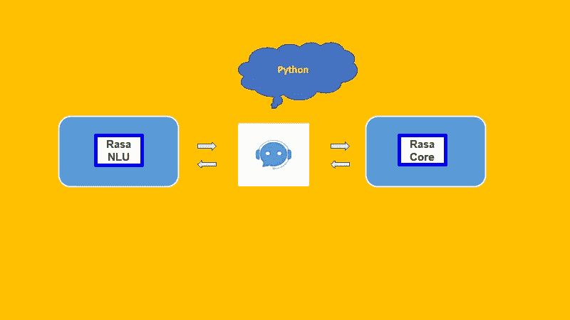
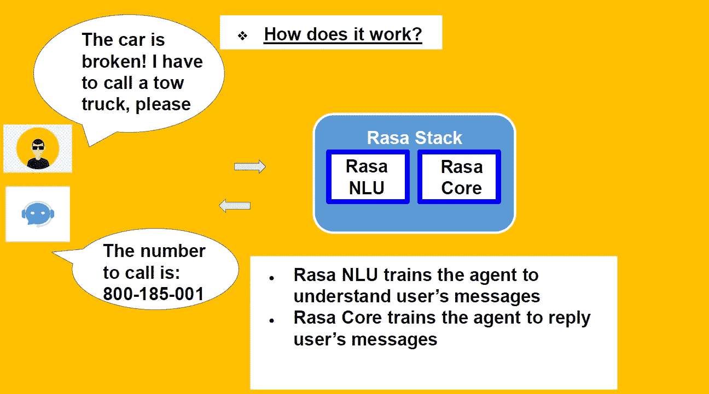
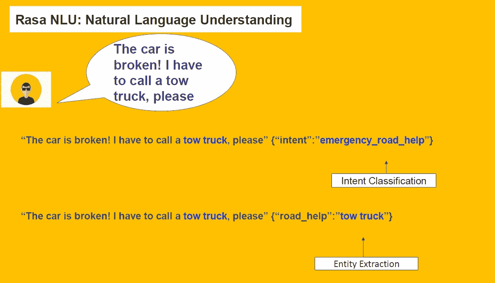
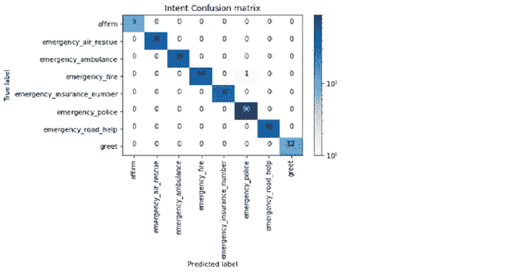
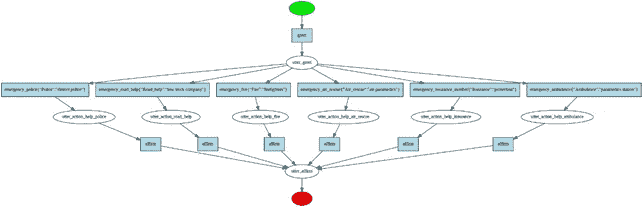

# 在 Jupyter 笔记本/Google 联合实验室上使用 Rasa 的紧急聊天机器人

> 原文：<https://towardsdatascience.com/emergency-chatbot-using-rasa-on-jupyter-notebook-google-colaboratory-2be9059f87cc?source=collection_archive---------13----------------------->

Picture by the author

聊天机器人是典型的人工智能工具，广泛用于商业目的。

通过这篇文章，我的目标是解释紧急聊天机器人的目的，如何将一个想法发展成一个空机器人，作为一个有优点和缺点的堆栈，以及为什么我使用 Jupyter 笔记本来解决它。

在 2018 年夏天，我和另外两个家伙有了建造聊天机器人的想法，尽管在最初的几个月合作之后，我已经和 Rasa 单独进行了这个项目。我的紧急聊天机器人的想法是在夏天意大利发生恶劣天气悲剧后产生的。在这些情况下，人们需要紧急帮助，同时他们也处于恐慌状态。因此，首先，紧急聊天机器人将是一种在危险情况下使用的社交工具，开发技术将有助于及时挽救生命。也许有机会在一起出售保险的应用程序中部署这个紧急聊天机器人。

我们开始用 python 编写一些脚本，但在那之后，我们发现了 Rasa，并决定使用这个框架，因为 Rasa 是一个用 python 编写的开源 NLP 工具包，具有预构建的架构，可以根据您的需要进行定制。Rasa Stack 是为短消息构建的，能够执行任务，所以只要有一个想法，你就可以开始用句子填充这个框架，形成用于训练你的机器人的数据集，然后你配置 NLU 模型，创建对话模式和对话的框架。

Picture by the author

为了这个项目，我遵循了"*Justina petraiyte "*Jupyter 笔记本的步骤。选择使用 Jupyter 笔记本电脑是因为它有助于数据科学家之间的工作共享，尽管不可能在生产中使用它来部署机器人，但可以在网络上共享笔记本电脑并在云上运行它。有几个工具，但*谷歌合作实验室*表现很好，是我的最佳选择。

要理解机器人如何工作，必须知道对话的基本流程:用户给出一个输入，代理解析这个输入并运行一个 NLP 任务，代理根据从对话中提取的实体给用户一个答案。

**意图**将用户输入映射到响应。它可以被视为对话中的一个对话回合。在每个意图中，都定义了用户话语、实体和如何响应的示例。

**实体**是用于从输入中识别和提取有用数据的关键字。意图让你的机器人理解特定用户输入背后的动机，而实体则用来挑选用户提到的特定信息，包括链接到实体的实体值

现在的问题是，Rasa 堆栈是如何工作的？

Rasa 框架分为 **Rasa NLU** 和 **Rasa 核心** python 库。第一个是自然语言理解模块，用于意图分类和实体提取，目的是教会聊天机器人如何基于机器学习理解用户输入。

使用 Rasa Core，您可以通过训练基于深度学习设置的对话管理来教聊天机器人如何做出响应。

Picture by the author

当用户输入到来时，它被传递给 i **解释器**(拉萨·NLU)，目的是提取意图、实体和其他结构化信息。后续步骤由 Rasa 核心管理。**跟踪器**用于在内存中存储对话历史，它维护对话状态。**策略**决定在对话的每一步采取什么行动。它是与一个**特征器**一起生成的，该特征器创建了跟踪器给出的当前对话状态的向量表示。最后，执行一个**动作**，向用户发送一条消息并传递一个跟踪器实例。

让我们开始紧急聊天机器人之旅吧！！！

看[Rasa _ Emergency _ Chatbot _ Colab](https://colab.research.google.com/drive/1fqshAYRT9FBaJwd1nIOSonUt4MoIsgl-)笔记本。

首先，让我们安装 Rasa 库:我已经使用了 Rasa NLU 0.12.3 和 Rasa 核心 0.9.6，虽然在此期间更新版本已经实现。

现在我们准备使用保存在“ **nlu.md** ”文件中的数据集开始自然语言理解过程(***“# #”***代表意图的开始)。

在该数据集中，用户输入示例按意图分组。在紧急聊天机器人中，数据集包含以下意图:

**“问候”、“确认”、“紧急 _ 空中 _ 救援”、“紧急 _ 保险 _ 号码”、“紧急 _ 道路 _ 求助”、“紧急 _ 消防”、“紧急 _ 救护车”、“紧急 _ 警察”。**

拥有六个实体:**“警察”、“道路 _ 救助”、“救护车”、“空中 _ 救援”、“消防”、“保险”。**

实体和实体值(同义)使用降价链接 syntex 进行标记:[实体值](实体类型)。

在 Rasa NLU 模型中，传入消息由一系列组件处理。这些组件在所谓的处理流水线中一个接一个地执行。有用于实体提取、意图分类、预处理等的组件。每个组件处理输入并创建输出。

在文件“ **config.yml** ”中嵌入了处理管道:Spacy 库提供了标记化和词性，Spacy featuriser 为每个标记查找手套向量，并将这些集合起来以生成整个句子的表示。Scikit-learn 分类器训练支持向量机模型，ner_crf 训练条件随机场来识别实体。使用支持向量机是因为它们是短信的一个很好的分类器，正如 Kaggle competition 所展示的那样:“在煮什么？”。

用混淆矩阵对模型进行评估，并用一个新句子测试其性能。

Picture by the author

此时，Rasa 核心用于教导聊天机器人如何使用深度学习模型做出响应:在 Keras 中实现的 LSTM 神经网络。

在这一步中，两个文件是相关的:“ **stories.md** 和“ **domain.yml** ”。

第一个表示对话管理模型的训练数据:实际对话的草稿，包括用户的意图和实体以及机器人的动作。在一个典型的故事中:

“##”代表一个故事的开始；

“*”代表用户以意图形式发送的信息；

“-”代表机器人采取的行动。

**动作**是你的机器人作为对用户输入的回答而运行的表达式。在 Rasa 核心中，有三种类型的操作:

- **默认动作** (action_listen，action_restart，action _ default _ fallback)；

- **utter actions** ，以“utter_”开始，用作发送给用户输入的消息；

- **自定义动作**(任何其他动作)，可用于任意代码。

在紧急情况下，具有 API 的聊天机器人创建定制动作，该定制动作使聊天机器人能够根据用户输入为救护车实体、警察实体或消防实体检索答案。聊天机器人将通过从槽“组”中检索值来知道应该给出哪种类型的答案。

“ **domain.yml** ”代表对话的框架，它有预期的用户输入、机器人应该预测的动作、如何响应以及存储什么信息。

领域由五部分组成:**意图、槽、实体、动作和模板。**

在**模板**中有链接到机器人动作的消息。

插槽代表机器人的记忆，它们存储用户或外界收集的键值。在紧急情况下，聊天机器人槽通过返回动作中的事件来设置；由实体及其值表示的分类槽。

Picture by the author

现在，对话管理模型将被训练，创建一个代理，并包括决定在对话的每一步采取何种行动的策略。

用于训练历史的模型是长短期记忆(LSTM ),这是一种奇特的递归神经网络，基本上扩展了它们的记忆。由于有内部存储器，RNN 的算法是第一个记住输入的算法，这使得它非常适合处理顺序数据的问题。苹果 Siri 和谷歌语音搜索都使用它们。

经过 10-15 分钟的训练(取决于是否使用 GPU ),你就可以玩紧急聊天机器人了。

虽然 Rasa 有广泛的文档，但我很难找到 Rasa NLU 关于支持向量机实现的文档。Rasa 的另一个弱点是当机器人不理解用户输入时使用的回退操作，因此机器人应该向用户发送默认模板消息，并恢复到导致回退的用户消息之前的对话状态。

我还没有使用这种类型的行动，因为它没有以一种适当的方式工作，机器人将继续建议不正确的答案；网站上使用的 Rasa 机器人“Sara”也是如此。

尽管有这些缺点，我认为 Rasa 是非常通用的，有机会用许多工具将其部署到生产中，并不断发展。

特别感谢 Lorenzo Invernizzi 和 Frenk Locmelis 为这个项目做出的最初贡献。

— — — — — — — — — — — — — — — — — — — — — — — — — — — — — — —

我的 Github 库:[https://github.com/claudio1975/chatbot](https://github.com/claudio1975/chatbot)

*参考文献:*

【https://github.com/RasaHQ/rasa-workshop-pydata-berlin 

[https://github.com/RasaHQ/rasa-workshop-pydata-dc](https://github.com/RasaHQ/rasa-workshop-pydata-dc)

[https://arxiv.org/abs/1712.05181](https://arxiv.org/abs/1712.05181)

[https://rasa.com/docs/](https://rasa.com/docs/)