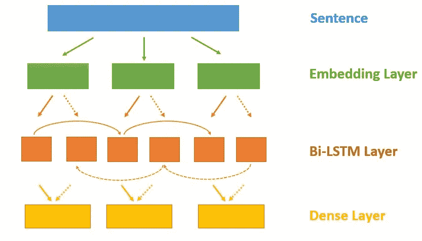
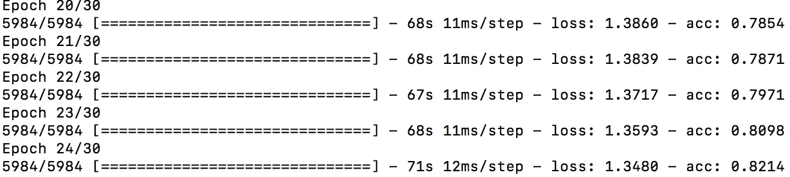
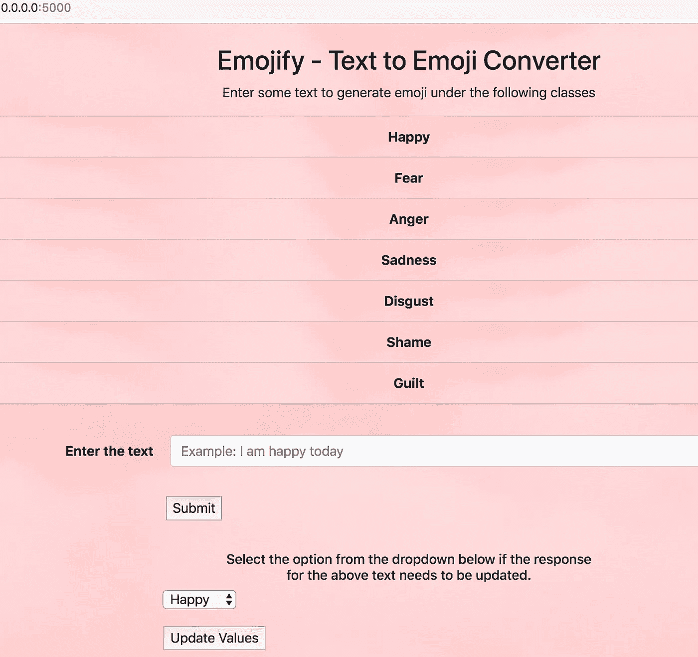
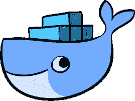
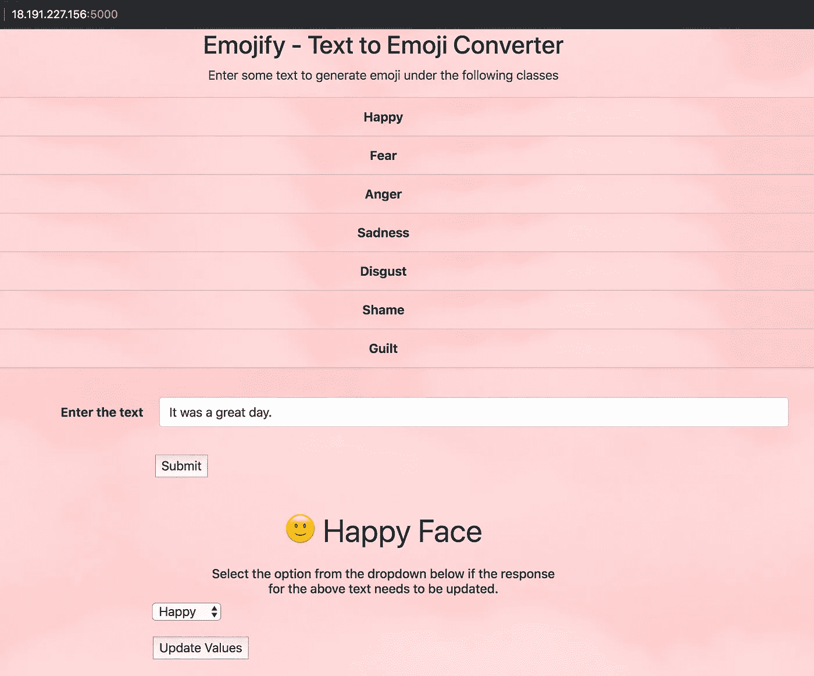
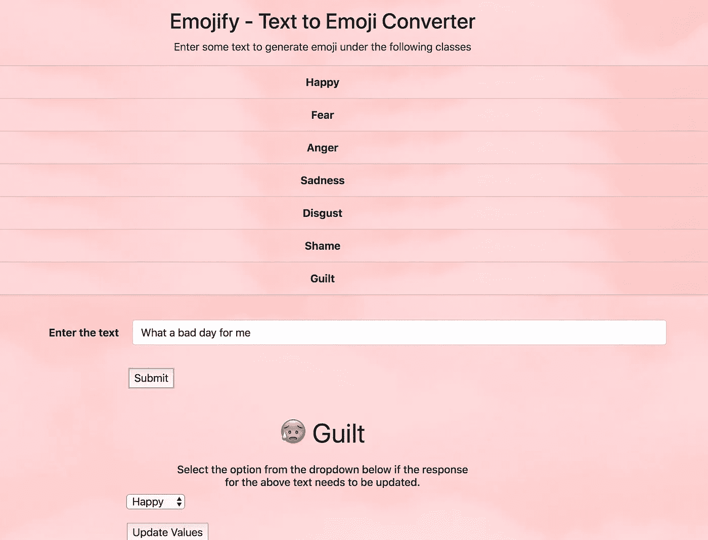
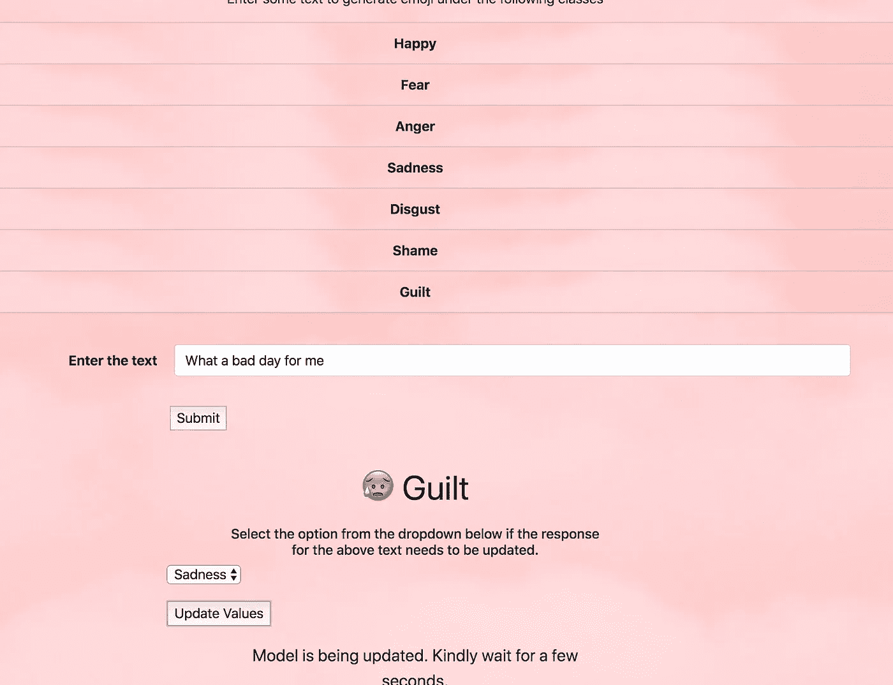
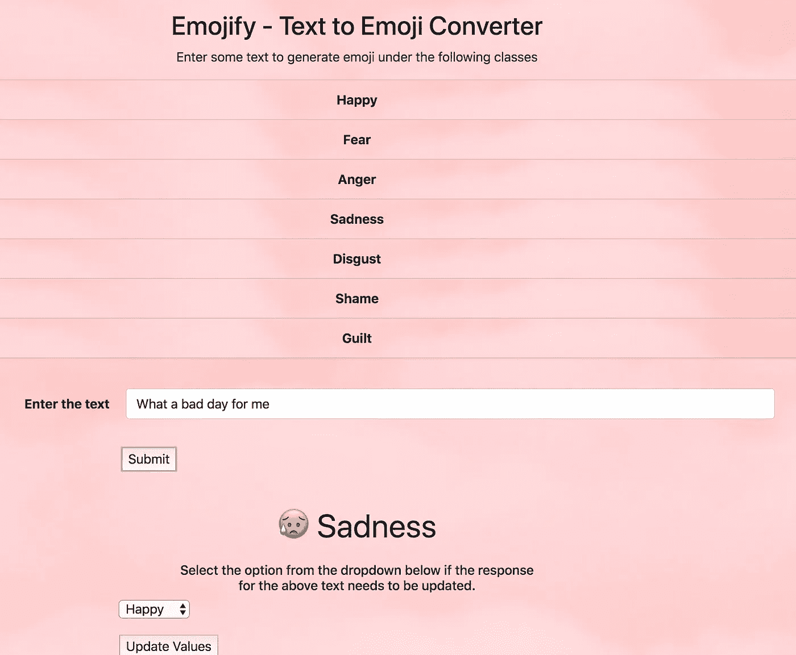

# 使用 Flask +容器化+在 AWS 上部署的机器学习 Web 应用程序

> 原文：<https://towardsdatascience.com/emojify-machine-learning-web-app-using-flask-containerization-deployment-on-aws-14a9bdb75535?source=collection_archive---------8----------------------->

## *构建和部署机器学习 web 应用的直观指南。*


PC: Unsplash

在本教程中，我将分享我在使用 Flask 构建一个简单的端到端机器学习 web 应用程序并随后将其部署到 AWS 上的学习。只有当用户可以通过 web 应用程序交互地使用 ML 模型时，它的目的才能得到很好的服务。传统的 Jupyter 笔记本电脑只提供了一个交互式控制台，对于将它应用到 web 应用程序上没有多大用处。

Flask 是一个用 Python 编写的微框架，可以帮助我们快速开始构建应用程序。我们将使用 Keras 中的长短期记忆(LSTM)单元来训练来自[深度莫吉](https://github.com/bfelbo/DeepMoji/tree/master/data)数据集的数据。然后，我们将最终模型保存为 HDF5 文件，并在以后用于预测目的。最终的应用程序将像这个 [***链接***](https://deepmoji.mit.edu/) 中提到的那样工作。让我们更深入地探讨如何使用 Docker 容器在 AWS 中构建和部署整个 web 应用程序。这个项目的代码可以在我的 [Github repo 中找到。](https://github.com/SRIRAM777/Emojify-ML-Flask-App)

# 内容

1.  数据

2.数据提取和处理

3.嵌入层

4.双向 RNN 模型

5.训练模型

6.构建 Flask 应用程序

7.使用码头集装箱的集装箱化

8.将 Docker 映像推送到 AWS ECR

9.在 AWS EC2 上部署 Flask 应用程序

## 数据

我们将使用 [**深度莫吉**](https://github.com/bfelbo/DeepMoji/tree/master/data) 数据集，特别是 PsychExp 数据集来构建模型。数据集由 **7840** 个样本组成，其中每一行包含一条文本消息和编码为一个热点向量的标签。这些标签属于这 7 类中的一类——快乐、恐惧、愤怒、悲伤、厌恶、羞耻、内疚。数据集中的一行示例如下:`[ 1\. 0\. 0\. 0\. 0\. 0\. 0.] I am very happy today.`

## **数据提取和处理**

Extracting text and labels from the pickled dataset.

在这个函数中，我们从 pickle 文件中提取文本和标签，然后将它们写入一个文本文件。

Separating Labels and Texts

在读取文本文件函数中，我们返回一个包含文本消息和标签的列表。然后，我们将消息和标签分离到单独的列表中。

对于任何 ML 模型，我们都必须以数字格式输入数据，以便进行处理。类似地，为了在 7 个类别中分类我们的输入文本，我们必须将我们的输入句子转换成单词向量表示。为此，我们将使用预先训练的 50 维手套单词嵌入。

上面的“read_glove_vector”函数返回给定单词的索引列表、给定索引的单词以及每个单词对应的 50 维表示。

## 嵌入层

在构建嵌入层之前，让我们知道为什么要使用嵌入层。让我们考虑我们有 1000 个单词的文本语料库。文本中每个单词的一个热编码将是具有 999 个零和 1 个非零值的向量。这些向量非常稀疏，不太适合大型数据集。在单词嵌入中，单词由密集向量表示，其中每个向量是单词在连续向量空间中的投影。因此，单词嵌入帮助将单词投影到一个更低的维度，而不是将单词投影到一个更高的维度。此外，单词嵌入帮助我们捕捉单词之间的关系，否则使用一个热编码向量难以捕捉。让我们看看如何为我们的应用程序实现这个嵌入层:

这里，嵌入层的第一个参数是手套单词嵌入中的单词总数，第二个参数是每个单词在向量空间中表示的维度。

## 双向 RNN 模型

双向 RNN 有两个网络，一个正向训练信息，另一个反向训练信息。因此，这些模型可以访问过去和未来的数据，而标准的 LSTM 模型只能访问过去的数据。


Bi-Directional LSTM

让我们在使用 Keras 的应用程序中看到它的实现。

LSTM Model

在这里，我们正在构建一个深度递归神经网络，它包含一个具有批量归一化和丢失的双向 LSTM。此处使用 Softmax 激活来获得跨 7 个类别的概率分布。

这是一个简化的图像，显示了我们整个 LSTM 模型的架构。



[Architecture of our Neural Network](http://thelillysblog.com/2017/10/02/sentiment-analysis-with-deep-learning/)

## 训练模型

我们将使用分类交叉熵作为损失函数，因为我们将在 7 个类别中对输出进行分类。我们将试图在每个时期最小化这种损失，以便它在测试数据上表现良好。Adam optimizer 用于帮助我们加快训练过程。准确性是我们在这里用来评估模型的性能指标。

```
X_train = pad_sequences(train_tokenized, maxlen = maxlen)
X_test = pad_sequences(test_tokenized, maxlen = maxlen)model.compile(loss='categorical_crossentropy', optimizer='adam', metrics=['accuracy'])model.fit(X_train, np.array(y_train), epochs = 30, batch_size = 32, shuffle=True)
```



然后，我们将使用 Tensorflow 的 save_model 来保存 Keras 模型，以便我们稍后可以加载它来给出预测。经过 30 个周期的训练，准确率达到了 86%。

```
model.save('emoji_model.h5')
model = load_model('emoji_model.h5')
```

## 构建 Flask 应用程序

首先我们必须使用命令- `**pip install flask**` **安装 flask。**然后创建一个名为 application.py 的文件，这是我们应用程序的主要后端文件。

首先，我们必须实例化 Flask 类的一个对象。然后，我们使用 load_model 函数加载已经训练好的模型。我们还为文本标记器保存了一个 pickle 文件，以便它可以用于标记未来的文本输入。有两条路线-预测和更新。“预测”路由接收输入文本字段中输入的值，我们使用 tokenizer 对象对文本进行标记。我们使用加载的模型对输入文本进行预测，然后以 JSON 格式返回响应。“更新”路线用于在预测值不正确时更新预测值，以便针对新输入对模型进行微调。虽然这可能不是在大规模系统中更新模型的正确方法，但我想尝试一下模型再训练是如何工作的。为了返回预测的正确表情响应，创建了以下 Javascript 文件。

另一个 Javascript 文件可以通过从下拉列表中选择值来帮助我们进行更新操作，并向“update”路由发送 POST 请求来更新值。我不太擅长构建 UI，因此前端部分可以根据我们的需要进行更改。

我们将使我们的应用程序在主机 0.0.0.0 和端口 5000 上运行。我们也将在 Docker 文件中对此进行配置。这是在我们的 localhost 中运行后的最终应用程序的样子。



## 使用码头集装箱的集装箱化



Docker 是一个开源应用程序，允许用户使用容器创建、管理和部署应用程序。使用 Docker 运行的应用程序驻留在它们自己的环境中，并且拥有运行应用程序所需的依赖关系。Docker 可以使用以下 [***链接***](https://docs.docker.com/docker-for-mac/install/) ***安装在 Mac 上。*** 安装 docker 后移动到我们终端中的应用文件夹。创建一个 docker 文件，指导 docker 安装依赖项并在构建 Docker 映像时执行其他命令。

上面的 docker 文件指示 Docker 从 Docker hub 安装 python，然后创建一个‘app’目录来复制我们 web app 的所有内容。然后它会安装 requirements.txt 文件中提到的所有包。则暴露端口 5000 以从容器外部访问应用程序。默认情况下，使用 CMD 命令运行 application.py 文件。我们将把 docker 图像命名为“flaskapp”。现在我们必须使用以下命令构建 docker 映像。

```
docker build -t flaskapp:latest .
```

“.”在这个命令的末尾，复制当前目录中的所有文件来构建镜像。然后，我们将使用上面创建的 docker 映像在端口 5000 运行 docker 容器。该命令如下所示:

```
docker run -p 5000:5000 flaskapp
```

通过在浏览器的端口 5000 上启动应用程序，检查应用程序是否可在容器外部访问。

## 将 Docker 映像推送到 AWS ECR

我假设在 AWS 中已经创建了一个帐户。如果没有，任何人都可以按照这个 [***链接***](https://aws.amazon.com/free/) ***免费上手。*** 我们必须使用`**pip install awscli --upgrade --user**`在桌面上安装`**awscli**`，以便直接从终端执行 AWS 中的操作。我们必须从我们的终端使用命令`**aws configure**` 来配置我们的 AWS 凭证，在这里我们输入我们的访问密钥 ID、秘密访问密钥、默认区域和输出格式。

我们将使用 AWS 弹性容器注册表来存储和部署我们的 docker 容器映像。为了存储 Docker 图像，我们必须首先在 AWS ECR 中创建一个存储库。这是使用以下命令完成的:

```
aws ecr create-repository --repository-name ml_flask_app
```

然后，为了获得访问 AWS ECR 的权限，我们输入以下命令-

```
$(aws ecr get-login --region region_name --no-include-email)
```

然后，我们在本地用创建的存储库标记我们的 flaskapp 容器。在这里，每个用户的 account_id 和 region name 是不同的。

```
docker tag flaskapp:latest aws_account_id.dkr.ecr.region_name.amazonaws.com/
```

然后，我们必须将本地 docker 映像推送到在 AWS ECR 中创建的存储库中。

```
docker push aws_account_id.dkr.ecr.region_name.amazonaws.com/ml_flask_app
```

## **在 AWS EC2 上部署 Flask 应用**

将图像推送到 AWS ECR 后，我们必须创建一个 EC2 实例，在其中我们可以为 web 应用程序提供服务。AWS 在免费层范围内提供了许多实例，我们可以利用这一点。我们将启动一台 Linux 机器，其中大部分配置都是默认设置的，只有安全组进行了如下更改:

SSH ->仅从我们的 IP 和

自定义 TCP ->端口 5000。

这些安全组规则是我们的 web 应用程序运行所必需的。一旦实例启动并运行，我们可以通过在终端中的‘PEM’文件所在的同一文件夹中输入以下命令来 ssh 到实例中。

```
ssh -i "test_ml_app.pem" [ec2-user@ec2-12-345-67-89.us-east-1.compute.amazonaws.com](mailto:ec2-user@ec2-18-191-94-75.us-east-2.compute.amazonaws.com)
```

一旦我们登录到实例中，我们可以使用下面的命令安装 docker 并启动它。

```
sudo yum install -y docker
sudo docker service start
```

我们必须像以前一样通过再次输入 aws configure 命令来配置 AWS 凭证。然后输入以下命令，以便添加 ec2 用户来在 Linux 机器上执行 docker 命令。

```
sudo groupadd docker
sudo gpasswd -a ${USER} docker
sudo service docker restart
```

然后退出该实例，并再次使用 ssh 进入该实例。运行以下命令从 AWS ECR 中提取 docker 映像，然后在 Linux 机器中运行 docker 容器。

```
docker pull account_id.dkr.ecr.region_name.amazonaws.com/ml_flask_app_:latestdocker run -p 5000:5000 account_id.dkr.ecr.region_name.amazonaws.com/ml_flask_app
```

从实例详细信息页面获取实例的公共 IP，并在浏览器中启动时添加端口 5000。瞧啊。！！这款应用终于在 AWS 上运行了。



让我们检查一些给出错误预测的输入。



现在，我们将为上述输入更新标签为“Sad”的模型。



在那里！！该模型已经更新了其对新输入文本的响应，并将尝试改进其对未来输入的预测。

因为这是我的第一个博客，我请求你们分享你们对这个博客的内容和质量的看法。如果有任何疑问，我非常乐意帮忙。你可以在 Linkedin @[Sri ram Muralishankar](https://www.linkedin.com/in/sriram-muralishankar/)上和我联系。

## 参考资料:

1.  深度莫吉数据集-【https://github.com/bfelbo/DeepMoji/tree/master/data 
2.  Coursera 序列模型教程-[https://github . com/kul bear/deep-learning-coursera/blob/master/Sequence % 20 Models/Emojify % 20-% 20 v2 . ipynb](https://github.com/Kulbear/deep-learning-coursera/blob/master/Sequence%20Models/Emojify%20-%20v2.ipynb)
3.  AWS 文档-[https://docs.aws.amazon.com/](https://docs.aws.amazon.com/)
4.  码头文件-[https://docs.docker.com/](https://docs.docker.com/)