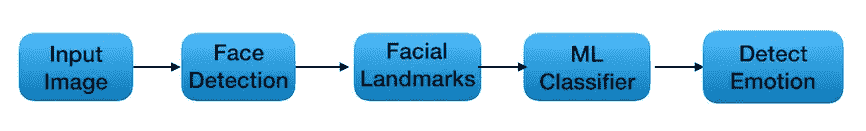
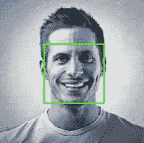
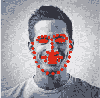

# 情绪检测:一个机器学习项目

> 原文：<https://towardsdatascience.com/emotion-detection-a-machine-learning-project-f7431f652b1f?source=collection_archive---------0----------------------->

## 一个关于情感检测的计算机视觉项目

# 情绪检测( *n.):*

*识别人类情感的过程*

如果有人给你看一张某人的照片，并让你猜猜他们的感受，你很可能会有很好的想法。如果你的电脑也能做到这一点会怎么样？如果它能变得比你更好呢？这似乎是一个荒谬的想法，对不对？

在我的上一篇博客(*读作:* [*揭秘人工智能*](https://medium.com/@aarohigupta2211/demystify-artificial-intelligence-4d5310ea1294) )中，我说过我会解释一个项目，展示所讨论的概念是如何应用的。

下面的博客包含了我们在 InspiritAI 项目期间所做的一系列事情的回忆，虽然它确实显示了进行情绪检测所需的大量代码，但这绝不是训练模型的最快方法。使用多个 ML 和 AI 模型来查看它们之间的差异。

情绪检测的三个主要组成部分如下:

1.  图像预处理
2.  特征抽出
3.  特征分类



## 面部检测:

人脸检测是情感检测中的一个重要步骤。它会删除图像中不相关的部分。这里有一种在图像中检测人脸的方法。

```
import dlib
import numpy as npfrontalface_detector = dlib.get_frontal_face_detector()def rect_to_bb(rect):
    x = rect.left()
    y = rect.top()
    w = rect.right() - x
    h = rect.bottom() - y
    return (x, y, w, h)def detect_face(image_url):
    try:
        url_response = urllib.request.urlopen(image_url)
        img_array = np.array(bytearray(url_response.read()), dtype=np.uint8)
        image = cv2.imdecode(img_array, -1)rects = frontalface_detector(image, 1)if len(rects) < 1:
    return "No Face Detected"for (i, rect) in enumerate(rects):
    (x, y, w, h) = rect_to_bb(rect)
    cv2.rectangle(image, (x, y), (x + w, y + h), (0, 255, 0), 2)plt.imshow(image, interpolation='nearest')
plt.axis('off')
plt.show()
```

另一种方法是使用 dlib 的预训练人脸检测器模型，该模型也将在下一点中使用。



## 面部标志:

面部标志是人脸图像上的一组关键点。这些点由它们在图像上的(x，y)坐标定义。这些点用于定位和表示面部的显著区域，例如眼睛、眉毛、鼻子、嘴和下颌线。

我们使用的面部标志模型是 Dlib 的预训练面部标志检测模型，它检测人脸上的 68 个二维点。

您可以像这样加载模型:

```
import dlib
import numpy as npfrontalface_detector = dlib.get_frontal_face_detector()landmark_predictor=dlib.shape_predictor('./shape_predictor_68_face_landmarks.dat')def get_landmarks(image_url):
    try:
        url_response = urllib.request.urlopen(image_url)
        img_array = np.array(bytearray(url_response.read()), dtype=np.uint8)
        image = cv2.imdecode(img_array, -1) except Exception as e:
        print ("Please check the URL and try again!")
        return None,None
    faces = frontalface_detector(image, 1) if len(faces):
        landmarks = [(p.x, p.y) for p in landmark_predictor(image, faces[0]).parts()] else:
        return None,None

    return image,landmarksdef image_landmarks(image,face_landmarks):
    radius = -1
    circle_thickness = 4
    image_copy = image.copy()
    for (x, y) in face_landmarks:
        cv2.circle(image_copy, (x, y), circle_thickness, (255,0,0), radius)
        plt.imshow(image_copy, interpolation='nearest')
        plt.axis('off')
        plt.show()
```

使用该模型后，您的输出应该如下所示:



在这个模型中，面部特征的具体标志是:

```
Jawline = 0–16
Eyebrows = 17–26
Nose = 27–35
Left eye = 36–41
Right eye = 42–47
Mouth = 48–67
```

区分两种情绪的一种方法是看这个人的嘴和眼睛是否张开。我们可以找到嘴部各点之间的欧几里德距离，如果一个人感到惊讶，这个距离会比他们没有惊讶时更大。

# 数据预处理

在使用数据之前，重要的是要经过一系列被称为预处理的步骤。这使得数据更容易处理。

我们将使用由五个情感标签组成的 fer2013 数据集的修改版本。

数据集存储在 CSV 文件中。CSV 文件中的每一行都代表一个实例。每个实例都有两个列属性:

*   以字符串格式存储的图像像素
*   目标标签的整数编码

共有 20，000 个图像平均分布在五种情绪中。这些图像是 48*48 灰度的裁剪图像。CSV 文件由以字符串形式存储的图像的扁平数组组成

```
The target labels are integer encoded in the csvfile. They are mapped as follows:0 — -> Angry
1 — -> Happy
2 — -> Sad
3 — -> Surprise
4 — -> Neutral
```

## 加载数据集

```
import pandas as pd
import numpy as np
import matplotlib.pyplot as pltlabel_map={"0":"ANGRY","1":"HAPPY","2":"SAD","3":"SURPRISE","4":"NEUTRAL"}df = pd.read_csv("./ferdata.csv")df.head()
```

该数据集包含图像的原始像素值。

## 拆分数据

正如上次讨论的那样，数据需要分成两个不同的集合:

1.  训练集:算法会一遍又一遍地读取或“训练”它，以尝试和学习它的任务。
2.  测试集:算法在这些数据上进行测试，看看它的效果如何。

```
from sklearn.model_selection import train_test_splitX_train, X_test, y_train, y_test = train_test_split(dataX, dataY, test_size=0.1,random_state=42,stratify =dataY)
```

## 使数据标准化

标准化是将不同的变量放在同一尺度上的过程。它重新调整数据，使平均值为 0，标准差为 1。这种转换以数据为中心。

```
from sklearn.preprocessing import StandardScalerscaler = StandardScaler()
scaler.fit(X_train)
X_train = scaler.transform(X_train)
X_test = scaler.transform(X_test)
```

# 线性模型

## k-最近邻

KNN 是一种非参数学习算法，这意味着它不对数据的分布做出任何假设。我们使用点之间的欧几里得距离作为数据。

```
from sklearn.neighbors import KNeighborsClassifierknn = KNeighborsClassifier(n_neighbors=3)
knn.fit(X_train, Y_train)
predictions = knn.predict(X_test)
```

要确定模型的准确性:

```
from sklearn.metrics import accuracy_scoreprint(accuracy_score(Y_test, predictions)*100)
```

我们的准确率约为 50%，所以我们尝试了一些非线性模型。

您可以尝试将原始像素值输入到模型中，并查看它如何影响模型的准确性。

# 非线性模型

## 多层感知器

MLPs 是神经网络的一个子类。它们由一层或多层神经元组成。输入层是输入数据的地方，之后可能有一个或多个隐藏层。预测来自输出层。

```
from keras.models import Sequential
from keras.utils import to_categorical
from keras.layers import Dense, Dropout, Flatten, Activation
from keras.losses import categorical_crossentropy
from keras.callbacks import EarlyStopping, ModelCheckpoint
from keras.models import load_model
from keras.optimizers import Adam, SGDmlp_model = Sequential()mlp_model.add(Dense(1024, input_shape = (2304,), activation = 'relu', kernel_initializer='glorot_normal'))mlp_model.add(Dense(512, activation = 'relu', kernel_initializer='glorot_normal'))mlp_model.add(Dense(5, activation = 'softmax'))mlp_model.compile(loss=categorical_crossentropy, optimizer=SGD(lr=0.001), metrics=['accuracy']) checkpoint = ModelCheckpoint('best_mlp_model.h5',verbose=1,
monitor='val_acc', save_best_only=True,mode='auto')mlp_history = mlp_model.fit(X_train, y_train, batch_size=batch_size,
epochs=epochs, verbose=1, callbacks=[checkpoint], validation_data(X_test, y_test),shuffle=True)
```

我们使用像素的准确率大约是 50%，当我们使用面部标志之间的距离而不是像素值时，准确率有所提高。然而，我们想要更精确的模型，所以我们决定使用 CNN。

## 卷积神经网络

```
width, height = 48, 48X_train = X_train.reshape(len(X_train),height,width)X_test = X_test.reshape(len(X_test),height,width)X_train = np.expand_dims(X_train,3)X_test = np.expand_dims(X_test,3)cnn_model = Sequential()cnn_model.add(Conv2D(5000, kernel_size=(4, 4), activation='relu', padding='same', input_shape = (width, height, 1)))cnn_model.add(BatchNormalization())cnn_model.add(MaxPooling2D(pool_size=(3, 3), strides=(4, 4)))cnn_model.add(Dropout(0.2))cnn_model.add(Flatten())cnn_model.add(Dense(2000, activation='relu'))cnn_model.add(Dropout(0.2))cnn_model.add(Dense(5, activation='softmax'))checkpoint = ModelCheckpoint('best_cnn_model.h5', verbose=1, monitor='val_loss',save_best_only=True, mode='auto')cnn_model.compile(loss=categorical_crossentropy,
optimizer=Adam(lr=0.001, beta_1=0.9, beta_2=0.999), 
metrics=['accuracy'])cnn_history = cnn_model.fit(X_train, y_train, batch_size=batch_size, epochs=epochs, verbose=1, callbacks=[checkpoint], 
validation_data=(X_test, y_test),shuffle=True)cnn_model.save('cnn_model.h5')
```

为了提高性能，你可以改变下降，密集层的数量和激活功能。我们还使用名为 VGG 的 CNN 进行迁移学习，这是一种用于图像分类的预训练卷积神经网络。

# E 估价

使用 VGG 得到的结果最好，其正确率约为 68–70 %,但即使是线性模型也做得非常好。虽然 50%的准确率看起来不算多，但这仍然比你随机选取一张图片和一个标签要高。在这一点上，你大约有 20%的几率是正确的。

然而，在这个特定的数据集中，VGG 的表现甚至比人类更好。CNN 和 MLP 之间的区别在于，CNN 提取他们自己认为重要的特征，而我们将像素或界标作为特征提供给 MLP。

更多关于 KNNs、CNN、MLPs 和其他基本机器学习主题的信息，请点击[此链接](https://medium.com/@aarohigupta2211/demystify-artificial-intelligence-4d5310ea1294)。

*特别感谢 Adeesh Goel 组织了这次令人惊叹的研讨会，查看 facebook 页面*[](https://www.facebook.com/inspiritAI/)**【InspiritAI】，感谢 Tyler Bonnen 担任如此出色的导师并指导我们完成该计划，并感谢我的团队成员 Khushi 和 Harsh。**