# 基于图卷积网络的情感识别

> 原文：<https://towardsdatascience.com/emotion-recognition-using-graph-convolutional-networks-9f22f04b244e?source=collection_archive---------9----------------------->

## 使用图形对对话进行分类

最近，深度学习在自然语言处理(NLP)方面取得了很大进展。随着许多新发明(如注意力和变形金刚)的出现，BERT 和 XLNet 等先进模型应运而生，许多任务(如文本情感识别)变得更加容易。本文将介绍一种新的方法，利用图形从对话中进行情感识别。

# 什么是情感识别？

简单地说，情绪识别(ERC)是对一项书面任务背后的情绪进行分类的任务。给定一段文字，你能说出说话者是生气、高兴、悲伤还是困惑吗？它在医疗保健、教育、销售和人力资源方面有许多广泛的应用。在最高层面上，ERC 的任务是有用的，因为许多人相信，它是构建能够与人对话的智能人工智能的垫脚石。

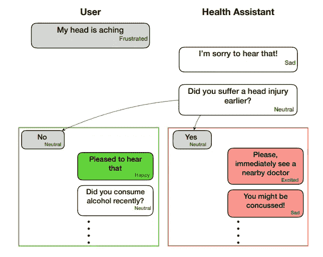

An example of using ERC to power a health assistant (image taken from [1])

目前，大多数 ERC 所基于的两个主要创新是递归神经网络(RNN)和注意力机制。LSTMs 和 GRUs 等 rnn 按顺序查看文本。当文本很长时，模型对开始部分的记忆会丢失。注意力机制通过对句子的不同部分进行不同的加权很好地解决了这个问题。

然而，RNNs+Attention 仍然很难从相邻序列和说话者(基本上任何对话的所有非常重要的部分)中考虑个性、主题和意图的上下文。再加上缺乏个性/情感的标记基准数据集，不仅难以实施，而且难以衡量新模型的结果。本文将总结最近的一篇论文，该论文通过使用一种相对较新的称为图卷积网络的创新解决了大部分问题: [DialogueGCN:一种用于对话中情感识别的图卷积神经网络](https://arxiv.org/abs/1908.11540) [1]。

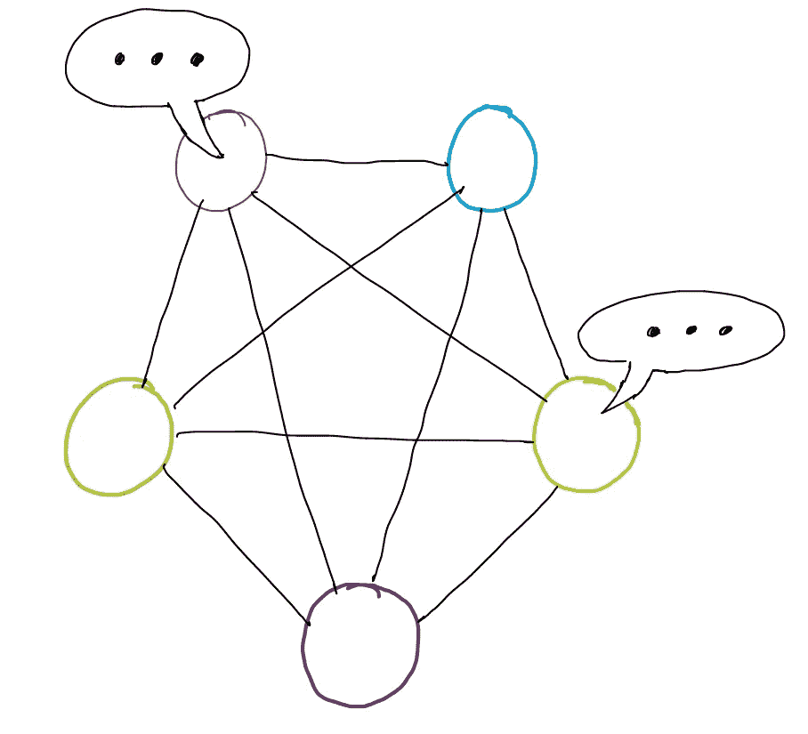

# 背景很重要

在对话中，上下文很重要。一个简单的“还好”可以表示“还好吗？”，“好的！”或者“好吧…”取决于你和对方之前说了什么，你现在的感觉如何，对方的感觉如何，紧张程度以及其他许多事情。有两种类型的上下文很重要:

1.  顺序语境:一个句子在一个序列中的意义。这种语境处理过去的词如何影响未来的词、词的关系以及语义/句法特征。在 RNN 模型中，顺序上下文被考虑在内。
2.  说话人层面的语境:说话人之间和说话人内部的依赖。这种语境涉及说话者之间的关系以及自我依赖性:即你自己的个性会改变并影响你在对话过程中的说话方式。

正如你可能猜到的，大多数模型很难考虑说话者级别的上下文。事实证明，使用图形卷积神经网络可以很好地模拟说话者级别的上下文，这正是 DialogueGCN 采用的方法。

# 用图形表示对话

一段对话中有 ***M*** 说话人/当事人分别表示为***【1】*******p【2】****，。。。，****p【M】***。每一个话语(有人发的一段文字)都表示为***u【1】*******u【2】****，。。。，****【N】***。ERC 的最终目标是准确地预测每个话语是高兴、悲伤、中立、愤怒、兴奋、沮丧、厌恶还是恐惧。**

**整个对话可以构建成一个有向图:**

**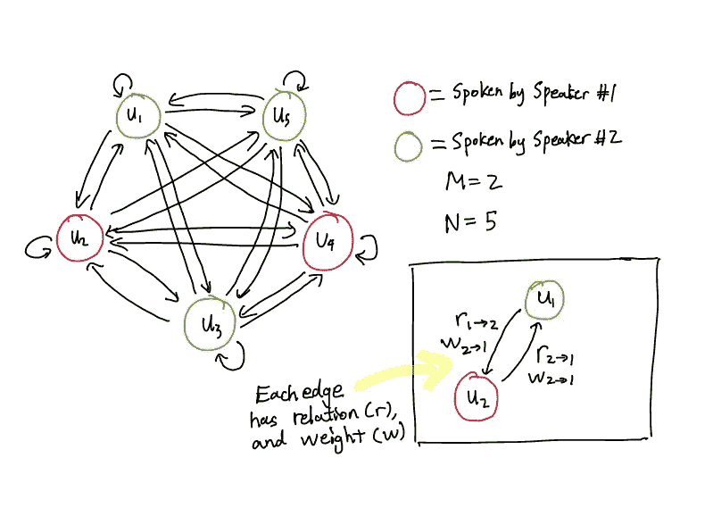**

**A conversation graph with 2 speakers and 5 utterances. [CORRECTION IN BOTTOM RIGHT IMAGE: For the arrow going from U1 to U2, one of the labels should be W1->2, not W2->1]**

*****G = (V，E，R，W)*****

*   **话语是节点( ***V*** )。边是节点***【E】***之间的路径/连接。关系是边的不同类型/标签***【R】***。权重代表一条边的重要性***【W】***。**
*   **两个节点***v【I】***和***v【j】***之间的每条边都有两个属性:关系( ***r*** )和权重( ***w*** )。我们稍后会详细讨论这个问题。**
*   **图形是[指向](https://www.mathworks.com/help/matlab/math/directed-and-undirected-graphs.html)的。所以，所有的边都是单向的。从***v【I】***到***v【j】***的边缘不同于从***v【j】***到***v【I】***的边缘。**

**从图中可以注意到的一点是，每个话语都有一条边与其自身相连。这代表了话语与其自身的关系。用更实际的话来说，这就是一个话语如何影响说话者的思想。**

## **上下文窗口**

**图形表示的一个主要问题是，如果一个会话非常长，那么一个节点可能有许多条边。因为每个节点都与其他节点相连，所以随着图形大小的增加，它的比例是二次方的。这在计算上非常昂贵。**

**为了解决这个问题，在 DialogueGCN 中，图形的边是基于具有特定**大小**的上下文窗口构建的。所以对于一个节点/话语 ***i*** ，只有过去的**大小**和未来的**大小**话语连接在一个图中(在 ***i-* 大小**到 ***i+* 大小**范围内的任意节点)。**

**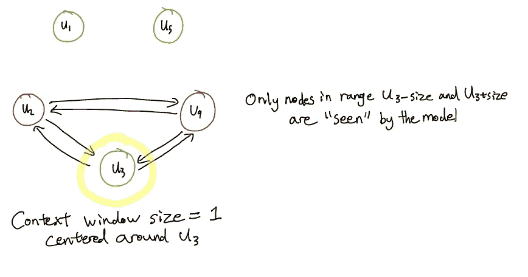**

**A context window of size 1 around the third utterance**

## **边缘权重**

**使用注意函数来计算边权重。设置注意函数，使得对于每个节点/话语，输入的边权重总和为 1。边权重是常数，在学习过程中不会改变。**

**简而言之，边权重表示两个节点之间连接的重要性。**

## **关系**

**边的关系取决于两个因素:**

*   **说话人依赖:谁说了 ***【我】*** ？谁说出了***v【j】***？**
*   **时态依存:是***【I】***在***【j】***之前说出，还是反过来？**

**在一次对话中，如果有*M***M***(说话人***【j】***)****M***(说话人***【j】***)* 2(是否***【I】*【T57)*****

**我们可以列出上面示例图中的所有关系:**

**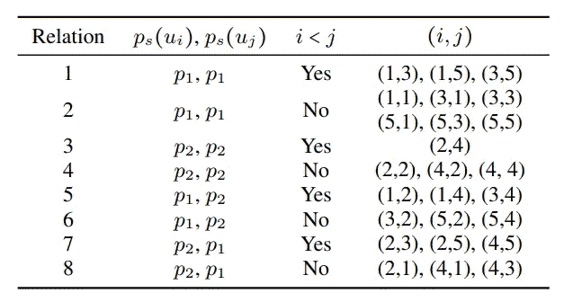**

**A table of all the possible relations in our example**

**这是同一张图，根据表格标注了边的关系:**

**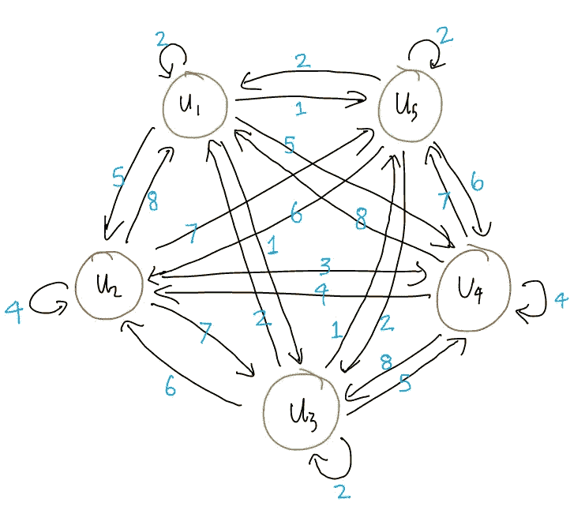**

**Edges are labelled with their respective relation (refer to table above)**

**在我们例子中，我们有 8 种不同的关系。在高层次上，关系是 edge 的一个重要属性，因为在对话中谁说了什么以及何时说了什么非常重要。如果彼得问一个问题，珍妮回答，这与珍妮先说答案，然后彼得问问题(时间依赖)是不同的。同样，如果 Peter 问 Jenny 和 Bob 同样的问题，他们可能会有不同的回答(说话者依赖)。**

**将关系视为定义连接的类型，边权重表示连接的重要性。**

**将关系视为定义连接的类型，边权重表示连接的重要性。**

# **模型**

**DialogueGCN 模型使用一种称为[图形卷积网络](/how-to-do-deep-learning-on-graphs-with-graph-convolutional-networks-7d2250723780) (GCN)的图形神经网络。**

**就像上面一样，所示的例子是针对 2 个说话者 5 个话语的图。**

**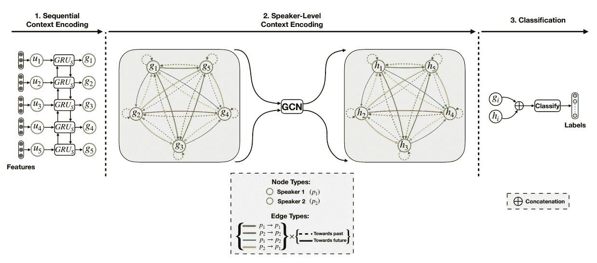**

**Figure 3 from [1]**

**在阶段 1 中，每个话语***【I】***被表示为特征向量，并被给予顺序上下文编码。这是通过在顺序上下文编码器中使每个话语通过一系列 gru 来完成的。阶段 1 不需要图形结构。具有连续语境的新话语表示为***【g【1】***……。***g【N】***文中。这是对 GCN 的输入。**

**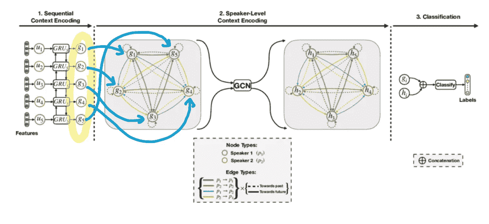**

**在阶段 2 中，该模型构建了一个类似于上一节中讨论的图，并且将使用特征变换将说话者级别的上下文添加到该图中。具有连续语境和说话者层次语境的话语由***【1】***……***h【N】***表示。这是 GCN 的产量。**

**边和节点的外观差异(虚线与实线，不同的颜色)代表不同的关系。例如，绿色的***g【1】***到绿色的***g【3】***，用绿色的实边表示表中的关系 1。**

## **特征变换—嵌入说话者级上下文**

**GCN 最重要的步骤之一是特征转换——基本上是 GCN 如何将说话者级别的上下文嵌入到话语中。我们将首先讨论所使用的技术，然后描述它的直觉来自哪里。**

**特征转换有两个步骤。在步骤 1 中，对于每个节点***【h[I]***，聚集相邻节点信息(上下文窗口大小内的节点)以创建新的特征向量***【h[I]***。**

**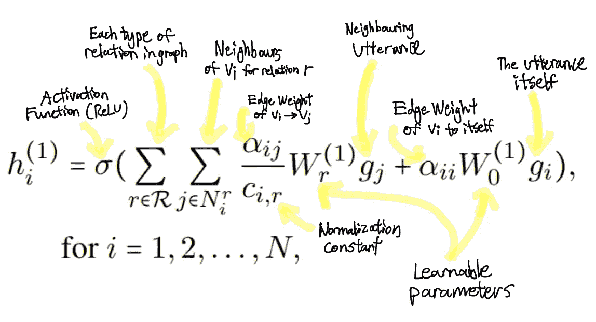**

**该函数可能看起来很复杂，但其核心只是将它想象为网络中的一层，具有由***【0】***和***W【r】***表示的可学习参数。添加的一个东西是常数***c【I，r】***它是一个归一化常数。可以提前设置，也可以用网络自己学习。**

**如前所述，边权重是恒定的，不会在过程中改变或学习。**

**第二步，同样的事情基本上再做一遍。聚集邻居信息，并将类似的函数应用于步骤 1 的输出。**

**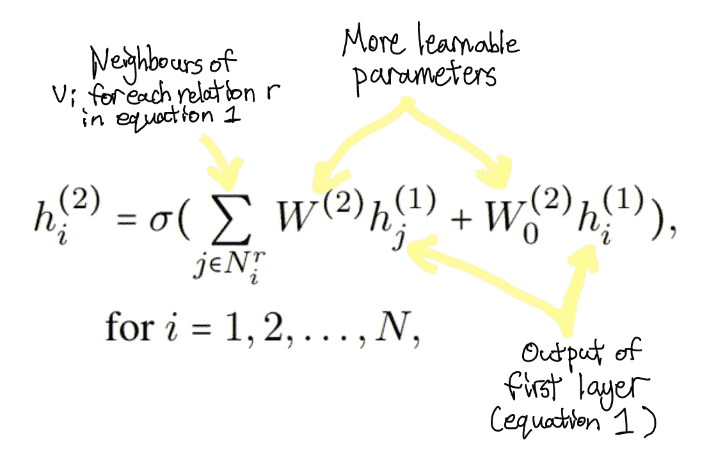**

**Equation 2 (Step Two)**

**再次， ***W*** 和***W【0】***表示在训练过程中修改的可学习参数。**

**在高层次上，这一两步过程实质上是对每个话语的所有相邻话语信息进行归一化求和。在更深的层次上，这种两步转换植根于简单的[可区分的消息传递框架](https://arxiv.org/pdf/1704.01212.pdf) [2]。这项技术被从事图形卷积神经网络工作的研究人员用于[关系数据建模](https://arxiv.org/abs/1703.06103)【3】。如果你有时间，我强烈推荐你按照这个顺序阅读这两篇论文。我相信 DialogueGCN 的特性转换过程所需的所有直觉都在那两篇论文中。**

**GCN 的输出由***h【1】***表示…..***【N】***图上。**

**在阶段 3，原始顺序上下文编码矢量与说话者级别上下文编码矢量连接。这类似于将原始层与后来的层组合起来，以“总结”每一层的输出。**

**然后，连接的特征向量被送入全连接网络进行分类。最终输出是模型认为话语是不同情绪的概率分布。**

**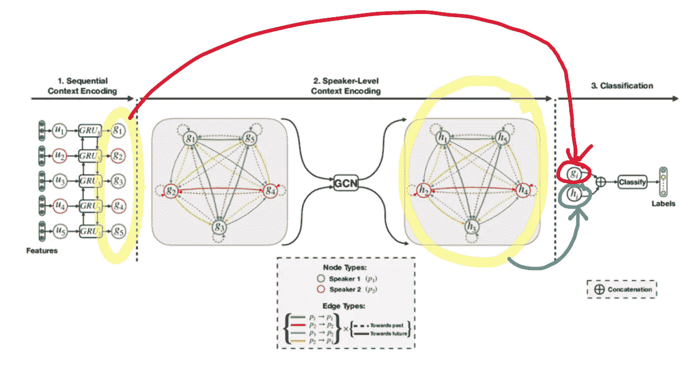**

**使用具有 L2 正则化的[分类交叉熵损失](https://gombru.github.io/2018/05/23/cross_entropy_loss/)来完成模型的训练。使用这种损失是因为模型正在预测多个标签(情感类别)的概率。**

# **结果**

## **基准数据集**

**之前我们提到缺乏基准数据集。这篇论文的作者能够通过使用标记的多模态数据集(文本以及视频或音频)来解决这个问题，然后提取文本部分，并完全忽略任何音频或视频数据。**

**DialogueGCN 在以下数据集上进行评估:**

*   ****IEMOCAP:** 视频格式的十个不同说话者的双向对话。话语被标记为快乐、悲伤、中性、愤怒、兴奋或沮丧。**
*   **AVEC:人类和人工智能代理之间的对话。话语有四个标签:化合价([-1，1])、唤醒([-1，1])、期待([-1，1])和力量([0，无穷大])。**
*   **MELD: 包含电视剧《老友记》中的 1400 段对话和 13000 句话语。MELD 还包含补充的听觉和视觉信息。话语被标记为愤怒、厌恶、悲伤、喜悦、惊讶、恐惧或中性之一。**

**MELD 具有预定义的培训/验证/测试分割。AVEC 和 IEMOCAP 没有预定义的分割，所以 10%的对话被用作验证集。**

**DialogueGCN 与 ERC 的许多基线和最新模型进行了比较。一个特殊的艺术模型状态是 DialogueRNN 由同一论文的作者。**

**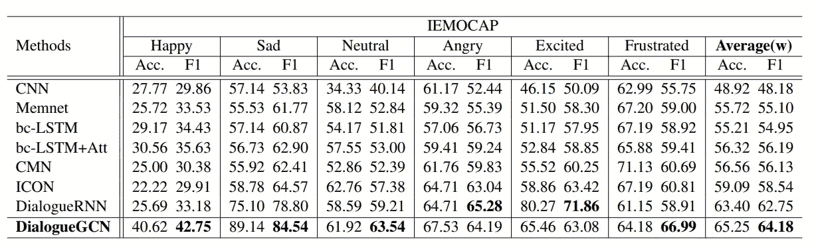**

**DialogueGCN vs. other models on the IEMOCAP dataset (table taken from [1])**

**在 IEMOCAP 的 6 个类别中的 4 个类别中，DialogueGCN 相对于包括 DialogueRNN 在内的所有模型显示出显著的改进。在“愤怒”类别中，DialogueGCN 与 DialogueRNN 基本持平(GCN 在 F1 得分上仅差 1.09)。只有“兴奋”类别显示出足够大的差异。**

**DialogueGCN 能够在 AVEC 和梅尔德上产生类似的结果，击败现任 DialogueRNN。**

**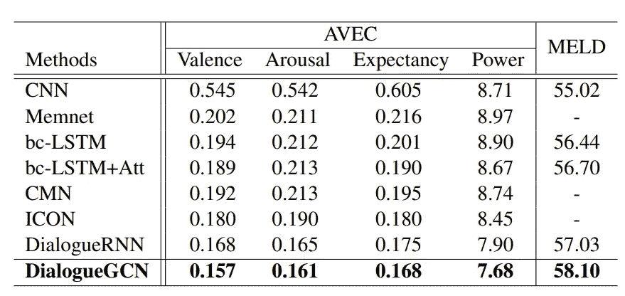**

**DialogueGCN vs. other models on the AVEC and MELD datasets (table taken from [1])**

**从结果中可以清楚地看出，将说话者级别的上下文添加到对话图内在地提高了理解。DialogueRNN 很好地捕捉了连续上下文，但缺乏对说话人上下文进行编码的能力。**

## **分析**

**实验的一个参数是上下文窗口的大小。通过扩展尺寸，能够增加特定话语的边数。人们发现，尽管计算成本更高，但尺寸的增加改善了结果。**

**作者做的另一个有趣的实验是消融研究。一次拆除一个编码器，并重新测量性能。发现说话者级别的上下文编码器(阶段 2)比顺序上下文编码器(阶段 1)稍微重要一些。**

**还发现错误分类往往发生在两种情况下:**

*   **类似的情绪类如“沮丧”和“愤怒”，或“兴奋”和“高兴”。**
*   **像“好的”或“是”这样的简短话语。**

**因为使用的所有数据集都是多模态的，并且包含音频和视频，所以可以通过集成音频和视觉多模态学习来提高这两种情况下的准确性。虽然分类错误仍然会发生，但值得注意的是，DialogueGCN 仍然在准确性方面带来了非常显著的提高。**

# **关键要点**

*   **背景很重要。一个好的模型不仅要考虑对话的连续语境(句子的顺序，哪些单词与其他单词相关)，还要考虑说话者层面的语境(谁说了什么，他们什么时候说的，他们如何受到其他说话者和他们自己的影响)。与传统的基于顺序和注意力的模型相比，整合说话者级别的上下文是一大进步。**
*   **序列不是表示对话的唯一方式。如果这篇论文展示了一件事，那就是数据的结构可以帮助捕捉大量的上下文。在这种情况下，说话者级别的上下文更容易以图形格式编码。**
*   **图神经网络是自然语言处理中一个很有前途的研究方向。聚合邻居信息的关键概念虽然在概念上很简单，但在捕捉数据关系方面却非常强大。**

**感谢阅读！**

**你可以在[中](https://medium.com/@kshen3778)、 [Linkedin](https://www.linkedin.com/in/kevinkwshen/) 或【kshen3778@gmail.com】与我联系**

**原文：<https://arxiv.org/abs/1908.11540>**

**来源:**

**[1]戈萨尔、迪潘威&马朱姆德、纳沃尼&茯苓、苏扬亚&恰亚、尼亚提&格尔布克、亚历山大。(2019).DialogueGCN:用于对话中情感识别的图形卷积神经网络。**

**[2] Michael Schlichtkrull、Thomas N Kipf、Peter Bloem、Rianne Van Den Berg、Ivan Titov 和 Max Welling。2018.用图卷积网络建模关系数据。欧洲语义网会议，593-607 页。斯普林格。**

**[3]贾斯汀·吉尔默、塞缪尔·舍恩霍尔茨、帕特里克·F·赖利、奥里奥尔·维尼亚尔斯和乔治·E·达尔。2017.量子化学的神经信息传递。《第 34 届机器学习国际会议论文集》第 70 卷，第 1263-1272 页。JMLR。org。**